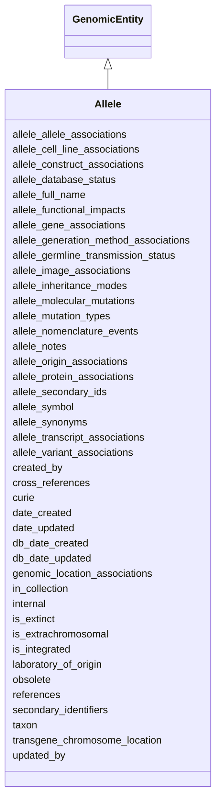

# Allele

One of multiple possible forms of a functional genomic element (most often described as a locus or gene), differing from the reference DNA sequence.  The genomic element can be endogenous or constructed.





URI: [alliance:Allele](http://alliancegenome.org/Allele)


## Parent Classes

* [AuditedObject](AuditedObject.md)
    * [BiologicalEntity](BiologicalEntity.md)
        * [GenomicEntity](GenomicEntity.md)
            * **Allele**


<!-- no inheritance hierarchy -->


## Slots

| Name | Description  |
| ---  | ---  |
| [allele_allele_associations](allele_allele_associations.md) | None |
| [allele_cell_line_associations](allele_cell_line_associations.md) | None |
| [allele_construct_associations](allele_construct_associations.md) | None |
| [allele_database_status](allele_database_status.md) | Database status of a given allele |
| [allele_full_name](allele_full_name.md) | The one current full name for an allele: e.g., wg<sup>1</sup>. |
| [allele_functional_impacts](allele_functional_impacts.md) | Functional impacts of a given allele |
| [allele_gene_associations](allele_gene_associations.md) | None |
| [allele_generation_method_associations](allele_generation_method_associations.md) | None |
| [allele_germline_transmission_status](allele_germline_transmission_status.md) | Germline transmission status for a given allele |
| [allele_image_associations](allele_image_associations.md) | None |
| [allele_inheritance_modes](allele_inheritance_modes.md) | Inheritance modes for an allele |
| [allele_molecular_mutations](allele_molecular_mutations.md) | Molecular mutations of a given allele |
| [allele_mutation_types](allele_mutation_types.md) | Mutation types for a given allele |
| [allele_nomenclature_events](allele_nomenclature_events.md) | Nomenclature events of a given allele |
| [allele_notes](allele_notes.md) | Notes for a given allele |
| [allele_origin_associations](allele_origin_associations.md) | None |
| [allele_protein_associations](allele_protein_associations.md) | None |
| [allele_secondary_ids](allele_secondary_ids.md) | Secondary IDs of a given allele |
| [allele_symbol](allele_symbol.md) | The one current accepted symbol for the allele: e.g., wg<sup>1</sup>. |
| [allele_synonyms](allele_synonyms.md) | Holds between an Allele and a synonym. |
| [allele_transcript_associations](allele_transcript_associations.md) | None |
| [allele_variant_associations](allele_variant_associations.md) | None |
| [created_by](created_by.md) | The individual that created the entity. |
| [cross_references](cross_references.md) | Holds between an object and its CrossReferences. |
| [curie](curie.md) | A unique identifier for a thing. Must be either a CURIE shorthand for a URI or a complete URI |
| [date_created](date_created.md) | The date on which an entity was created. This can be applied to nodes or edges. |
| [date_updated](date_updated.md) | Date on which an entity was last modified. |
| [db_date_created](db_date_created.md) | The date on which an entity was created in the Alliance database.  This is disinct from date_created, which represents the date when the entity was originally created (i.e. at the MOD for imported data). |
| [db_date_updated](db_date_updated.md) | Date on which an entity was last modified in the Alliance database.  This is disinct from date_updated, which represents the date when the entity was last modified and may predate import into the Alliance database. |
| [genomic_location_associations](genomic_location_associations.md) | None |
| [in_collection](in_collection.md) | Set of high-throughput alleles made by large projects |
| [internal](internal.md) | Classifies the entity as private (for internal use) or not (for public use). |
| [is_extinct](is_extinct.md) | Does the allele still exist in a population somewhere? |
| [is_extrachromosomal](is_extrachromosomal.md) | Used by WormBase to indicate whether a transgenic allele is known to be extrachromosomal. |
| [is_integrated](is_integrated.md) | Used by WormBase to indicate whether a transgenic allele is known to be integrated into the genome. |
| [laboratory_of_origin](laboratory_of_origin.md) | The laboratory of origin for the entity. |
| [obsolete](obsolete.md) | Entity is no longer current. |
| [references](references.md) | holds between an object and a list of references |
| [secondary_identifiers](secondary_identifiers.md) | None |
| [taxon](taxon.md) | The taxon from which the biological entity derives. |
| [transgene_chromosome_location](transgene_chromosome_location.md) | The chromosome to which a transgene has been mapped. Used for WormBase transgenes that have been integrated into the genome and mapped to a chromosome. |
| [updated_by](updated_by.md) | The individual that last modified the entity. |


## Mappings

| Mapping Type | Mapped Value |
| ---  | ---  |
| self | ['alliance:Allele'] |
| native | ['alliance:Allele'] |
| exact | ['SO:0001023'] |


## LinkML Specification

<!-- TODO: investigate https://stackoverflow.com/questions/37606292/how-to-create-tabbed-code-blocks-in-mkdocs-or-sphinx -->

### Direct

<details>
```yaml
name: Allele
description: One of multiple possible forms of a functional genomic element (most
  often described as a locus or gene), differing from the reference DNA sequence.  The
  genomic element can be endogenous or constructed.
from_schema: https://github.com/alliance-genome/agr_curation_schema/src/schema/allele
exact_mappings:
- SO:0001023
is_a: GenomicEntity
slots:
- allele_symbol
- allele_full_name
- references
- in_collection
- laboratory_of_origin
- is_extinct
- is_extrachromosomal
- is_integrated
- transgene_chromosome_location
- allele_mutation_types
- allele_inheritance_modes
- allele_germline_transmission_status
- allele_functional_impacts
- allele_molecular_mutations
- allele_database_status
- allele_secondary_ids
- allele_nomenclature_events
- allele_notes
- allele_synonyms
- allele_gene_associations
- allele_transcript_associations
- allele_protein_associations
- allele_allele_associations
- allele_variant_associations
- allele_construct_associations
- allele_cell_line_associations
- allele_image_associations
- allele_origin_associations
- allele_generation_method_associations
slot_usage:
  aberration:
    name: aberration
    notes:
    - specific to FB
  allele_symbol:
    name: allele_symbol
    domain_of:
    - Allele
    required: true
  laboratory_of_origin:
    name: laboratory_of_origin
    domain_of:
    - Allele
    required: false
  is_extrachromosomal:
    name: is_extrachromosomal
    domain_of:
    - Allele
    - AlleleDTO
    required: false
  is_integrated:
    name: is_integrated
    domain_of:
    - Allele
    - AlleleDTO
    required: false

```
</details>

### Induced

<details>
```yaml
name: Allele
description: One of multiple possible forms of a functional genomic element (most
  often described as a locus or gene), differing from the reference DNA sequence.  The
  genomic element can be endogenous or constructed.
from_schema: https://github.com/alliance-genome/agr_curation_schema/src/schema/allele
exact_mappings:
- SO:0001023
is_a: GenomicEntity
slot_usage:
  aberration:
    name: aberration
    notes:
    - specific to FB
  allele_symbol:
    name: allele_symbol
    domain_of:
    - Allele
    required: true
  laboratory_of_origin:
    name: laboratory_of_origin
    domain_of:
    - Allele
    required: false
  is_extrachromosomal:
    name: is_extrachromosomal
    domain_of:
    - Allele
    - AlleleDTO
    required: false
  is_integrated:
    name: is_integrated
    domain_of:
    - Allele
    - AlleleDTO
    required: false
attributes:
  allele_symbol:
    name: allele_symbol
    description: 'The one current accepted symbol for the allele: e.g., wg<sup>1</sup>.'
    from_schema: https://github.com/alliance-genome/agr_curation_schema/src/schema/allele
    domain: Allele
    multivalued: false
    alias: allele_symbol
    owner: Allele
    domain_of:
    - Allele
    range: AlleleSymbolSlotAnnotation
    required: true
  allele_full_name:
    name: allele_full_name
    description: 'The one current full name for an allele: e.g., wg<sup>1</sup>.'
    from_schema: https://github.com/alliance-genome/agr_curation_schema/src/schema/allele
    domain: Allele
    multivalued: false
    alias: allele_full_name
    owner: Allele
    domain_of:
    - Allele
    range: AlleleFullNameSlotAnnotation
    required: false
  references:
    name: references
    description: holds between an object and a list of references
    from_schema: https://github.com/alliance-genome/agr_curation_schema/core.yaml
    singular_name: reference
    multivalued: true
    alias: references
    owner: Allele
    domain_of:
    - Allele
    - Construct
    - SequenceTargetingReagent
    - SequenceTargetingReagentToGeneAssociation
    - AffectedGenomicModel
    - Antibody
    range: Reference
  in_collection:
    name: in_collection
    description: Set of high-throughput alleles made by large projects
    from_schema: https://github.com/alliance-genome/agr_curation_schema/src/schema/allele
    domain: Allele
    alias: in_collection
    owner: Allele
    domain_of:
    - Allele
    range: VocabularyTerm
  laboratory_of_origin:
    name: laboratory_of_origin
    description: The laboratory of origin for the entity.
    from_schema: https://github.com/alliance-genome/agr_curation_schema/src/schema/allele
    domain: Allele
    alias: laboratory_of_origin
    owner: Allele
    domain_of:
    - Allele
    range: Laboratory
    required: false
  is_extinct:
    name: is_extinct
    description: Does the allele still exist in a population somewhere?
    from_schema: https://github.com/alliance-genome/agr_curation_schema/src/schema/allele
    domain: Allele
    alias: is_extinct
    owner: Allele
    domain_of:
    - Allele
    - AlleleDTO
    range: boolean
  is_extrachromosomal:
    name: is_extrachromosomal
    description: Used by WormBase to indicate whether a transgenic allele is known
      to be extrachromosomal.
    from_schema: https://github.com/alliance-genome/agr_curation_schema/src/schema/allele
    domain: Allele
    alias: is_extrachromosomal
    owner: Allele
    domain_of:
    - Allele
    - AlleleDTO
    range: boolean
    required: false
  is_integrated:
    name: is_integrated
    description: Used by WormBase to indicate whether a transgenic allele is known
      to be integrated into the genome.
    from_schema: https://github.com/alliance-genome/agr_curation_schema/src/schema/allele
    domain: Allele
    alias: is_integrated
    owner: Allele
    domain_of:
    - Allele
    - AlleleDTO
    range: boolean
    required: false
  transgene_chromosome_location:
    name: transgene_chromosome_location
    description: The chromosome to which a transgene has been mapped. Used for WormBase
      transgenes that have been integrated into the genome and mapped to a chromosome.
    from_schema: https://github.com/alliance-genome/agr_curation_schema/src/schema/allele
    domain: Allele
    multivalued: false
    alias: transgene_chromosome_location
    owner: Allele
    domain_of:
    - Allele
    range: Chromosome
  allele_mutation_types:
    name: allele_mutation_types
    description: Mutation types for a given allele
    from_schema: https://github.com/alliance-genome/agr_curation_schema/src/schema/allele
    domain: Allele
    multivalued: true
    alias: allele_mutation_types
    owner: Allele
    domain_of:
    - Allele
    range: AlleleMutationTypeSlotAnnotation
  allele_inheritance_modes:
    name: allele_inheritance_modes
    description: Inheritance modes for an allele
    from_schema: https://github.com/alliance-genome/agr_curation_schema/src/schema/allele
    domain: Allele
    multivalued: true
    alias: allele_inheritance_modes
    owner: Allele
    domain_of:
    - Allele
    range: AlleleInheritanceModeSlotAnnotation
  allele_germline_transmission_status:
    name: allele_germline_transmission_status
    description: Germline transmission status for a given allele
    from_schema: https://github.com/alliance-genome/agr_curation_schema/src/schema/allele
    domain: Allele
    multivalued: false
    alias: allele_germline_transmission_status
    owner: Allele
    domain_of:
    - Allele
    range: AlleleGermlineTransmissionStatusSlotAnnotation
  allele_functional_impacts:
    name: allele_functional_impacts
    description: Functional impacts of a given allele
    from_schema: https://github.com/alliance-genome/agr_curation_schema/src/schema/allele
    domain: Allele
    multivalued: true
    alias: allele_functional_impacts
    owner: Allele
    domain_of:
    - Allele
    range: AlleleFunctionalImpactSlotAnnotation
  allele_molecular_mutations:
    name: allele_molecular_mutations
    description: Molecular mutations of a given allele
    from_schema: https://github.com/alliance-genome/agr_curation_schema/src/schema/allele
    domain: Allele
    multivalued: true
    alias: allele_molecular_mutations
    owner: Allele
    domain_of:
    - Allele
    range: AlleleMolecularMutationSlotAnnotation
  allele_database_status:
    name: allele_database_status
    description: Database status of a given allele
    from_schema: https://github.com/alliance-genome/agr_curation_schema/src/schema/allele
    domain: Allele
    alias: allele_database_status
    owner: Allele
    domain_of:
    - Allele
    range: AlleleDatabaseStatusSlotAnnotation
  allele_secondary_ids:
    name: allele_secondary_ids
    description: Secondary IDs of a given allele
    from_schema: https://github.com/alliance-genome/agr_curation_schema/src/schema/allele
    domain: Allele
    multivalued: true
    alias: allele_secondary_ids
    owner: Allele
    domain_of:
    - Allele
    range: AlleleSecondaryIdSlotAnnotation
  allele_nomenclature_events:
    name: allele_nomenclature_events
    description: Nomenclature events of a given allele
    from_schema: https://github.com/alliance-genome/agr_curation_schema/src/schema/allele
    domain: Allele
    multivalued: true
    alias: allele_nomenclature_events
    owner: Allele
    domain_of:
    - Allele
    range: AlleleNomenclatureEventSlotAnnotation
  allele_notes:
    name: allele_notes
    description: Notes for a given allele
    from_schema: https://github.com/alliance-genome/agr_curation_schema/src/schema/allele
    domain: Allele
    multivalued: true
    alias: allele_notes
    owner: Allele
    domain_of:
    - Allele
    range: AlleleNoteSlotAnnotation
  allele_synonyms:
    name: allele_synonyms
    description: Holds between an Allele and a synonym.
    from_schema: https://github.com/alliance-genome/agr_curation_schema/src/schema/allele
    multivalued: true
    alias: allele_synonyms
    owner: Allele
    domain_of:
    - Allele
    range: AlleleSynonymSlotAnnotation
    required: false
  allele_gene_associations:
    name: allele_gene_associations
    from_schema: https://github.com/alliance-genome/agr_curation_schema/src/schema/allele
    domain: Allele
    multivalued: true
    alias: allele_gene_associations
    owner: Allele
    domain_of:
    - Allele
    range: AlleleGeneAssociation
  allele_transcript_associations:
    name: allele_transcript_associations
    from_schema: https://github.com/alliance-genome/agr_curation_schema/src/schema/allele
    domain: Allele
    multivalued: true
    alias: allele_transcript_associations
    owner: Allele
    domain_of:
    - Allele
    range: AlleleTranscriptAssociation
  allele_protein_associations:
    name: allele_protein_associations
    from_schema: https://github.com/alliance-genome/agr_curation_schema/src/schema/allele
    domain: Allele
    multivalued: true
    alias: allele_protein_associations
    owner: Allele
    domain_of:
    - Allele
    range: AlleleProteinAssociation
  allele_allele_associations:
    name: allele_allele_associations
    from_schema: https://github.com/alliance-genome/agr_curation_schema/src/schema/allele
    domain: Allele
    multivalued: true
    alias: allele_allele_associations
    owner: Allele
    domain_of:
    - Allele
    range: AlleleAlleleAssociation
  allele_variant_associations:
    name: allele_variant_associations
    from_schema: https://github.com/alliance-genome/agr_curation_schema/src/schema/allele
    domain: Allele
    multivalued: true
    alias: allele_variant_associations
    owner: Allele
    domain_of:
    - Allele
    range: AlleleVariantAssociation
  allele_construct_associations:
    name: allele_construct_associations
    from_schema: https://github.com/alliance-genome/agr_curation_schema/src/schema/allele
    domain: Allele
    multivalued: true
    alias: allele_construct_associations
    owner: Allele
    domain_of:
    - Allele
    range: AlleleConstructAssociation
  allele_cell_line_associations:
    name: allele_cell_line_associations
    from_schema: https://github.com/alliance-genome/agr_curation_schema/src/schema/allele
    domain: Allele
    multivalued: true
    alias: allele_cell_line_associations
    owner: Allele
    domain_of:
    - Allele
    range: AlleleCellLineAssociation
  allele_image_associations:
    name: allele_image_associations
    from_schema: https://github.com/alliance-genome/agr_curation_schema/src/schema/allele
    domain: Allele
    multivalued: true
    alias: allele_image_associations
    owner: Allele
    domain_of:
    - Allele
    range: AlleleImageAssociation
  allele_origin_associations:
    name: allele_origin_associations
    from_schema: https://github.com/alliance-genome/agr_curation_schema/src/schema/allele
    domain: Allele
    multivalued: true
    alias: allele_origin_associations
    owner: Allele
    domain_of:
    - Allele
    range: AlleleOriginAssociation
  allele_generation_method_associations:
    name: allele_generation_method_associations
    from_schema: https://github.com/alliance-genome/agr_curation_schema/src/schema/allele
    domain: Allele
    multivalued: true
    alias: allele_generation_method_associations
    owner: Allele
    domain_of:
    - Allele
    range: AlleleGenerationMethodAssociation
  cross_references:
    name: cross_references
    description: Holds between an object and its CrossReferences.
    from_schema: https://github.com/alliance-genome/agr_curation_schema/core.yaml
    aliases:
    - xrefs
    singular_name: cross_reference
    multivalued: true
    alias: cross_references
    owner: Allele
    domain_of:
    - OntologyTerm
    - GenomicEntity
    - AuthorReference
    - Antibody
    - GeneInteraction
    range: CrossReference
  secondary_identifiers:
    name: secondary_identifiers
    from_schema: https://github.com/alliance-genome/agr_curation_schema/core.yaml
    aliases:
    - secondary_ids
    multivalued: true
    alias: secondary_identifiers
    owner: Allele
    domain_of:
    - OntologyTerm
    - GenomicEntity
    - GenomicEntityDTO
    - Figure
    - Image
    - Antibody
    range: uriorcurie
  genomic_location_associations:
    name: genomic_location_associations
    from_schema: https://github.com/alliance-genome/agr_curation_schema/core.yaml
    domain: GenomicEntity
    multivalued: true
    alias: genomic_location_associations
    owner: Allele
    domain_of:
    - GenomicEntity
    range: GenomicLocationAssociation
  curie:
    name: curie
    description: A unique identifier for a thing. Must be either a CURIE shorthand
      for a URI or a complete URI
    from_schema: https://github.com/alliance-genome/agr_curation_schema/core.yaml
    multivalued: false
    identifier: true
    alias: curie
    owner: Allele
    domain_of:
    - OntologyTerm
    - PhenotypeAnnotation
    - DiseaseAnnotation
    - BiologicalEntity
    - BiologicalEntityDTO
    - Chromosome
    - Assembly
    - Identifier
    - Figure
    - Image
    - Laboratory
    - InformationContentEntity
    - Reference
    - Resource
    - ModCorpusAssociation
    - GeneInteraction
    - ExpressionExperiment
    - GeneNomenclatureSet
    range: uriorcurie
    required: true
  taxon:
    name: taxon
    description: The taxon from which the biological entity derives.
    from_schema: https://github.com/alliance-genome/agr_curation_schema/core.yaml
    multivalued: false
    alias: taxon
    owner: Allele
    domain_of:
    - BiologicalEntity
    range: NCBITaxonTerm
    required: true
  created_by:
    name: created_by
    description: The individual that created the entity.
    from_schema: https://github.com/alliance-genome/agr_curation_schema/core.yaml
    domain: AuditedObject
    multivalued: false
    alias: created_by
    owner: Allele
    domain_of:
    - AuditedObject
    range: Person
  date_created:
    name: date_created
    description: The date on which an entity was created. This can be applied to nodes
      or edges.
    from_schema: https://github.com/alliance-genome/agr_curation_schema/core.yaml
    aliases:
    - creation_date
    exact_mappings:
    - dct:createdOn
    - WIKIDATA_PROPERTY:P577
    alias: date_created
    owner: Allele
    domain_of:
    - AuditedObject
    - AuditedObjectDTO
    range: datetime
  updated_by:
    name: updated_by
    description: The individual that last modified the entity.
    from_schema: https://github.com/alliance-genome/agr_curation_schema/core.yaml
    domain: AuditedObject
    multivalued: false
    alias: updated_by
    owner: Allele
    domain_of:
    - AuditedObject
    range: Person
  date_updated:
    name: date_updated
    description: Date on which an entity was last modified.
    from_schema: https://github.com/alliance-genome/agr_curation_schema/core.yaml
    aliases:
    - date_last_modified
    alias: date_updated
    owner: Allele
    domain_of:
    - AuditedObject
    - AuditedObjectDTO
    range: datetime
  db_date_created:
    name: db_date_created
    description: The date on which an entity was created in the Alliance database.  This
      is disinct from date_created, which represents the date when the entity was
      originally created (i.e. at the MOD for imported data).
    from_schema: https://github.com/alliance-genome/agr_curation_schema/core.yaml
    alias: db_date_created
    owner: Allele
    domain_of:
    - AuditedObject
    - AuditedObjectDTO
    range: datetime
  db_date_updated:
    name: db_date_updated
    description: Date on which an entity was last modified in the Alliance database.  This
      is disinct from date_updated, which represents the date when the entity was
      last modified and may predate import into the Alliance database.
    from_schema: https://github.com/alliance-genome/agr_curation_schema/core.yaml
    alias: db_date_updated
    owner: Allele
    domain_of:
    - AuditedObject
    - AuditedObjectDTO
    range: datetime
  internal:
    name: internal
    description: Classifies the entity as private (for internal use) or not (for public
      use).
    notes:
    - Default value is true.
    from_schema: https://github.com/alliance-genome/agr_curation_schema/core.yaml
    alias: internal
    owner: Allele
    domain_of:
    - AuditedObject
    - AuditedObjectDTO
    range: boolean
    required: true
  obsolete:
    name: obsolete
    description: Entity is no longer current.
    notes:
    - Obsolete entities are preserved in the database for posterity but should not
      be publicly displayed.
    from_schema: https://github.com/alliance-genome/agr_curation_schema/core.yaml
    alias: obsolete
    owner: Allele
    domain_of:
    - AuditedObject
    - AuditedObjectDTO
    range: boolean

```
</details>