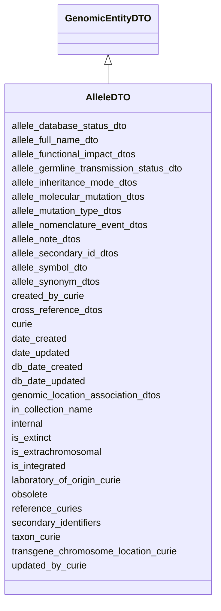

# AlleleDTO

Ingest class for an Allele object





URI: [alliance:AlleleDTO](http://alliancegenome.org/AlleleDTO)


## Parent Classes

* [AuditedObjectDTO](AuditedObjectDTO.md)
    * [BiologicalEntityDTO](BiologicalEntityDTO.md)
        * [GenomicEntityDTO](GenomicEntityDTO.md)
            * **AlleleDTO**


<!-- no inheritance hierarchy -->


## Slots

| Name | Description  |
| ---  | ---  |
| [allele_database_status_dto](allele_database_status_dto.md) | None |
| [allele_full_name_dto](allele_full_name_dto.md) | The one current full name for an allele: e.g., wg<sup>1</sup>. |
| [allele_functional_impact_dtos](allele_functional_impact_dtos.md) | None |
| [allele_germline_transmission_status_dto](allele_germline_transmission_status_dto.md) | None |
| [allele_inheritance_mode_dtos](allele_inheritance_mode_dtos.md) | One or more allele inheritance mode DTO objects to be submitted |
| [allele_molecular_mutation_dtos](allele_molecular_mutation_dtos.md) | None |
| [allele_mutation_type_dtos](allele_mutation_type_dtos.md) | None |
| [allele_nomenclature_event_dtos](allele_nomenclature_event_dtos.md) | None |
| [allele_note_dtos](allele_note_dtos.md) | None |
| [allele_secondary_id_dtos](allele_secondary_id_dtos.md) | None |
| [allele_symbol_dto](allele_symbol_dto.md) | The one current accepted symbol for the allele: e.g., wg<sup>1</sup>. |
| [allele_synonym_dtos](allele_synonym_dtos.md) | None |
| [created_by_curie](created_by_curie.md) | Curie of the Person object representing the individual that created the entity |
| [cross_reference_dtos](cross_reference_dtos.md) | None |
| [curie](curie.md) | A unique identifier for a thing. Must be either a CURIE shorthand for a URI or a complete URI |
| [date_created](date_created.md) | The date on which an entity was created. This can be applied to nodes or edges. |
| [date_updated](date_updated.md) | Date on which an entity was last modified. |
| [db_date_created](db_date_created.md) | The date on which an entity was created in the Alliance database.  This is disinct from date_created, which represents the date when the entity was originally created (i.e. at the MOD for imported data). |
| [db_date_updated](db_date_updated.md) | Date on which an entity was last modified in the Alliance database.  This is disinct from date_updated, which represents the date when the entity was last modified and may predate import into the Alliance database. |
| [genomic_location_association_dtos](genomic_location_association_dtos.md) | None |
| [in_collection_name](in_collection_name.md) | Name of VocabularyTerm describing the collection from the 'Allele collection vocabulary' Vocabulary |
| [internal](internal.md) | Classifies the entity as private (for internal use) or not (for public use). |
| [is_extinct](is_extinct.md) | Does the allele still exist in a population somewhere? |
| [is_extrachromosomal](is_extrachromosomal.md) | Used by WormBase to indicate whether a transgenic allele is known to be extrachromosomal. |
| [is_integrated](is_integrated.md) | Used by WormBase to indicate whether a transgenic allele is known to be integrated into the genome. |
| [laboratory_of_origin_curie](laboratory_of_origin_curie.md) | The curie of the laboratory of origin for the entity. |
| [obsolete](obsolete.md) | Entity is no longer current. |
| [reference_curies](reference_curies.md) | External reference curies used for ingest |
| [secondary_identifiers](secondary_identifiers.md) | None |
| [taxon_curie](taxon_curie.md) | Curie of the NCBITaxonTerm representing the taxon from which the biological entity derives |
| [transgene_chromosome_location_curie](transgene_chromosome_location_curie.md) | The curie string of the chromosome to which a transgene has been mapped. Used for WormBase transgenes that have been integrated into the genome and mapped to a chromosome. |
| [updated_by_curie](updated_by_curie.md) | Curie of the Person object representing the individual that updated the entity |


## Mappings

| Mapping Type | Mapped Value |
| ---  | ---  |
| self | ['alliance:AlleleDTO'] |
| native | ['alliance:AlleleDTO'] |


## LinkML Specification

<!-- TODO: investigate https://stackoverflow.com/questions/37606292/how-to-create-tabbed-code-blocks-in-mkdocs-or-sphinx -->

### Direct

<details>
```yaml
name: AlleleDTO
description: Ingest class for an Allele object
from_schema: https://github.com/alliance-genome/agr_curation_schema/src/schema/alleleDTO
is_a: GenomicEntityDTO
slots:
- allele_symbol_dto
- allele_full_name_dto
- reference_curies
- in_collection_name
- laboratory_of_origin_curie
- is_extinct
- is_extrachromosomal
- is_integrated
- transgene_chromosome_location_curie
- allele_mutation_type_dtos
- allele_inheritance_mode_dtos
- allele_germline_transmission_status_dto
- allele_functional_impact_dtos
- allele_molecular_mutation_dtos
- allele_database_status_dto
- allele_secondary_id_dtos
- allele_nomenclature_event_dtos
- allele_note_dtos
- allele_synonym_dtos

```
</details>

### Induced

<details>
```yaml
name: AlleleDTO
description: Ingest class for an Allele object
from_schema: https://github.com/alliance-genome/agr_curation_schema/src/schema/alleleDTO
is_a: GenomicEntityDTO
attributes:
  allele_symbol_dto:
    name: allele_symbol_dto
    description: 'The one current accepted symbol for the allele: e.g., wg<sup>1</sup>.'
    from_schema: https://github.com/alliance-genome/agr_curation_schema/src/schema/alleleDTO
    domain: AlleleDTO
    multivalued: false
    alias: allele_symbol_dto
    owner: AlleleDTO
    domain_of:
    - AlleleDTO
    range: SymbolSlotAnnotationDTO
    required: true
    inlined: true
  allele_full_name_dto:
    name: allele_full_name_dto
    description: 'The one current full name for an allele: e.g., wg<sup>1</sup>.'
    from_schema: https://github.com/alliance-genome/agr_curation_schema/src/schema/alleleDTO
    domain: AlleleDTO
    multivalued: false
    alias: allele_full_name_dto
    owner: AlleleDTO
    domain_of:
    - AlleleDTO
    range: FullNameSlotAnnotationDTO
    inlined: true
  reference_curies:
    name: reference_curies
    description: External reference curies used for ingest
    from_schema: https://github.com/alliance-genome/agr_curation_schema/src/schema/reference
    multivalued: true
    alias: reference_curies
    owner: AlleleDTO
    domain_of:
    - AlleleDTO
    - ConstructDTO
    - SequenceTargetingReagentDTO
    - AffectedGenomicModelDTO
    range: string
  in_collection_name:
    name: in_collection_name
    description: Name of VocabularyTerm describing the collection from the 'Allele
      collection vocabulary' Vocabulary
    from_schema: https://github.com/alliance-genome/agr_curation_schema/src/schema/alleleDTO
    domain: AlleleDTO
    alias: in_collection_name
    owner: AlleleDTO
    domain_of:
    - AlleleDTO
    range: string
  laboratory_of_origin_curie:
    name: laboratory_of_origin_curie
    description: The curie of the laboratory of origin for the entity.
    from_schema: https://github.com/alliance-genome/agr_curation_schema/src/schema/alleleDTO
    domain: AlleleDTO
    alias: laboratory_of_origin_curie
    owner: AlleleDTO
    domain_of:
    - AlleleDTO
    range: string
  is_extinct:
    name: is_extinct
    description: Does the allele still exist in a population somewhere?
    from_schema: https://github.com/alliance-genome/agr_curation_schema/src/schema/allele
    domain: Allele
    alias: is_extinct
    owner: AlleleDTO
    domain_of:
    - Allele
    - AlleleDTO
    range: boolean
  is_extrachromosomal:
    name: is_extrachromosomal
    description: Used by WormBase to indicate whether a transgenic allele is known
      to be extrachromosomal.
    from_schema: https://github.com/alliance-genome/agr_curation_schema/src/schema/allele
    domain: Allele
    alias: is_extrachromosomal
    owner: AlleleDTO
    domain_of:
    - Allele
    - AlleleDTO
    range: boolean
  is_integrated:
    name: is_integrated
    description: Used by WormBase to indicate whether a transgenic allele is known
      to be integrated into the genome.
    from_schema: https://github.com/alliance-genome/agr_curation_schema/src/schema/allele
    domain: Allele
    alias: is_integrated
    owner: AlleleDTO
    domain_of:
    - Allele
    - AlleleDTO
    range: boolean
  transgene_chromosome_location_curie:
    name: transgene_chromosome_location_curie
    description: The curie string of the chromosome to which a transgene has been
      mapped. Used for WormBase transgenes that have been integrated into the genome
      and mapped to a chromosome.
    from_schema: https://github.com/alliance-genome/agr_curation_schema/src/schema/alleleDTO
    domain: AlleleDTO
    multivalued: false
    alias: transgene_chromosome_location_curie
    owner: AlleleDTO
    domain_of:
    - AlleleDTO
    range: string
  allele_mutation_type_dtos:
    name: allele_mutation_type_dtos
    from_schema: https://github.com/alliance-genome/agr_curation_schema/src/schema/alleleDTO
    domain: AlleleDTO
    multivalued: true
    alias: allele_mutation_type_dtos
    owner: AlleleDTO
    domain_of:
    - AlleleDTO
    range: AlleleMutationTypeSlotAnnotationDTO
    inlined: true
    inlined_as_list: true
  allele_inheritance_mode_dtos:
    name: allele_inheritance_mode_dtos
    description: One or more allele inheritance mode DTO objects to be submitted
    from_schema: https://github.com/alliance-genome/agr_curation_schema/src/schema/alleleDTO
    domain: AlleleDTO
    multivalued: true
    alias: allele_inheritance_mode_dtos
    owner: AlleleDTO
    domain_of:
    - AlleleDTO
    range: AlleleInheritanceModeSlotAnnotationDTO
    inlined: true
    inlined_as_list: true
  allele_germline_transmission_status_dto:
    name: allele_germline_transmission_status_dto
    from_schema: https://github.com/alliance-genome/agr_curation_schema/src/schema/alleleDTO
    domain: AlleleDTO
    multivalued: false
    alias: allele_germline_transmission_status_dto
    owner: AlleleDTO
    domain_of:
    - AlleleDTO
    range: AlleleGermlineTransmissionStatusSlotAnnotationDTO
    inlined: true
  allele_functional_impact_dtos:
    name: allele_functional_impact_dtos
    from_schema: https://github.com/alliance-genome/agr_curation_schema/src/schema/alleleDTO
    domain: AlleleDTO
    multivalued: true
    alias: allele_functional_impact_dtos
    owner: AlleleDTO
    domain_of:
    - AlleleDTO
    range: AlleleFunctionalImpactSlotAnnotationDTO
    inlined: true
    inlined_as_list: true
  allele_molecular_mutation_dtos:
    name: allele_molecular_mutation_dtos
    from_schema: https://github.com/alliance-genome/agr_curation_schema/src/schema/alleleDTO
    domain: AlleleDTO
    multivalued: true
    alias: allele_molecular_mutation_dtos
    owner: AlleleDTO
    domain_of:
    - AlleleDTO
    range: AlleleMolecularMutationSlotAnnotationDTO
    inlined: true
    inlined_as_list: true
  allele_database_status_dto:
    name: allele_database_status_dto
    from_schema: https://github.com/alliance-genome/agr_curation_schema/src/schema/alleleDTO
    domain: AlleleDTO
    alias: allele_database_status_dto
    owner: AlleleDTO
    domain_of:
    - AlleleDTO
    range: AlleleDatabaseStatusSlotAnnotationDTO
    inlined: true
  allele_secondary_id_dtos:
    name: allele_secondary_id_dtos
    from_schema: https://github.com/alliance-genome/agr_curation_schema/src/schema/alleleDTO
    domain: AlleleDTO
    multivalued: true
    alias: allele_secondary_id_dtos
    owner: AlleleDTO
    domain_of:
    - AlleleDTO
    range: AlleleSecondaryIdSlotAnnotationDTO
    inlined: true
    inlined_as_list: true
  allele_nomenclature_event_dtos:
    name: allele_nomenclature_event_dtos
    from_schema: https://github.com/alliance-genome/agr_curation_schema/src/schema/alleleDTO
    domain: AlleleDTO
    multivalued: true
    alias: allele_nomenclature_event_dtos
    owner: AlleleDTO
    domain_of:
    - AlleleDTO
    range: AlleleNomenclatureEventSlotAnnotationDTO
    inlined: true
    inlined_as_list: true
  allele_note_dtos:
    name: allele_note_dtos
    from_schema: https://github.com/alliance-genome/agr_curation_schema/src/schema/alleleDTO
    is_a: note_dtos
    domain: AlleleDTO
    multivalued: true
    alias: allele_note_dtos
    owner: AlleleDTO
    domain_of:
    - AlleleDTO
    range: AlleleNoteSlotAnnotationDTO
    inlined: true
    inlined_as_list: true
  allele_synonym_dtos:
    name: allele_synonym_dtos
    from_schema: https://github.com/alliance-genome/agr_curation_schema/src/schema/alleleDTO
    domain: AlleleDTO
    multivalued: true
    alias: allele_synonym_dtos
    owner: AlleleDTO
    domain_of:
    - AlleleDTO
    range: NameSlotAnnotationDTO
    inlined: true
    inlined_as_list: true
  cross_reference_dtos:
    name: cross_reference_dtos
    from_schema: https://github.com/alliance-genome/agr_curation_schema/core.yaml
    multivalued: true
    alias: cross_reference_dtos
    owner: AlleleDTO
    domain_of:
    - GenomicEntityDTO
    range: CrossReferenceDTO
    inlined: true
    inlined_as_list: true
  secondary_identifiers:
    name: secondary_identifiers
    from_schema: https://github.com/alliance-genome/agr_curation_schema/core.yaml
    aliases:
    - secondary_ids
    multivalued: true
    alias: secondary_identifiers
    owner: AlleleDTO
    domain_of:
    - OntologyTerm
    - GenomicEntity
    - GenomicEntityDTO
    - Figure
    - Image
    - Antibody
    range: uriorcurie
  genomic_location_association_dtos:
    name: genomic_location_association_dtos
    from_schema: https://github.com/alliance-genome/agr_curation_schema/core.yaml
    domain: GenomicEntityDTO
    multivalued: true
    alias: genomic_location_association_dtos
    owner: AlleleDTO
    domain_of:
    - GenomicEntityDTO
    range: GenomicLocationAssociationDTO
    inlined: true
    inlined_as_list: true
  curie:
    name: curie
    description: A unique identifier for a thing. Must be either a CURIE shorthand
      for a URI or a complete URI
    from_schema: https://github.com/alliance-genome/agr_curation_schema/core.yaml
    multivalued: false
    identifier: true
    alias: curie
    owner: AlleleDTO
    domain_of:
    - OntologyTerm
    - PhenotypeAnnotation
    - DiseaseAnnotation
    - BiologicalEntity
    - BiologicalEntityDTO
    - Chromosome
    - Assembly
    - Identifier
    - Figure
    - Image
    - Laboratory
    - InformationContentEntity
    - Reference
    - Resource
    - ModCorpusAssociation
    - GeneInteraction
    - ExpressionExperiment
    - GeneNomenclatureSet
    range: uriorcurie
    required: true
  taxon_curie:
    name: taxon_curie
    description: Curie of the NCBITaxonTerm representing the taxon from which the
      biological entity derives
    from_schema: https://github.com/alliance-genome/agr_curation_schema/core.yaml
    alias: taxon_curie
    owner: AlleleDTO
    domain_of:
    - BiologicalEntityDTO
    range: string
    required: true
  created_by_curie:
    name: created_by_curie
    description: Curie of the Person object representing the individual that created
      the entity
    from_schema: https://github.com/alliance-genome/agr_curation_schema/core.yaml
    domain: AuditedObjectDTO
    alias: created_by_curie
    owner: AlleleDTO
    domain_of:
    - AuditedObjectDTO
    range: string
  date_created:
    name: date_created
    description: The date on which an entity was created. This can be applied to nodes
      or edges.
    from_schema: https://github.com/alliance-genome/agr_curation_schema/core.yaml
    aliases:
    - creation_date
    exact_mappings:
    - dct:createdOn
    - WIKIDATA_PROPERTY:P577
    alias: date_created
    owner: AlleleDTO
    domain_of:
    - AuditedObject
    - AuditedObjectDTO
    range: datetime
  updated_by_curie:
    name: updated_by_curie
    description: Curie of the Person object representing the individual that updated
      the entity
    from_schema: https://github.com/alliance-genome/agr_curation_schema/core.yaml
    domain: AuditedObjectDTO
    alias: updated_by_curie
    owner: AlleleDTO
    domain_of:
    - AuditedObjectDTO
    range: string
  date_updated:
    name: date_updated
    description: Date on which an entity was last modified.
    from_schema: https://github.com/alliance-genome/agr_curation_schema/core.yaml
    aliases:
    - date_last_modified
    alias: date_updated
    owner: AlleleDTO
    domain_of:
    - AuditedObject
    - AuditedObjectDTO
    range: datetime
  db_date_created:
    name: db_date_created
    description: The date on which an entity was created in the Alliance database.  This
      is disinct from date_created, which represents the date when the entity was
      originally created (i.e. at the MOD for imported data).
    from_schema: https://github.com/alliance-genome/agr_curation_schema/core.yaml
    alias: db_date_created
    owner: AlleleDTO
    domain_of:
    - AuditedObject
    - AuditedObjectDTO
    range: datetime
  db_date_updated:
    name: db_date_updated
    description: Date on which an entity was last modified in the Alliance database.  This
      is disinct from date_updated, which represents the date when the entity was
      last modified and may predate import into the Alliance database.
    from_schema: https://github.com/alliance-genome/agr_curation_schema/core.yaml
    alias: db_date_updated
    owner: AlleleDTO
    domain_of:
    - AuditedObject
    - AuditedObjectDTO
    range: datetime
  internal:
    name: internal
    description: Classifies the entity as private (for internal use) or not (for public
      use).
    notes:
    - Default value is true.
    from_schema: https://github.com/alliance-genome/agr_curation_schema/core.yaml
    alias: internal
    owner: AlleleDTO
    domain_of:
    - AuditedObject
    - AuditedObjectDTO
    range: boolean
    required: true
  obsolete:
    name: obsolete
    description: Entity is no longer current.
    notes:
    - Obsolete entities are preserved in the database for posterity but should not
      be publicly displayed.
    from_schema: https://github.com/alliance-genome/agr_curation_schema/core.yaml
    alias: obsolete
    owner: AlleleDTO
    domain_of:
    - AuditedObject
    - AuditedObjectDTO
    range: boolean

```
</details>