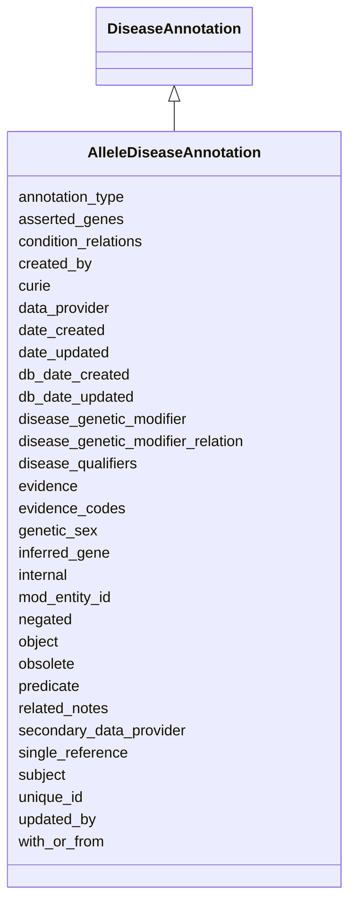

# AlleleDiseaseAnnotation

An annotation asserting an association between an allele and a disease supported by evidence.





URI: [alliance:AlleleDiseaseAnnotation](http://alliancegenome.org/AlleleDiseaseAnnotation)


## Parent Classes

* [AuditedObject](AuditedObject.md)
    * [Association](Association.md)
        * [DiseaseAnnotation](DiseaseAnnotation.md)
            * **AlleleDiseaseAnnotation**


<!-- no inheritance hierarchy -->


## Slots

| Name | Description  |
| ---  | ---  |
| [annotation_type](annotation_type.md) | The type of annotation classified according to curation method. Submitted value should be a vocabulary term from the 'Annotation types' vocabulary |
| [asserted_genes](asserted_genes.md) | The gene(s) to which something is manually asserted to be associated. |
| [condition_relations](condition_relations.md) | None |
| [created_by](created_by.md) | The individual that created the entity. |
| [curie](curie.md) | A unique identifier for a thing. Must be either a CURIE shorthand for a URI or a complete URI |
| [data_provider](data_provider.md) | Object representing the organization (e.g. MOD) from which the data was sourced and a CrossReference to that organisation's site |
| [date_created](date_created.md) | The date on which an entity was created. This can be applied to nodes or edges. |
| [date_updated](date_updated.md) | Date on which an entity was last modified. |
| [db_date_created](db_date_created.md) | The date on which an entity was created in the Alliance database.  This is disinct from date_created, which represents the date when the entity was originally created (i.e. at the MOD for imported data). |
| [db_date_updated](db_date_updated.md) | Date on which an entity was last modified in the Alliance database.  This is disinct from date_updated, which represents the date when the entity was last modified and may predate import into the Alliance database. |
| [disease_genetic_modifier](disease_genetic_modifier.md) | Specifies a genetic object that modifies the disease model. May be a gene, allele, AGM. |
| [disease_genetic_modifier_relation](disease_genetic_modifier_relation.md) | A relation describing how the genetic modifier modifies the disease model. Submitted value should be a vocabulary term from the 'Disease genetic modifiers' vocabulary |
| [disease_qualifiers](disease_qualifiers.md) | Submitted values should be vocabulary terms from the 'Disease qualifiers' Vocabulary |
| [evidence](evidence.md) |  |
| [evidence_codes](evidence_codes.md) | ECO term IDs |
| [genetic_sex](genetic_sex.md) | Submitted value should be a vocabulary term from the 'Genetic sexes' vocabulary |
| [inferred_gene](inferred_gene.md) | The gene to which the disease is inferred to be associated. |
| [internal](internal.md) | Classifies the entity as private (for internal use) or not (for public use). |
| [mod_entity_id](mod_entity_id.md) | The model organism database (MOD) identifier/curie for the object |
| [negated](negated.md) | if set to true, then the association is negated i.e. is not true |
| [object](object.md) | connects an association to the object of the association. For example, in a gene-to-phenotype association, the gene is subject and phenotype is object. |
| [obsolete](obsolete.md) | Entity is no longer current. |
| [predicate](predicate.md) | The relationship between allele and disease. Submitted value should be a vocabulary term from the 'Allele disease relations' vocabulary |
| [related_notes](related_notes.md) | Holds between an object and a list of related Note objects. |
| [secondary_data_provider](secondary_data_provider.md) | Object representing organization (e.g. MOD) that provided the data directly to the Alliance, but not the original source, and a CrossReference to that organisation's site |
| [single_reference](single_reference.md) | holds between an object and a single reference |
| [subject](subject.md) | The allele to which the disease ontology term is associated. |
| [unique_id](unique_id.md) | A non-curie unique identifier for a thing. |
| [updated_by](updated_by.md) | The individual that last modified the entity. |
| [with_or_from](with_or_from.md) | http://geneontology.org/docs/go-annotation-file-gaf-format-2.2/#with-or-from-column-8 |


## Mappings

| Mapping Type | Mapped Value |
| ---  | ---  |
| self | ['alliance:AlleleDiseaseAnnotation'] |
| native | ['alliance:AlleleDiseaseAnnotation'] |


## LinkML Specification

<!-- TODO: investigate https://stackoverflow.com/questions/37606292/how-to-create-tabbed-code-blocks-in-mkdocs-or-sphinx -->

### Direct

<details>
```yaml
name: AlleleDiseaseAnnotation
description: An annotation asserting an association between an allele and a disease
  supported by evidence.
from_schema: https://github.com/alliance-genome/agr_persistent_schema/phenotypeAndDiseaseAnnotation.yaml
is_a: DiseaseAnnotation
slots:
- inferred_gene
- asserted_genes
slot_usage:
  subject:
    name: subject
    description: The allele to which the disease ontology term is associated.
    domain_of:
    - Association
    - VariantConsequence
    range: Allele
  predicate:
    name: predicate
    description: The relationship between allele and disease. Submitted value should
      be a vocabulary term from the 'Allele disease relations' vocabulary
    domain_of:
    - Association
    - GeneToGeneOrthology
    range: VocabularyTerm
    required: true
  inferred_gene:
    name: inferred_gene
    description: The gene to which the disease is inferred to be associated.
    domain_of:
    - AllelePhenotypeAnnotation
    - AGMPhenotypeAnnotation
    - AlleleDiseaseAnnotation
    - AGMDiseaseAnnotation
    range: Gene
    required: false
  asserted_genes:
    name: asserted_genes
    domain_of:
    - AllelePhenotypeAnnotation
    - AGMPhenotypeAnnotation
    - AlleleDiseaseAnnotation
    - AGMDiseaseAnnotation
    required: false

```
</details>

### Induced

<details>
```yaml
name: AlleleDiseaseAnnotation
description: An annotation asserting an association between an allele and a disease
  supported by evidence.
from_schema: https://github.com/alliance-genome/agr_persistent_schema/phenotypeAndDiseaseAnnotation.yaml
is_a: DiseaseAnnotation
slot_usage:
  subject:
    name: subject
    description: The allele to which the disease ontology term is associated.
    domain_of:
    - Association
    - VariantConsequence
    range: Allele
  predicate:
    name: predicate
    description: The relationship between allele and disease. Submitted value should
      be a vocabulary term from the 'Allele disease relations' vocabulary
    domain_of:
    - Association
    - GeneToGeneOrthology
    range: VocabularyTerm
    required: true
  inferred_gene:
    name: inferred_gene
    description: The gene to which the disease is inferred to be associated.
    domain_of:
    - AllelePhenotypeAnnotation
    - AGMPhenotypeAnnotation
    - AlleleDiseaseAnnotation
    - AGMDiseaseAnnotation
    range: Gene
    required: false
  asserted_genes:
    name: asserted_genes
    domain_of:
    - AllelePhenotypeAnnotation
    - AGMPhenotypeAnnotation
    - AlleleDiseaseAnnotation
    - AGMDiseaseAnnotation
    required: false
attributes:
  inferred_gene:
    name: inferred_gene
    description: The gene to which the disease is inferred to be associated.
    from_schema: https://github.com/alliance-genome/agr_persistent_schema/phenotypeAndDiseaseAnnotation.yaml
    alias: inferred_gene
    owner: AlleleDiseaseAnnotation
    domain_of:
    - AllelePhenotypeAnnotation
    - AGMPhenotypeAnnotation
    - AlleleDiseaseAnnotation
    - AGMDiseaseAnnotation
    range: Gene
    required: false
  asserted_genes:
    name: asserted_genes
    description: The gene(s) to which something is manually asserted to be associated.
    from_schema: https://github.com/alliance-genome/agr_persistent_schema/phenotypeAndDiseaseAnnotation.yaml
    singular_name: asserted_gene
    multivalued: true
    alias: asserted_genes
    owner: AlleleDiseaseAnnotation
    domain_of:
    - AllelePhenotypeAnnotation
    - AGMPhenotypeAnnotation
    - AlleleDiseaseAnnotation
    - AGMDiseaseAnnotation
    range: Gene
    required: false
  curie:
    name: curie
    description: A unique identifier for a thing. Must be either a CURIE shorthand
      for a URI or a complete URI
    from_schema: https://github.com/alliance-genome/agr_curation_schema/core.yaml
    multivalued: false
    identifier: true
    alias: curie
    owner: AlleleDiseaseAnnotation
    domain_of:
    - OntologyTerm
    - PhenotypeAnnotation
    - DiseaseAnnotation
    - BiologicalEntity
    - BiologicalEntityDTO
    - Chromosome
    - Assembly
    - Identifier
    - Figure
    - Image
    - Laboratory
    - InformationContentEntity
    - Reference
    - Resource
    - ModCorpusAssociation
    - GeneInteraction
    - ExpressionExperiment
    - GeneNomenclatureSet
    range: uriorcurie
  unique_id:
    name: unique_id
    description: A non-curie unique identifier for a thing.
    from_schema: https://github.com/alliance-genome/agr_curation_schema/core.yaml
    multivalued: false
    alias: unique_id
    owner: AlleleDiseaseAnnotation
    domain_of:
    - DiseaseAnnotation
    - ExperimentalCondition
    - ConditionRelation
    - Person
    range: string
    required: false
  mod_entity_id:
    name: mod_entity_id
    description: The model organism database (MOD) identifier/curie for the object
    from_schema: https://github.com/alliance-genome/agr_curation_schema/core.yaml
    alias: mod_entity_id
    owner: AlleleDiseaseAnnotation
    domain_of:
    - DiseaseAnnotation
    - DiseaseAnnotationDTO
    - Person
    range: string
  negated:
    name: negated
    description: if set to true, then the association is negated i.e. is not true
    from_schema: https://github.com/alliance-genome/agr_curation_schema/core.yaml
    alias: negated
    owner: AlleleDiseaseAnnotation
    domain_of:
    - DiseaseAnnotation
    - DiseaseAnnotationDTO
    - ExpressionAnnotation
    range: boolean
  evidence_codes:
    name: evidence_codes
    description: ECO term IDs
    from_schema: https://github.com/alliance-genome/agr_curation_schema/core.yaml
    values_from:
    - ECO
    multivalued: true
    alias: evidence_codes
    owner: AlleleDiseaseAnnotation
    domain_of:
    - DiseaseAnnotation
    range: ECOTerm
    required: true
  single_reference:
    name: single_reference
    description: holds between an object and a single reference
    from_schema: https://github.com/alliance-genome/agr_curation_schema/core.yaml
    multivalued: false
    alias: single_reference
    owner: AlleleDiseaseAnnotation
    domain_of:
    - SourceVariantLocation
    - VariantLocation
    - PhenotypeAnnotation
    - DiseaseAnnotation
    - ConditionRelation
    - Figure
    - GeneToGeneOrthologyCurated
    - ExpressionExperiment
    - FunctionalGeneSet
    range: Reference
    required: true
  annotation_type:
    name: annotation_type
    description: The type of annotation classified according to curation method. Submitted
      value should be a vocabulary term from the 'Annotation types' vocabulary
    from_schema: https://github.com/alliance-genome/agr_persistent_schema/phenotypeAndDiseaseAnnotation.yaml
    alias: annotation_type
    owner: AlleleDiseaseAnnotation
    domain_of:
    - DiseaseAnnotation
    range: VocabularyTerm
    required: false
  with_or_from:
    name: with_or_from
    description: http://geneontology.org/docs/go-annotation-file-gaf-format-2.2/#with-or-from-column-8
    from_schema: https://github.com/alliance-genome/agr_persistent_schema/phenotypeAndDiseaseAnnotation.yaml
    multivalued: true
    alias: with_or_from
    owner: AlleleDiseaseAnnotation
    domain_of:
    - DiseaseAnnotation
    range: Gene
    required: false
  disease_qualifiers:
    name: disease_qualifiers
    description: Submitted values should be vocabulary terms from the 'Disease qualifiers'
      Vocabulary
    from_schema: https://github.com/alliance-genome/agr_persistent_schema/phenotypeAndDiseaseAnnotation.yaml
    domain: DiseaseAnnotation
    multivalued: true
    alias: disease_qualifiers
    owner: AlleleDiseaseAnnotation
    domain_of:
    - DiseaseAnnotation
    range: VocabularyTerm
  condition_relations:
    name: condition_relations
    from_schema: https://github.com/alliance-genome/agr_persistent_schema/phenotypeAndDiseaseAnnotation.yaml
    multivalued: true
    alias: condition_relations
    owner: AlleleDiseaseAnnotation
    domain_of:
    - PhenotypeAnnotation
    - DiseaseAnnotation
    - ExpressionExperiment
    range: ConditionRelation
  genetic_sex:
    name: genetic_sex
    description: Submitted value should be a vocabulary term from the 'Genetic sexes'
      vocabulary
    from_schema: https://github.com/alliance-genome/agr_persistent_schema/phenotypeAndDiseaseAnnotation.yaml
    alias: genetic_sex
    owner: AlleleDiseaseAnnotation
    domain_of:
    - DiseaseAnnotation
    range: VocabularyTerm
    required: false
  related_notes:
    name: related_notes
    description: Holds between an object and a list of related Note objects.
    notes:
    - The original name suggested for this slot was simply notes, but I think that
      label is reserved in LinkML for internal descriptions of objects, hence the
      related_notes label used here.
    from_schema: https://github.com/alliance-genome/agr_curation_schema/core.yaml
    multivalued: true
    alias: related_notes
    owner: AlleleDiseaseAnnotation
    domain_of:
    - Variant
    - DiseaseAnnotation
    - Gene
    - Antibody
    - ExpressionExperiment
    - ExpressionAnnotation
    range: Note
  data_provider:
    name: data_provider
    description: Object representing the organization (e.g. MOD) from which the data
      was sourced and a CrossReference to that organisation's site
    from_schema: https://github.com/alliance-genome/agr_curation_schema/core.yaml
    multivalued: false
    alias: data_provider
    owner: AlleleDiseaseAnnotation
    domain_of:
    - DiseaseAnnotation
    - AffectedGenomicModel
    range: DataProvider
    required: true
  secondary_data_provider:
    name: secondary_data_provider
    description: Object representing organization (e.g. MOD) that provided the data
      directly to the Alliance, but not the original source, and a CrossReference
      to that organisation's site
    from_schema: https://github.com/alliance-genome/agr_curation_schema/core.yaml
    multivalued: false
    alias: secondary_data_provider
    owner: AlleleDiseaseAnnotation
    domain_of:
    - DiseaseAnnotation
    range: DataProvider
  disease_genetic_modifier:
    name: disease_genetic_modifier
    description: Specifies a genetic object that modifies the disease model. May be
      a gene, allele, AGM.
    from_schema: https://github.com/alliance-genome/agr_persistent_schema/phenotypeAndDiseaseAnnotation.yaml
    alias: disease_genetic_modifier
    owner: AlleleDiseaseAnnotation
    domain_of:
    - DiseaseAnnotation
    range: string
    required: false
  disease_genetic_modifier_relation:
    name: disease_genetic_modifier_relation
    description: A relation describing how the genetic modifier modifies the disease
      model. Submitted value should be a vocabulary term from the 'Disease genetic
      modifiers' vocabulary
    from_schema: https://github.com/alliance-genome/agr_persistent_schema/phenotypeAndDiseaseAnnotation.yaml
    alias: disease_genetic_modifier_relation
    owner: AlleleDiseaseAnnotation
    domain_of:
    - DiseaseAnnotation
    range: VocabularyTerm
  subject:
    name: subject
    description: The allele to which the disease ontology term is associated.
    from_schema: https://github.com/alliance-genome/agr_curation_schema/core.yaml
    is_a: association_slot
    alias: subject
    owner: AlleleDiseaseAnnotation
    domain_of:
    - Association
    - VariantConsequence
    range: Allele
    required: true
  predicate:
    name: predicate
    description: The relationship between allele and disease. Submitted value should
      be a vocabulary term from the 'Allele disease relations' vocabulary
    from_schema: https://github.com/alliance-genome/agr_curation_schema/core.yaml
    is_a: association_slot
    alias: predicate
    owner: AlleleDiseaseAnnotation
    domain_of:
    - Association
    - GeneToGeneOrthology
    range: VocabularyTerm
    required: true
  object:
    name: object
    description: connects an association to the object of the association. For example,
      in a gene-to-phenotype association, the gene is subject and phenotype is object.
    from_schema: https://github.com/alliance-genome/agr_curation_schema/core.yaml
    exact_mappings:
    - biolink:object
    is_a: association_slot
    alias: object
    owner: AlleleDiseaseAnnotation
    domain_of:
    - Association
    - VariantConsequence
    range: DOTerm
    required: true
  evidence:
    name: evidence
    description: ''
    from_schema: https://github.com/alliance-genome/agr_curation_schema/src/schema/reference
    multivalued: true
    alias: evidence
    owner: AlleleDiseaseAnnotation
    domain_of:
    - AlleleGenerationMethodAssociation
    - Note
    - SlotAnnotation
    - Association
    range: InformationContentEntity
  created_by:
    name: created_by
    description: The individual that created the entity.
    from_schema: https://github.com/alliance-genome/agr_curation_schema/core.yaml
    domain: AuditedObject
    multivalued: false
    alias: created_by
    owner: AlleleDiseaseAnnotation
    domain_of:
    - AuditedObject
    range: Person
  date_created:
    name: date_created
    description: The date on which an entity was created. This can be applied to nodes
      or edges.
    from_schema: https://github.com/alliance-genome/agr_curation_schema/core.yaml
    aliases:
    - creation_date
    exact_mappings:
    - dct:createdOn
    - WIKIDATA_PROPERTY:P577
    alias: date_created
    owner: AlleleDiseaseAnnotation
    domain_of:
    - AuditedObject
    - AuditedObjectDTO
    range: datetime
  updated_by:
    name: updated_by
    description: The individual that last modified the entity.
    from_schema: https://github.com/alliance-genome/agr_curation_schema/core.yaml
    domain: AuditedObject
    multivalued: false
    alias: updated_by
    owner: AlleleDiseaseAnnotation
    domain_of:
    - AuditedObject
    range: Person
  date_updated:
    name: date_updated
    description: Date on which an entity was last modified.
    from_schema: https://github.com/alliance-genome/agr_curation_schema/core.yaml
    aliases:
    - date_last_modified
    alias: date_updated
    owner: AlleleDiseaseAnnotation
    domain_of:
    - AuditedObject
    - AuditedObjectDTO
    range: datetime
  db_date_created:
    name: db_date_created
    description: The date on which an entity was created in the Alliance database.  This
      is disinct from date_created, which represents the date when the entity was
      originally created (i.e. at the MOD for imported data).
    from_schema: https://github.com/alliance-genome/agr_curation_schema/core.yaml
    alias: db_date_created
    owner: AlleleDiseaseAnnotation
    domain_of:
    - AuditedObject
    - AuditedObjectDTO
    range: datetime
  db_date_updated:
    name: db_date_updated
    description: Date on which an entity was last modified in the Alliance database.  This
      is disinct from date_updated, which represents the date when the entity was
      last modified and may predate import into the Alliance database.
    from_schema: https://github.com/alliance-genome/agr_curation_schema/core.yaml
    alias: db_date_updated
    owner: AlleleDiseaseAnnotation
    domain_of:
    - AuditedObject
    - AuditedObjectDTO
    range: datetime
  internal:
    name: internal
    description: Classifies the entity as private (for internal use) or not (for public
      use).
    notes:
    - Default value is true.
    from_schema: https://github.com/alliance-genome/agr_curation_schema/core.yaml
    alias: internal
    owner: AlleleDiseaseAnnotation
    domain_of:
    - AuditedObject
    - AuditedObjectDTO
    range: boolean
    required: true
  obsolete:
    name: obsolete
    description: Entity is no longer current.
    notes:
    - Obsolete entities are preserved in the database for posterity but should not
      be publicly displayed.
    from_schema: https://github.com/alliance-genome/agr_curation_schema/core.yaml
    alias: obsolete
    owner: AlleleDiseaseAnnotation
    domain_of:
    - AuditedObject
    - AuditedObjectDTO
    range: boolean

```
</details>