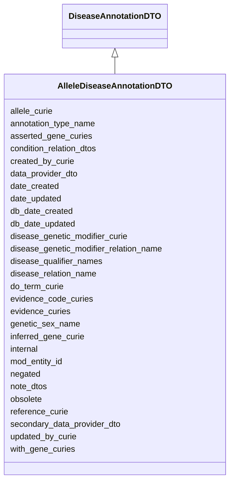

# AlleleDiseaseAnnotationDTO

Ingest class for an association between an allele and a disease





URI: [alliance:AlleleDiseaseAnnotationDTO](http://alliancegenome.org/AlleleDiseaseAnnotationDTO)


## Parent Classes

* [AuditedObjectDTO](AuditedObjectDTO.md)
    * [DiseaseAnnotationDTO](DiseaseAnnotationDTO.md)
        * **AlleleDiseaseAnnotationDTO**


<!-- no inheritance hierarchy -->


## Slots

| Name | Description  |
| ---  | ---  |
| [allele_curie](allele_curie.md) | None |
| [annotation_type_name](annotation_type_name.md) | Name of the VocabularyTerm describing the annotation type selected from the 'Annotation types' Vocabulary |
| [asserted_gene_curies](asserted_gene_curies.md) | Curies of the gene(s) to which something is manually asserted to be associated |
| [condition_relation_dtos](condition_relation_dtos.md) | None |
| [created_by_curie](created_by_curie.md) | Curie of the Person object representing the individual that created the entity |
| [data_provider_dto](data_provider_dto.md) | Ingest object representing the organization (e.g. MOD) from which the data was sourced and a CrossReference to that organisation's site |
| [date_created](date_created.md) | The date on which an entity was created. This can be applied to nodes or edges. |
| [date_updated](date_updated.md) | Date on which an entity was last modified. |
| [db_date_created](db_date_created.md) | The date on which an entity was created in the Alliance database.  This is disinct from date_created, which represents the date when the entity was originally created (i.e. at the MOD for imported data). |
| [db_date_updated](db_date_updated.md) | Date on which an entity was last modified in the Alliance database.  This is disinct from date_updated, which represents the date when the entity was last modified and may predate import into the Alliance database. |
| [disease_genetic_modifier_curie](disease_genetic_modifier_curie.md) | Curie of BiologcalEntity that modifies the disease model |
| [disease_genetic_modifier_relation_name](disease_genetic_modifier_relation_name.md) | Name of the VocabularyTerm that describes how the genetic modifier modifies the disease model, selected from the 'Disease genetic modifier relations' Vocabulary. |
| [disease_qualifier_names](disease_qualifier_names.md) | Names of terms from the 'Disease qualifiers' vocabulary |
| [disease_relation_name](disease_relation_name.md) | Name of term from 'Disease Relation Vocabulary' vocabulary |
| [do_term_curie](do_term_curie.md) | Curie of DOTerm describing the disease |
| [evidence_code_curies](evidence_code_curies.md) | List of ECOTerm curies |
| [evidence_curies](evidence_curies.md) | Curies of InformationContentEntity objects given as evidence |
| [genetic_sex_name](genetic_sex_name.md) | Name of term from the 'Genetic sexes' vocabulary |
| [inferred_gene_curie](inferred_gene_curie.md) | Curie of gene to which something is inferred to be associated via an automated pipeline |
| [internal](internal.md) | Classifies the entity as private (for internal use) or not (for public use). |
| [mod_entity_id](mod_entity_id.md) | The model organism database (MOD) identifier/curie for the object |
| [negated](negated.md) | if set to true, then the association is negated i.e. is not true |
| [note_dtos](note_dtos.md) | None |
| [obsolete](obsolete.md) | Entity is no longer current. |
| [reference_curie](reference_curie.md) | External reference curie used for ingest |
| [secondary_data_provider_dto](secondary_data_provider_dto.md) | Ingest object representing organization (e.g. MOD) that provided the data directly to the Alliance, but not the original source, and a CrossReference to that organisation's site |
| [updated_by_curie](updated_by_curie.md) | Curie of the Person object representing the individual that updated the entity |
| [with_gene_curies](with_gene_curies.md) | http://geneontology.org/docs/go-annotation-file-gaf-format-2.2/#with-or-from-column-8 |


## Mappings

| Mapping Type | Mapped Value |
| ---  | ---  |
| self | ['alliance:AlleleDiseaseAnnotationDTO'] |
| native | ['alliance:AlleleDiseaseAnnotationDTO'] |


## LinkML Specification

<!-- TODO: investigate https://stackoverflow.com/questions/37606292/how-to-create-tabbed-code-blocks-in-mkdocs-or-sphinx -->

### Direct

<details>
```yaml
name: AlleleDiseaseAnnotationDTO
description: Ingest class for an association between an allele and a disease
from_schema: https://github.com/alliance-genome/agr_persistent_schema/phenotypeAndDiseaseAnnotation.yaml
is_a: DiseaseAnnotationDTO
slots:
- allele_curie
- inferred_gene_curie
- asserted_gene_curies

```
</details>

### Induced

<details>
```yaml
name: AlleleDiseaseAnnotationDTO
description: Ingest class for an association between an allele and a disease
from_schema: https://github.com/alliance-genome/agr_persistent_schema/phenotypeAndDiseaseAnnotation.yaml
is_a: DiseaseAnnotationDTO
attributes:
  allele_curie:
    name: allele_curie
    from_schema: https://github.com/alliance-genome/agr_curation_schema/src/schema/alleleDTO
    alias: allele_curie
    owner: AlleleDiseaseAnnotationDTO
    domain_of:
    - AlleleDiseaseAnnotationDTO
    - AlleleCellLineAssociationDTO
    - AlleleGenerationMethodAssociationDTO
    - AlleleGenomicEntityAssociationDTO
    - AlleleImageAssociationDTO
    - AlleleOriginAssociationDTO
    - AffectedGenomicModelComponentDTO
    range: string
    required: true
  inferred_gene_curie:
    name: inferred_gene_curie
    description: Curie of gene to which something is inferred to be associated via
      an automated pipeline
    from_schema: https://github.com/alliance-genome/agr_persistent_schema/phenotypeAndDiseaseAnnotation.yaml
    alias: inferred_gene_curie
    owner: AlleleDiseaseAnnotationDTO
    domain_of:
    - AlleleDiseaseAnnotationDTO
    - AGMDiseaseAnnotationDTO
    range: string
  asserted_gene_curies:
    name: asserted_gene_curies
    description: Curies of the gene(s) to which something is manually asserted to
      be associated
    from_schema: https://github.com/alliance-genome/agr_persistent_schema/phenotypeAndDiseaseAnnotation.yaml
    multivalued: true
    alias: asserted_gene_curies
    owner: AlleleDiseaseAnnotationDTO
    domain_of:
    - AlleleDiseaseAnnotationDTO
    - AGMDiseaseAnnotationDTO
    range: string
  disease_relation_name:
    name: disease_relation_name
    description: Name of term from 'Disease Relation Vocabulary' vocabulary
    from_schema: https://github.com/alliance-genome/agr_persistent_schema/phenotypeAndDiseaseAnnotation.yaml
    domain: DiseaseAnnotationDTO
    alias: disease_relation_name
    owner: AlleleDiseaseAnnotationDTO
    domain_of:
    - DiseaseAnnotationDTO
    range: string
    required: true
  do_term_curie:
    name: do_term_curie
    description: Curie of DOTerm describing the disease
    from_schema: https://github.com/alliance-genome/agr_persistent_schema/phenotypeAndDiseaseAnnotation.yaml
    domain: DiseaseAnnotationDTO
    alias: do_term_curie
    owner: AlleleDiseaseAnnotationDTO
    domain_of:
    - DiseaseAnnotationDTO
    range: string
    required: true
  mod_entity_id:
    name: mod_entity_id
    description: The model organism database (MOD) identifier/curie for the object
    from_schema: https://github.com/alliance-genome/agr_curation_schema/core.yaml
    alias: mod_entity_id
    owner: AlleleDiseaseAnnotationDTO
    domain_of:
    - DiseaseAnnotation
    - DiseaseAnnotationDTO
    - Person
    range: string
  negated:
    name: negated
    description: if set to true, then the association is negated i.e. is not true
    from_schema: https://github.com/alliance-genome/agr_curation_schema/core.yaml
    alias: negated
    owner: AlleleDiseaseAnnotationDTO
    domain_of:
    - DiseaseAnnotation
    - DiseaseAnnotationDTO
    - ExpressionAnnotation
    range: boolean
  evidence_curies:
    name: evidence_curies
    description: Curies of InformationContentEntity objects given as evidence
    from_schema: https://github.com/alliance-genome/agr_curation_schema/src/schema/reference
    multivalued: true
    alias: evidence_curies
    owner: AlleleDiseaseAnnotationDTO
    domain_of:
    - DiseaseAnnotationDTO
    - AlleleCellLineAssociationDTO
    - AlleleGenerationMethodAssociationDTO
    - AlleleGenomicEntityAssociationDTO
    - AlleleImageAssociationDTO
    - AlleleOriginAssociationDTO
    - NoteDTO
    - SlotAnnotationDTO
    - GenomicLocationAssociationDTO
    range: string
  evidence_code_curies:
    name: evidence_code_curies
    description: List of ECOTerm curies
    from_schema: https://github.com/alliance-genome/agr_curation_schema/ontologyTerm.yaml
    multivalued: true
    alias: evidence_code_curies
    owner: AlleleDiseaseAnnotationDTO
    domain_of:
    - DiseaseAnnotationDTO
    range: string
  reference_curie:
    name: reference_curie
    description: External reference curie used for ingest
    from_schema: https://github.com/alliance-genome/agr_curation_schema/src/schema/reference
    alias: reference_curie
    owner: AlleleDiseaseAnnotationDTO
    domain_of:
    - DiseaseAnnotationDTO
    - ConditionRelationDTO
    range: string
  annotation_type_name:
    name: annotation_type_name
    description: Name of the VocabularyTerm describing the annotation type selected
      from the 'Annotation types' Vocabulary
    from_schema: https://github.com/alliance-genome/agr_persistent_schema/phenotypeAndDiseaseAnnotation.yaml
    domain: DiseaseAnnotationDTO
    alias: annotation_type_name
    owner: AlleleDiseaseAnnotationDTO
    domain_of:
    - DiseaseAnnotationDTO
    range: string
  with_gene_curies:
    name: with_gene_curies
    description: http://geneontology.org/docs/go-annotation-file-gaf-format-2.2/#with-or-from-column-8
    from_schema: https://github.com/alliance-genome/agr_persistent_schema/phenotypeAndDiseaseAnnotation.yaml
    multivalued: true
    alias: with_gene_curies
    owner: AlleleDiseaseAnnotationDTO
    domain_of:
    - DiseaseAnnotationDTO
    range: string
  disease_qualifier_names:
    name: disease_qualifier_names
    description: Names of terms from the 'Disease qualifiers' vocabulary
    from_schema: https://github.com/alliance-genome/agr_persistent_schema/phenotypeAndDiseaseAnnotation.yaml
    domain: DiseaseAnnotationDTO
    multivalued: true
    alias: disease_qualifier_names
    owner: AlleleDiseaseAnnotationDTO
    domain_of:
    - DiseaseAnnotationDTO
    range: string
  condition_relation_dtos:
    name: condition_relation_dtos
    from_schema: https://github.com/alliance-genome/agr_persistent_schema/phenotypeAndDiseaseAnnotation.yaml
    multivalued: true
    alias: condition_relation_dtos
    owner: AlleleDiseaseAnnotationDTO
    domain_of:
    - DiseaseAnnotationDTO
    range: ConditionRelationDTO
    inlined: true
    inlined_as_list: true
  genetic_sex_name:
    name: genetic_sex_name
    description: Name of term from the 'Genetic sexes' vocabulary
    from_schema: https://github.com/alliance-genome/agr_persistent_schema/phenotypeAndDiseaseAnnotation.yaml
    domain: DiseaseAnnotationDTO
    alias: genetic_sex_name
    owner: AlleleDiseaseAnnotationDTO
    domain_of:
    - DiseaseAnnotationDTO
    range: string
  note_dtos:
    name: note_dtos
    from_schema: https://github.com/alliance-genome/agr_curation_schema/core.yaml
    multivalued: true
    alias: note_dtos
    owner: AlleleDiseaseAnnotationDTO
    domain_of:
    - DiseaseAnnotationDTO
    range: NoteDTO
    inlined: true
    inlined_as_list: true
  data_provider_dto:
    name: data_provider_dto
    description: Ingest object representing the organization (e.g. MOD) from which
      the data was sourced and a CrossReference to that organisation's site
    from_schema: https://github.com/alliance-genome/agr_curation_schema/core.yaml
    multivalued: false
    alias: data_provider_dto
    owner: AlleleDiseaseAnnotationDTO
    domain_of:
    - DiseaseAnnotationDTO
    - AffectedGenomicModelDTO
    range: DataProviderDTO
    required: true
    inlined: true
  secondary_data_provider_dto:
    name: secondary_data_provider_dto
    description: Ingest object representing organization (e.g. MOD) that provided
      the data directly to the Alliance, but not the original source, and a CrossReference
      to that organisation's site
    from_schema: https://github.com/alliance-genome/agr_curation_schema/core.yaml
    multivalued: false
    alias: secondary_data_provider_dto
    owner: AlleleDiseaseAnnotationDTO
    domain_of:
    - DiseaseAnnotationDTO
    range: DataProviderDTO
    inlined: true
  disease_genetic_modifier_curie:
    name: disease_genetic_modifier_curie
    description: Curie of BiologcalEntity that modifies the disease model
    from_schema: https://github.com/alliance-genome/agr_persistent_schema/phenotypeAndDiseaseAnnotation.yaml
    domain: DiseaseAnnotationDTO
    alias: disease_genetic_modifier_curie
    owner: AlleleDiseaseAnnotationDTO
    domain_of:
    - DiseaseAnnotationDTO
    range: string
  disease_genetic_modifier_relation_name:
    name: disease_genetic_modifier_relation_name
    description: Name of the VocabularyTerm that describes how the genetic modifier
      modifies the disease model, selected from the 'Disease genetic modifier relations'
      Vocabulary.
    from_schema: https://github.com/alliance-genome/agr_persistent_schema/phenotypeAndDiseaseAnnotation.yaml
    domain: DiseaseAnnotationDTO
    alias: disease_genetic_modifier_relation_name
    owner: AlleleDiseaseAnnotationDTO
    domain_of:
    - DiseaseAnnotationDTO
    range: string
  created_by_curie:
    name: created_by_curie
    description: Curie of the Person object representing the individual that created
      the entity
    from_schema: https://github.com/alliance-genome/agr_curation_schema/core.yaml
    domain: AuditedObjectDTO
    alias: created_by_curie
    owner: AlleleDiseaseAnnotationDTO
    domain_of:
    - AuditedObjectDTO
    range: string
  date_created:
    name: date_created
    description: The date on which an entity was created. This can be applied to nodes
      or edges.
    from_schema: https://github.com/alliance-genome/agr_curation_schema/core.yaml
    aliases:
    - creation_date
    exact_mappings:
    - dct:createdOn
    - WIKIDATA_PROPERTY:P577
    alias: date_created
    owner: AlleleDiseaseAnnotationDTO
    domain_of:
    - AuditedObject
    - AuditedObjectDTO
    range: datetime
  updated_by_curie:
    name: updated_by_curie
    description: Curie of the Person object representing the individual that updated
      the entity
    from_schema: https://github.com/alliance-genome/agr_curation_schema/core.yaml
    domain: AuditedObjectDTO
    alias: updated_by_curie
    owner: AlleleDiseaseAnnotationDTO
    domain_of:
    - AuditedObjectDTO
    range: string
  date_updated:
    name: date_updated
    description: Date on which an entity was last modified.
    from_schema: https://github.com/alliance-genome/agr_curation_schema/core.yaml
    aliases:
    - date_last_modified
    alias: date_updated
    owner: AlleleDiseaseAnnotationDTO
    domain_of:
    - AuditedObject
    - AuditedObjectDTO
    range: datetime
  db_date_created:
    name: db_date_created
    description: The date on which an entity was created in the Alliance database.  This
      is disinct from date_created, which represents the date when the entity was
      originally created (i.e. at the MOD for imported data).
    from_schema: https://github.com/alliance-genome/agr_curation_schema/core.yaml
    alias: db_date_created
    owner: AlleleDiseaseAnnotationDTO
    domain_of:
    - AuditedObject
    - AuditedObjectDTO
    range: datetime
  db_date_updated:
    name: db_date_updated
    description: Date on which an entity was last modified in the Alliance database.  This
      is disinct from date_updated, which represents the date when the entity was
      last modified and may predate import into the Alliance database.
    from_schema: https://github.com/alliance-genome/agr_curation_schema/core.yaml
    alias: db_date_updated
    owner: AlleleDiseaseAnnotationDTO
    domain_of:
    - AuditedObject
    - AuditedObjectDTO
    range: datetime
  internal:
    name: internal
    description: Classifies the entity as private (for internal use) or not (for public
      use).
    notes:
    - Default value is true.
    from_schema: https://github.com/alliance-genome/agr_curation_schema/core.yaml
    alias: internal
    owner: AlleleDiseaseAnnotationDTO
    domain_of:
    - AuditedObject
    - AuditedObjectDTO
    range: boolean
    required: true
  obsolete:
    name: obsolete
    description: Entity is no longer current.
    notes:
    - Obsolete entities are preserved in the database for posterity but should not
      be publicly displayed.
    from_schema: https://github.com/alliance-genome/agr_curation_schema/core.yaml
    alias: obsolete
    owner: AlleleDiseaseAnnotationDTO
    domain_of:
    - AuditedObject
    - AuditedObjectDTO
    range: boolean

```
</details>