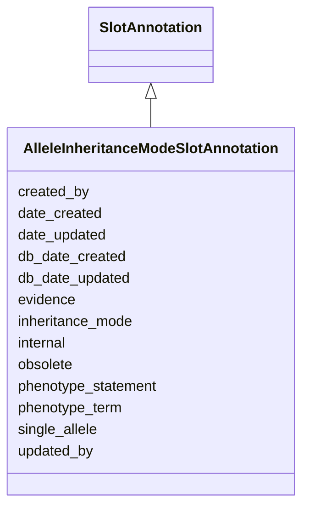

# AlleleInheritanceModeSlotAnnotation

None





URI: [alliance:AlleleInheritanceModeSlotAnnotation](http://alliancegenome.org/AlleleInheritanceModeSlotAnnotation)


## Parent Classes

* [AuditedObject](AuditedObject.md)
    * [SlotAnnotation](SlotAnnotation.md)
        * **AlleleInheritanceModeSlotAnnotation**


<!-- no inheritance hierarchy -->


## Slots

| Name | Description  |
| ---  | ---  |
| [created_by](created_by.md) | The individual that created the entity. |
| [date_created](date_created.md) | The date on which an entity was created. This can be applied to nodes or edges. |
| [date_updated](date_updated.md) | Date on which an entity was last modified. |
| [db_date_created](db_date_created.md) | The date on which an entity was created in the Alliance database.  This is disinct from date_created, which represents the date when the entity was originally created (i.e. at the MOD for imported data). |
| [db_date_updated](db_date_updated.md) | Date on which an entity was last modified in the Alliance database.  This is disinct from date_updated, which represents the date when the entity was last modified and may predate import into the Alliance database. |
| [evidence](evidence.md) |  |
| [inheritance_mode](inheritance_mode.md) | Mode of inheritance, e.g. dominant / semi-dominant / recessive / unknown / codominant |
| [internal](internal.md) | Classifies the entity as private (for internal use) or not (for public use). |
| [obsolete](obsolete.md) | Entity is no longer current. |
| [phenotype_statement](phenotype_statement.md) | For some MODs, the inheritance mode of an allele is reported specifically in the context of a particular phenotype. This slot is intended to capture the free-text phenotype statement. |
| [phenotype_term](phenotype_term.md) | For some MODs, the inheritance mode of an allele is reported specifically in the context of a particular phenotype. This slot is intended to capture the phenotype ontology term. |
| [single_allele](single_allele.md) | None |
| [updated_by](updated_by.md) | The individual that last modified the entity. |


## Mappings

| Mapping Type | Mapped Value |
| ---  | ---  |
| self | ['alliance:AlleleInheritanceModeSlotAnnotation'] |
| native | ['alliance:AlleleInheritanceModeSlotAnnotation'] |


## LinkML Specification

<!-- TODO: investigate https://stackoverflow.com/questions/37606292/how-to-create-tabbed-code-blocks-in-mkdocs-or-sphinx -->

### Direct

<details>
```yaml
name: AlleleInheritanceModeSlotAnnotation
from_schema: https://github.com/alliance-genome/agr_curation_schema/src/schema/allele
is_a: SlotAnnotation
slots:
- single_allele
- inheritance_mode
- phenotype_term
- phenotype_statement
slot_usage:
  single_allele:
    name: single_allele
    domain_of:
    - AlleleDatabaseStatusSlotAnnotation
    - AlleleFullNameSlotAnnotation
    - AlleleFunctionalImpactSlotAnnotation
    - AlleleGermlineTransmissionStatusSlotAnnotation
    - AlleleInheritanceModeSlotAnnotation
    - AlleleMolecularMutationSlotAnnotation
    - AlleleMutationTypeSlotAnnotation
    - AlleleNomenclatureEventSlotAnnotation
    - AlleleNoteSlotAnnotation
    - AlleleSecondaryIdSlotAnnotation
    - AlleleSymbolSlotAnnotation
    - AlleleSynonymSlotAnnotation
    - AffectedGenomicModelComponent
    required: true
  inheritance_mode:
    name: inheritance_mode
    domain_of:
    - AlleleInheritanceModeSlotAnnotation
    required: true
  phenotype_term:
    name: phenotype_term
    description: For some MODs, the inheritance mode of an allele is reported specifically
      in the context of a particular phenotype. This slot is intended to capture the
      phenotype ontology term.
    domain_of:
    - AlleleFunctionalImpactSlotAnnotation
    - AlleleInheritanceModeSlotAnnotation
    - PhenotypeAnnotation
    required: false
  phenotype_statement:
    name: phenotype_statement
    description: For some MODs, the inheritance mode of an allele is reported specifically
      in the context of a particular phenotype. This slot is intended to capture the
      free-text phenotype statement.
    domain_of:
    - AlleleFunctionalImpactSlotAnnotation
    - AlleleInheritanceModeSlotAnnotation
    - AlleleFunctionalImpactSlotAnnotationDTO
    - AlleleInheritanceModeSlotAnnotationDTO
    required: false

```
</details>

### Induced

<details>
```yaml
name: AlleleInheritanceModeSlotAnnotation
from_schema: https://github.com/alliance-genome/agr_curation_schema/src/schema/allele
is_a: SlotAnnotation
slot_usage:
  single_allele:
    name: single_allele
    domain_of:
    - AlleleDatabaseStatusSlotAnnotation
    - AlleleFullNameSlotAnnotation
    - AlleleFunctionalImpactSlotAnnotation
    - AlleleGermlineTransmissionStatusSlotAnnotation
    - AlleleInheritanceModeSlotAnnotation
    - AlleleMolecularMutationSlotAnnotation
    - AlleleMutationTypeSlotAnnotation
    - AlleleNomenclatureEventSlotAnnotation
    - AlleleNoteSlotAnnotation
    - AlleleSecondaryIdSlotAnnotation
    - AlleleSymbolSlotAnnotation
    - AlleleSynonymSlotAnnotation
    - AffectedGenomicModelComponent
    required: true
  inheritance_mode:
    name: inheritance_mode
    domain_of:
    - AlleleInheritanceModeSlotAnnotation
    required: true
  phenotype_term:
    name: phenotype_term
    description: For some MODs, the inheritance mode of an allele is reported specifically
      in the context of a particular phenotype. This slot is intended to capture the
      phenotype ontology term.
    domain_of:
    - AlleleFunctionalImpactSlotAnnotation
    - AlleleInheritanceModeSlotAnnotation
    - PhenotypeAnnotation
    required: false
  phenotype_statement:
    name: phenotype_statement
    description: For some MODs, the inheritance mode of an allele is reported specifically
      in the context of a particular phenotype. This slot is intended to capture the
      free-text phenotype statement.
    domain_of:
    - AlleleFunctionalImpactSlotAnnotation
    - AlleleInheritanceModeSlotAnnotation
    - AlleleFunctionalImpactSlotAnnotationDTO
    - AlleleInheritanceModeSlotAnnotationDTO
    required: false
attributes:
  single_allele:
    name: single_allele
    from_schema: https://github.com/alliance-genome/agr_curation_schema/src/schema/allele
    multivalued: false
    alias: single_allele
    owner: AlleleInheritanceModeSlotAnnotation
    domain_of:
    - AlleleDatabaseStatusSlotAnnotation
    - AlleleFullNameSlotAnnotation
    - AlleleFunctionalImpactSlotAnnotation
    - AlleleGermlineTransmissionStatusSlotAnnotation
    - AlleleInheritanceModeSlotAnnotation
    - AlleleMolecularMutationSlotAnnotation
    - AlleleMutationTypeSlotAnnotation
    - AlleleNomenclatureEventSlotAnnotation
    - AlleleNoteSlotAnnotation
    - AlleleSecondaryIdSlotAnnotation
    - AlleleSymbolSlotAnnotation
    - AlleleSynonymSlotAnnotation
    - AffectedGenomicModelComponent
    range: Allele
    required: true
  inheritance_mode:
    name: inheritance_mode
    description: Mode of inheritance, e.g. dominant / semi-dominant / recessive /
      unknown / codominant
    from_schema: https://github.com/alliance-genome/agr_curation_schema/src/schema/allele
    domain: AlleleInheritanceModeSlotAnnotation
    alias: inheritance_mode
    owner: AlleleInheritanceModeSlotAnnotation
    domain_of:
    - AlleleInheritanceModeSlotAnnotation
    range: VocabularyTerm
    required: true
  phenotype_term:
    name: phenotype_term
    description: For some MODs, the inheritance mode of an allele is reported specifically
      in the context of a particular phenotype. This slot is intended to capture the
      phenotype ontology term.
    from_schema: https://github.com/alliance-genome/agr_persistent_schema/phenotypeAndDiseaseAnnotation.yaml
    multivalued: false
    alias: phenotype_term
    owner: AlleleInheritanceModeSlotAnnotation
    domain_of:
    - AlleleFunctionalImpactSlotAnnotation
    - AlleleInheritanceModeSlotAnnotation
    - PhenotypeAnnotation
    range: PhenotypeTerm
    required: false
  phenotype_statement:
    name: phenotype_statement
    description: For some MODs, the inheritance mode of an allele is reported specifically
      in the context of a particular phenotype. This slot is intended to capture the
      free-text phenotype statement.
    from_schema: https://github.com/alliance-genome/agr_persistent_schema/phenotypeAndDiseaseAnnotation.yaml
    alias: phenotype_statement
    owner: AlleleInheritanceModeSlotAnnotation
    domain_of:
    - AlleleFunctionalImpactSlotAnnotation
    - AlleleInheritanceModeSlotAnnotation
    - AlleleFunctionalImpactSlotAnnotationDTO
    - AlleleInheritanceModeSlotAnnotationDTO
    range: string
    required: false
  evidence:
    name: evidence
    description: ''
    from_schema: https://github.com/alliance-genome/agr_curation_schema/src/schema/reference
    multivalued: true
    alias: evidence
    owner: AlleleInheritanceModeSlotAnnotation
    domain_of:
    - AlleleGenerationMethodAssociation
    - Note
    - SlotAnnotation
    - Association
    range: InformationContentEntity
  created_by:
    name: created_by
    description: The individual that created the entity.
    from_schema: https://github.com/alliance-genome/agr_curation_schema/core.yaml
    domain: AuditedObject
    multivalued: false
    alias: created_by
    owner: AlleleInheritanceModeSlotAnnotation
    domain_of:
    - AuditedObject
    range: Person
  date_created:
    name: date_created
    description: The date on which an entity was created. This can be applied to nodes
      or edges.
    from_schema: https://github.com/alliance-genome/agr_curation_schema/core.yaml
    aliases:
    - creation_date
    exact_mappings:
    - dct:createdOn
    - WIKIDATA_PROPERTY:P577
    alias: date_created
    owner: AlleleInheritanceModeSlotAnnotation
    domain_of:
    - AuditedObject
    - AuditedObjectDTO
    range: datetime
  updated_by:
    name: updated_by
    description: The individual that last modified the entity.
    from_schema: https://github.com/alliance-genome/agr_curation_schema/core.yaml
    domain: AuditedObject
    multivalued: false
    alias: updated_by
    owner: AlleleInheritanceModeSlotAnnotation
    domain_of:
    - AuditedObject
    range: Person
  date_updated:
    name: date_updated
    description: Date on which an entity was last modified.
    from_schema: https://github.com/alliance-genome/agr_curation_schema/core.yaml
    aliases:
    - date_last_modified
    alias: date_updated
    owner: AlleleInheritanceModeSlotAnnotation
    domain_of:
    - AuditedObject
    - AuditedObjectDTO
    range: datetime
  db_date_created:
    name: db_date_created
    description: The date on which an entity was created in the Alliance database.  This
      is disinct from date_created, which represents the date when the entity was
      originally created (i.e. at the MOD for imported data).
    from_schema: https://github.com/alliance-genome/agr_curation_schema/core.yaml
    alias: db_date_created
    owner: AlleleInheritanceModeSlotAnnotation
    domain_of:
    - AuditedObject
    - AuditedObjectDTO
    range: datetime
  db_date_updated:
    name: db_date_updated
    description: Date on which an entity was last modified in the Alliance database.  This
      is disinct from date_updated, which represents the date when the entity was
      last modified and may predate import into the Alliance database.
    from_schema: https://github.com/alliance-genome/agr_curation_schema/core.yaml
    alias: db_date_updated
    owner: AlleleInheritanceModeSlotAnnotation
    domain_of:
    - AuditedObject
    - AuditedObjectDTO
    range: datetime
  internal:
    name: internal
    description: Classifies the entity as private (for internal use) or not (for public
      use).
    notes:
    - Default value is true.
    from_schema: https://github.com/alliance-genome/agr_curation_schema/core.yaml
    alias: internal
    owner: AlleleInheritanceModeSlotAnnotation
    domain_of:
    - AuditedObject
    - AuditedObjectDTO
    range: boolean
    required: true
  obsolete:
    name: obsolete
    description: Entity is no longer current.
    notes:
    - Obsolete entities are preserved in the database for posterity but should not
      be publicly displayed.
    from_schema: https://github.com/alliance-genome/agr_curation_schema/core.yaml
    alias: obsolete
    owner: AlleleInheritanceModeSlotAnnotation
    domain_of:
    - AuditedObject
    - AuditedObjectDTO
    range: boolean

```
</details>