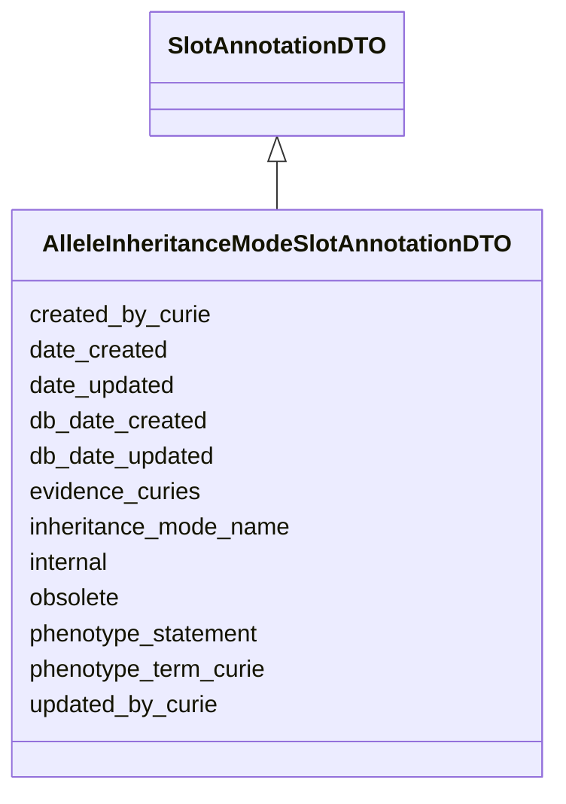

# AlleleInheritanceModeSlotAnnotationDTO

None





URI: [alliance:AlleleInheritanceModeSlotAnnotationDTO](http://alliancegenome.org/AlleleInheritanceModeSlotAnnotationDTO)


## Parent Classes

* [AuditedObjectDTO](AuditedObjectDTO.md)
    * [SlotAnnotationDTO](SlotAnnotationDTO.md)
        * **AlleleInheritanceModeSlotAnnotationDTO**


<!-- no inheritance hierarchy -->


## Slots

| Name | Description  |
| ---  | ---  |
| [created_by_curie](created_by_curie.md) | Curie of the Person object representing the individual that created the entity |
| [date_created](date_created.md) | The date on which an entity was created. This can be applied to nodes or edges. |
| [date_updated](date_updated.md) | Date on which an entity was last modified. |
| [db_date_created](db_date_created.md) | The date on which an entity was created in the Alliance database.  This is disinct from date_created, which represents the date when the entity was originally created (i.e. at the MOD for imported data). |
| [db_date_updated](db_date_updated.md) | Date on which an entity was last modified in the Alliance database.  This is disinct from date_updated, which represents the date when the entity was last modified and may predate import into the Alliance database. |
| [evidence_curies](evidence_curies.md) | Curies of InformationContentEntity objects given as evidence |
| [inheritance_mode_name](inheritance_mode_name.md) | Name of VocabularyTerm describing the inheritance mode from the 'Allele inheritance mode vocabulary', e.g. dominant / semi-dominant / recessive / unknown / codominant |
| [internal](internal.md) | Classifies the entity as private (for internal use) or not (for public use). |
| [obsolete](obsolete.md) | Entity is no longer current. |
| [phenotype_statement](phenotype_statement.md) | For some MODs, the inheritance mode of an allele is reported specifically in the context of a particular phenotype. This slot is intended to capture the free-text phenotype statement. |
| [phenotype_term_curie](phenotype_term_curie.md) | For some MODs, the inheritance mode of an allele is reported specifically in the context of a particular phenotype. This slot is intended to capture the phenotype ontology term. |
| [updated_by_curie](updated_by_curie.md) | Curie of the Person object representing the individual that updated the entity |


## Mappings

| Mapping Type | Mapped Value |
| ---  | ---  |
| self | ['alliance:AlleleInheritanceModeSlotAnnotationDTO'] |
| native | ['alliance:AlleleInheritanceModeSlotAnnotationDTO'] |


## LinkML Specification

<!-- TODO: investigate https://stackoverflow.com/questions/37606292/how-to-create-tabbed-code-blocks-in-mkdocs-or-sphinx -->

### Direct

<details>
```yaml
name: AlleleInheritanceModeSlotAnnotationDTO
from_schema: https://github.com/alliance-genome/agr_curation_schema/src/schema/alleleDTO
is_a: SlotAnnotationDTO
slots:
- inheritance_mode_name
- phenotype_term_curie
- phenotype_statement
slot_usage:
  inheritance_mode_name:
    name: inheritance_mode_name
    domain_of:
    - AlleleInheritanceModeSlotAnnotationDTO
    required: true
  phenotype_term_curie:
    name: phenotype_term_curie
    description: For some MODs, the inheritance mode of an allele is reported specifically
      in the context of a particular phenotype. This slot is intended to capture the
      phenotype ontology term.
    domain_of:
    - AlleleFunctionalImpactSlotAnnotationDTO
    - AlleleInheritanceModeSlotAnnotationDTO
    required: false
  phenotype_statement:
    name: phenotype_statement
    description: For some MODs, the inheritance mode of an allele is reported specifically
      in the context of a particular phenotype. This slot is intended to capture the
      free-text phenotype statement.
    domain_of:
    - AlleleFunctionalImpactSlotAnnotation
    - AlleleInheritanceModeSlotAnnotation
    - AlleleFunctionalImpactSlotAnnotationDTO
    - AlleleInheritanceModeSlotAnnotationDTO
    required: false

```
</details>

### Induced

<details>
```yaml
name: AlleleInheritanceModeSlotAnnotationDTO
from_schema: https://github.com/alliance-genome/agr_curation_schema/src/schema/alleleDTO
is_a: SlotAnnotationDTO
slot_usage:
  inheritance_mode_name:
    name: inheritance_mode_name
    domain_of:
    - AlleleInheritanceModeSlotAnnotationDTO
    required: true
  phenotype_term_curie:
    name: phenotype_term_curie
    description: For some MODs, the inheritance mode of an allele is reported specifically
      in the context of a particular phenotype. This slot is intended to capture the
      phenotype ontology term.
    domain_of:
    - AlleleFunctionalImpactSlotAnnotationDTO
    - AlleleInheritanceModeSlotAnnotationDTO
    required: false
  phenotype_statement:
    name: phenotype_statement
    description: For some MODs, the inheritance mode of an allele is reported specifically
      in the context of a particular phenotype. This slot is intended to capture the
      free-text phenotype statement.
    domain_of:
    - AlleleFunctionalImpactSlotAnnotation
    - AlleleInheritanceModeSlotAnnotation
    - AlleleFunctionalImpactSlotAnnotationDTO
    - AlleleInheritanceModeSlotAnnotationDTO
    required: false
attributes:
  inheritance_mode_name:
    name: inheritance_mode_name
    description: Name of VocabularyTerm describing the inheritance mode from the 'Allele
      inheritance mode vocabulary', e.g. dominant / semi-dominant / recessive / unknown
      / codominant
    from_schema: https://github.com/alliance-genome/agr_curation_schema/src/schema/alleleDTO
    domain: AlleleInheritanceModeSlotAnnotationDTO
    alias: inheritance_mode_name
    owner: AlleleInheritanceModeSlotAnnotationDTO
    domain_of:
    - AlleleInheritanceModeSlotAnnotationDTO
    range: string
    required: true
  phenotype_term_curie:
    name: phenotype_term_curie
    description: For some MODs, the inheritance mode of an allele is reported specifically
      in the context of a particular phenotype. This slot is intended to capture the
      phenotype ontology term.
    from_schema: https://github.com/alliance-genome/agr_persistent_schema/phenotypeAndDiseaseAnnotation.yaml
    multivalued: false
    alias: phenotype_term_curie
    owner: AlleleInheritanceModeSlotAnnotationDTO
    domain_of:
    - AlleleFunctionalImpactSlotAnnotationDTO
    - AlleleInheritanceModeSlotAnnotationDTO
    range: string
    required: false
  phenotype_statement:
    name: phenotype_statement
    description: For some MODs, the inheritance mode of an allele is reported specifically
      in the context of a particular phenotype. This slot is intended to capture the
      free-text phenotype statement.
    from_schema: https://github.com/alliance-genome/agr_persistent_schema/phenotypeAndDiseaseAnnotation.yaml
    alias: phenotype_statement
    owner: AlleleInheritanceModeSlotAnnotationDTO
    domain_of:
    - AlleleFunctionalImpactSlotAnnotation
    - AlleleInheritanceModeSlotAnnotation
    - AlleleFunctionalImpactSlotAnnotationDTO
    - AlleleInheritanceModeSlotAnnotationDTO
    range: string
    required: false
  evidence_curies:
    name: evidence_curies
    description: Curies of InformationContentEntity objects given as evidence
    from_schema: https://github.com/alliance-genome/agr_curation_schema/src/schema/reference
    multivalued: true
    alias: evidence_curies
    owner: AlleleInheritanceModeSlotAnnotationDTO
    domain_of:
    - DiseaseAnnotationDTO
    - AlleleCellLineAssociationDTO
    - AlleleGenerationMethodAssociationDTO
    - AlleleGenomicEntityAssociationDTO
    - AlleleImageAssociationDTO
    - AlleleOriginAssociationDTO
    - NoteDTO
    - SlotAnnotationDTO
    - GenomicLocationAssociationDTO
    range: string
  created_by_curie:
    name: created_by_curie
    description: Curie of the Person object representing the individual that created
      the entity
    from_schema: https://github.com/alliance-genome/agr_curation_schema/core.yaml
    domain: AuditedObjectDTO
    alias: created_by_curie
    owner: AlleleInheritanceModeSlotAnnotationDTO
    domain_of:
    - AuditedObjectDTO
    range: string
  date_created:
    name: date_created
    description: The date on which an entity was created. This can be applied to nodes
      or edges.
    from_schema: https://github.com/alliance-genome/agr_curation_schema/core.yaml
    aliases:
    - creation_date
    exact_mappings:
    - dct:createdOn
    - WIKIDATA_PROPERTY:P577
    alias: date_created
    owner: AlleleInheritanceModeSlotAnnotationDTO
    domain_of:
    - AuditedObject
    - AuditedObjectDTO
    range: datetime
  updated_by_curie:
    name: updated_by_curie
    description: Curie of the Person object representing the individual that updated
      the entity
    from_schema: https://github.com/alliance-genome/agr_curation_schema/core.yaml
    domain: AuditedObjectDTO
    alias: updated_by_curie
    owner: AlleleInheritanceModeSlotAnnotationDTO
    domain_of:
    - AuditedObjectDTO
    range: string
  date_updated:
    name: date_updated
    description: Date on which an entity was last modified.
    from_schema: https://github.com/alliance-genome/agr_curation_schema/core.yaml
    aliases:
    - date_last_modified
    alias: date_updated
    owner: AlleleInheritanceModeSlotAnnotationDTO
    domain_of:
    - AuditedObject
    - AuditedObjectDTO
    range: datetime
  db_date_created:
    name: db_date_created
    description: The date on which an entity was created in the Alliance database.  This
      is disinct from date_created, which represents the date when the entity was
      originally created (i.e. at the MOD for imported data).
    from_schema: https://github.com/alliance-genome/agr_curation_schema/core.yaml
    alias: db_date_created
    owner: AlleleInheritanceModeSlotAnnotationDTO
    domain_of:
    - AuditedObject
    - AuditedObjectDTO
    range: datetime
  db_date_updated:
    name: db_date_updated
    description: Date on which an entity was last modified in the Alliance database.  This
      is disinct from date_updated, which represents the date when the entity was
      last modified and may predate import into the Alliance database.
    from_schema: https://github.com/alliance-genome/agr_curation_schema/core.yaml
    alias: db_date_updated
    owner: AlleleInheritanceModeSlotAnnotationDTO
    domain_of:
    - AuditedObject
    - AuditedObjectDTO
    range: datetime
  internal:
    name: internal
    description: Classifies the entity as private (for internal use) or not (for public
      use).
    notes:
    - Default value is true.
    from_schema: https://github.com/alliance-genome/agr_curation_schema/core.yaml
    alias: internal
    owner: AlleleInheritanceModeSlotAnnotationDTO
    domain_of:
    - AuditedObject
    - AuditedObjectDTO
    range: boolean
    required: true
  obsolete:
    name: obsolete
    description: Entity is no longer current.
    notes:
    - Obsolete entities are preserved in the database for posterity but should not
      be publicly displayed.
    from_schema: https://github.com/alliance-genome/agr_curation_schema/core.yaml
    alias: obsolete
    owner: AlleleInheritanceModeSlotAnnotationDTO
    domain_of:
    - AuditedObject
    - AuditedObjectDTO
    range: boolean

```
</details>