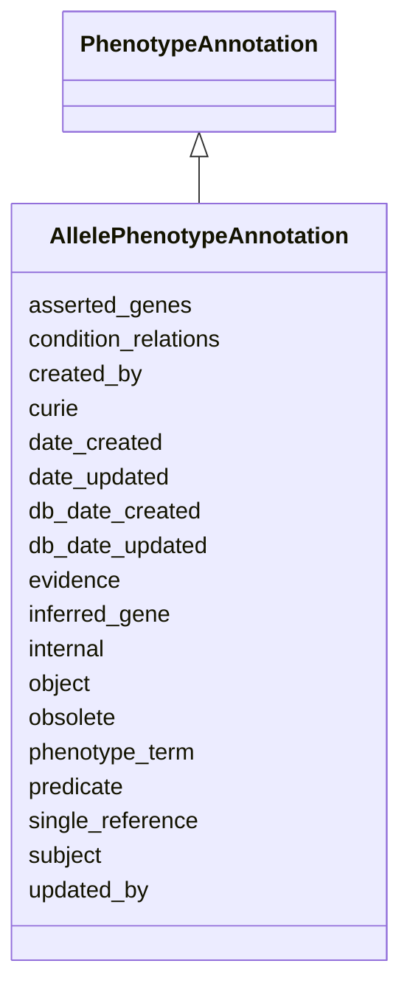

# AllelePhenotypeAnnotation

An annotation asserting an association between an allele and a phenotype supported by evidence.





URI: [alliance:AllelePhenotypeAnnotation](http://alliancegenome.org/AllelePhenotypeAnnotation)


## Parent Classes

* [AuditedObject](AuditedObject.md)
    * [Association](Association.md)
        * [PhenotypeAnnotation](PhenotypeAnnotation.md)
            * **AllelePhenotypeAnnotation**


<!-- no inheritance hierarchy -->


## Slots

| Name | Description  |
| ---  | ---  |
| [asserted_genes](asserted_genes.md) | The gene(s) to which something is manually asserted to be associated. |
| [condition_relations](condition_relations.md) | None |
| [created_by](created_by.md) | The individual that created the entity. |
| [curie](curie.md) | A unique identifier for a thing. Must be either a CURIE shorthand for a URI or a complete URI |
| [date_created](date_created.md) | The date on which an entity was created. This can be applied to nodes or edges. |
| [date_updated](date_updated.md) | Date on which an entity was last modified. |
| [db_date_created](db_date_created.md) | The date on which an entity was created in the Alliance database.  This is disinct from date_created, which represents the date when the entity was originally created (i.e. at the MOD for imported data). |
| [db_date_updated](db_date_updated.md) | Date on which an entity was last modified in the Alliance database.  This is disinct from date_updated, which represents the date when the entity was last modified and may predate import into the Alliance database. |
| [evidence](evidence.md) |  |
| [inferred_gene](inferred_gene.md) | The gene to which the phenotype is inferred to be associated. |
| [internal](internal.md) | Classifies the entity as private (for internal use) or not (for public use). |
| [object](object.md) | connects an association to the object of the association. For example, in a gene-to-phenotype association, the gene is subject and phenotype is object. |
| [obsolete](obsolete.md) | Entity is no longer current. |
| [phenotype_term](phenotype_term.md) | The phenotype ontology term used to describe the phenotype of an organism or a set of organisms. |
| [predicate](predicate.md) | A high-level grouping for the relationship type. This is analogous to category for nodes. In RDF, this corresponds to rdf:predicate and in Neo4j this corresponds to the relationship type. |
| [single_reference](single_reference.md) | holds between an object and a single reference |
| [subject](subject.md) | The allele to which the phenotype ontology term is associated. |
| [updated_by](updated_by.md) | The individual that last modified the entity. |


## Mappings

| Mapping Type | Mapped Value |
| ---  | ---  |
| self | ['alliance:AllelePhenotypeAnnotation'] |
| native | ['alliance:AllelePhenotypeAnnotation'] |


## LinkML Specification

<!-- TODO: investigate https://stackoverflow.com/questions/37606292/how-to-create-tabbed-code-blocks-in-mkdocs-or-sphinx -->

### Direct

<details>
```yaml
name: AllelePhenotypeAnnotation
description: An annotation asserting an association between an allele and a phenotype
  supported by evidence.
from_schema: https://github.com/alliance-genome/agr_persistent_schema/phenotypeAndDiseaseAnnotation.yaml
is_a: PhenotypeAnnotation
slots:
- inferred_gene
- asserted_genes
slot_usage:
  subject:
    name: subject
    description: The allele to which the phenotype ontology term is associated.
    domain_of:
    - Association
    - VariantConsequence
    range: Allele
  inferred_gene:
    name: inferred_gene
    description: The gene to which the phenotype is inferred to be associated.
    domain_of:
    - AllelePhenotypeAnnotation
    - AGMPhenotypeAnnotation
    - AlleleDiseaseAnnotation
    - AGMDiseaseAnnotation
    range: Gene
    required: false
  asserted_genes:
    name: asserted_genes
    domain_of:
    - AllelePhenotypeAnnotation
    - AGMPhenotypeAnnotation
    - AlleleDiseaseAnnotation
    - AGMDiseaseAnnotation
    required: false
  asserted_allele:
    name: asserted_allele
    required: false

```
</details>

### Induced

<details>
```yaml
name: AllelePhenotypeAnnotation
description: An annotation asserting an association between an allele and a phenotype
  supported by evidence.
from_schema: https://github.com/alliance-genome/agr_persistent_schema/phenotypeAndDiseaseAnnotation.yaml
is_a: PhenotypeAnnotation
slot_usage:
  subject:
    name: subject
    description: The allele to which the phenotype ontology term is associated.
    domain_of:
    - Association
    - VariantConsequence
    range: Allele
  inferred_gene:
    name: inferred_gene
    description: The gene to which the phenotype is inferred to be associated.
    domain_of:
    - AllelePhenotypeAnnotation
    - AGMPhenotypeAnnotation
    - AlleleDiseaseAnnotation
    - AGMDiseaseAnnotation
    range: Gene
    required: false
  asserted_genes:
    name: asserted_genes
    domain_of:
    - AllelePhenotypeAnnotation
    - AGMPhenotypeAnnotation
    - AlleleDiseaseAnnotation
    - AGMDiseaseAnnotation
    required: false
  asserted_allele:
    name: asserted_allele
    required: false
attributes:
  inferred_gene:
    name: inferred_gene
    description: The gene to which the phenotype is inferred to be associated.
    from_schema: https://github.com/alliance-genome/agr_persistent_schema/phenotypeAndDiseaseAnnotation.yaml
    alias: inferred_gene
    owner: AllelePhenotypeAnnotation
    domain_of:
    - AllelePhenotypeAnnotation
    - AGMPhenotypeAnnotation
    - AlleleDiseaseAnnotation
    - AGMDiseaseAnnotation
    range: Gene
    required: false
  asserted_genes:
    name: asserted_genes
    description: The gene(s) to which something is manually asserted to be associated.
    from_schema: https://github.com/alliance-genome/agr_persistent_schema/phenotypeAndDiseaseAnnotation.yaml
    singular_name: asserted_gene
    multivalued: true
    alias: asserted_genes
    owner: AllelePhenotypeAnnotation
    domain_of:
    - AllelePhenotypeAnnotation
    - AGMPhenotypeAnnotation
    - AlleleDiseaseAnnotation
    - AGMDiseaseAnnotation
    range: Gene
    required: false
  curie:
    name: curie
    description: A unique identifier for a thing. Must be either a CURIE shorthand
      for a URI or a complete URI
    from_schema: https://github.com/alliance-genome/agr_curation_schema/core.yaml
    multivalued: false
    identifier: true
    alias: curie
    owner: AllelePhenotypeAnnotation
    domain_of:
    - OntologyTerm
    - PhenotypeAnnotation
    - DiseaseAnnotation
    - BiologicalEntity
    - BiologicalEntityDTO
    - Chromosome
    - Assembly
    - Identifier
    - Figure
    - Image
    - Laboratory
    - InformationContentEntity
    - Reference
    - Resource
    - ModCorpusAssociation
    - GeneInteraction
    - ExpressionExperiment
    - GeneNomenclatureSet
    range: uriorcurie
  single_reference:
    name: single_reference
    description: holds between an object and a single reference
    from_schema: https://github.com/alliance-genome/agr_curation_schema/core.yaml
    multivalued: false
    alias: single_reference
    owner: AllelePhenotypeAnnotation
    domain_of:
    - SourceVariantLocation
    - VariantLocation
    - PhenotypeAnnotation
    - DiseaseAnnotation
    - ConditionRelation
    - Figure
    - GeneToGeneOrthologyCurated
    - ExpressionExperiment
    - FunctionalGeneSet
    range: Reference
  phenotype_term:
    name: phenotype_term
    description: The phenotype ontology term used to describe the phenotype of an
      organism or a set of organisms.
    from_schema: https://github.com/alliance-genome/agr_persistent_schema/phenotypeAndDiseaseAnnotation.yaml
    multivalued: false
    alias: phenotype_term
    owner: AllelePhenotypeAnnotation
    domain_of:
    - AlleleFunctionalImpactSlotAnnotation
    - AlleleInheritanceModeSlotAnnotation
    - PhenotypeAnnotation
    range: PhenotypeTerm
  condition_relations:
    name: condition_relations
    from_schema: https://github.com/alliance-genome/agr_persistent_schema/phenotypeAndDiseaseAnnotation.yaml
    multivalued: true
    alias: condition_relations
    owner: AllelePhenotypeAnnotation
    domain_of:
    - PhenotypeAnnotation
    - DiseaseAnnotation
    - ExpressionExperiment
    range: ConditionRelation
  subject:
    name: subject
    description: The allele to which the phenotype ontology term is associated.
    from_schema: https://github.com/alliance-genome/agr_curation_schema/core.yaml
    is_a: association_slot
    alias: subject
    owner: AllelePhenotypeAnnotation
    domain_of:
    - Association
    - VariantConsequence
    range: Allele
    required: true
  predicate:
    name: predicate
    description: A high-level grouping for the relationship type. This is analogous
      to category for nodes. In RDF, this corresponds to rdf:predicate and in Neo4j
      this corresponds to the relationship type.
    from_schema: https://github.com/alliance-genome/agr_curation_schema/core.yaml
    exact_mappings:
    - biolink:predicate
    is_a: association_slot
    alias: predicate
    owner: AllelePhenotypeAnnotation
    domain_of:
    - Association
    - GeneToGeneOrthology
    range: string
    required: true
  object:
    name: object
    description: connects an association to the object of the association. For example,
      in a gene-to-phenotype association, the gene is subject and phenotype is object.
    from_schema: https://github.com/alliance-genome/agr_curation_schema/core.yaml
    exact_mappings:
    - biolink:object
    is_a: association_slot
    alias: object
    owner: AllelePhenotypeAnnotation
    domain_of:
    - Association
    - VariantConsequence
    range: string
    required: true
  evidence:
    name: evidence
    description: ''
    from_schema: https://github.com/alliance-genome/agr_curation_schema/src/schema/reference
    multivalued: true
    alias: evidence
    owner: AllelePhenotypeAnnotation
    domain_of:
    - AlleleGenerationMethodAssociation
    - Note
    - SlotAnnotation
    - Association
    range: InformationContentEntity
  created_by:
    name: created_by
    description: The individual that created the entity.
    from_schema: https://github.com/alliance-genome/agr_curation_schema/core.yaml
    domain: AuditedObject
    multivalued: false
    alias: created_by
    owner: AllelePhenotypeAnnotation
    domain_of:
    - AuditedObject
    range: Person
  date_created:
    name: date_created
    description: The date on which an entity was created. This can be applied to nodes
      or edges.
    from_schema: https://github.com/alliance-genome/agr_curation_schema/core.yaml
    aliases:
    - creation_date
    exact_mappings:
    - dct:createdOn
    - WIKIDATA_PROPERTY:P577
    multivalued: false
    alias: date_created
    owner: AllelePhenotypeAnnotation
    domain_of:
    - AuditedObject
    - AuditedObjectDTO
    range: datetime
    required: true
  updated_by:
    name: updated_by
    description: The individual that last modified the entity.
    from_schema: https://github.com/alliance-genome/agr_curation_schema/core.yaml
    domain: AuditedObject
    multivalued: false
    alias: updated_by
    owner: AllelePhenotypeAnnotation
    domain_of:
    - AuditedObject
    range: Person
  date_updated:
    name: date_updated
    description: Date on which an entity was last modified.
    from_schema: https://github.com/alliance-genome/agr_curation_schema/core.yaml
    aliases:
    - date_last_modified
    alias: date_updated
    owner: AllelePhenotypeAnnotation
    domain_of:
    - AuditedObject
    - AuditedObjectDTO
    range: datetime
  db_date_created:
    name: db_date_created
    description: The date on which an entity was created in the Alliance database.  This
      is disinct from date_created, which represents the date when the entity was
      originally created (i.e. at the MOD for imported data).
    from_schema: https://github.com/alliance-genome/agr_curation_schema/core.yaml
    alias: db_date_created
    owner: AllelePhenotypeAnnotation
    domain_of:
    - AuditedObject
    - AuditedObjectDTO
    range: datetime
  db_date_updated:
    name: db_date_updated
    description: Date on which an entity was last modified in the Alliance database.  This
      is disinct from date_updated, which represents the date when the entity was
      last modified and may predate import into the Alliance database.
    from_schema: https://github.com/alliance-genome/agr_curation_schema/core.yaml
    alias: db_date_updated
    owner: AllelePhenotypeAnnotation
    domain_of:
    - AuditedObject
    - AuditedObjectDTO
    range: datetime
  internal:
    name: internal
    description: Classifies the entity as private (for internal use) or not (for public
      use).
    notes:
    - Default value is true.
    from_schema: https://github.com/alliance-genome/agr_curation_schema/core.yaml
    alias: internal
    owner: AllelePhenotypeAnnotation
    domain_of:
    - AuditedObject
    - AuditedObjectDTO
    range: boolean
    required: true
  obsolete:
    name: obsolete
    description: Entity is no longer current.
    notes:
    - Obsolete entities are preserved in the database for posterity but should not
      be publicly displayed.
    from_schema: https://github.com/alliance-genome/agr_curation_schema/core.yaml
    alias: obsolete
    owner: AllelePhenotypeAnnotation
    domain_of:
    - AuditedObject
    - AuditedObjectDTO
    range: boolean

```
</details>