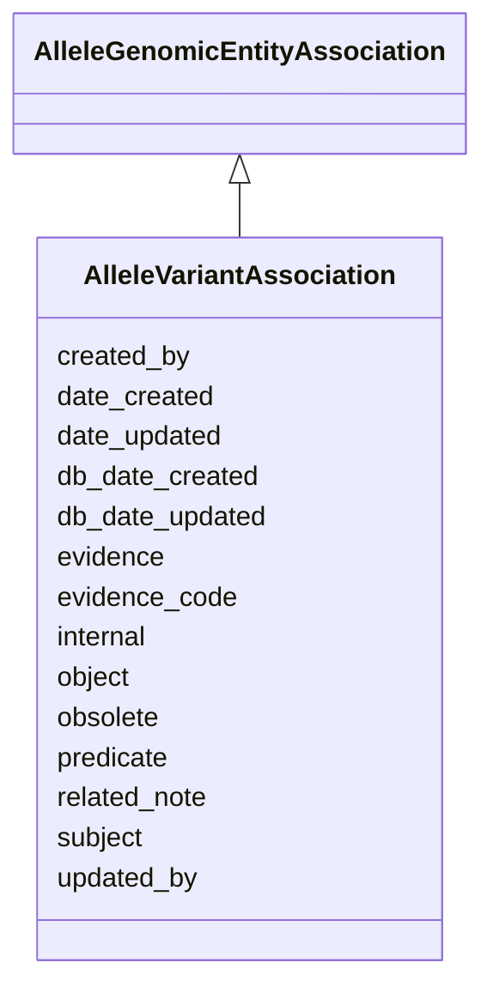

# AlleleVariantAssociation

The relationship between an allele and a variant is many to many. An Allele may have many variants and a variant can be present in many alleles.





URI: [alliance:AlleleVariantAssociation](http://alliancegenome.org/AlleleVariantAssociation)


## Parent Classes

* [AuditedObject](AuditedObject.md)
    * [Association](Association.md)
        * [AlleleGenomicEntityAssociation](AlleleGenomicEntityAssociation.md)
            * **AlleleVariantAssociation**


<!-- no inheritance hierarchy -->


## Slots

| Name | Description  |
| ---  | ---  |
| [created_by](created_by.md) | The individual that created the entity. |
| [date_created](date_created.md) | The date on which an entity was created. This can be applied to nodes or edges. |
| [date_updated](date_updated.md) | Date on which an entity was last modified. |
| [db_date_created](db_date_created.md) | The date on which an entity was created in the Alliance database.  This is disinct from date_created, which represents the date when the entity was originally created (i.e. at the MOD for imported data). |
| [db_date_updated](db_date_updated.md) | Date on which an entity was last modified in the Alliance database.  This is disinct from date_updated, which represents the date when the entity was last modified and may predate import into the Alliance database. |
| [evidence](evidence.md) |  |
| [evidence_code](evidence_code.md) | None |
| [internal](internal.md) | Classifies the entity as private (for internal use) or not (for public use). |
| [object](object.md) | connects an association to the object of the association. For example, in a gene-to-phenotype association, the gene is subject and phenotype is object. |
| [obsolete](obsolete.md) | Entity is no longer current. |
| [predicate](predicate.md) | A high-level grouping for the relationship type. This is analogous to category for nodes. In RDF, this corresponds to rdf:predicate and in Neo4j this corresponds to the relationship type. |
| [related_note](related_note.md) | Holds between an object and a Note object. |
| [subject](subject.md) | connects an association to the subject of the association. For example, in a gene-to-phenotype association, the gene is subject and phenotype is object. |
| [updated_by](updated_by.md) | The individual that last modified the entity. |


## Mappings

| Mapping Type | Mapped Value |
| ---  | ---  |
| self | ['alliance:AlleleVariantAssociation'] |
| native | ['alliance:AlleleVariantAssociation'] |


## LinkML Specification

<!-- TODO: investigate https://stackoverflow.com/questions/37606292/how-to-create-tabbed-code-blocks-in-mkdocs-or-sphinx -->

### Direct

<details>
```yaml
name: AlleleVariantAssociation
description: The relationship between an allele and a variant is many to many. An
  Allele may have many variants and a variant can be present in many alleles.
from_schema: https://github.com/alliance-genome/agr_curation_schema/src/schema/allele
is_a: AlleleGenomicEntityAssociation
slot_usage:
  subject:
    name: subject
    domain_of:
    - Association
    - VariantConsequence
    range: Allele
  object:
    name: object
    domain_of:
    - Association
    - VariantConsequence
    range: Variant

```
</details>

### Induced

<details>
```yaml
name: AlleleVariantAssociation
description: The relationship between an allele and a variant is many to many. An
  Allele may have many variants and a variant can be present in many alleles.
from_schema: https://github.com/alliance-genome/agr_curation_schema/src/schema/allele
is_a: AlleleGenomicEntityAssociation
slot_usage:
  subject:
    name: subject
    domain_of:
    - Association
    - VariantConsequence
    range: Allele
  object:
    name: object
    domain_of:
    - Association
    - VariantConsequence
    range: Variant
attributes:
  evidence_code:
    name: evidence_code
    from_schema: https://github.com/alliance-genome/agr_curation_schema/core.yaml
    multivalued: false
    alias: evidence_code
    owner: AlleleVariantAssociation
    domain_of:
    - VariantLocation
    - AlleleGenomicEntityAssociation
    - GeneToGeneOrthologyCurated
    range: ECOTerm
  related_note:
    name: related_note
    description: Holds between an object and a Note object.
    notes:
    - Singular version of related_notes
    from_schema: https://github.com/alliance-genome/agr_curation_schema/core.yaml
    multivalued: false
    alias: related_note
    owner: AlleleVariantAssociation
    domain_of:
    - AlleleNoteSlotAnnotation
    - AlleleGenomicEntityAssociation
    - GeneCluster
    - GeneCollection
    - GeneNomenclatureSet
    - Operon
    range: Note
  subject:
    name: subject
    description: connects an association to the subject of the association. For example,
      in a gene-to-phenotype association, the gene is subject and phenotype is object.
    from_schema: https://github.com/alliance-genome/agr_curation_schema/core.yaml
    is_a: association_slot
    alias: subject
    owner: AlleleVariantAssociation
    domain_of:
    - Association
    - VariantConsequence
    range: Allele
    required: true
  predicate:
    name: predicate
    description: A high-level grouping for the relationship type. This is analogous
      to category for nodes. In RDF, this corresponds to rdf:predicate and in Neo4j
      this corresponds to the relationship type.
    from_schema: https://github.com/alliance-genome/agr_curation_schema/core.yaml
    exact_mappings:
    - biolink:predicate
    is_a: association_slot
    alias: predicate
    owner: AlleleVariantAssociation
    domain_of:
    - Association
    - GeneToGeneOrthology
    range: VocabularyTerm
    required: true
  object:
    name: object
    description: connects an association to the object of the association. For example,
      in a gene-to-phenotype association, the gene is subject and phenotype is object.
    from_schema: https://github.com/alliance-genome/agr_curation_schema/core.yaml
    is_a: association_slot
    alias: object
    owner: AlleleVariantAssociation
    domain_of:
    - Association
    - VariantConsequence
    range: Variant
    required: true
  evidence:
    name: evidence
    description: ''
    from_schema: https://github.com/alliance-genome/agr_curation_schema/src/schema/reference
    multivalued: true
    alias: evidence
    owner: AlleleVariantAssociation
    domain_of:
    - AlleleGenerationMethodAssociation
    - Note
    - SlotAnnotation
    - Association
    range: InformationContentEntity
    required: false
  created_by:
    name: created_by
    description: The individual that created the entity.
    from_schema: https://github.com/alliance-genome/agr_curation_schema/core.yaml
    domain: AuditedObject
    multivalued: false
    alias: created_by
    owner: AlleleVariantAssociation
    domain_of:
    - AuditedObject
    range: Person
  date_created:
    name: date_created
    description: The date on which an entity was created. This can be applied to nodes
      or edges.
    from_schema: https://github.com/alliance-genome/agr_curation_schema/core.yaml
    aliases:
    - creation_date
    exact_mappings:
    - dct:createdOn
    - WIKIDATA_PROPERTY:P577
    alias: date_created
    owner: AlleleVariantAssociation
    domain_of:
    - AuditedObject
    - AuditedObjectDTO
    range: datetime
  updated_by:
    name: updated_by
    description: The individual that last modified the entity.
    from_schema: https://github.com/alliance-genome/agr_curation_schema/core.yaml
    domain: AuditedObject
    multivalued: false
    alias: updated_by
    owner: AlleleVariantAssociation
    domain_of:
    - AuditedObject
    range: Person
  date_updated:
    name: date_updated
    description: Date on which an entity was last modified.
    from_schema: https://github.com/alliance-genome/agr_curation_schema/core.yaml
    aliases:
    - date_last_modified
    alias: date_updated
    owner: AlleleVariantAssociation
    domain_of:
    - AuditedObject
    - AuditedObjectDTO
    range: datetime
  db_date_created:
    name: db_date_created
    description: The date on which an entity was created in the Alliance database.  This
      is disinct from date_created, which represents the date when the entity was
      originally created (i.e. at the MOD for imported data).
    from_schema: https://github.com/alliance-genome/agr_curation_schema/core.yaml
    alias: db_date_created
    owner: AlleleVariantAssociation
    domain_of:
    - AuditedObject
    - AuditedObjectDTO
    range: datetime
  db_date_updated:
    name: db_date_updated
    description: Date on which an entity was last modified in the Alliance database.  This
      is disinct from date_updated, which represents the date when the entity was
      last modified and may predate import into the Alliance database.
    from_schema: https://github.com/alliance-genome/agr_curation_schema/core.yaml
    alias: db_date_updated
    owner: AlleleVariantAssociation
    domain_of:
    - AuditedObject
    - AuditedObjectDTO
    range: datetime
  internal:
    name: internal
    description: Classifies the entity as private (for internal use) or not (for public
      use).
    notes:
    - Default value is true.
    from_schema: https://github.com/alliance-genome/agr_curation_schema/core.yaml
    alias: internal
    owner: AlleleVariantAssociation
    domain_of:
    - AuditedObject
    - AuditedObjectDTO
    range: boolean
    required: true
  obsolete:
    name: obsolete
    description: Entity is no longer current.
    notes:
    - Obsolete entities are preserved in the database for posterity but should not
      be publicly displayed.
    from_schema: https://github.com/alliance-genome/agr_curation_schema/core.yaml
    alias: obsolete
    owner: AlleleVariantAssociation
    domain_of:
    - AuditedObject
    - AuditedObjectDTO
    range: boolean

```
</details>