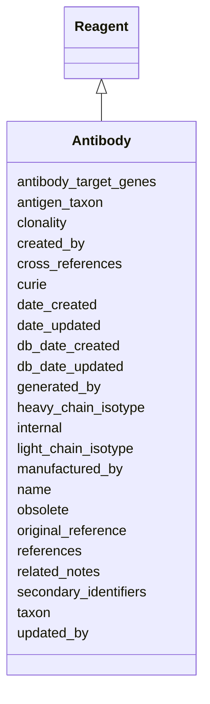

# Antibody

Immunoglobulin proteins that bind specific molecule(s). Can be used experimentally for the purposes of detection or purification.





URI: [alliance:Antibody](http://alliancegenome.org/Antibody)


## Parent Classes

* [AuditedObject](AuditedObject.md)
    * [BiologicalEntity](BiologicalEntity.md)
        * [Reagent](Reagent.md)
            * **Antibody**


<!-- no inheritance hierarchy -->


## Slots

| Name | Description  |
| ---  | ---  |
| [antibody_target_genes](antibody_target_genes.md) | The genes whose gene products are recognized by the antibody. |
| [antigen_taxon](antigen_taxon.md) | Holds between an Antibody and the species from which the antigen originates (as represented by taxon). |
| [clonality](clonality.md) | The clonality of the antibody: e.g., monoclonal. |
| [created_by](created_by.md) | The individual that created the entity. |
| [cross_references](cross_references.md) | Holds between an object and its CrossReferences. |
| [curie](curie.md) | A unique identifier for the antibody: e.g., WBAntibody0000001. |
| [date_created](date_created.md) | The date on which an entity was created. This can be applied to nodes or edges. |
| [date_updated](date_updated.md) | Date on which an entity was last modified. |
| [db_date_created](db_date_created.md) | The date on which an entity was created in the Alliance database.  This is disinct from date_created, which represents the date when the entity was originally created (i.e. at the MOD for imported data). |
| [db_date_updated](db_date_updated.md) | Date on which an entity was last modified in the Alliance database.  This is disinct from date_updated, which represents the date when the entity was last modified and may predate import into the Alliance database. |
| [generated_by](generated_by.md) | Holds between a material entity and an Agent that generated it: e.g., Thomas Blumenthal, Kornberg Laboratory. |
| [heavy_chain_isotype](heavy_chain_isotype.md) | The isotype of the antibody heavy chain: e.g., IgA. |
| [internal](internal.md) | Classifies the entity as private (for internal use) or not (for public use). |
| [light_chain_isotype](light_chain_isotype.md) | The isotype of the antibody light chain: e.g., i4. |
| [manufactured_by](manufactured_by.md) | Holds between a material entity and an Agent that has manufactured it: e.g., Molecular Probes. |
| [name](name.md) | Publicly displayed name of the antibody. It often includes the name of the antibody target: e.g., anti-WNT-4. It may also include the host species and antibody clonality. |
| [obsolete](obsolete.md) | Entity is no longer current. |
| [original_reference](original_reference.md) | The reference providing the original description of the antibody's generation. |
| [references](references.md) | holds between an object and a list of references |
| [related_notes](related_notes.md) | Holds between an object and a list of related Note objects. |
| [secondary_identifiers](secondary_identifiers.md) | None |
| [taxon](taxon.md) | The species in which the antibody was raised: e.g., mouse, rabbit, guinea pig, goat, camel, etc. |
| [updated_by](updated_by.md) | The individual that last modified the entity. |


## Mappings

| Mapping Type | Mapped Value |
| ---  | ---  |
| self | ['alliance:Antibody'] |
| native | ['alliance:Antibody'] |


### Valid ID Prefixes

Instances of this class *should* have identifiers with one of the following prefixes:

* RGD

* SGD

* FB

* MGI

* WB

* ZFIN


## LinkML Specification

<!-- TODO: investigate https://stackoverflow.com/questions/37606292/how-to-create-tabbed-code-blocks-in-mkdocs-or-sphinx -->

### Direct

<details>
```yaml
name: Antibody
id_prefixes:
- RGD
- SGD
- FB
- MGI
- WB
- ZFIN
description: Immunoglobulin proteins that bind specific molecule(s). Can be used experimentally
  for the purposes of detection or purification.
notes:
- Inherits id and taxon slots from parental BiologicalEntity.
from_schema: https://github.com/alliance-genome/agr_curation_schema/src/schema/reagent.yaml
aliases:
- antibody
- antibodies
- antiserum
- antisera
is_a: Reagent
slots:
- name
- antigen_taxon
- clonality
- heavy_chain_isotype
- light_chain_isotype
- antibody_target_genes
- cross_references
- secondary_identifiers
- references
- original_reference
- related_notes
slot_usage:
  curie:
    name: curie
    description: 'A unique identifier for the antibody: e.g., WBAntibody0000001.'
    notes:
    - As not all MODs have IDs (e.g., FB), some IDs will need to be minted at the
      Alliance. Does anyone use RRIDs as the 1o ID for antibody?
    domain_of:
    - OntologyTerm
    - PhenotypeAnnotation
    - DiseaseAnnotation
    - BiologicalEntity
    - BiologicalEntityDTO
    - Chromosome
    - Assembly
    - Identifier
    - Figure
    - Image
    - Laboratory
    - InformationContentEntity
    - Reference
    - Resource
    - ModCorpusAssociation
    - GeneInteraction
    - ExpressionExperiment
    - GeneNomenclatureSet
  name:
    name: name
    description: 'Publicly displayed name of the antibody. It often includes the name
      of the antibody target: e.g., anti-WNT-4. It may also include the host species
      and antibody clonality.'
    notes:
    - FB does not have names for antibodies, but would be easy to generate, so we
      may want to make this required.
    domain_of:
    - OntologyTerm
    - ResourceDescriptor
    - ResourceDescriptorPage
    - AffectedGenomicModel
    - AffectedGenomicModelDTO
    - VocabularyTerm
    - Vocabulary
    - VocabularyTermSet
    - Antibody
    - CurationReportGroup
    - CurationReport
    - BulkLoadGroup
    - BulkLoad
    required: true
  taxon:
    name: taxon
    description: 'The species in which the antibody was raised: e.g., mouse, rabbit,
      guinea pig, goat, camel, etc.'
    notes:
    - FB does not have host taxon information for antibodies.
    domain_of:
    - BiologicalEntity
    required: false
  original_reference:
    name: original_reference
    description: The reference providing the original description of the antibody's
      generation.
    domain_of:
    - Antibody

```
</details>

### Induced

<details>
```yaml
name: Antibody
id_prefixes:
- RGD
- SGD
- FB
- MGI
- WB
- ZFIN
description: Immunoglobulin proteins that bind specific molecule(s). Can be used experimentally
  for the purposes of detection or purification.
notes:
- Inherits id and taxon slots from parental BiologicalEntity.
from_schema: https://github.com/alliance-genome/agr_curation_schema/src/schema/reagent.yaml
aliases:
- antibody
- antibodies
- antiserum
- antisera
is_a: Reagent
slot_usage:
  curie:
    name: curie
    description: 'A unique identifier for the antibody: e.g., WBAntibody0000001.'
    notes:
    - As not all MODs have IDs (e.g., FB), some IDs will need to be minted at the
      Alliance. Does anyone use RRIDs as the 1o ID for antibody?
    domain_of:
    - OntologyTerm
    - PhenotypeAnnotation
    - DiseaseAnnotation
    - BiologicalEntity
    - BiologicalEntityDTO
    - Chromosome
    - Assembly
    - Identifier
    - Figure
    - Image
    - Laboratory
    - InformationContentEntity
    - Reference
    - Resource
    - ModCorpusAssociation
    - GeneInteraction
    - ExpressionExperiment
    - GeneNomenclatureSet
  name:
    name: name
    description: 'Publicly displayed name of the antibody. It often includes the name
      of the antibody target: e.g., anti-WNT-4. It may also include the host species
      and antibody clonality.'
    notes:
    - FB does not have names for antibodies, but would be easy to generate, so we
      may want to make this required.
    domain_of:
    - OntologyTerm
    - ResourceDescriptor
    - ResourceDescriptorPage
    - AffectedGenomicModel
    - AffectedGenomicModelDTO
    - VocabularyTerm
    - Vocabulary
    - VocabularyTermSet
    - Antibody
    - CurationReportGroup
    - CurationReport
    - BulkLoadGroup
    - BulkLoad
    required: true
  taxon:
    name: taxon
    description: 'The species in which the antibody was raised: e.g., mouse, rabbit,
      guinea pig, goat, camel, etc.'
    notes:
    - FB does not have host taxon information for antibodies.
    domain_of:
    - BiologicalEntity
    required: false
  original_reference:
    name: original_reference
    description: The reference providing the original description of the antibody's
      generation.
    domain_of:
    - Antibody
attributes:
  name:
    name: name
    description: 'Publicly displayed name of the antibody. It often includes the name
      of the antibody target: e.g., anti-WNT-4. It may also include the host species
      and antibody clonality.'
    notes:
    - FB does not have names for antibodies, but would be easy to generate, so we
      may want to make this required.
    from_schema: https://github.com/alliance-genome/agr_curation_schema/affectedGenomicModel
    multivalued: false
    alias: name
    owner: Antibody
    domain_of:
    - OntologyTerm
    - ResourceDescriptor
    - ResourceDescriptorPage
    - AffectedGenomicModel
    - AffectedGenomicModelDTO
    - VocabularyTerm
    - Vocabulary
    - VocabularyTermSet
    - Antibody
    - CurationReportGroup
    - CurationReport
    - BulkLoadGroup
    - BulkLoad
    range: string
    required: true
  antigen_taxon:
    name: antigen_taxon
    description: Holds between an Antibody and the species from which the antigen
      originates (as represented by taxon).
    from_schema: https://github.com/alliance-genome/agr_curation_schema/src/schema/reagent.yaml
    domain: Antibody
    multivalued: false
    alias: antigen_taxon
    owner: Antibody
    domain_of:
    - Antibody
    range: NCBITaxonTerm
    required: false
  clonality:
    name: clonality
    description: 'The clonality of the antibody: e.g., monoclonal.'
    notes:
    - I think this will be an antibody specific slot.
    from_schema: https://github.com/alliance-genome/agr_curation_schema/src/schema/reagent.yaml
    domain: Antibody
    multivalued: false
    alias: clonality
    owner: Antibody
    domain_of:
    - Antibody
    range: antibody_clonality_set
    required: true
  heavy_chain_isotype:
    name: heavy_chain_isotype
    description: 'The isotype of the antibody heavy chain: e.g., IgA.'
    from_schema: https://github.com/alliance-genome/agr_curation_schema/src/schema/reagent.yaml
    domain: Antibody
    multivalued: false
    alias: heavy_chain_isotype
    owner: Antibody
    domain_of:
    - Antibody
    range: heavy_chain_isotype_set
    required: false
  light_chain_isotype:
    name: light_chain_isotype
    description: 'The isotype of the antibody light chain: e.g., i4.'
    from_schema: https://github.com/alliance-genome/agr_curation_schema/src/schema/reagent.yaml
    domain: Antibody
    multivalued: false
    alias: light_chain_isotype
    owner: Antibody
    domain_of:
    - Antibody
    range: light_chain_isotype_set
    required: false
  antibody_target_genes:
    name: antibody_target_genes
    description: The genes whose gene products are recognized by the antibody.
    from_schema: https://github.com/alliance-genome/agr_curation_schema/src/schema/reagent.yaml
    domain: Antibody
    multivalued: true
    alias: antibody_target_genes
    owner: Antibody
    domain_of:
    - Antibody
    range: Gene
    required: false
  cross_references:
    name: cross_references
    description: Holds between an object and its CrossReferences.
    from_schema: https://github.com/alliance-genome/agr_curation_schema/core.yaml
    aliases:
    - xrefs
    singular_name: cross_reference
    multivalued: true
    alias: cross_references
    owner: Antibody
    domain_of:
    - OntologyTerm
    - GenomicEntity
    - AuthorReference
    - Antibody
    - GeneInteraction
    range: CrossReference
  secondary_identifiers:
    name: secondary_identifiers
    from_schema: https://github.com/alliance-genome/agr_curation_schema/core.yaml
    aliases:
    - secondary_ids
    multivalued: true
    alias: secondary_identifiers
    owner: Antibody
    domain_of:
    - OntologyTerm
    - GenomicEntity
    - GenomicEntityDTO
    - Figure
    - Image
    - Antibody
    range: uriorcurie
  references:
    name: references
    description: holds between an object and a list of references
    from_schema: https://github.com/alliance-genome/agr_curation_schema/core.yaml
    singular_name: reference
    multivalued: true
    alias: references
    owner: Antibody
    domain_of:
    - Allele
    - Construct
    - SequenceTargetingReagent
    - SequenceTargetingReagentToGeneAssociation
    - AffectedGenomicModel
    - Antibody
    range: Reference
  original_reference:
    name: original_reference
    description: The reference providing the original description of the antibody's
      generation.
    from_schema: https://github.com/alliance-genome/agr_curation_schema/core.yaml
    is_a: references
    multivalued: true
    alias: original_reference
    owner: Antibody
    domain_of:
    - Antibody
    range: Reference
  related_notes:
    name: related_notes
    description: Holds between an object and a list of related Note objects.
    notes:
    - The original name suggested for this slot was simply notes, but I think that
      label is reserved in LinkML for internal descriptions of objects, hence the
      related_notes label used here.
    from_schema: https://github.com/alliance-genome/agr_curation_schema/core.yaml
    multivalued: true
    alias: related_notes
    owner: Antibody
    domain_of:
    - Variant
    - DiseaseAnnotation
    - Gene
    - Antibody
    - ExpressionExperiment
    - ExpressionAnnotation
    range: Note
  generated_by:
    name: generated_by
    description: 'Holds between a material entity and an Agent that generated it:
      e.g., Thomas Blumenthal, Kornberg Laboratory.'
    from_schema: https://github.com/alliance-genome/agr_curation_schema/core.yaml
    multivalued: true
    alias: generated_by
    owner: Antibody
    domain_of:
    - Reagent
    range: Agent
    required: false
  manufactured_by:
    name: manufactured_by
    description: 'Holds between a material entity and an Agent that has manufactured
      it: e.g., Molecular Probes.'
    from_schema: https://github.com/alliance-genome/agr_curation_schema/core.yaml
    multivalued: true
    alias: manufactured_by
    owner: Antibody
    domain_of:
    - Reagent
    range: Agent
    required: false
  curie:
    name: curie
    description: 'A unique identifier for the antibody: e.g., WBAntibody0000001.'
    notes:
    - As not all MODs have IDs (e.g., FB), some IDs will need to be minted at the
      Alliance. Does anyone use RRIDs as the 1o ID for antibody?
    from_schema: https://github.com/alliance-genome/agr_curation_schema/core.yaml
    multivalued: false
    identifier: true
    alias: curie
    owner: Antibody
    domain_of:
    - OntologyTerm
    - PhenotypeAnnotation
    - DiseaseAnnotation
    - BiologicalEntity
    - BiologicalEntityDTO
    - Chromosome
    - Assembly
    - Identifier
    - Figure
    - Image
    - Laboratory
    - InformationContentEntity
    - Reference
    - Resource
    - ModCorpusAssociation
    - GeneInteraction
    - ExpressionExperiment
    - GeneNomenclatureSet
    range: uriorcurie
    required: true
  taxon:
    name: taxon
    description: 'The species in which the antibody was raised: e.g., mouse, rabbit,
      guinea pig, goat, camel, etc.'
    notes:
    - FB does not have host taxon information for antibodies.
    from_schema: https://github.com/alliance-genome/agr_curation_schema/core.yaml
    multivalued: false
    alias: taxon
    owner: Antibody
    domain_of:
    - BiologicalEntity
    range: NCBITaxonTerm
    required: false
  created_by:
    name: created_by
    description: The individual that created the entity.
    from_schema: https://github.com/alliance-genome/agr_curation_schema/core.yaml
    domain: AuditedObject
    multivalued: false
    alias: created_by
    owner: Antibody
    domain_of:
    - AuditedObject
    range: Person
  date_created:
    name: date_created
    description: The date on which an entity was created. This can be applied to nodes
      or edges.
    from_schema: https://github.com/alliance-genome/agr_curation_schema/core.yaml
    aliases:
    - creation_date
    exact_mappings:
    - dct:createdOn
    - WIKIDATA_PROPERTY:P577
    alias: date_created
    owner: Antibody
    domain_of:
    - AuditedObject
    - AuditedObjectDTO
    range: datetime
  updated_by:
    name: updated_by
    description: The individual that last modified the entity.
    from_schema: https://github.com/alliance-genome/agr_curation_schema/core.yaml
    domain: AuditedObject
    multivalued: false
    alias: updated_by
    owner: Antibody
    domain_of:
    - AuditedObject
    range: Person
  date_updated:
    name: date_updated
    description: Date on which an entity was last modified.
    from_schema: https://github.com/alliance-genome/agr_curation_schema/core.yaml
    aliases:
    - date_last_modified
    alias: date_updated
    owner: Antibody
    domain_of:
    - AuditedObject
    - AuditedObjectDTO
    range: datetime
  db_date_created:
    name: db_date_created
    description: The date on which an entity was created in the Alliance database.  This
      is disinct from date_created, which represents the date when the entity was
      originally created (i.e. at the MOD for imported data).
    from_schema: https://github.com/alliance-genome/agr_curation_schema/core.yaml
    alias: db_date_created
    owner: Antibody
    domain_of:
    - AuditedObject
    - AuditedObjectDTO
    range: datetime
  db_date_updated:
    name: db_date_updated
    description: Date on which an entity was last modified in the Alliance database.  This
      is disinct from date_updated, which represents the date when the entity was
      last modified and may predate import into the Alliance database.
    from_schema: https://github.com/alliance-genome/agr_curation_schema/core.yaml
    alias: db_date_updated
    owner: Antibody
    domain_of:
    - AuditedObject
    - AuditedObjectDTO
    range: datetime
  internal:
    name: internal
    description: Classifies the entity as private (for internal use) or not (for public
      use).
    notes:
    - Default value is true.
    from_schema: https://github.com/alliance-genome/agr_curation_schema/core.yaml
    alias: internal
    owner: Antibody
    domain_of:
    - AuditedObject
    - AuditedObjectDTO
    range: boolean
    required: true
  obsolete:
    name: obsolete
    description: Entity is no longer current.
    notes:
    - Obsolete entities are preserved in the database for posterity but should not
      be publicly displayed.
    from_schema: https://github.com/alliance-genome/agr_curation_schema/core.yaml
    alias: obsolete
    owner: Antibody
    domain_of:
    - AuditedObject
    - AuditedObjectDTO
    range: boolean

```
</details>