# AuditedObject

Base class for all other LinkML classes. Some entity for which changes are tracked, including date/time of change, the agent responsible for the change, and whether the entity is internal (private).

```mermaid
 classDiagram
      AuditedObject <|-- SourceVariantLocation
      AuditedObject <|-- VariantLocation
      AuditedObject <|-- OntologyTerm
      AuditedObject <|-- GenerationMethod
      AuditedObject <|-- ExperimentalCondition
      AuditedObject <|-- ConditionRelation
      AuditedObject <|-- BiologicalEntity
      AuditedObject <|-- CrossReference
      AuditedObject <|-- DataProvider
      AuditedObject <|-- Note
      AuditedObject <|-- SlotAnnotation
      AuditedObject <|-- Association
      AuditedObject <|-- ExternalDatabaseLink
      AuditedObject <|-- Chromosome
      AuditedObject <|-- Assembly
      AuditedObject <|-- ResourceDescriptor
      AuditedObject <|-- ResourceDescriptorPage
      AuditedObject <|-- AffectedGenomicModelComponent
      AuditedObject <|-- VocabularyTerm
      AuditedObject <|-- Vocabulary
      AuditedObject <|-- VocabularyTermSet
      AuditedObject <|-- Figure
      AuditedObject <|-- File
      AuditedObject <|-- Image
      AuditedObject <|-- ImagePane
      AuditedObject <|-- Agent
      AuditedObject <|-- InformationContentEntity
      AuditedObject <|-- AuthorReference
      AuditedObject <|-- MeshDetail
      AuditedObject <|-- Resource
      AuditedObject <|-- GeneHistory
      AuditedObject <|-- VariantConsequence
      AuditedObject <|-- GeneToGeneOrthology
      AuditedObject <|-- ModCorpusAssociation
      AuditedObject <|-- ExpressionExperiment
      AuditedObject <|-- ExpressionAnnotation
      AuditedObject <|-- TemporalContext
      AuditedObject <|-- AnatomicalSite
      AuditedObject <|-- CurationReportGroup
      AuditedObject <|-- CurationReport
      AuditedObject <|-- CurationReportHistory
      AuditedObject <|-- BulkLoadGroup
      AuditedObject <|-- BulkLoad
      AuditedObject <|-- BulkLoadFile
      AuditedObject <|-- BulkLoadFileHistory
      AuditedObject <|-- GeneNomenclatureSet
      
      AuditedObject : created_by
      AuditedObject : date_created
      AuditedObject : date_updated
      AuditedObject : db_date_created
      AuditedObject : db_date_updated
      AuditedObject : internal
      AuditedObject : obsolete
      AuditedObject : updated_by
      
```





URI: [alliance:AuditedObject](http://alliancegenome.org/AuditedObject)


## Parent Classes


## Children

* **AuditedObject**
    * [SourceVariantLocation](SourceVariantLocation.md)
    * [VariantLocation](VariantLocation.md)
    * [OntologyTerm](OntologyTerm.md)
    * [GenerationMethod](GenerationMethod.md)
    * [ExperimentalCondition](ExperimentalCondition.md)
    * [ConditionRelation](ConditionRelation.md)
    * [BiologicalEntity](BiologicalEntity.md)
    * [CrossReference](CrossReference.md)
    * [DataProvider](DataProvider.md)
    * [Note](Note.md)
    * [SlotAnnotation](SlotAnnotation.md)
    * [Association](Association.md)
    * [ExternalDatabaseLink](ExternalDatabaseLink.md)
    * [Chromosome](Chromosome.md)
    * [Assembly](Assembly.md)
    * [ResourceDescriptor](ResourceDescriptor.md)
    * [ResourceDescriptorPage](ResourceDescriptorPage.md)
    * [AffectedGenomicModelComponent](AffectedGenomicModelComponent.md)
    * [VocabularyTerm](VocabularyTerm.md)
    * [Vocabulary](Vocabulary.md)
    * [VocabularyTermSet](VocabularyTermSet.md)
    * [Figure](Figure.md)
    * [File](File.md)
    * [Image](Image.md)
    * [ImagePane](ImagePane.md)
    * [Agent](Agent.md)
    * [InformationContentEntity](InformationContentEntity.md)
    * [AuthorReference](AuthorReference.md)
    * [MeshDetail](MeshDetail.md)
    * [Resource](Resource.md)
    * [GeneHistory](GeneHistory.md)
    * [VariantConsequence](VariantConsequence.md)
    * [GeneToGeneOrthology](GeneToGeneOrthology.md)
    * [ModCorpusAssociation](ModCorpusAssociation.md)
    * [ExpressionExperiment](ExpressionExperiment.md)
    * [ExpressionAnnotation](ExpressionAnnotation.md)
    * [TemporalContext](TemporalContext.md)
    * [AnatomicalSite](AnatomicalSite.md)
    * [CurationReportGroup](CurationReportGroup.md)
    * [CurationReport](CurationReport.md)
    * [CurationReportHistory](CurationReportHistory.md)
    * [BulkLoadGroup](BulkLoadGroup.md)
    * [BulkLoad](BulkLoad.md)
    * [BulkLoadFile](BulkLoadFile.md)
    * [BulkLoadFileHistory](BulkLoadFileHistory.md)
    * [GeneNomenclatureSet](GeneNomenclatureSet.md)


## Slots

| Name | Description  |
| ---  | ---  |
| [created_by](created_by.md) | The individual that created the entity. |
| [date_created](date_created.md) | The date on which an entity was created. This can be applied to nodes or edges. |
| [date_updated](date_updated.md) | Date on which an entity was last modified. |
| [db_date_created](db_date_created.md) | The date on which an entity was created in the Alliance database.  This is disinct from date_created, which represents the date when the entity was originally created (i.e. at the MOD for imported data). |
| [db_date_updated](db_date_updated.md) | Date on which an entity was last modified in the Alliance database.  This is disinct from date_updated, which represents the date when the entity was last modified and may predate import into the Alliance database. |
| [internal](internal.md) | Classifies the entity as private (for internal use) or not (for public use). |
| [obsolete](obsolete.md) | Entity is no longer current. |
| [updated_by](updated_by.md) | The individual that last modified the entity. |


## Mappings

| Mapping Type | Mapped Value |
| ---  | ---  |
| self | ['alliance:AuditedObject'] |
| native | ['alliance:AuditedObject'] |


## LinkML Specification

<!-- TODO: investigate https://stackoverflow.com/questions/37606292/how-to-create-tabbed-code-blocks-in-mkdocs-or-sphinx -->

### Direct

<details>
```yaml
name: AuditedObject
description: Base class for all other LinkML classes. Some entity for which changes
  are tracked, including date/time of change, the agent responsible for the change,
  and whether the entity is internal (private).
from_schema: https://github.com/alliance-genome/agr_curation_schema/core.yaml
slots:
- created_by
- date_created
- updated_by
- date_updated
- db_date_created
- db_date_updated
- internal
- obsolete

```
</details>

### Induced

<details>
```yaml
name: AuditedObject
description: Base class for all other LinkML classes. Some entity for which changes
  are tracked, including date/time of change, the agent responsible for the change,
  and whether the entity is internal (private).
from_schema: https://github.com/alliance-genome/agr_curation_schema/core.yaml
attributes:
  created_by:
    name: created_by
    description: The individual that created the entity.
    from_schema: https://github.com/alliance-genome/agr_curation_schema/core.yaml
    domain: AuditedObject
    multivalued: false
    alias: created_by
    owner: AuditedObject
    domain_of:
    - AuditedObject
    range: Person
  date_created:
    name: date_created
    description: The date on which an entity was created. This can be applied to nodes
      or edges.
    from_schema: https://github.com/alliance-genome/agr_curation_schema/core.yaml
    aliases:
    - creation_date
    exact_mappings:
    - dct:createdOn
    - WIKIDATA_PROPERTY:P577
    alias: date_created
    owner: AuditedObject
    domain_of:
    - AuditedObject
    - AuditedObjectDTO
    range: datetime
  updated_by:
    name: updated_by
    description: The individual that last modified the entity.
    from_schema: https://github.com/alliance-genome/agr_curation_schema/core.yaml
    domain: AuditedObject
    multivalued: false
    alias: updated_by
    owner: AuditedObject
    domain_of:
    - AuditedObject
    range: Person
  date_updated:
    name: date_updated
    description: Date on which an entity was last modified.
    from_schema: https://github.com/alliance-genome/agr_curation_schema/core.yaml
    aliases:
    - date_last_modified
    alias: date_updated
    owner: AuditedObject
    domain_of:
    - AuditedObject
    - AuditedObjectDTO
    range: datetime
  db_date_created:
    name: db_date_created
    description: The date on which an entity was created in the Alliance database.  This
      is disinct from date_created, which represents the date when the entity was
      originally created (i.e. at the MOD for imported data).
    from_schema: https://github.com/alliance-genome/agr_curation_schema/core.yaml
    alias: db_date_created
    owner: AuditedObject
    domain_of:
    - AuditedObject
    - AuditedObjectDTO
    range: datetime
  db_date_updated:
    name: db_date_updated
    description: Date on which an entity was last modified in the Alliance database.  This
      is disinct from date_updated, which represents the date when the entity was
      last modified and may predate import into the Alliance database.
    from_schema: https://github.com/alliance-genome/agr_curation_schema/core.yaml
    alias: db_date_updated
    owner: AuditedObject
    domain_of:
    - AuditedObject
    - AuditedObjectDTO
    range: datetime
  internal:
    name: internal
    description: Classifies the entity as private (for internal use) or not (for public
      use).
    notes:
    - Default value is true.
    from_schema: https://github.com/alliance-genome/agr_curation_schema/core.yaml
    alias: internal
    owner: AuditedObject
    domain_of:
    - AuditedObject
    - AuditedObjectDTO
    range: boolean
    required: true
  obsolete:
    name: obsolete
    description: Entity is no longer current.
    notes:
    - Obsolete entities are preserved in the database for posterity but should not
      be publicly displayed.
    from_schema: https://github.com/alliance-genome/agr_curation_schema/core.yaml
    alias: obsolete
    owner: AuditedObject
    domain_of:
    - AuditedObject
    - AuditedObjectDTO
    range: boolean

```
</details>