# AuditedObjectDTO

Base class for all other LinkML DTO classes.

```mermaid
 classDiagram
      AuditedObjectDTO <|-- DiseaseAnnotationDTO
      AuditedObjectDTO <|-- ExperimentalConditionDTO
      AuditedObjectDTO <|-- ConditionRelationDTO
      AuditedObjectDTO <|-- GenerationMethodDTO
      AuditedObjectDTO <|-- AlleleCellLineAssociationDTO
      AuditedObjectDTO <|-- AlleleGenerationMethodAssociationDTO
      AuditedObjectDTO <|-- AlleleGenomicEntityAssociationDTO
      AuditedObjectDTO <|-- AlleleImageAssociationDTO
      AuditedObjectDTO <|-- AlleleOriginAssociationDTO
      AuditedObjectDTO <|-- BiologicalEntityDTO
      AuditedObjectDTO <|-- CrossReferenceDTO
      AuditedObjectDTO <|-- DataProviderDTO
      AuditedObjectDTO <|-- NoteDTO
      AuditedObjectDTO <|-- SlotAnnotationDTO
      AuditedObjectDTO <|-- GenomicLocationAssociationDTO
      AuditedObjectDTO <|-- AffectedGenomicModelComponentDTO
      
      AuditedObjectDTO : created_by_curie
      AuditedObjectDTO : date_created
      AuditedObjectDTO : date_updated
      AuditedObjectDTO : db_date_created
      AuditedObjectDTO : db_date_updated
      AuditedObjectDTO : internal
      AuditedObjectDTO : obsolete
      AuditedObjectDTO : updated_by_curie
      
```





URI: [alliance:AuditedObjectDTO](http://alliancegenome.org/AuditedObjectDTO)


## Parent Classes


## Children

* **AuditedObjectDTO**
    * [DiseaseAnnotationDTO](DiseaseAnnotationDTO.md)
    * [ExperimentalConditionDTO](ExperimentalConditionDTO.md)
    * [ConditionRelationDTO](ConditionRelationDTO.md)
    * [GenerationMethodDTO](GenerationMethodDTO.md)
    * [AlleleCellLineAssociationDTO](AlleleCellLineAssociationDTO.md)
    * [AlleleGenerationMethodAssociationDTO](AlleleGenerationMethodAssociationDTO.md)
    * [AlleleGenomicEntityAssociationDTO](AlleleGenomicEntityAssociationDTO.md)
    * [AlleleImageAssociationDTO](AlleleImageAssociationDTO.md)
    * [AlleleOriginAssociationDTO](AlleleOriginAssociationDTO.md)
    * [BiologicalEntityDTO](BiologicalEntityDTO.md)
    * [CrossReferenceDTO](CrossReferenceDTO.md)
    * [DataProviderDTO](DataProviderDTO.md)
    * [NoteDTO](NoteDTO.md)
    * [SlotAnnotationDTO](SlotAnnotationDTO.md)
    * [GenomicLocationAssociationDTO](GenomicLocationAssociationDTO.md)
    * [AffectedGenomicModelComponentDTO](AffectedGenomicModelComponentDTO.md)


## Slots

| Name | Description  |
| ---  | ---  |
| [created_by_curie](created_by_curie.md) | Curie of the Person object representing the individual that created the entity |
| [date_created](date_created.md) | The date on which an entity was created. This can be applied to nodes or edges. |
| [date_updated](date_updated.md) | Date on which an entity was last modified. |
| [db_date_created](db_date_created.md) | The date on which an entity was created in the Alliance database.  This is disinct from date_created, which represents the date when the entity was originally created (i.e. at the MOD for imported data). |
| [db_date_updated](db_date_updated.md) | Date on which an entity was last modified in the Alliance database.  This is disinct from date_updated, which represents the date when the entity was last modified and may predate import into the Alliance database. |
| [internal](internal.md) | Classifies the entity as private (for internal use) or not (for public use). |
| [obsolete](obsolete.md) | Entity is no longer current. |
| [updated_by_curie](updated_by_curie.md) | Curie of the Person object representing the individual that updated the entity |


## Mappings

| Mapping Type | Mapped Value |
| ---  | ---  |
| self | ['alliance:AuditedObjectDTO'] |
| native | ['alliance:AuditedObjectDTO'] |


## LinkML Specification

<!-- TODO: investigate https://stackoverflow.com/questions/37606292/how-to-create-tabbed-code-blocks-in-mkdocs-or-sphinx -->

### Direct

<details>
```yaml
name: AuditedObjectDTO
description: Base class for all other LinkML DTO classes.
from_schema: https://github.com/alliance-genome/agr_curation_schema/core.yaml
slots:
- created_by_curie
- date_created
- updated_by_curie
- date_updated
- db_date_created
- db_date_updated
- internal
- obsolete

```
</details>

### Induced

<details>
```yaml
name: AuditedObjectDTO
description: Base class for all other LinkML DTO classes.
from_schema: https://github.com/alliance-genome/agr_curation_schema/core.yaml
attributes:
  created_by_curie:
    name: created_by_curie
    description: Curie of the Person object representing the individual that created
      the entity
    from_schema: https://github.com/alliance-genome/agr_curation_schema/core.yaml
    domain: AuditedObjectDTO
    alias: created_by_curie
    owner: AuditedObjectDTO
    domain_of:
    - AuditedObjectDTO
    range: string
  date_created:
    name: date_created
    description: The date on which an entity was created. This can be applied to nodes
      or edges.
    from_schema: https://github.com/alliance-genome/agr_curation_schema/core.yaml
    aliases:
    - creation_date
    exact_mappings:
    - dct:createdOn
    - WIKIDATA_PROPERTY:P577
    alias: date_created
    owner: AuditedObjectDTO
    domain_of:
    - AuditedObject
    - AuditedObjectDTO
    range: datetime
  updated_by_curie:
    name: updated_by_curie
    description: Curie of the Person object representing the individual that updated
      the entity
    from_schema: https://github.com/alliance-genome/agr_curation_schema/core.yaml
    domain: AuditedObjectDTO
    alias: updated_by_curie
    owner: AuditedObjectDTO
    domain_of:
    - AuditedObjectDTO
    range: string
  date_updated:
    name: date_updated
    description: Date on which an entity was last modified.
    from_schema: https://github.com/alliance-genome/agr_curation_schema/core.yaml
    aliases:
    - date_last_modified
    alias: date_updated
    owner: AuditedObjectDTO
    domain_of:
    - AuditedObject
    - AuditedObjectDTO
    range: datetime
  db_date_created:
    name: db_date_created
    description: The date on which an entity was created in the Alliance database.  This
      is disinct from date_created, which represents the date when the entity was
      originally created (i.e. at the MOD for imported data).
    from_schema: https://github.com/alliance-genome/agr_curation_schema/core.yaml
    alias: db_date_created
    owner: AuditedObjectDTO
    domain_of:
    - AuditedObject
    - AuditedObjectDTO
    range: datetime
  db_date_updated:
    name: db_date_updated
    description: Date on which an entity was last modified in the Alliance database.  This
      is disinct from date_updated, which represents the date when the entity was
      last modified and may predate import into the Alliance database.
    from_schema: https://github.com/alliance-genome/agr_curation_schema/core.yaml
    alias: db_date_updated
    owner: AuditedObjectDTO
    domain_of:
    - AuditedObject
    - AuditedObjectDTO
    range: datetime
  internal:
    name: internal
    description: Classifies the entity as private (for internal use) or not (for public
      use).
    notes:
    - Default value is true.
    from_schema: https://github.com/alliance-genome/agr_curation_schema/core.yaml
    alias: internal
    owner: AuditedObjectDTO
    domain_of:
    - AuditedObject
    - AuditedObjectDTO
    range: boolean
    required: true
  obsolete:
    name: obsolete
    description: Entity is no longer current.
    notes:
    - Obsolete entities are preserved in the database for posterity but should not
      be publicly displayed.
    from_schema: https://github.com/alliance-genome/agr_curation_schema/core.yaml
    alias: obsolete
    owner: AuditedObjectDTO
    domain_of:
    - AuditedObject
    - AuditedObjectDTO
    range: boolean

```
</details>