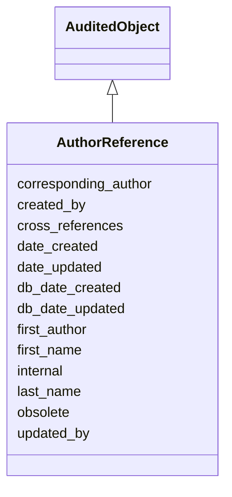

# AuthorReference

None





URI: [alliance:AuthorReference](http://alliancegenome.org/AuthorReference)


## Parent Classes

* [AuditedObject](AuditedObject.md)
    * **AuthorReference**


<!-- no inheritance hierarchy -->


## Slots

| Name | Description  |
| ---  | ---  |
| [corresponding_author](corresponding_author.md) | Indicates if the author is a corresponding author. |
| [created_by](created_by.md) | The individual that created the entity. |
| [cross_references](cross_references.md) | Holds between an object and its CrossReferences. |
| [date_created](date_created.md) | The date on which an entity was created. This can be applied to nodes or edges. |
| [date_updated](date_updated.md) | Date on which an entity was last modified. |
| [db_date_created](db_date_created.md) | The date on which an entity was created in the Alliance database.  This is disinct from date_created, which represents the date when the entity was originally created (i.e. at the MOD for imported data). |
| [db_date_updated](db_date_updated.md) | Date on which an entity was last modified in the Alliance database.  This is disinct from date_updated, which represents the date when the entity was last modified and may predate import into the Alliance database. |
| [first_author](first_author.md) | Indicates if the author is a first author. |
| [first_name](first_name.md) | first name of a person |
| [internal](internal.md) | Classifies the entity as private (for internal use) or not (for public use). |
| [last_name](last_name.md) | last (family) name of a person |
| [obsolete](obsolete.md) | Entity is no longer current. |
| [updated_by](updated_by.md) | The individual that last modified the entity. |


## Mappings

| Mapping Type | Mapped Value |
| ---  | ---  |
| self | ['alliance:AuthorReference'] |
| native | ['alliance:AuthorReference'] |


## LinkML Specification

<!-- TODO: investigate https://stackoverflow.com/questions/37606292/how-to-create-tabbed-code-blocks-in-mkdocs-or-sphinx -->

### Direct

<details>
```yaml
name: AuthorReference
from_schema: https://github.com/alliance-genome/agr_curation_schema/src/schema/reference
is_a: AuditedObject
slots:
- corresponding_author
- first_author
- first_name
- last_name
- cross_references

```
</details>

### Induced

<details>
```yaml
name: AuthorReference
from_schema: https://github.com/alliance-genome/agr_curation_schema/src/schema/reference
is_a: AuditedObject
attributes:
  corresponding_author:
    name: corresponding_author
    description: Indicates if the author is a corresponding author.
    from_schema: https://github.com/alliance-genome/agr_curation_schema/src/schema/reference
    domain: AuthorReference
    alias: corresponding_author
    owner: AuthorReference
    domain_of:
    - AuthorReference
    range: boolean
  first_author:
    name: first_author
    description: Indicates if the author is a first author.
    from_schema: https://github.com/alliance-genome/agr_curation_schema/src/schema/reference
    domain: AuthorReference
    alias: first_author
    owner: AuthorReference
    domain_of:
    - AuthorReference
    range: boolean
  first_name:
    name: first_name
    description: first name of a person
    from_schema: https://github.com/alliance-genome/agr_curation_schema/core.yaml
    alias: first_name
    owner: AuthorReference
    domain_of:
    - Person
    - AuthorReference
    range: string
  last_name:
    name: last_name
    description: last (family) name of a person
    from_schema: https://github.com/alliance-genome/agr_curation_schema/core.yaml
    alias: last_name
    owner: AuthorReference
    domain_of:
    - Person
    - AuthorReference
    range: string
  cross_references:
    name: cross_references
    description: Holds between an object and its CrossReferences.
    from_schema: https://github.com/alliance-genome/agr_curation_schema/core.yaml
    aliases:
    - xrefs
    singular_name: cross_reference
    multivalued: true
    alias: cross_references
    owner: AuthorReference
    domain_of:
    - OntologyTerm
    - GenomicEntity
    - AuthorReference
    - Antibody
    - GeneInteraction
    range: CrossReference
  created_by:
    name: created_by
    description: The individual that created the entity.
    from_schema: https://github.com/alliance-genome/agr_curation_schema/core.yaml
    domain: AuditedObject
    multivalued: false
    alias: created_by
    owner: AuthorReference
    domain_of:
    - AuditedObject
    range: Person
  date_created:
    name: date_created
    description: The date on which an entity was created. This can be applied to nodes
      or edges.
    from_schema: https://github.com/alliance-genome/agr_curation_schema/core.yaml
    aliases:
    - creation_date
    exact_mappings:
    - dct:createdOn
    - WIKIDATA_PROPERTY:P577
    alias: date_created
    owner: AuthorReference
    domain_of:
    - AuditedObject
    - AuditedObjectDTO
    range: datetime
  updated_by:
    name: updated_by
    description: The individual that last modified the entity.
    from_schema: https://github.com/alliance-genome/agr_curation_schema/core.yaml
    domain: AuditedObject
    multivalued: false
    alias: updated_by
    owner: AuthorReference
    domain_of:
    - AuditedObject
    range: Person
  date_updated:
    name: date_updated
    description: Date on which an entity was last modified.
    from_schema: https://github.com/alliance-genome/agr_curation_schema/core.yaml
    aliases:
    - date_last_modified
    alias: date_updated
    owner: AuthorReference
    domain_of:
    - AuditedObject
    - AuditedObjectDTO
    range: datetime
  db_date_created:
    name: db_date_created
    description: The date on which an entity was created in the Alliance database.  This
      is disinct from date_created, which represents the date when the entity was
      originally created (i.e. at the MOD for imported data).
    from_schema: https://github.com/alliance-genome/agr_curation_schema/core.yaml
    alias: db_date_created
    owner: AuthorReference
    domain_of:
    - AuditedObject
    - AuditedObjectDTO
    range: datetime
  db_date_updated:
    name: db_date_updated
    description: Date on which an entity was last modified in the Alliance database.  This
      is disinct from date_updated, which represents the date when the entity was
      last modified and may predate import into the Alliance database.
    from_schema: https://github.com/alliance-genome/agr_curation_schema/core.yaml
    alias: db_date_updated
    owner: AuthorReference
    domain_of:
    - AuditedObject
    - AuditedObjectDTO
    range: datetime
  internal:
    name: internal
    description: Classifies the entity as private (for internal use) or not (for public
      use).
    notes:
    - Default value is true.
    from_schema: https://github.com/alliance-genome/agr_curation_schema/core.yaml
    alias: internal
    owner: AuthorReference
    domain_of:
    - AuditedObject
    - AuditedObjectDTO
    range: boolean
    required: true
  obsolete:
    name: obsolete
    description: Entity is no longer current.
    notes:
    - Obsolete entities are preserved in the database for posterity but should not
      be publicly displayed.
    from_schema: https://github.com/alliance-genome/agr_curation_schema/core.yaml
    alias: obsolete
    owner: AuthorReference
    domain_of:
    - AuditedObject
    - AuditedObjectDTO
    range: boolean

```
</details>