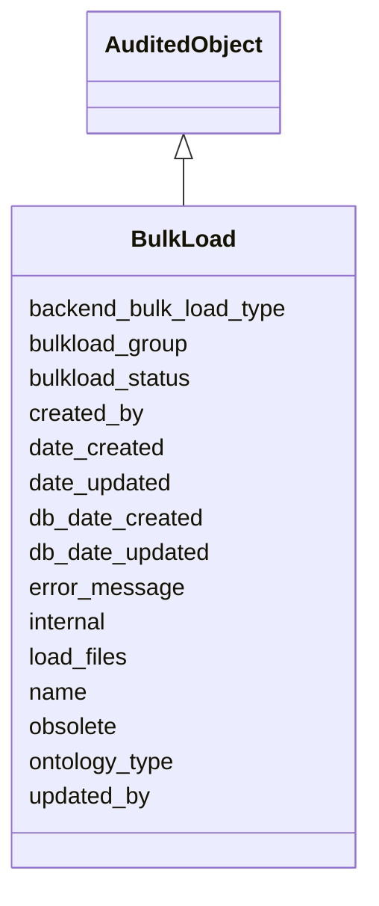

# BulkLoad

Base class for all loads





URI: [alliance:BulkLoad](http://alliancegenome.org/BulkLoad)


## Parent Classes

* [AuditedObject](AuditedObject.md)
    * **BulkLoad**
        * [BulkScheduledLoad](BulkScheduledLoad.md)
        * [BulkManualLoad](BulkManualLoad.md)


## Children

* [AuditedObject](AuditedObject.md)
    * **BulkLoad**
        * [BulkScheduledLoad](BulkScheduledLoad.md)
        * [BulkManualLoad](BulkManualLoad.md)


## Slots

| Name | Description  |
| ---  | ---  |
| [backend_bulk_load_type](backend_bulk_load_type.md) | None |
| [bulkload_group](bulkload_group.md) | Bulk load group designed to group together bulk loads |
| [bulkload_status](bulkload_status.md) | Status used to capture the progress of the load |
| [created_by](created_by.md) | The individual that created the entity. |
| [date_created](date_created.md) | The date on which an entity was created. This can be applied to nodes or edges. |
| [date_updated](date_updated.md) | Date on which an entity was last modified. |
| [db_date_created](db_date_created.md) | The date on which an entity was created in the Alliance database.  This is disinct from date_created, which represents the date when the entity was originally created (i.e. at the MOD for imported data). |
| [db_date_updated](db_date_updated.md) | Date on which an entity was last modified in the Alliance database.  This is disinct from date_updated, which represents the date when the entity was last modified and may predate import into the Alliance database. |
| [error_message](error_message.md) | Error message string if an error occurs |
| [internal](internal.md) | Classifies the entity as private (for internal use) or not (for public use). |
| [load_files](load_files.md) | None |
| [name](name.md) | a human-readable name for an entity |
| [obsolete](obsolete.md) | Entity is no longer current. |
| [ontology_type](ontology_type.md) | None |
| [updated_by](updated_by.md) | The individual that last modified the entity. |


## Mappings

| Mapping Type | Mapped Value |
| ---  | ---  |
| self | ['alliance:BulkLoad'] |
| native | ['alliance:BulkLoad'] |


## LinkML Specification

<!-- TODO: investigate https://stackoverflow.com/questions/37606292/how-to-create-tabbed-code-blocks-in-mkdocs-or-sphinx -->

### Direct

<details>
```yaml
name: BulkLoad
description: Base class for all loads
from_schema: https://github.com/alliance-genome/agr_curation_schema/src/schema/bulkload.yaml
is_a: AuditedObject
slots:
- name
- bulkload_status
- error_message
- backend_bulk_load_type
- ontology_type
- bulkload_group
- load_files

```
</details>

### Induced

<details>
```yaml
name: BulkLoad
description: Base class for all loads
from_schema: https://github.com/alliance-genome/agr_curation_schema/src/schema/bulkload.yaml
is_a: AuditedObject
attributes:
  name:
    name: name
    description: a human-readable name for an entity
    notes:
    - May want to convert this into a slot that uses NameSlotAnnotation.
    from_schema: https://github.com/alliance-genome/agr_curation_schema/affectedGenomicModel
    multivalued: false
    alias: name
    owner: BulkLoad
    domain_of:
    - OntologyTerm
    - ResourceDescriptor
    - ResourceDescriptorPage
    - AffectedGenomicModel
    - AffectedGenomicModelDTO
    - VocabularyTerm
    - Vocabulary
    - VocabularyTermSet
    - Antibody
    - CurationReportGroup
    - CurationReport
    - BulkLoadGroup
    - BulkLoad
    range: string
  bulkload_status:
    name: bulkload_status
    description: Status used to capture the progress of the load
    from_schema: https://github.com/alliance-genome/agr_curation_schema/src/schema/bulkload.yaml
    alias: bulkload_status
    owner: BulkLoad
    domain_of:
    - BulkLoad
    - BulkLoadFile
    range: bulk_load_status_enum
  error_message:
    name: error_message
    description: Error message string if an error occurs
    from_schema: https://github.com/alliance-genome/agr_curation_schema/src/schema/bulkload.yaml
    alias: error_message
    owner: BulkLoad
    domain_of:
    - CurationReport
    - BulkLoad
    - BulkLoadFile
    range: string
  backend_bulk_load_type:
    name: backend_bulk_load_type
    from_schema: https://github.com/alliance-genome/agr_curation_schema/src/schema/bulkload.yaml
    alias: backend_bulk_load_type
    owner: BulkLoad
    domain_of:
    - BulkLoad
    range: backend_bulk_load_type_enum
  ontology_type:
    name: ontology_type
    from_schema: https://github.com/alliance-genome/agr_curation_schema/src/schema/bulkload.yaml
    alias: ontology_type
    owner: BulkLoad
    domain_of:
    - BulkLoad
    range: ontology_bulk_load_type_enum
  bulkload_group:
    name: bulkload_group
    description: Bulk load group designed to group together bulk loads
    from_schema: https://github.com/alliance-genome/agr_curation_schema/src/schema/bulkload.yaml
    alias: bulkload_group
    owner: BulkLoad
    domain_of:
    - BulkLoad
    range: BulkLoadGroup
  load_files:
    name: load_files
    from_schema: https://github.com/alliance-genome/agr_curation_schema/src/schema/bulkload.yaml
    multivalued: true
    alias: load_files
    owner: BulkLoad
    domain_of:
    - BulkLoad
    range: BulkLoadFile
  created_by:
    name: created_by
    description: The individual that created the entity.
    from_schema: https://github.com/alliance-genome/agr_curation_schema/core.yaml
    domain: AuditedObject
    multivalued: false
    alias: created_by
    owner: BulkLoad
    domain_of:
    - AuditedObject
    range: Person
  date_created:
    name: date_created
    description: The date on which an entity was created. This can be applied to nodes
      or edges.
    from_schema: https://github.com/alliance-genome/agr_curation_schema/core.yaml
    aliases:
    - creation_date
    exact_mappings:
    - dct:createdOn
    - WIKIDATA_PROPERTY:P577
    alias: date_created
    owner: BulkLoad
    domain_of:
    - AuditedObject
    - AuditedObjectDTO
    range: datetime
  updated_by:
    name: updated_by
    description: The individual that last modified the entity.
    from_schema: https://github.com/alliance-genome/agr_curation_schema/core.yaml
    domain: AuditedObject
    multivalued: false
    alias: updated_by
    owner: BulkLoad
    domain_of:
    - AuditedObject
    range: Person
  date_updated:
    name: date_updated
    description: Date on which an entity was last modified.
    from_schema: https://github.com/alliance-genome/agr_curation_schema/core.yaml
    aliases:
    - date_last_modified
    alias: date_updated
    owner: BulkLoad
    domain_of:
    - AuditedObject
    - AuditedObjectDTO
    range: datetime
  db_date_created:
    name: db_date_created
    description: The date on which an entity was created in the Alliance database.  This
      is disinct from date_created, which represents the date when the entity was
      originally created (i.e. at the MOD for imported data).
    from_schema: https://github.com/alliance-genome/agr_curation_schema/core.yaml
    alias: db_date_created
    owner: BulkLoad
    domain_of:
    - AuditedObject
    - AuditedObjectDTO
    range: datetime
  db_date_updated:
    name: db_date_updated
    description: Date on which an entity was last modified in the Alliance database.  This
      is disinct from date_updated, which represents the date when the entity was
      last modified and may predate import into the Alliance database.
    from_schema: https://github.com/alliance-genome/agr_curation_schema/core.yaml
    alias: db_date_updated
    owner: BulkLoad
    domain_of:
    - AuditedObject
    - AuditedObjectDTO
    range: datetime
  internal:
    name: internal
    description: Classifies the entity as private (for internal use) or not (for public
      use).
    notes:
    - Default value is true.
    from_schema: https://github.com/alliance-genome/agr_curation_schema/core.yaml
    alias: internal
    owner: BulkLoad
    domain_of:
    - AuditedObject
    - AuditedObjectDTO
    range: boolean
    required: true
  obsolete:
    name: obsolete
    description: Entity is no longer current.
    notes:
    - Obsolete entities are preserved in the database for posterity but should not
      be publicly displayed.
    from_schema: https://github.com/alliance-genome/agr_curation_schema/core.yaml
    alias: obsolete
    owner: BulkLoad
    domain_of:
    - AuditedObject
    - AuditedObjectDTO
    range: boolean

```
</details>