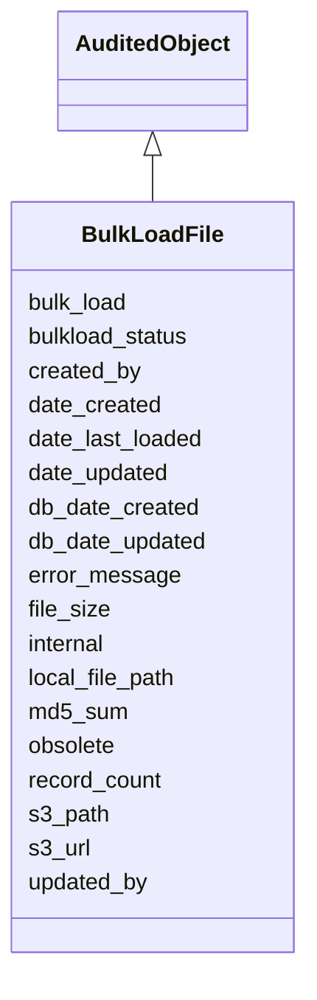

# BulkLoadFile

This class is used to hold version of the files being loaded





URI: [alliance:BulkLoadFile](http://alliancegenome.org/BulkLoadFile)


## Parent Classes

* [AuditedObject](AuditedObject.md)
    * **BulkLoadFile**


<!-- no inheritance hierarchy -->


## Slots

| Name | Description  |
| ---  | ---  |
| [bulk_load](bulk_load.md) | A link back to the parent bulk load |
| [bulkload_status](bulkload_status.md) | Status used to capture the progress of the load |
| [created_by](created_by.md) | The individual that created the entity. |
| [date_created](date_created.md) | The date on which an entity was created. This can be applied to nodes or edges. |
| [date_last_loaded](date_last_loaded.md) | Indicates when the file was last loaded |
| [date_updated](date_updated.md) | Date on which an entity was last modified. |
| [db_date_created](db_date_created.md) | The date on which an entity was created in the Alliance database.  This is disinct from date_created, which represents the date when the entity was originally created (i.e. at the MOD for imported data). |
| [db_date_updated](db_date_updated.md) | Date on which an entity was last modified in the Alliance database.  This is disinct from date_updated, which represents the date when the entity was last modified and may predate import into the Alliance database. |
| [error_message](error_message.md) | Error message string if an error occurs |
| [file_size](file_size.md) | The size of the file |
| [internal](internal.md) | Classifies the entity as private (for internal use) or not (for public use). |
| [local_file_path](local_file_path.md) | Local file path to where the file has been saved for processing |
| [md5_sum](md5_sum.md) | Generated md5Sum of the file that has been uploaded |
| [obsolete](obsolete.md) | Entity is no longer current. |
| [record_count](record_count.md) | The number of records found in the file |
| [s3_path](s3_path.md) | The relative path to the file in the S3 bucket |
| [s3_url](s3_url.md) | The full URL to the file from S3 |
| [updated_by](updated_by.md) | The individual that last modified the entity. |


## Mappings

| Mapping Type | Mapped Value |
| ---  | ---  |
| self | ['alliance:BulkLoadFile'] |
| native | ['alliance:BulkLoadFile'] |


## LinkML Specification

<!-- TODO: investigate https://stackoverflow.com/questions/37606292/how-to-create-tabbed-code-blocks-in-mkdocs-or-sphinx -->

### Direct

<details>
```yaml
name: BulkLoadFile
description: This class is used to hold version of the files being loaded
from_schema: https://github.com/alliance-genome/agr_curation_schema/src/schema/bulkload.yaml
is_a: AuditedObject
slots:
- bulkload_status
- md5_sum
- local_file_path
- file_size
- s3_path
- s3_url
- record_count
- error_message
- bulk_load
- date_last_loaded

```
</details>

### Induced

<details>
```yaml
name: BulkLoadFile
description: This class is used to hold version of the files being loaded
from_schema: https://github.com/alliance-genome/agr_curation_schema/src/schema/bulkload.yaml
is_a: AuditedObject
attributes:
  bulkload_status:
    name: bulkload_status
    description: Status used to capture the progress of the load
    from_schema: https://github.com/alliance-genome/agr_curation_schema/src/schema/bulkload.yaml
    alias: bulkload_status
    owner: BulkLoadFile
    domain_of:
    - BulkLoad
    - BulkLoadFile
    range: bulk_load_status_enum
  md5_sum:
    name: md5_sum
    description: Generated md5Sum of the file that has been uploaded
    from_schema: https://github.com/alliance-genome/agr_curation_schema/src/schema/bulkload.yaml
    alias: md5_sum
    owner: BulkLoadFile
    domain_of:
    - BulkLoadFile
    range: string
  local_file_path:
    name: local_file_path
    description: Local file path to where the file has been saved for processing
    from_schema: https://github.com/alliance-genome/agr_curation_schema/src/schema/bulkload.yaml
    alias: local_file_path
    owner: BulkLoadFile
    domain_of:
    - BulkLoadFile
    range: string
  file_size:
    name: file_size
    description: The size of the file
    from_schema: https://github.com/alliance-genome/agr_curation_schema/src/schema/bulkload.yaml
    alias: file_size
    owner: BulkLoadFile
    domain_of:
    - BulkLoadFile
    range: integer
  s3_path:
    name: s3_path
    description: The relative path to the file in the S3 bucket
    from_schema: https://github.com/alliance-genome/agr_curation_schema/src/schema/bulkload.yaml
    alias: s3_path
    owner: BulkLoadFile
    domain_of:
    - BulkLoadFile
    range: string
  s3_url:
    name: s3_url
    description: The full URL to the file from S3
    from_schema: https://github.com/alliance-genome/agr_curation_schema/src/schema/bulkload.yaml
    alias: s3_url
    owner: BulkLoadFile
    domain_of:
    - BulkLoadFile
    range: string
  record_count:
    name: record_count
    description: The number of records found in the file
    from_schema: https://github.com/alliance-genome/agr_curation_schema/src/schema/bulkload.yaml
    alias: record_count
    owner: BulkLoadFile
    domain_of:
    - BulkLoadFile
    range: integer
  error_message:
    name: error_message
    description: Error message string if an error occurs
    from_schema: https://github.com/alliance-genome/agr_curation_schema/src/schema/bulkload.yaml
    alias: error_message
    owner: BulkLoadFile
    domain_of:
    - CurationReport
    - BulkLoad
    - BulkLoadFile
    range: string
  bulk_load:
    name: bulk_load
    description: A link back to the parent bulk load
    from_schema: https://github.com/alliance-genome/agr_curation_schema/src/schema/bulkload.yaml
    alias: bulk_load
    owner: BulkLoadFile
    domain_of:
    - BulkLoadFile
    range: BulkLoad
  date_last_loaded:
    name: date_last_loaded
    description: Indicates when the file was last loaded
    from_schema: https://github.com/alliance-genome/agr_curation_schema/src/schema/bulkload.yaml
    domain: BulkLoadFile
    alias: date_last_loaded
    owner: BulkLoadFile
    domain_of:
    - BulkLoadFile
    range: datetime
  created_by:
    name: created_by
    description: The individual that created the entity.
    from_schema: https://github.com/alliance-genome/agr_curation_schema/core.yaml
    domain: AuditedObject
    multivalued: false
    alias: created_by
    owner: BulkLoadFile
    domain_of:
    - AuditedObject
    range: Person
  date_created:
    name: date_created
    description: The date on which an entity was created. This can be applied to nodes
      or edges.
    from_schema: https://github.com/alliance-genome/agr_curation_schema/core.yaml
    aliases:
    - creation_date
    exact_mappings:
    - dct:createdOn
    - WIKIDATA_PROPERTY:P577
    alias: date_created
    owner: BulkLoadFile
    domain_of:
    - AuditedObject
    - AuditedObjectDTO
    range: datetime
  updated_by:
    name: updated_by
    description: The individual that last modified the entity.
    from_schema: https://github.com/alliance-genome/agr_curation_schema/core.yaml
    domain: AuditedObject
    multivalued: false
    alias: updated_by
    owner: BulkLoadFile
    domain_of:
    - AuditedObject
    range: Person
  date_updated:
    name: date_updated
    description: Date on which an entity was last modified.
    from_schema: https://github.com/alliance-genome/agr_curation_schema/core.yaml
    aliases:
    - date_last_modified
    alias: date_updated
    owner: BulkLoadFile
    domain_of:
    - AuditedObject
    - AuditedObjectDTO
    range: datetime
  db_date_created:
    name: db_date_created
    description: The date on which an entity was created in the Alliance database.  This
      is disinct from date_created, which represents the date when the entity was
      originally created (i.e. at the MOD for imported data).
    from_schema: https://github.com/alliance-genome/agr_curation_schema/core.yaml
    alias: db_date_created
    owner: BulkLoadFile
    domain_of:
    - AuditedObject
    - AuditedObjectDTO
    range: datetime
  db_date_updated:
    name: db_date_updated
    description: Date on which an entity was last modified in the Alliance database.  This
      is disinct from date_updated, which represents the date when the entity was
      last modified and may predate import into the Alliance database.
    from_schema: https://github.com/alliance-genome/agr_curation_schema/core.yaml
    alias: db_date_updated
    owner: BulkLoadFile
    domain_of:
    - AuditedObject
    - AuditedObjectDTO
    range: datetime
  internal:
    name: internal
    description: Classifies the entity as private (for internal use) or not (for public
      use).
    notes:
    - Default value is true.
    from_schema: https://github.com/alliance-genome/agr_curation_schema/core.yaml
    alias: internal
    owner: BulkLoadFile
    domain_of:
    - AuditedObject
    - AuditedObjectDTO
    range: boolean
    required: true
  obsolete:
    name: obsolete
    description: Entity is no longer current.
    notes:
    - Obsolete entities are preserved in the database for posterity but should not
      be publicly displayed.
    from_schema: https://github.com/alliance-genome/agr_curation_schema/core.yaml
    alias: obsolete
    owner: BulkLoadFile
    domain_of:
    - AuditedObject
    - AuditedObjectDTO
    range: boolean

```
</details>