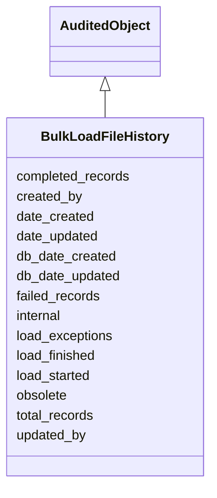

# BulkLoadFileHistory

Object used to describe the indiviual run of this BulkLoadFile





URI: [alliance:BulkLoadFileHistory](http://alliancegenome.org/BulkLoadFileHistory)


## Parent Classes

* [AuditedObject](AuditedObject.md)
    * **BulkLoadFileHistory**


<!-- no inheritance hierarchy -->


## Slots

| Name | Description  |
| ---  | ---  |
| [completed_records](completed_records.md) | The number of completed records |
| [created_by](created_by.md) | The individual that created the entity. |
| [date_created](date_created.md) | The date on which an entity was created. This can be applied to nodes or edges. |
| [date_updated](date_updated.md) | Date on which an entity was last modified. |
| [db_date_created](db_date_created.md) | The date on which an entity was created in the Alliance database.  This is disinct from date_created, which represents the date when the entity was originally created (i.e. at the MOD for imported data). |
| [db_date_updated](db_date_updated.md) | Date on which an entity was last modified in the Alliance database.  This is disinct from date_updated, which represents the date when the entity was last modified and may predate import into the Alliance database. |
| [failed_records](failed_records.md) | The number of failed records |
| [internal](internal.md) | Classifies the entity as private (for internal use) or not (for public use). |
| [load_exceptions](load_exceptions.md) | A list of execeptions the load encountered |
| [load_finished](load_finished.md) | The date and time that the load finished. |
| [load_started](load_started.md) | The date and time that the load started. |
| [obsolete](obsolete.md) | Entity is no longer current. |
| [total_records](total_records.md) | The total number of records |
| [updated_by](updated_by.md) | The individual that last modified the entity. |


## Mappings

| Mapping Type | Mapped Value |
| ---  | ---  |
| self | ['alliance:BulkLoadFileHistory'] |
| native | ['alliance:BulkLoadFileHistory'] |


## LinkML Specification

<!-- TODO: investigate https://stackoverflow.com/questions/37606292/how-to-create-tabbed-code-blocks-in-mkdocs-or-sphinx -->

### Direct

<details>
```yaml
name: BulkLoadFileHistory
description: Object used to describe the indiviual run of this BulkLoadFile
from_schema: https://github.com/alliance-genome/agr_curation_schema/src/schema/bulkload.yaml
is_a: AuditedObject
slots:
- load_started
- load_finished
- total_records
- failed_records
- completed_records
- load_exceptions

```
</details>

### Induced

<details>
```yaml
name: BulkLoadFileHistory
description: Object used to describe the indiviual run of this BulkLoadFile
from_schema: https://github.com/alliance-genome/agr_curation_schema/src/schema/bulkload.yaml
is_a: AuditedObject
attributes:
  load_started:
    name: load_started
    description: The date and time that the load started.
    from_schema: https://github.com/alliance-genome/agr_curation_schema/src/schema/bulkload.yaml
    alias: load_started
    owner: BulkLoadFileHistory
    domain_of:
    - BulkLoadFileHistory
    range: datetime
  load_finished:
    name: load_finished
    description: The date and time that the load finished.
    from_schema: https://github.com/alliance-genome/agr_curation_schema/src/schema/bulkload.yaml
    alias: load_finished
    owner: BulkLoadFileHistory
    domain_of:
    - BulkLoadFileHistory
    range: datetime
  total_records:
    name: total_records
    description: The total number of records
    from_schema: https://github.com/alliance-genome/agr_curation_schema/src/schema/bulkload.yaml
    alias: total_records
    owner: BulkLoadFileHistory
    domain_of:
    - BulkLoadFileHistory
    range: integer
  failed_records:
    name: failed_records
    description: The number of failed records
    from_schema: https://github.com/alliance-genome/agr_curation_schema/src/schema/bulkload.yaml
    alias: failed_records
    owner: BulkLoadFileHistory
    domain_of:
    - BulkLoadFileHistory
    range: integer
  completed_records:
    name: completed_records
    description: The number of completed records
    from_schema: https://github.com/alliance-genome/agr_curation_schema/src/schema/bulkload.yaml
    alias: completed_records
    owner: BulkLoadFileHistory
    domain_of:
    - BulkLoadFileHistory
    range: string
  load_exceptions:
    name: load_exceptions
    description: A list of execeptions the load encountered
    from_schema: https://github.com/alliance-genome/agr_curation_schema/src/schema/bulkload.yaml
    multivalued: true
    alias: load_exceptions
    owner: BulkLoadFileHistory
    domain_of:
    - BulkLoadFileHistory
    range: string
  created_by:
    name: created_by
    description: The individual that created the entity.
    from_schema: https://github.com/alliance-genome/agr_curation_schema/core.yaml
    domain: AuditedObject
    multivalued: false
    alias: created_by
    owner: BulkLoadFileHistory
    domain_of:
    - AuditedObject
    range: Person
  date_created:
    name: date_created
    description: The date on which an entity was created. This can be applied to nodes
      or edges.
    from_schema: https://github.com/alliance-genome/agr_curation_schema/core.yaml
    aliases:
    - creation_date
    exact_mappings:
    - dct:createdOn
    - WIKIDATA_PROPERTY:P577
    alias: date_created
    owner: BulkLoadFileHistory
    domain_of:
    - AuditedObject
    - AuditedObjectDTO
    range: datetime
  updated_by:
    name: updated_by
    description: The individual that last modified the entity.
    from_schema: https://github.com/alliance-genome/agr_curation_schema/core.yaml
    domain: AuditedObject
    multivalued: false
    alias: updated_by
    owner: BulkLoadFileHistory
    domain_of:
    - AuditedObject
    range: Person
  date_updated:
    name: date_updated
    description: Date on which an entity was last modified.
    from_schema: https://github.com/alliance-genome/agr_curation_schema/core.yaml
    aliases:
    - date_last_modified
    alias: date_updated
    owner: BulkLoadFileHistory
    domain_of:
    - AuditedObject
    - AuditedObjectDTO
    range: datetime
  db_date_created:
    name: db_date_created
    description: The date on which an entity was created in the Alliance database.  This
      is disinct from date_created, which represents the date when the entity was
      originally created (i.e. at the MOD for imported data).
    from_schema: https://github.com/alliance-genome/agr_curation_schema/core.yaml
    alias: db_date_created
    owner: BulkLoadFileHistory
    domain_of:
    - AuditedObject
    - AuditedObjectDTO
    range: datetime
  db_date_updated:
    name: db_date_updated
    description: Date on which an entity was last modified in the Alliance database.  This
      is disinct from date_updated, which represents the date when the entity was
      last modified and may predate import into the Alliance database.
    from_schema: https://github.com/alliance-genome/agr_curation_schema/core.yaml
    alias: db_date_updated
    owner: BulkLoadFileHistory
    domain_of:
    - AuditedObject
    - AuditedObjectDTO
    range: datetime
  internal:
    name: internal
    description: Classifies the entity as private (for internal use) or not (for public
      use).
    notes:
    - Default value is true.
    from_schema: https://github.com/alliance-genome/agr_curation_schema/core.yaml
    alias: internal
    owner: BulkLoadFileHistory
    domain_of:
    - AuditedObject
    - AuditedObjectDTO
    range: boolean
    required: true
  obsolete:
    name: obsolete
    description: Entity is no longer current.
    notes:
    - Obsolete entities are preserved in the database for posterity but should not
      be publicly displayed.
    from_schema: https://github.com/alliance-genome/agr_curation_schema/core.yaml
    alias: obsolete
    owner: BulkLoadFileHistory
    domain_of:
    - AuditedObject
    - AuditedObjectDTO
    range: boolean

```
</details>