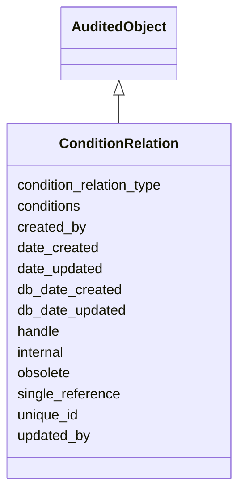

# ConditionRelation

A pairing of an experimental condition relation (i.e. has_condition) with a list of 1 or more ExperimentalCondition objects. Annotation objects can connect directly to a set of 0 or more of these ConditionRelation objects via a 'condition_relations' slot to express the experimental conditions relevant to the annotation.





URI: [alliance:ConditionRelation](http://alliancegenome.org/ConditionRelation)


## Parent Classes

* [AuditedObject](AuditedObject.md)
    * **ConditionRelation**


<!-- no inheritance hierarchy -->


## Slots

| Name | Description  |
| ---  | ---  |
| [condition_relation_type](condition_relation_type.md) | Submitted value should be a vocabulary term from the 'Condition relation types' vocabulary |
| [conditions](conditions.md) | None |
| [created_by](created_by.md) | The individual that created the entity. |
| [date_created](date_created.md) | The date on which an entity was created. This can be applied to nodes or edges. |
| [date_updated](date_updated.md) | Date on which an entity was last modified. |
| [db_date_created](db_date_created.md) | The date on which an entity was created in the Alliance database.  This is disinct from date_created, which represents the date when the entity was originally created (i.e. at the MOD for imported data). |
| [db_date_updated](db_date_updated.md) | Date on which an entity was last modified in the Alliance database.  This is disinct from date_updated, which represents the date when the entity was last modified and may predate import into the Alliance database. |
| [handle](handle.md) | A slot pointing to a free-text alias or 'handle' for a data object, such as a reference-specific alias for a data object used while curating. |
| [internal](internal.md) | Classifies the entity as private (for internal use) or not (for public use). |
| [obsolete](obsolete.md) | Entity is no longer current. |
| [single_reference](single_reference.md) | holds between an object and a single reference |
| [unique_id](unique_id.md) | Unique identifer for the condition relation.  Will be generated at AGR. |
| [updated_by](updated_by.md) | The individual that last modified the entity. |


## Mappings

| Mapping Type | Mapped Value |
| ---  | ---  |
| self | ['alliance:ConditionRelation'] |
| native | ['alliance:ConditionRelation'] |


## LinkML Specification

<!-- TODO: investigate https://stackoverflow.com/questions/37606292/how-to-create-tabbed-code-blocks-in-mkdocs-or-sphinx -->

### Direct

<details>
```yaml
name: ConditionRelation
description: A pairing of an experimental condition relation (i.e. has_condition)
  with a list of 1 or more ExperimentalCondition objects. Annotation objects can connect
  directly to a set of 0 or more of these ConditionRelation objects via a 'condition_relations'
  slot to express the experimental conditions relevant to the annotation.
from_schema: https://github.com/alliance-genome/agr_persistent_schema/phenotypeAndDiseaseAnnotation.yaml
is_a: AuditedObject
slots:
- unique_id
- handle
- single_reference
- condition_relation_type
- conditions
slot_usage:
  unique_id:
    name: unique_id
    description: Unique identifer for the condition relation.  Will be generated at
      AGR.
    domain_of:
    - DiseaseAnnotation
    - ExperimentalCondition
    - ConditionRelation
    - Person
    required: false
  handle:
    name: handle
    multivalued: false
    domain_of:
    - ConditionRelation
    - ConditionRelationDTO
    required: false
  single_reference:
    name: single_reference
    domain_of:
    - SourceVariantLocation
    - VariantLocation
    - PhenotypeAnnotation
    - DiseaseAnnotation
    - ConditionRelation
    - Figure
    - GeneToGeneOrthologyCurated
    - ExpressionExperiment
    - FunctionalGeneSet
    required: false
  condition_relation_type:
    name: condition_relation_type
    multivalued: false
    domain_of:
    - ConditionRelation
    required: true

```
</details>

### Induced

<details>
```yaml
name: ConditionRelation
description: A pairing of an experimental condition relation (i.e. has_condition)
  with a list of 1 or more ExperimentalCondition objects. Annotation objects can connect
  directly to a set of 0 or more of these ConditionRelation objects via a 'condition_relations'
  slot to express the experimental conditions relevant to the annotation.
from_schema: https://github.com/alliance-genome/agr_persistent_schema/phenotypeAndDiseaseAnnotation.yaml
is_a: AuditedObject
slot_usage:
  unique_id:
    name: unique_id
    description: Unique identifer for the condition relation.  Will be generated at
      AGR.
    domain_of:
    - DiseaseAnnotation
    - ExperimentalCondition
    - ConditionRelation
    - Person
    required: false
  handle:
    name: handle
    multivalued: false
    domain_of:
    - ConditionRelation
    - ConditionRelationDTO
    required: false
  single_reference:
    name: single_reference
    domain_of:
    - SourceVariantLocation
    - VariantLocation
    - PhenotypeAnnotation
    - DiseaseAnnotation
    - ConditionRelation
    - Figure
    - GeneToGeneOrthologyCurated
    - ExpressionExperiment
    - FunctionalGeneSet
    required: false
  condition_relation_type:
    name: condition_relation_type
    multivalued: false
    domain_of:
    - ConditionRelation
    required: true
attributes:
  unique_id:
    name: unique_id
    description: Unique identifer for the condition relation.  Will be generated at
      AGR.
    from_schema: https://github.com/alliance-genome/agr_curation_schema/core.yaml
    multivalued: false
    alias: unique_id
    owner: ConditionRelation
    domain_of:
    - DiseaseAnnotation
    - ExperimentalCondition
    - ConditionRelation
    - Person
    range: string
    required: false
  handle:
    name: handle
    description: A slot pointing to a free-text alias or 'handle' for a data object,
      such as a reference-specific alias for a data object used while curating.
    from_schema: https://github.com/alliance-genome/agr_persistent_schema/phenotypeAndDiseaseAnnotation.yaml
    multivalued: false
    alias: handle
    owner: ConditionRelation
    domain_of:
    - ConditionRelation
    - ConditionRelationDTO
    range: string
    required: false
  single_reference:
    name: single_reference
    description: holds between an object and a single reference
    from_schema: https://github.com/alliance-genome/agr_curation_schema/core.yaml
    multivalued: false
    alias: single_reference
    owner: ConditionRelation
    domain_of:
    - SourceVariantLocation
    - VariantLocation
    - PhenotypeAnnotation
    - DiseaseAnnotation
    - ConditionRelation
    - Figure
    - GeneToGeneOrthologyCurated
    - ExpressionExperiment
    - FunctionalGeneSet
    range: Reference
    required: false
  condition_relation_type:
    name: condition_relation_type
    description: Submitted value should be a vocabulary term from the 'Condition relation
      types' vocabulary
    from_schema: https://github.com/alliance-genome/agr_persistent_schema/phenotypeAndDiseaseAnnotation.yaml
    domain: ConditionRelation
    multivalued: false
    alias: condition_relation_type
    owner: ConditionRelation
    domain_of:
    - ConditionRelation
    range: VocabularyTerm
    required: true
  conditions:
    name: conditions
    from_schema: https://github.com/alliance-genome/agr_persistent_schema/phenotypeAndDiseaseAnnotation.yaml
    multivalued: true
    alias: conditions
    owner: ConditionRelation
    domain_of:
    - ConditionRelation
    range: ExperimentalCondition
  created_by:
    name: created_by
    description: The individual that created the entity.
    from_schema: https://github.com/alliance-genome/agr_curation_schema/core.yaml
    domain: AuditedObject
    multivalued: false
    alias: created_by
    owner: ConditionRelation
    domain_of:
    - AuditedObject
    range: Person
  date_created:
    name: date_created
    description: The date on which an entity was created. This can be applied to nodes
      or edges.
    from_schema: https://github.com/alliance-genome/agr_curation_schema/core.yaml
    aliases:
    - creation_date
    exact_mappings:
    - dct:createdOn
    - WIKIDATA_PROPERTY:P577
    alias: date_created
    owner: ConditionRelation
    domain_of:
    - AuditedObject
    - AuditedObjectDTO
    range: datetime
  updated_by:
    name: updated_by
    description: The individual that last modified the entity.
    from_schema: https://github.com/alliance-genome/agr_curation_schema/core.yaml
    domain: AuditedObject
    multivalued: false
    alias: updated_by
    owner: ConditionRelation
    domain_of:
    - AuditedObject
    range: Person
  date_updated:
    name: date_updated
    description: Date on which an entity was last modified.
    from_schema: https://github.com/alliance-genome/agr_curation_schema/core.yaml
    aliases:
    - date_last_modified
    alias: date_updated
    owner: ConditionRelation
    domain_of:
    - AuditedObject
    - AuditedObjectDTO
    range: datetime
  db_date_created:
    name: db_date_created
    description: The date on which an entity was created in the Alliance database.  This
      is disinct from date_created, which represents the date when the entity was
      originally created (i.e. at the MOD for imported data).
    from_schema: https://github.com/alliance-genome/agr_curation_schema/core.yaml
    alias: db_date_created
    owner: ConditionRelation
    domain_of:
    - AuditedObject
    - AuditedObjectDTO
    range: datetime
  db_date_updated:
    name: db_date_updated
    description: Date on which an entity was last modified in the Alliance database.  This
      is disinct from date_updated, which represents the date when the entity was
      last modified and may predate import into the Alliance database.
    from_schema: https://github.com/alliance-genome/agr_curation_schema/core.yaml
    alias: db_date_updated
    owner: ConditionRelation
    domain_of:
    - AuditedObject
    - AuditedObjectDTO
    range: datetime
  internal:
    name: internal
    description: Classifies the entity as private (for internal use) or not (for public
      use).
    notes:
    - Default value is true.
    from_schema: https://github.com/alliance-genome/agr_curation_schema/core.yaml
    alias: internal
    owner: ConditionRelation
    domain_of:
    - AuditedObject
    - AuditedObjectDTO
    range: boolean
    required: true
  obsolete:
    name: obsolete
    description: Entity is no longer current.
    notes:
    - Obsolete entities are preserved in the database for posterity but should not
      be publicly displayed.
    from_schema: https://github.com/alliance-genome/agr_curation_schema/core.yaml
    alias: obsolete
    owner: ConditionRelation
    domain_of:
    - AuditedObject
    - AuditedObjectDTO
    range: boolean

```
</details>