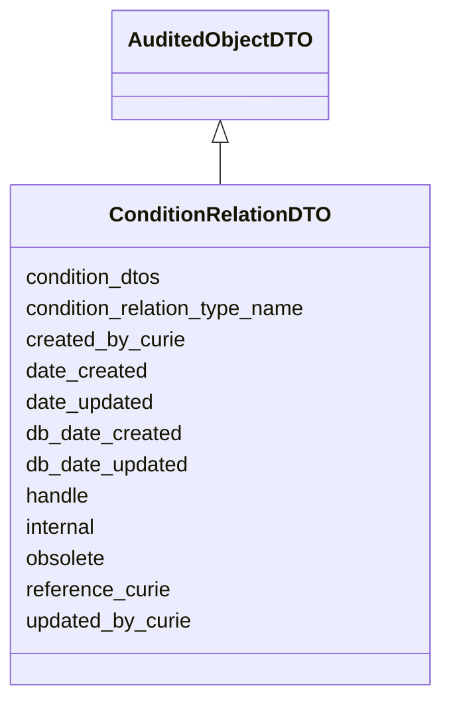

# ConditionRelationDTO

Ingest class for the pairing of an experimental condition relation with a list of one or more conditions





URI: [alliance:ConditionRelationDTO](http://alliancegenome.org/ConditionRelationDTO)


## Parent Classes

* [AuditedObjectDTO](AuditedObjectDTO.md)
    * **ConditionRelationDTO**


<!-- no inheritance hierarchy -->


## Slots

| Name | Description  |
| ---  | ---  |
| [condition_dtos](condition_dtos.md) | None |
| [condition_relation_type_name](condition_relation_type_name.md) | Name of VocabularyTerm from 'Condition relation types' vocabulary |
| [created_by_curie](created_by_curie.md) | Curie of the Person object representing the individual that created the entity |
| [date_created](date_created.md) | The date on which an entity was created. This can be applied to nodes or edges. |
| [date_updated](date_updated.md) | Date on which an entity was last modified. |
| [db_date_created](db_date_created.md) | The date on which an entity was created in the Alliance database.  This is disinct from date_created, which represents the date when the entity was originally created (i.e. at the MOD for imported data). |
| [db_date_updated](db_date_updated.md) | Date on which an entity was last modified in the Alliance database.  This is disinct from date_updated, which represents the date when the entity was last modified and may predate import into the Alliance database. |
| [handle](handle.md) | A slot pointing to a free-text alias or 'handle' for a data object, such as a reference-specific alias for a data object used while curating. |
| [internal](internal.md) | Classifies the entity as private (for internal use) or not (for public use). |
| [obsolete](obsolete.md) | Entity is no longer current. |
| [reference_curie](reference_curie.md) | External reference curie used for ingest |
| [updated_by_curie](updated_by_curie.md) | Curie of the Person object representing the individual that updated the entity |


## Mappings

| Mapping Type | Mapped Value |
| ---  | ---  |
| self | ['alliance:ConditionRelationDTO'] |
| native | ['alliance:ConditionRelationDTO'] |


## LinkML Specification

<!-- TODO: investigate https://stackoverflow.com/questions/37606292/how-to-create-tabbed-code-blocks-in-mkdocs-or-sphinx -->

### Direct

<details>
```yaml
name: ConditionRelationDTO
description: Ingest class for the pairing of an experimental condition relation with
  a list of one or more conditions
from_schema: https://github.com/alliance-genome/agr_persistent_schema/phenotypeAndDiseaseAnnotation.yaml
is_a: AuditedObjectDTO
slots:
- handle
- reference_curie
- condition_relation_type_name
- condition_dtos
slot_usage:
  condition_relation_type_name:
    name: condition_relation_type_name
    domain_of:
    - ConditionRelationDTO
    required: true
  condition_dtos:
    name: condition_dtos
    domain_of:
    - ConditionRelationDTO
    required: true

```
</details>

### Induced

<details>
```yaml
name: ConditionRelationDTO
description: Ingest class for the pairing of an experimental condition relation with
  a list of one or more conditions
from_schema: https://github.com/alliance-genome/agr_persistent_schema/phenotypeAndDiseaseAnnotation.yaml
is_a: AuditedObjectDTO
slot_usage:
  condition_relation_type_name:
    name: condition_relation_type_name
    domain_of:
    - ConditionRelationDTO
    required: true
  condition_dtos:
    name: condition_dtos
    domain_of:
    - ConditionRelationDTO
    required: true
attributes:
  handle:
    name: handle
    description: A slot pointing to a free-text alias or 'handle' for a data object,
      such as a reference-specific alias for a data object used while curating.
    from_schema: https://github.com/alliance-genome/agr_persistent_schema/phenotypeAndDiseaseAnnotation.yaml
    alias: handle
    owner: ConditionRelationDTO
    domain_of:
    - ConditionRelation
    - ConditionRelationDTO
    range: string
  reference_curie:
    name: reference_curie
    description: External reference curie used for ingest
    from_schema: https://github.com/alliance-genome/agr_curation_schema/src/schema/reference
    alias: reference_curie
    owner: ConditionRelationDTO
    domain_of:
    - DiseaseAnnotationDTO
    - ConditionRelationDTO
    range: string
  condition_relation_type_name:
    name: condition_relation_type_name
    description: Name of VocabularyTerm from 'Condition relation types' vocabulary
    from_schema: https://github.com/alliance-genome/agr_persistent_schema/phenotypeAndDiseaseAnnotation.yaml
    domain: ConditionRelationDTO
    alias: condition_relation_type_name
    owner: ConditionRelationDTO
    domain_of:
    - ConditionRelationDTO
    range: string
    required: true
  condition_dtos:
    name: condition_dtos
    from_schema: https://github.com/alliance-genome/agr_persistent_schema/phenotypeAndDiseaseAnnotation.yaml
    domain: ConditionRelationDTO
    multivalued: true
    alias: condition_dtos
    owner: ConditionRelationDTO
    domain_of:
    - ConditionRelationDTO
    range: ExperimentalConditionDTO
    required: true
    inlined: true
    inlined_as_list: true
  created_by_curie:
    name: created_by_curie
    description: Curie of the Person object representing the individual that created
      the entity
    from_schema: https://github.com/alliance-genome/agr_curation_schema/core.yaml
    domain: AuditedObjectDTO
    alias: created_by_curie
    owner: ConditionRelationDTO
    domain_of:
    - AuditedObjectDTO
    range: string
  date_created:
    name: date_created
    description: The date on which an entity was created. This can be applied to nodes
      or edges.
    from_schema: https://github.com/alliance-genome/agr_curation_schema/core.yaml
    aliases:
    - creation_date
    exact_mappings:
    - dct:createdOn
    - WIKIDATA_PROPERTY:P577
    alias: date_created
    owner: ConditionRelationDTO
    domain_of:
    - AuditedObject
    - AuditedObjectDTO
    range: datetime
  updated_by_curie:
    name: updated_by_curie
    description: Curie of the Person object representing the individual that updated
      the entity
    from_schema: https://github.com/alliance-genome/agr_curation_schema/core.yaml
    domain: AuditedObjectDTO
    alias: updated_by_curie
    owner: ConditionRelationDTO
    domain_of:
    - AuditedObjectDTO
    range: string
  date_updated:
    name: date_updated
    description: Date on which an entity was last modified.
    from_schema: https://github.com/alliance-genome/agr_curation_schema/core.yaml
    aliases:
    - date_last_modified
    alias: date_updated
    owner: ConditionRelationDTO
    domain_of:
    - AuditedObject
    - AuditedObjectDTO
    range: datetime
  db_date_created:
    name: db_date_created
    description: The date on which an entity was created in the Alliance database.  This
      is disinct from date_created, which represents the date when the entity was
      originally created (i.e. at the MOD for imported data).
    from_schema: https://github.com/alliance-genome/agr_curation_schema/core.yaml
    alias: db_date_created
    owner: ConditionRelationDTO
    domain_of:
    - AuditedObject
    - AuditedObjectDTO
    range: datetime
  db_date_updated:
    name: db_date_updated
    description: Date on which an entity was last modified in the Alliance database.  This
      is disinct from date_updated, which represents the date when the entity was
      last modified and may predate import into the Alliance database.
    from_schema: https://github.com/alliance-genome/agr_curation_schema/core.yaml
    alias: db_date_updated
    owner: ConditionRelationDTO
    domain_of:
    - AuditedObject
    - AuditedObjectDTO
    range: datetime
  internal:
    name: internal
    description: Classifies the entity as private (for internal use) or not (for public
      use).
    notes:
    - Default value is true.
    from_schema: https://github.com/alliance-genome/agr_curation_schema/core.yaml
    alias: internal
    owner: ConditionRelationDTO
    domain_of:
    - AuditedObject
    - AuditedObjectDTO
    range: boolean
    required: true
  obsolete:
    name: obsolete
    description: Entity is no longer current.
    notes:
    - Obsolete entities are preserved in the database for posterity but should not
      be publicly displayed.
    from_schema: https://github.com/alliance-genome/agr_curation_schema/core.yaml
    alias: obsolete
    owner: ConditionRelationDTO
    domain_of:
    - AuditedObject
    - AuditedObjectDTO
    range: boolean

```
</details>