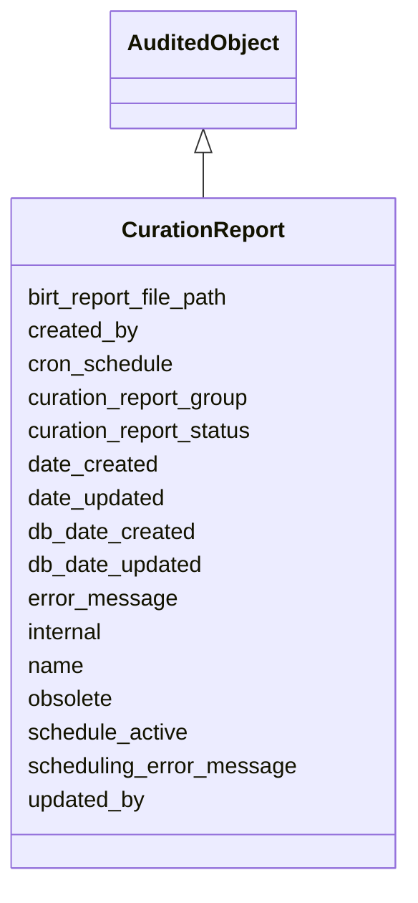

# CurationReport

Base class for all curation reports





URI: [alliance:CurationReport](http://alliancegenome.org/CurationReport)


## Parent Classes

* [AuditedObject](AuditedObject.md)
    * **CurationReport**


<!-- no inheritance hierarchy -->


## Slots

| Name | Description  |
| ---  | ---  |
| [birt_report_file_path](birt_report_file_path.md) | File path to where the BIRT file has been saved |
| [created_by](created_by.md) | The individual that created the entity. |
| [cron_schedule](cron_schedule.md) | A string describing the cron syntax for the schedule |
| [curation_report_group](curation_report_group.md) | Links a curation report to its report group |
| [curation_report_status](curation_report_status.md) | Describes the status of the curation report |
| [date_created](date_created.md) | The date on which an entity was created. This can be applied to nodes or edges. |
| [date_updated](date_updated.md) | Date on which an entity was last modified. |
| [db_date_created](db_date_created.md) | The date on which an entity was created in the Alliance database.  This is disinct from date_created, which represents the date when the entity was originally created (i.e. at the MOD for imported data). |
| [db_date_updated](db_date_updated.md) | Date on which an entity was last modified in the Alliance database.  This is disinct from date_updated, which represents the date when the entity was last modified and may predate import into the Alliance database. |
| [error_message](error_message.md) | Error message string if an error occurs |
| [internal](internal.md) | Classifies the entity as private (for internal use) or not (for public use). |
| [name](name.md) | a human-readable name for an entity |
| [obsolete](obsolete.md) | Entity is no longer current. |
| [schedule_active](schedule_active.md) | This determines if the the schedule is active or not |
| [scheduling_error_message](scheduling_error_message.md) | Any errors in syntax on the cron_schedule |
| [updated_by](updated_by.md) | The individual that last modified the entity. |


## Mappings

| Mapping Type | Mapped Value |
| ---  | ---  |
| self | ['alliance:CurationReport'] |
| native | ['alliance:CurationReport'] |


## LinkML Specification

<!-- TODO: investigate https://stackoverflow.com/questions/37606292/how-to-create-tabbed-code-blocks-in-mkdocs-or-sphinx -->

### Direct

<details>
```yaml
name: CurationReport
description: Base class for all curation reports
from_schema: https://github.com/alliance-genome/agr_curation_schema/src/schema/bulkload.yaml
is_a: AuditedObject
slots:
- name
- birt_report_file_path
- schedule_active
- cron_schedule
- curation_report_status
- curation_report_group
- error_message
- scheduling_error_message

```
</details>

### Induced

<details>
```yaml
name: CurationReport
description: Base class for all curation reports
from_schema: https://github.com/alliance-genome/agr_curation_schema/src/schema/bulkload.yaml
is_a: AuditedObject
attributes:
  name:
    name: name
    description: a human-readable name for an entity
    notes:
    - May want to convert this into a slot that uses NameSlotAnnotation.
    from_schema: https://github.com/alliance-genome/agr_curation_schema/affectedGenomicModel
    multivalued: false
    alias: name
    owner: CurationReport
    domain_of:
    - OntologyTerm
    - ResourceDescriptor
    - ResourceDescriptorPage
    - AffectedGenomicModel
    - AffectedGenomicModelDTO
    - VocabularyTerm
    - Vocabulary
    - VocabularyTermSet
    - Antibody
    - CurationReportGroup
    - CurationReport
    - BulkLoadGroup
    - BulkLoad
    range: string
  birt_report_file_path:
    name: birt_report_file_path
    description: File path to where the BIRT file has been saved
    from_schema: https://github.com/alliance-genome/agr_curation_schema/src/schema/bulkload.yaml
    alias: birt_report_file_path
    owner: CurationReport
    domain_of:
    - CurationReport
    range: string
  schedule_active:
    name: schedule_active
    description: This determines if the the schedule is active or not
    from_schema: https://github.com/alliance-genome/agr_curation_schema/core.yaml
    alias: schedule_active
    owner: CurationReport
    domain_of:
    - CurationReport
    - BulkScheduledLoad
    range: boolean
  cron_schedule:
    name: cron_schedule
    description: A string describing the cron syntax for the schedule
    from_schema: https://github.com/alliance-genome/agr_curation_schema/core.yaml
    alias: cron_schedule
    owner: CurationReport
    domain_of:
    - CurationReport
    - BulkScheduledLoad
    range: string
  curation_report_status:
    name: curation_report_status
    description: Describes the status of the curation report
    from_schema: https://github.com/alliance-genome/agr_curation_schema/src/schema/bulkload.yaml
    alias: curation_report_status
    owner: CurationReport
    domain_of:
    - CurationReport
    - CurationReportHistory
    range: string
  curation_report_group:
    name: curation_report_group
    description: Links a curation report to its report group
    from_schema: https://github.com/alliance-genome/agr_curation_schema/src/schema/bulkload.yaml
    domain: CurationReport
    alias: curation_report_group
    owner: CurationReport
    domain_of:
    - CurationReport
    range: CurationReportGroup
  error_message:
    name: error_message
    description: Error message string if an error occurs
    from_schema: https://github.com/alliance-genome/agr_curation_schema/src/schema/bulkload.yaml
    alias: error_message
    owner: CurationReport
    domain_of:
    - CurationReport
    - BulkLoad
    - BulkLoadFile
    range: string
  scheduling_error_message:
    name: scheduling_error_message
    description: Any errors in syntax on the cron_schedule
    from_schema: https://github.com/alliance-genome/agr_curation_schema/src/schema/bulkload.yaml
    alias: scheduling_error_message
    owner: CurationReport
    domain_of:
    - CurationReport
    - BulkScheduledLoad
    range: string
  created_by:
    name: created_by
    description: The individual that created the entity.
    from_schema: https://github.com/alliance-genome/agr_curation_schema/core.yaml
    domain: AuditedObject
    multivalued: false
    alias: created_by
    owner: CurationReport
    domain_of:
    - AuditedObject
    range: Person
  date_created:
    name: date_created
    description: The date on which an entity was created. This can be applied to nodes
      or edges.
    from_schema: https://github.com/alliance-genome/agr_curation_schema/core.yaml
    aliases:
    - creation_date
    exact_mappings:
    - dct:createdOn
    - WIKIDATA_PROPERTY:P577
    alias: date_created
    owner: CurationReport
    domain_of:
    - AuditedObject
    - AuditedObjectDTO
    range: datetime
  updated_by:
    name: updated_by
    description: The individual that last modified the entity.
    from_schema: https://github.com/alliance-genome/agr_curation_schema/core.yaml
    domain: AuditedObject
    multivalued: false
    alias: updated_by
    owner: CurationReport
    domain_of:
    - AuditedObject
    range: Person
  date_updated:
    name: date_updated
    description: Date on which an entity was last modified.
    from_schema: https://github.com/alliance-genome/agr_curation_schema/core.yaml
    aliases:
    - date_last_modified
    alias: date_updated
    owner: CurationReport
    domain_of:
    - AuditedObject
    - AuditedObjectDTO
    range: datetime
  db_date_created:
    name: db_date_created
    description: The date on which an entity was created in the Alliance database.  This
      is disinct from date_created, which represents the date when the entity was
      originally created (i.e. at the MOD for imported data).
    from_schema: https://github.com/alliance-genome/agr_curation_schema/core.yaml
    alias: db_date_created
    owner: CurationReport
    domain_of:
    - AuditedObject
    - AuditedObjectDTO
    range: datetime
  db_date_updated:
    name: db_date_updated
    description: Date on which an entity was last modified in the Alliance database.  This
      is disinct from date_updated, which represents the date when the entity was
      last modified and may predate import into the Alliance database.
    from_schema: https://github.com/alliance-genome/agr_curation_schema/core.yaml
    alias: db_date_updated
    owner: CurationReport
    domain_of:
    - AuditedObject
    - AuditedObjectDTO
    range: datetime
  internal:
    name: internal
    description: Classifies the entity as private (for internal use) or not (for public
      use).
    notes:
    - Default value is true.
    from_schema: https://github.com/alliance-genome/agr_curation_schema/core.yaml
    alias: internal
    owner: CurationReport
    domain_of:
    - AuditedObject
    - AuditedObjectDTO
    range: boolean
    required: true
  obsolete:
    name: obsolete
    description: Entity is no longer current.
    notes:
    - Obsolete entities are preserved in the database for posterity but should not
      be publicly displayed.
    from_schema: https://github.com/alliance-genome/agr_curation_schema/core.yaml
    alias: obsolete
    owner: CurationReport
    domain_of:
    - AuditedObject
    - AuditedObjectDTO
    range: boolean

```
</details>