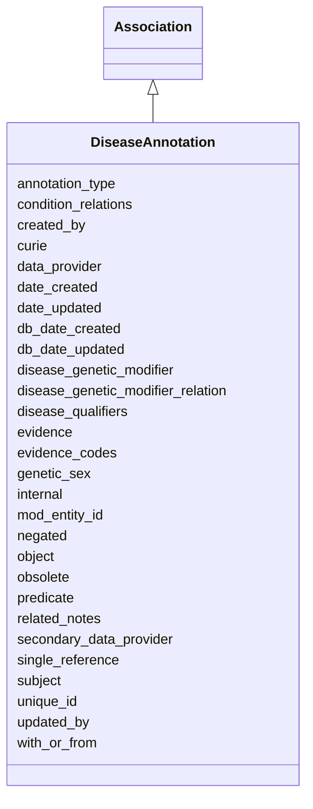

# DiseaseAnnotation

An annotation asserting an association between a biological entity and a disease supported by evidence.





URI: [alliance:DiseaseAnnotation](http://alliancegenome.org/DiseaseAnnotation)


## Parent Classes

* [AuditedObject](AuditedObject.md)
    * [Association](Association.md)
        * **DiseaseAnnotation**
            * [GeneDiseaseAnnotation](GeneDiseaseAnnotation.md)
            * [AlleleDiseaseAnnotation](AlleleDiseaseAnnotation.md)
            * [AGMDiseaseAnnotation](AGMDiseaseAnnotation.md)


## Children

* [AuditedObject](AuditedObject.md)
    * [Association](Association.md)
        * **DiseaseAnnotation**
            * [GeneDiseaseAnnotation](GeneDiseaseAnnotation.md)
            * [AlleleDiseaseAnnotation](AlleleDiseaseAnnotation.md)
            * [AGMDiseaseAnnotation](AGMDiseaseAnnotation.md)


## Slots

| Name | Description  |
| ---  | ---  |
| [annotation_type](annotation_type.md) | The type of annotation classified according to curation method. Submitted value should be a vocabulary term from the 'Annotation types' vocabulary |
| [condition_relations](condition_relations.md) | None |
| [created_by](created_by.md) | The individual that created the entity. |
| [curie](curie.md) | The Alliance-minted ID for the disease annotation. The ID is of the format AGRKB:100000000000001, where the first three digits represent the DiseaseAnnotation class code of "100", followed by a 12-digit identifier |
| [data_provider](data_provider.md) | Object representing the organization (e.g. MOD) from which the data was sourced and a CrossReference to that organisation's site |
| [date_created](date_created.md) | The date on which an entity was created. This can be applied to nodes or edges. |
| [date_updated](date_updated.md) | Date on which an entity was last modified. |
| [db_date_created](db_date_created.md) | The date on which an entity was created in the Alliance database.  This is disinct from date_created, which represents the date when the entity was originally created (i.e. at the MOD for imported data). |
| [db_date_updated](db_date_updated.md) | Date on which an entity was last modified in the Alliance database.  This is disinct from date_updated, which represents the date when the entity was last modified and may predate import into the Alliance database. |
| [disease_genetic_modifier](disease_genetic_modifier.md) | Specifies a genetic object that modifies the disease model. May be a gene, allele, AGM. |
| [disease_genetic_modifier_relation](disease_genetic_modifier_relation.md) | A relation describing how the genetic modifier modifies the disease model. Submitted value should be a vocabulary term from the 'Disease genetic modifiers' vocabulary |
| [disease_qualifiers](disease_qualifiers.md) | Submitted values should be vocabulary terms from the 'Disease qualifiers' Vocabulary |
| [evidence](evidence.md) |  |
| [evidence_codes](evidence_codes.md) | ECO term IDs |
| [genetic_sex](genetic_sex.md) | Submitted value should be a vocabulary term from the 'Genetic sexes' vocabulary |
| [internal](internal.md) | Classifies the entity as private (for internal use) or not (for public use). |
| [mod_entity_id](mod_entity_id.md) | The model organism database (MOD) identifier/curie for the disease annotation. Currently only used by WormBase for disease annotations, e.g. "WBDOannot00000907" |
| [negated](negated.md) | The negative qualifier for the annotation. |
| [object](object.md) | The disease ontology term. |
| [obsolete](obsolete.md) | Entity is no longer current. |
| [predicate](predicate.md) | Constrains the disease subject, associationType and inferredGeneAssociation. |
| [related_notes](related_notes.md) | Valid note types are available for viewing in the A-Team curation tool Controlled Vocabulary Terms Table (in the "Disease annotation note types" vocabulary) on the production environment (curation.alliancegenome.org). New terms can be added as needed. |
| [secondary_data_provider](secondary_data_provider.md) | Object representing organization (e.g. MOD) that provided the data directly to the Alliance, but not the original source, and a CrossReference to that organisation's site |
| [single_reference](single_reference.md) | The reference in which the disease association was asserted/reported. |
| [subject](subject.md) | The biological entity to which the disease ontology term is associated. |
| [unique_id](unique_id.md) | Unique identifer for the disease annotation.  Will be generated at AGR if not submitted by the MOD. |
| [updated_by](updated_by.md) | The individual that last modified the entity. |
| [with_or_from](with_or_from.md) | A field for disease annotations that captures the human gene the implicated MOD gene is homologous or orthologous to when using the ISS (inferred from sequence similarity) evidence code or the ISO (inferred from sequence orthology) evidence code. The assertion would state that the MOD gene is implicated in the indicated disease based on sequence-similarity/sequence-orthology "with" some human gene. Currently used by SGD. |


## Mappings

| Mapping Type | Mapped Value |
| ---  | ---  |
| self | ['alliance:DiseaseAnnotation'] |
| native | ['alliance:DiseaseAnnotation'] |


## LinkML Specification

<!-- TODO: investigate https://stackoverflow.com/questions/37606292/how-to-create-tabbed-code-blocks-in-mkdocs-or-sphinx -->

### Direct

<details>
```yaml
name: DiseaseAnnotation
description: An annotation asserting an association between a biological entity and
  a disease supported by evidence.
from_schema: https://github.com/alliance-genome/agr_persistent_schema/phenotypeAndDiseaseAnnotation.yaml
is_a: Association
abstract: true
slots:
- curie
- unique_id
- mod_entity_id
- negated
- evidence_codes
- single_reference
- annotation_type
- with_or_from
- disease_qualifiers
- condition_relations
- genetic_sex
- related_notes
- data_provider
- secondary_data_provider
- disease_genetic_modifier
- disease_genetic_modifier_relation
slot_usage:
  curie:
    name: curie
    description: The Alliance-minted ID for the disease annotation. The ID is of the
      format AGRKB:100000000000001, where the first three digits represent the DiseaseAnnotation
      class code of "100", followed by a 12-digit identifier
    domain_of:
    - OntologyTerm
    - PhenotypeAnnotation
    - DiseaseAnnotation
    - BiologicalEntity
    - BiologicalEntityDTO
    - Chromosome
    - Assembly
    - Identifier
    - Figure
    - Image
    - Laboratory
    - InformationContentEntity
    - Reference
    - Resource
    - ModCorpusAssociation
    - GeneInteraction
    - ExpressionExperiment
    - GeneNomenclatureSet
  unique_id:
    name: unique_id
    description: Unique identifer for the disease annotation.  Will be generated at
      AGR if not submitted by the MOD.
    domain_of:
    - DiseaseAnnotation
    - ExperimentalCondition
    - ConditionRelation
    - Person
    required: false
  mod_entity_id:
    name: mod_entity_id
    description: The model organism database (MOD) identifier/curie for the disease
      annotation. Currently only used by WormBase for disease annotations, e.g. "WBDOannot00000907"
    domain_of:
    - DiseaseAnnotation
    - DiseaseAnnotationDTO
    - Person
  subject:
    name: subject
    description: The biological entity to which the disease ontology term is associated.
    domain_of:
    - Association
    - VariantConsequence
    range: BiologicalEntity
    required: true
  predicate:
    name: predicate
    description: Constrains the disease subject, associationType and inferredGeneAssociation.
    domain_of:
    - Association
    - GeneToGeneOrthology
    required: true
  negated:
    name: negated
    description: The negative qualifier for the annotation.
    domain_of:
    - DiseaseAnnotation
    - DiseaseAnnotationDTO
    - ExpressionAnnotation
  object:
    name: object
    description: The disease ontology term.
    domain_of:
    - Association
    - VariantConsequence
    range: DOTerm
    required: true
  data_provider:
    name: data_provider
    domain_of:
    - DiseaseAnnotation
    - AffectedGenomicModel
    required: true
  annotation_type:
    name: annotation_type
    domain_of:
    - DiseaseAnnotation
    required: false
  with_or_from:
    name: with_or_from
    description: A field for disease annotations that captures the human gene the
      implicated MOD gene is homologous or orthologous to when using the ISS (inferred
      from sequence similarity) evidence code or the ISO (inferred from sequence orthology)
      evidence code. The assertion would state that the MOD gene is implicated in
      the indicated disease based on sequence-similarity/sequence-orthology "with"
      some human gene. Currently used by SGD.
    domain_of:
    - DiseaseAnnotation
    required: false
  single_reference:
    name: single_reference
    description: The reference in which the disease association was asserted/reported.
    domain_of:
    - SourceVariantLocation
    - VariantLocation
    - PhenotypeAnnotation
    - DiseaseAnnotation
    - ConditionRelation
    - Figure
    - GeneToGeneOrthologyCurated
    - ExpressionExperiment
    - FunctionalGeneSet
    required: true
  evidence_codes:
    name: evidence_codes
    multivalued: true
    domain_of:
    - DiseaseAnnotation
    required: true
  genetic_sex:
    name: genetic_sex
    description: Submitted value should be a vocabulary term from the 'Genetic sexes'
      vocabulary
    domain_of:
    - DiseaseAnnotation
    range: VocabularyTerm
    required: false
  related_notes:
    name: related_notes
    description: Valid note types are available for viewing in the A-Team curation
      tool Controlled Vocabulary Terms Table (in the "Disease annotation note types"
      vocabulary) on the production environment (curation.alliancegenome.org). New
      terms can be added as needed.
    domain_of:
    - Variant
    - DiseaseAnnotation
    - Gene
    - Antibody
    - ExpressionExperiment
    - ExpressionAnnotation

```
</details>

### Induced

<details>
```yaml
name: DiseaseAnnotation
description: An annotation asserting an association between a biological entity and
  a disease supported by evidence.
from_schema: https://github.com/alliance-genome/agr_persistent_schema/phenotypeAndDiseaseAnnotation.yaml
is_a: Association
abstract: true
slot_usage:
  curie:
    name: curie
    description: The Alliance-minted ID for the disease annotation. The ID is of the
      format AGRKB:100000000000001, where the first three digits represent the DiseaseAnnotation
      class code of "100", followed by a 12-digit identifier
    domain_of:
    - OntologyTerm
    - PhenotypeAnnotation
    - DiseaseAnnotation
    - BiologicalEntity
    - BiologicalEntityDTO
    - Chromosome
    - Assembly
    - Identifier
    - Figure
    - Image
    - Laboratory
    - InformationContentEntity
    - Reference
    - Resource
    - ModCorpusAssociation
    - GeneInteraction
    - ExpressionExperiment
    - GeneNomenclatureSet
  unique_id:
    name: unique_id
    description: Unique identifer for the disease annotation.  Will be generated at
      AGR if not submitted by the MOD.
    domain_of:
    - DiseaseAnnotation
    - ExperimentalCondition
    - ConditionRelation
    - Person
    required: false
  mod_entity_id:
    name: mod_entity_id
    description: The model organism database (MOD) identifier/curie for the disease
      annotation. Currently only used by WormBase for disease annotations, e.g. "WBDOannot00000907"
    domain_of:
    - DiseaseAnnotation
    - DiseaseAnnotationDTO
    - Person
  subject:
    name: subject
    description: The biological entity to which the disease ontology term is associated.
    domain_of:
    - Association
    - VariantConsequence
    range: BiologicalEntity
    required: true
  predicate:
    name: predicate
    description: Constrains the disease subject, associationType and inferredGeneAssociation.
    domain_of:
    - Association
    - GeneToGeneOrthology
    required: true
  negated:
    name: negated
    description: The negative qualifier for the annotation.
    domain_of:
    - DiseaseAnnotation
    - DiseaseAnnotationDTO
    - ExpressionAnnotation
  object:
    name: object
    description: The disease ontology term.
    domain_of:
    - Association
    - VariantConsequence
    range: DOTerm
    required: true
  data_provider:
    name: data_provider
    domain_of:
    - DiseaseAnnotation
    - AffectedGenomicModel
    required: true
  annotation_type:
    name: annotation_type
    domain_of:
    - DiseaseAnnotation
    required: false
  with_or_from:
    name: with_or_from
    description: A field for disease annotations that captures the human gene the
      implicated MOD gene is homologous or orthologous to when using the ISS (inferred
      from sequence similarity) evidence code or the ISO (inferred from sequence orthology)
      evidence code. The assertion would state that the MOD gene is implicated in
      the indicated disease based on sequence-similarity/sequence-orthology "with"
      some human gene. Currently used by SGD.
    domain_of:
    - DiseaseAnnotation
    required: false
  single_reference:
    name: single_reference
    description: The reference in which the disease association was asserted/reported.
    domain_of:
    - SourceVariantLocation
    - VariantLocation
    - PhenotypeAnnotation
    - DiseaseAnnotation
    - ConditionRelation
    - Figure
    - GeneToGeneOrthologyCurated
    - ExpressionExperiment
    - FunctionalGeneSet
    required: true
  evidence_codes:
    name: evidence_codes
    multivalued: true
    domain_of:
    - DiseaseAnnotation
    required: true
  genetic_sex:
    name: genetic_sex
    description: Submitted value should be a vocabulary term from the 'Genetic sexes'
      vocabulary
    domain_of:
    - DiseaseAnnotation
    range: VocabularyTerm
    required: false
  related_notes:
    name: related_notes
    description: Valid note types are available for viewing in the A-Team curation
      tool Controlled Vocabulary Terms Table (in the "Disease annotation note types"
      vocabulary) on the production environment (curation.alliancegenome.org). New
      terms can be added as needed.
    domain_of:
    - Variant
    - DiseaseAnnotation
    - Gene
    - Antibody
    - ExpressionExperiment
    - ExpressionAnnotation
attributes:
  curie:
    name: curie
    description: The Alliance-minted ID for the disease annotation. The ID is of the
      format AGRKB:100000000000001, where the first three digits represent the DiseaseAnnotation
      class code of "100", followed by a 12-digit identifier
    from_schema: https://github.com/alliance-genome/agr_curation_schema/core.yaml
    multivalued: false
    identifier: true
    alias: curie
    owner: DiseaseAnnotation
    domain_of:
    - OntologyTerm
    - PhenotypeAnnotation
    - DiseaseAnnotation
    - BiologicalEntity
    - BiologicalEntityDTO
    - Chromosome
    - Assembly
    - Identifier
    - Figure
    - Image
    - Laboratory
    - InformationContentEntity
    - Reference
    - Resource
    - ModCorpusAssociation
    - GeneInteraction
    - ExpressionExperiment
    - GeneNomenclatureSet
    range: uriorcurie
  unique_id:
    name: unique_id
    description: Unique identifer for the disease annotation.  Will be generated at
      AGR if not submitted by the MOD.
    from_schema: https://github.com/alliance-genome/agr_curation_schema/core.yaml
    multivalued: false
    alias: unique_id
    owner: DiseaseAnnotation
    domain_of:
    - DiseaseAnnotation
    - ExperimentalCondition
    - ConditionRelation
    - Person
    range: string
    required: false
  mod_entity_id:
    name: mod_entity_id
    description: The model organism database (MOD) identifier/curie for the disease
      annotation. Currently only used by WormBase for disease annotations, e.g. "WBDOannot00000907"
    from_schema: https://github.com/alliance-genome/agr_curation_schema/core.yaml
    alias: mod_entity_id
    owner: DiseaseAnnotation
    domain_of:
    - DiseaseAnnotation
    - DiseaseAnnotationDTO
    - Person
    range: string
  negated:
    name: negated
    description: The negative qualifier for the annotation.
    from_schema: https://github.com/alliance-genome/agr_curation_schema/core.yaml
    alias: negated
    owner: DiseaseAnnotation
    domain_of:
    - DiseaseAnnotation
    - DiseaseAnnotationDTO
    - ExpressionAnnotation
    range: boolean
  evidence_codes:
    name: evidence_codes
    description: ECO term IDs
    from_schema: https://github.com/alliance-genome/agr_curation_schema/core.yaml
    multivalued: true
    alias: evidence_codes
    owner: DiseaseAnnotation
    domain_of:
    - DiseaseAnnotation
    range: ECOTerm
    required: true
  single_reference:
    name: single_reference
    description: The reference in which the disease association was asserted/reported.
    from_schema: https://github.com/alliance-genome/agr_curation_schema/core.yaml
    multivalued: false
    alias: single_reference
    owner: DiseaseAnnotation
    domain_of:
    - SourceVariantLocation
    - VariantLocation
    - PhenotypeAnnotation
    - DiseaseAnnotation
    - ConditionRelation
    - Figure
    - GeneToGeneOrthologyCurated
    - ExpressionExperiment
    - FunctionalGeneSet
    range: Reference
    required: true
  annotation_type:
    name: annotation_type
    description: The type of annotation classified according to curation method. Submitted
      value should be a vocabulary term from the 'Annotation types' vocabulary
    from_schema: https://github.com/alliance-genome/agr_persistent_schema/phenotypeAndDiseaseAnnotation.yaml
    alias: annotation_type
    owner: DiseaseAnnotation
    domain_of:
    - DiseaseAnnotation
    range: VocabularyTerm
    required: false
  with_or_from:
    name: with_or_from
    description: A field for disease annotations that captures the human gene the
      implicated MOD gene is homologous or orthologous to when using the ISS (inferred
      from sequence similarity) evidence code or the ISO (inferred from sequence orthology)
      evidence code. The assertion would state that the MOD gene is implicated in
      the indicated disease based on sequence-similarity/sequence-orthology "with"
      some human gene. Currently used by SGD.
    from_schema: https://github.com/alliance-genome/agr_persistent_schema/phenotypeAndDiseaseAnnotation.yaml
    multivalued: true
    alias: with_or_from
    owner: DiseaseAnnotation
    domain_of:
    - DiseaseAnnotation
    range: Gene
    required: false
  disease_qualifiers:
    name: disease_qualifiers
    description: Submitted values should be vocabulary terms from the 'Disease qualifiers'
      Vocabulary
    from_schema: https://github.com/alliance-genome/agr_persistent_schema/phenotypeAndDiseaseAnnotation.yaml
    domain: DiseaseAnnotation
    multivalued: true
    alias: disease_qualifiers
    owner: DiseaseAnnotation
    domain_of:
    - DiseaseAnnotation
    range: VocabularyTerm
  condition_relations:
    name: condition_relations
    from_schema: https://github.com/alliance-genome/agr_persistent_schema/phenotypeAndDiseaseAnnotation.yaml
    multivalued: true
    alias: condition_relations
    owner: DiseaseAnnotation
    domain_of:
    - PhenotypeAnnotation
    - DiseaseAnnotation
    - ExpressionExperiment
    range: ConditionRelation
  genetic_sex:
    name: genetic_sex
    description: Submitted value should be a vocabulary term from the 'Genetic sexes'
      vocabulary
    from_schema: https://github.com/alliance-genome/agr_persistent_schema/phenotypeAndDiseaseAnnotation.yaml
    alias: genetic_sex
    owner: DiseaseAnnotation
    domain_of:
    - DiseaseAnnotation
    range: VocabularyTerm
    required: false
  related_notes:
    name: related_notes
    description: Valid note types are available for viewing in the A-Team curation
      tool Controlled Vocabulary Terms Table (in the "Disease annotation note types"
      vocabulary) on the production environment (curation.alliancegenome.org). New
      terms can be added as needed.
    from_schema: https://github.com/alliance-genome/agr_curation_schema/core.yaml
    multivalued: true
    alias: related_notes
    owner: DiseaseAnnotation
    domain_of:
    - Variant
    - DiseaseAnnotation
    - Gene
    - Antibody
    - ExpressionExperiment
    - ExpressionAnnotation
    range: Note
  data_provider:
    name: data_provider
    description: Object representing the organization (e.g. MOD) from which the data
      was sourced and a CrossReference to that organisation's site
    from_schema: https://github.com/alliance-genome/agr_curation_schema/core.yaml
    multivalued: false
    alias: data_provider
    owner: DiseaseAnnotation
    domain_of:
    - DiseaseAnnotation
    - AffectedGenomicModel
    range: DataProvider
    required: true
  secondary_data_provider:
    name: secondary_data_provider
    description: Object representing organization (e.g. MOD) that provided the data
      directly to the Alliance, but not the original source, and a CrossReference
      to that organisation's site
    from_schema: https://github.com/alliance-genome/agr_curation_schema/core.yaml
    multivalued: false
    alias: secondary_data_provider
    owner: DiseaseAnnotation
    domain_of:
    - DiseaseAnnotation
    range: DataProvider
  disease_genetic_modifier:
    name: disease_genetic_modifier
    description: Specifies a genetic object that modifies the disease model. May be
      a gene, allele, AGM.
    from_schema: https://github.com/alliance-genome/agr_persistent_schema/phenotypeAndDiseaseAnnotation.yaml
    alias: disease_genetic_modifier
    owner: DiseaseAnnotation
    domain_of:
    - DiseaseAnnotation
    range: string
    required: false
  disease_genetic_modifier_relation:
    name: disease_genetic_modifier_relation
    description: A relation describing how the genetic modifier modifies the disease
      model. Submitted value should be a vocabulary term from the 'Disease genetic
      modifiers' vocabulary
    from_schema: https://github.com/alliance-genome/agr_persistent_schema/phenotypeAndDiseaseAnnotation.yaml
    alias: disease_genetic_modifier_relation
    owner: DiseaseAnnotation
    domain_of:
    - DiseaseAnnotation
    range: VocabularyTerm
  subject:
    name: subject
    description: The biological entity to which the disease ontology term is associated.
    from_schema: https://github.com/alliance-genome/agr_curation_schema/core.yaml
    is_a: association_slot
    alias: subject
    owner: DiseaseAnnotation
    domain_of:
    - Association
    - VariantConsequence
    range: BiologicalEntity
    required: true
  predicate:
    name: predicate
    description: Constrains the disease subject, associationType and inferredGeneAssociation.
    from_schema: https://github.com/alliance-genome/agr_curation_schema/core.yaml
    is_a: association_slot
    alias: predicate
    owner: DiseaseAnnotation
    domain_of:
    - Association
    - GeneToGeneOrthology
    range: string
    required: true
  object:
    name: object
    description: The disease ontology term.
    from_schema: https://github.com/alliance-genome/agr_curation_schema/core.yaml
    is_a: association_slot
    alias: object
    owner: DiseaseAnnotation
    domain_of:
    - Association
    - VariantConsequence
    range: DOTerm
    required: true
  evidence:
    name: evidence
    description: ''
    from_schema: https://github.com/alliance-genome/agr_curation_schema/src/schema/reference
    multivalued: true
    alias: evidence
    owner: DiseaseAnnotation
    domain_of:
    - AlleleGenerationMethodAssociation
    - Note
    - SlotAnnotation
    - Association
    range: InformationContentEntity
  created_by:
    name: created_by
    description: The individual that created the entity.
    from_schema: https://github.com/alliance-genome/agr_curation_schema/core.yaml
    domain: AuditedObject
    multivalued: false
    alias: created_by
    owner: DiseaseAnnotation
    domain_of:
    - AuditedObject
    range: Person
  date_created:
    name: date_created
    description: The date on which an entity was created. This can be applied to nodes
      or edges.
    from_schema: https://github.com/alliance-genome/agr_curation_schema/core.yaml
    aliases:
    - creation_date
    exact_mappings:
    - dct:createdOn
    - WIKIDATA_PROPERTY:P577
    alias: date_created
    owner: DiseaseAnnotation
    domain_of:
    - AuditedObject
    - AuditedObjectDTO
    range: datetime
  updated_by:
    name: updated_by
    description: The individual that last modified the entity.
    from_schema: https://github.com/alliance-genome/agr_curation_schema/core.yaml
    domain: AuditedObject
    multivalued: false
    alias: updated_by
    owner: DiseaseAnnotation
    domain_of:
    - AuditedObject
    range: Person
  date_updated:
    name: date_updated
    description: Date on which an entity was last modified.
    from_schema: https://github.com/alliance-genome/agr_curation_schema/core.yaml
    aliases:
    - date_last_modified
    alias: date_updated
    owner: DiseaseAnnotation
    domain_of:
    - AuditedObject
    - AuditedObjectDTO
    range: datetime
  db_date_created:
    name: db_date_created
    description: The date on which an entity was created in the Alliance database.  This
      is disinct from date_created, which represents the date when the entity was
      originally created (i.e. at the MOD for imported data).
    from_schema: https://github.com/alliance-genome/agr_curation_schema/core.yaml
    alias: db_date_created
    owner: DiseaseAnnotation
    domain_of:
    - AuditedObject
    - AuditedObjectDTO
    range: datetime
  db_date_updated:
    name: db_date_updated
    description: Date on which an entity was last modified in the Alliance database.  This
      is disinct from date_updated, which represents the date when the entity was
      last modified and may predate import into the Alliance database.
    from_schema: https://github.com/alliance-genome/agr_curation_schema/core.yaml
    alias: db_date_updated
    owner: DiseaseAnnotation
    domain_of:
    - AuditedObject
    - AuditedObjectDTO
    range: datetime
  internal:
    name: internal
    description: Classifies the entity as private (for internal use) or not (for public
      use).
    notes:
    - Default value is true.
    from_schema: https://github.com/alliance-genome/agr_curation_schema/core.yaml
    alias: internal
    owner: DiseaseAnnotation
    domain_of:
    - AuditedObject
    - AuditedObjectDTO
    range: boolean
    required: true
  obsolete:
    name: obsolete
    description: Entity is no longer current.
    notes:
    - Obsolete entities are preserved in the database for posterity but should not
      be publicly displayed.
    from_schema: https://github.com/alliance-genome/agr_curation_schema/core.yaml
    alias: obsolete
    owner: DiseaseAnnotation
    domain_of:
    - AuditedObject
    - AuditedObjectDTO
    range: boolean

```
</details>