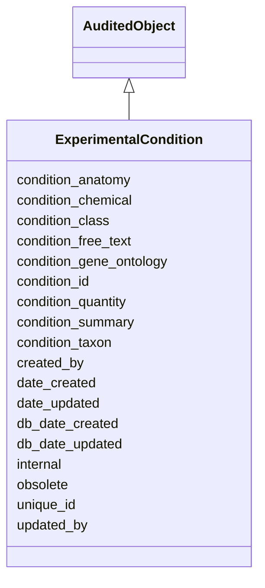

# ExperimentalCondition

The environmental context in which an experiment is carried out. This may (e.g. drug treatment) or may not (e.g. standard conditions) directly influence the outcome of the experiment.





URI: [alliance:ExperimentalCondition](http://alliancegenome.org/ExperimentalCondition)


## Parent Classes

* [AuditedObject](AuditedObject.md)
    * **ExperimentalCondition**


<!-- no inheritance hierarchy -->


## Slots

| Name | Description  |
| ---  | ---  |
| [condition_anatomy](condition_anatomy.md) | Anatomical ontology identifier used in cases like regeneration/wounding. |
| [condition_chemical](condition_chemical.md) | ChEBI or molecular ontology id used in subset of condition terms.  ie: the specific chemcial used in conjunction with 'chemical condition'. |
| [condition_class](condition_class.md) | The ZECO ID that represents the high level condition grouping term.  This will come from a slim in the ZECO, called 'AllianceSlim'. |
| [condition_free_text](condition_free_text.md) | Free-text description of the experimental condition |
| [condition_gene_ontology](condition_gene_ontology.md) | Gene Ontology id used in subset of condition types. |
| [condition_id](condition_id.md) | The specific ontology ID for the condition when that is not covered by any of the other condition ontology ID attributes (chemical, NCBITaxon, anatomical). This could also be another ZECO term if the ZECO term that describes this condition is more specific, or outside the conditionClassId slim. |
| [condition_quantity](condition_quantity.md) | Optional free text field that records the units/amount/degrees of a condition. |
| [condition_summary](condition_summary.md) | Free text describing the environmental/experimental condition. For some groups this is a single term, others is it is a concatenation of the term names from the ontologies included in this data structure. The condition_summary will not be submitted by DQMs but rather generated at the Alliance after ingest (or generated/updated in the curation interface and persistent store). |
| [condition_taxon](condition_taxon.md) | NCBITaxon ontology id used in subset of condition types like 'bacterial infection'. |
| [created_by](created_by.md) | The individual that created the entity. |
| [date_created](date_created.md) | The date on which an entity was created. This can be applied to nodes or edges. |
| [date_updated](date_updated.md) | Date on which an entity was last modified. |
| [db_date_created](db_date_created.md) | The date on which an entity was created in the Alliance database.  This is disinct from date_created, which represents the date when the entity was originally created (i.e. at the MOD for imported data). |
| [db_date_updated](db_date_updated.md) | Date on which an entity was last modified in the Alliance database.  This is disinct from date_updated, which represents the date when the entity was last modified and may predate import into the Alliance database. |
| [internal](internal.md) | Classifies the entity as private (for internal use) or not (for public use). |
| [obsolete](obsolete.md) | Entity is no longer current. |
| [unique_id](unique_id.md) | Unique identifer for the experimental condition.  Will be generated at AGR. |
| [updated_by](updated_by.md) | The individual that last modified the entity. |


## Mappings

| Mapping Type | Mapped Value |
| ---  | ---  |
| self | ['alliance:ExperimentalCondition'] |
| native | ['alliance:ExperimentalCondition'] |


## LinkML Specification

<!-- TODO: investigate https://stackoverflow.com/questions/37606292/how-to-create-tabbed-code-blocks-in-mkdocs-or-sphinx -->

### Direct

<details>
```yaml
name: ExperimentalCondition
description: The environmental context in which an experiment is carried out. This
  may (e.g. drug treatment) or may not (e.g. standard conditions) directly influence
  the outcome of the experiment.
from_schema: https://github.com/alliance-genome/agr_persistent_schema/phenotypeAndDiseaseAnnotation.yaml
is_a: AuditedObject
slots:
- unique_id
- condition_class
- condition_summary
- condition_id
- condition_free_text
- condition_quantity
- condition_anatomy
- condition_gene_ontology
- condition_taxon
- condition_chemical
slot_usage:
  unique_id:
    name: unique_id
    description: Unique identifer for the experimental condition.  Will be generated
      at AGR.
    domain_of:
    - DiseaseAnnotation
    - ExperimentalCondition
    - ConditionRelation
    - Person
    required: false
  condition_class:
    name: condition_class
    description: The ZECO ID that represents the high level condition grouping term.  This
      will come from a slim in the ZECO, called 'AllianceSlim'.
    domain_of:
    - ExperimentalCondition
  condition_summary:
    name: condition_summary
    description: Free text describing the environmental/experimental condition. For
      some groups this is a single term, others is it is a concatenation of the term
      names from the ontologies included in this data structure. The condition_summary
      will not be submitted by DQMs but rather generated at the Alliance after ingest
      (or generated/updated in the curation interface and persistent store).
    domain_of:
    - ExperimentalCondition
    range: string
  condition_id:
    name: condition_id
    description: The specific ontology ID for the condition when that is not covered
      by any of the other condition ontology ID attributes (chemical, NCBITaxon, anatomical).
      This could also be another ZECO term if the ZECO term that describes this condition
      is more specific, or outside the conditionClassId slim.
    domain_of:
    - ExperimentalCondition
  condition_quantity:
    name: condition_quantity
    description: Optional free text field that records the units/amount/degrees of
      a condition.
    domain_of:
    - ExperimentalCondition
    - ExperimentalConditionDTO
    required: false
  condition_anatomy:
    name: condition_anatomy
    description: Anatomical ontology identifier used in cases like regeneration/wounding.
    domain_of:
    - ExperimentalCondition
  condition_gene_ontology:
    name: condition_gene_ontology
    description: Gene Ontology id used in subset of condition types.
    domain_of:
    - ExperimentalCondition
    range: GOTerm
  condition_taxon:
    name: condition_taxon
    description: NCBITaxon ontology id used in subset of condition types like 'bacterial
      infection'.
    domain_of:
    - ExperimentalCondition
  condition_chemical:
    name: condition_chemical
    description: 'ChEBI or molecular ontology id used in subset of condition terms.  ie:
      the specific chemcial used in conjunction with ''chemical condition''.'
    domain_of:
    - ExperimentalCondition
    range: ChemicalTerm

```
</details>

### Induced

<details>
```yaml
name: ExperimentalCondition
description: The environmental context in which an experiment is carried out. This
  may (e.g. drug treatment) or may not (e.g. standard conditions) directly influence
  the outcome of the experiment.
from_schema: https://github.com/alliance-genome/agr_persistent_schema/phenotypeAndDiseaseAnnotation.yaml
is_a: AuditedObject
slot_usage:
  unique_id:
    name: unique_id
    description: Unique identifer for the experimental condition.  Will be generated
      at AGR.
    domain_of:
    - DiseaseAnnotation
    - ExperimentalCondition
    - ConditionRelation
    - Person
    required: false
  condition_class:
    name: condition_class
    description: The ZECO ID that represents the high level condition grouping term.  This
      will come from a slim in the ZECO, called 'AllianceSlim'.
    domain_of:
    - ExperimentalCondition
  condition_summary:
    name: condition_summary
    description: Free text describing the environmental/experimental condition. For
      some groups this is a single term, others is it is a concatenation of the term
      names from the ontologies included in this data structure. The condition_summary
      will not be submitted by DQMs but rather generated at the Alliance after ingest
      (or generated/updated in the curation interface and persistent store).
    domain_of:
    - ExperimentalCondition
    range: string
  condition_id:
    name: condition_id
    description: The specific ontology ID for the condition when that is not covered
      by any of the other condition ontology ID attributes (chemical, NCBITaxon, anatomical).
      This could also be another ZECO term if the ZECO term that describes this condition
      is more specific, or outside the conditionClassId slim.
    domain_of:
    - ExperimentalCondition
  condition_quantity:
    name: condition_quantity
    description: Optional free text field that records the units/amount/degrees of
      a condition.
    domain_of:
    - ExperimentalCondition
    - ExperimentalConditionDTO
    required: false
  condition_anatomy:
    name: condition_anatomy
    description: Anatomical ontology identifier used in cases like regeneration/wounding.
    domain_of:
    - ExperimentalCondition
  condition_gene_ontology:
    name: condition_gene_ontology
    description: Gene Ontology id used in subset of condition types.
    domain_of:
    - ExperimentalCondition
    range: GOTerm
  condition_taxon:
    name: condition_taxon
    description: NCBITaxon ontology id used in subset of condition types like 'bacterial
      infection'.
    domain_of:
    - ExperimentalCondition
  condition_chemical:
    name: condition_chemical
    description: 'ChEBI or molecular ontology id used in subset of condition terms.  ie:
      the specific chemcial used in conjunction with ''chemical condition''.'
    domain_of:
    - ExperimentalCondition
    range: ChemicalTerm
attributes:
  unique_id:
    name: unique_id
    description: Unique identifer for the experimental condition.  Will be generated
      at AGR.
    from_schema: https://github.com/alliance-genome/agr_curation_schema/core.yaml
    multivalued: false
    alias: unique_id
    owner: ExperimentalCondition
    domain_of:
    - DiseaseAnnotation
    - ExperimentalCondition
    - ConditionRelation
    - Person
    range: string
    required: false
  condition_class:
    name: condition_class
    description: The ZECO ID that represents the high level condition grouping term.  This
      will come from a slim in the ZECO, called 'AllianceSlim'.
    from_schema: https://github.com/alliance-genome/agr_persistent_schema/phenotypeAndDiseaseAnnotation.yaml
    domain: ExperimentalCondition
    alias: condition_class
    owner: ExperimentalCondition
    domain_of:
    - ExperimentalCondition
    range: ZECOTerm
    required: true
  condition_summary:
    name: condition_summary
    description: Free text describing the environmental/experimental condition. For
      some groups this is a single term, others is it is a concatenation of the term
      names from the ontologies included in this data structure. The condition_summary
      will not be submitted by DQMs but rather generated at the Alliance after ingest
      (or generated/updated in the curation interface and persistent store).
    from_schema: https://github.com/alliance-genome/agr_persistent_schema/phenotypeAndDiseaseAnnotation.yaml
    domain: ExperimentalCondition
    alias: condition_summary
    owner: ExperimentalCondition
    domain_of:
    - ExperimentalCondition
    range: string
    required: false
  condition_id:
    name: condition_id
    description: The specific ontology ID for the condition when that is not covered
      by any of the other condition ontology ID attributes (chemical, NCBITaxon, anatomical).
      This could also be another ZECO term if the ZECO term that describes this condition
      is more specific, or outside the conditionClassId slim.
    from_schema: https://github.com/alliance-genome/agr_persistent_schema/phenotypeAndDiseaseAnnotation.yaml
    domain: ExperimentalCondition
    alias: condition_id
    owner: ExperimentalCondition
    domain_of:
    - ExperimentalCondition
    range: ExperimentalConditionOntologyTerm
  condition_free_text:
    name: condition_free_text
    description: Free-text description of the experimental condition
    from_schema: https://github.com/alliance-genome/agr_persistent_schema/phenotypeAndDiseaseAnnotation.yaml
    domain: ExperimentalCondition
    alias: condition_free_text
    owner: ExperimentalCondition
    domain_of:
    - ExperimentalCondition
    - ExperimentalConditionDTO
    range: string
    required: false
  condition_quantity:
    name: condition_quantity
    description: Optional free text field that records the units/amount/degrees of
      a condition.
    from_schema: https://github.com/alliance-genome/agr_persistent_schema/phenotypeAndDiseaseAnnotation.yaml
    domain: ExperimentalCondition
    alias: condition_quantity
    owner: ExperimentalCondition
    domain_of:
    - ExperimentalCondition
    - ExperimentalConditionDTO
    range: string
    required: false
  condition_anatomy:
    name: condition_anatomy
    description: Anatomical ontology identifier used in cases like regeneration/wounding.
    from_schema: https://github.com/alliance-genome/agr_persistent_schema/phenotypeAndDiseaseAnnotation.yaml
    domain: ExperimentalCondition
    alias: condition_anatomy
    owner: ExperimentalCondition
    domain_of:
    - ExperimentalCondition
    range: AnatomicalTerm
  condition_gene_ontology:
    name: condition_gene_ontology
    description: Gene Ontology id used in subset of condition types.
    from_schema: https://github.com/alliance-genome/agr_persistent_schema/phenotypeAndDiseaseAnnotation.yaml
    domain: ExperimentalCondition
    alias: condition_gene_ontology
    owner: ExperimentalCondition
    domain_of:
    - ExperimentalCondition
    range: GOTerm
  condition_taxon:
    name: condition_taxon
    description: NCBITaxon ontology id used in subset of condition types like 'bacterial
      infection'.
    from_schema: https://github.com/alliance-genome/agr_persistent_schema/phenotypeAndDiseaseAnnotation.yaml
    domain: ExperimentalCondition
    alias: condition_taxon
    owner: ExperimentalCondition
    domain_of:
    - ExperimentalCondition
    range: NCBITaxonTerm
  condition_chemical:
    name: condition_chemical
    description: 'ChEBI or molecular ontology id used in subset of condition terms.  ie:
      the specific chemcial used in conjunction with ''chemical condition''.'
    from_schema: https://github.com/alliance-genome/agr_persistent_schema/phenotypeAndDiseaseAnnotation.yaml
    domain: ExperimentalCondition
    alias: condition_chemical
    owner: ExperimentalCondition
    domain_of:
    - ExperimentalCondition
    range: ChemicalTerm
  created_by:
    name: created_by
    description: The individual that created the entity.
    from_schema: https://github.com/alliance-genome/agr_curation_schema/core.yaml
    domain: AuditedObject
    multivalued: false
    alias: created_by
    owner: ExperimentalCondition
    domain_of:
    - AuditedObject
    range: Person
  date_created:
    name: date_created
    description: The date on which an entity was created. This can be applied to nodes
      or edges.
    from_schema: https://github.com/alliance-genome/agr_curation_schema/core.yaml
    aliases:
    - creation_date
    exact_mappings:
    - dct:createdOn
    - WIKIDATA_PROPERTY:P577
    alias: date_created
    owner: ExperimentalCondition
    domain_of:
    - AuditedObject
    - AuditedObjectDTO
    range: datetime
  updated_by:
    name: updated_by
    description: The individual that last modified the entity.
    from_schema: https://github.com/alliance-genome/agr_curation_schema/core.yaml
    domain: AuditedObject
    multivalued: false
    alias: updated_by
    owner: ExperimentalCondition
    domain_of:
    - AuditedObject
    range: Person
  date_updated:
    name: date_updated
    description: Date on which an entity was last modified.
    from_schema: https://github.com/alliance-genome/agr_curation_schema/core.yaml
    aliases:
    - date_last_modified
    alias: date_updated
    owner: ExperimentalCondition
    domain_of:
    - AuditedObject
    - AuditedObjectDTO
    range: datetime
  db_date_created:
    name: db_date_created
    description: The date on which an entity was created in the Alliance database.  This
      is disinct from date_created, which represents the date when the entity was
      originally created (i.e. at the MOD for imported data).
    from_schema: https://github.com/alliance-genome/agr_curation_schema/core.yaml
    alias: db_date_created
    owner: ExperimentalCondition
    domain_of:
    - AuditedObject
    - AuditedObjectDTO
    range: datetime
  db_date_updated:
    name: db_date_updated
    description: Date on which an entity was last modified in the Alliance database.  This
      is disinct from date_updated, which represents the date when the entity was
      last modified and may predate import into the Alliance database.
    from_schema: https://github.com/alliance-genome/agr_curation_schema/core.yaml
    alias: db_date_updated
    owner: ExperimentalCondition
    domain_of:
    - AuditedObject
    - AuditedObjectDTO
    range: datetime
  internal:
    name: internal
    description: Classifies the entity as private (for internal use) or not (for public
      use).
    notes:
    - Default value is true.
    from_schema: https://github.com/alliance-genome/agr_curation_schema/core.yaml
    alias: internal
    owner: ExperimentalCondition
    domain_of:
    - AuditedObject
    - AuditedObjectDTO
    range: boolean
    required: true
  obsolete:
    name: obsolete
    description: Entity is no longer current.
    notes:
    - Obsolete entities are preserved in the database for posterity but should not
      be publicly displayed.
    from_schema: https://github.com/alliance-genome/agr_curation_schema/core.yaml
    alias: obsolete
    owner: ExperimentalCondition
    domain_of:
    - AuditedObject
    - AuditedObjectDTO
    range: boolean

```
</details>