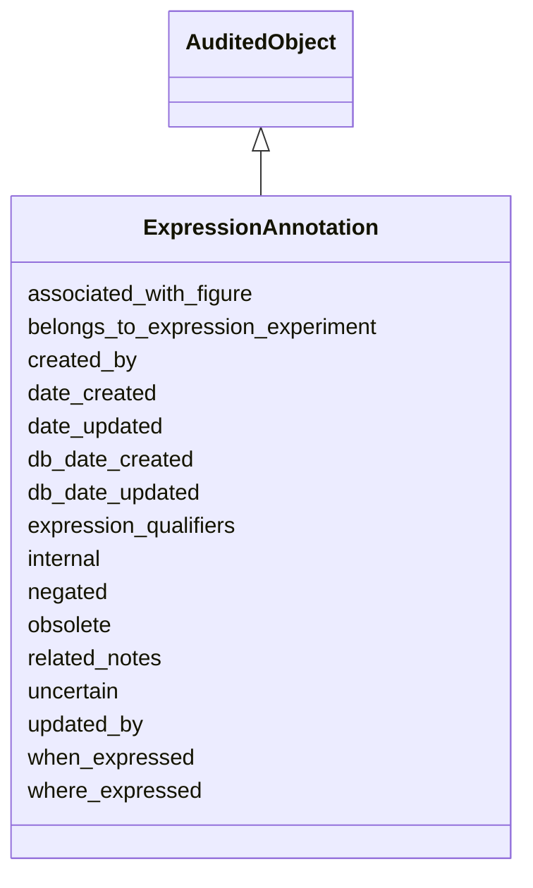

# ExpressionAnnotation

A description of when and where gene products are observed to be present, including experimental details, supporting evidence, and curator notes.





URI: [alliance:ExpressionAnnotation](http://alliancegenome.org/ExpressionAnnotation)


## Parent Classes

* [AuditedObject](AuditedObject.md)
    * **ExpressionAnnotation**


<!-- no inheritance hierarchy -->


## Slots

| Name | Description  |
| ---  | ---  |
| [associated_with_figure](associated_with_figure.md) | The figure(s) that support(s) the expression annotation. |
| [belongs_to_expression_experiment](belongs_to_expression_experiment.md) | Holds between an ExpressionAnnotation and an ExpressionExperiment. |
| [created_by](created_by.md) | The individual that created the entity. |
| [date_created](date_created.md) | The date on which an entity was created. This can be applied to nodes or edges. |
| [date_updated](date_updated.md) | Date on which an entity was last modified. |
| [db_date_created](db_date_created.md) | The date on which an entity was created in the Alliance database.  This is disinct from date_created, which represents the date when the entity was originally created (i.e. at the MOD for imported data). |
| [db_date_updated](db_date_updated.md) | Date on which an entity was last modified in the Alliance database.  This is disinct from date_updated, which represents the date when the entity was last modified and may predate import into the Alliance database. |
| [expression_qualifiers](expression_qualifiers.md) | Qualifiers that describe additional characteristics of gene expression. For example: aint, intense, restricted. |
| [internal](internal.md) | Classifies the entity as private (for internal use) or not (for public use). |
| [negated](negated.md) | if set to true, then the association is negated i.e. is not true |
| [obsolete](obsolete.md) | Entity is no longer current. |
| [related_notes](related_notes.md) | Holds between an object and a list of related Note objects. |
| [uncertain](uncertain.md) | If set to true, then the related entity is uncertain. |
| [updated_by](updated_by.md) | The individual that last modified the entity. |
| [when_expressed](when_expressed.md) | When a gene product is observed to be present. |
| [where_expressed](where_expressed.md) | Where a gene product is observed to be present. |


## Mappings

| Mapping Type | Mapped Value |
| ---  | ---  |
| self | ['alliance:ExpressionAnnotation'] |
| native | ['alliance:ExpressionAnnotation'] |


## LinkML Specification

<!-- TODO: investigate https://stackoverflow.com/questions/37606292/how-to-create-tabbed-code-blocks-in-mkdocs-or-sphinx -->

### Direct

<details>
```yaml
name: ExpressionAnnotation
description: A description of when and where gene products are observed to be present,
  including experimental details, supporting evidence, and curator notes.
notes:
- Curators can provide several levels of evidence for an annotation, in an attempt
  to offer support the annotation schema at various MODs. A curator can provide a
  Figure within that reference (ZFIN). Also, a curator can provide an ImagePane within
  some Figure (MGI). It's unclear which of these approaches will be chosen for future
  Alliance expression curation.
from_schema: https://github.com/alliance-genome/agr_persistent_schema/src/schema/expression.yaml
is_a: AuditedObject
slots:
- belongs_to_expression_experiment
- when_expressed
- where_expressed
- expression_qualifiers
- negated
- uncertain
- associated_with_figure
- related_notes
slot_usage:
  associated_with_figure:
    name: associated_with_figure
    description: The figure(s) that support(s) the expression annotation.
    notes:
    - This can seem redundant with ExpressionAnnotationImagePane. But, sometimes we
      know the figure but don't have the image. Optional, as existing annotations
      from some MODs have no related images or figures.
    multivalued: true
    domain_of:
    - Image
    - ExpressionAnnotation
    required: false

```
</details>

### Induced

<details>
```yaml
name: ExpressionAnnotation
description: A description of when and where gene products are observed to be present,
  including experimental details, supporting evidence, and curator notes.
notes:
- Curators can provide several levels of evidence for an annotation, in an attempt
  to offer support the annotation schema at various MODs. A curator can provide a
  Figure within that reference (ZFIN). Also, a curator can provide an ImagePane within
  some Figure (MGI). It's unclear which of these approaches will be chosen for future
  Alliance expression curation.
from_schema: https://github.com/alliance-genome/agr_persistent_schema/src/schema/expression.yaml
is_a: AuditedObject
slot_usage:
  associated_with_figure:
    name: associated_with_figure
    description: The figure(s) that support(s) the expression annotation.
    notes:
    - This can seem redundant with ExpressionAnnotationImagePane. But, sometimes we
      know the figure but don't have the image. Optional, as existing annotations
      from some MODs have no related images or figures.
    multivalued: true
    domain_of:
    - Image
    - ExpressionAnnotation
    required: false
attributes:
  belongs_to_expression_experiment:
    name: belongs_to_expression_experiment
    description: Holds between an ExpressionAnnotation and an ExpressionExperiment.
    from_schema: https://github.com/alliance-genome/agr_persistent_schema/src/schema/expression.yaml
    domain: ExpressionAnnotation
    multivalued: false
    alias: belongs_to_expression_experiment
    owner: ExpressionAnnotation
    domain_of:
    - ExpressionAnnotation
    range: ExpressionExperiment
    required: true
  when_expressed:
    name: when_expressed
    description: When a gene product is observed to be present.
    from_schema: https://github.com/alliance-genome/agr_persistent_schema/src/schema/expression.yaml
    domain: ExpressionAnnotation
    multivalued: false
    alias: when_expressed
    owner: ExpressionAnnotation
    domain_of:
    - ExpressionAnnotation
    range: TemporalContext
  where_expressed:
    name: where_expressed
    description: Where a gene product is observed to be present.
    notes:
    - Placeholder internal notes.
    from_schema: https://github.com/alliance-genome/agr_persistent_schema/src/schema/expression.yaml
    domain: ExpressionAnnotation
    multivalued: false
    alias: where_expressed
    owner: ExpressionAnnotation
    domain_of:
    - ExpressionAnnotation
    range: AnatomicalSite
  expression_qualifiers:
    name: expression_qualifiers
    description: 'Qualifiers that describe additional characteristics of gene expression.
      For example: aint, intense, restricted.'
    from_schema: https://github.com/alliance-genome/agr_persistent_schema/src/schema/expression.yaml
    domain: ExpressionAnnotation
    alias: expression_qualifiers
    owner: ExpressionAnnotation
    domain_of:
    - ExpressionAnnotation
    range: expression_qualifier_set
  negated:
    name: negated
    description: if set to true, then the association is negated i.e. is not true
    from_schema: https://github.com/alliance-genome/agr_curation_schema/core.yaml
    alias: negated
    owner: ExpressionAnnotation
    domain_of:
    - DiseaseAnnotation
    - DiseaseAnnotationDTO
    - ExpressionAnnotation
    range: boolean
  uncertain:
    name: uncertain
    description: If set to true, then the related entity is uncertain.
    from_schema: https://github.com/alliance-genome/agr_curation_schema/core.yaml
    alias: uncertain
    owner: ExpressionAnnotation
    domain_of:
    - ExpressionAnnotation
    range: boolean
  associated_with_figure:
    name: associated_with_figure
    description: The figure(s) that support(s) the expression annotation.
    notes:
    - This can seem redundant with ExpressionAnnotationImagePane. But, sometimes we
      know the figure but don't have the image. Optional, as existing annotations
      from some MODs have no related images or figures.
    from_schema: https://github.com/alliance-genome/agr_persistent_schema/src/schema/image.yaml
    multivalued: true
    alias: associated_with_figure
    owner: ExpressionAnnotation
    domain_of:
    - Image
    - ExpressionAnnotation
    range: Figure
    required: false
  related_notes:
    name: related_notes
    description: Holds between an object and a list of related Note objects.
    notes:
    - The original name suggested for this slot was simply notes, but I think that
      label is reserved in LinkML for internal descriptions of objects, hence the
      related_notes label used here.
    from_schema: https://github.com/alliance-genome/agr_curation_schema/core.yaml
    multivalued: true
    alias: related_notes
    owner: ExpressionAnnotation
    domain_of:
    - Variant
    - DiseaseAnnotation
    - Gene
    - Antibody
    - ExpressionExperiment
    - ExpressionAnnotation
    range: Note
  created_by:
    name: created_by
    description: The individual that created the entity.
    from_schema: https://github.com/alliance-genome/agr_curation_schema/core.yaml
    domain: AuditedObject
    multivalued: false
    alias: created_by
    owner: ExpressionAnnotation
    domain_of:
    - AuditedObject
    range: Person
  date_created:
    name: date_created
    description: The date on which an entity was created. This can be applied to nodes
      or edges.
    from_schema: https://github.com/alliance-genome/agr_curation_schema/core.yaml
    aliases:
    - creation_date
    exact_mappings:
    - dct:createdOn
    - WIKIDATA_PROPERTY:P577
    alias: date_created
    owner: ExpressionAnnotation
    domain_of:
    - AuditedObject
    - AuditedObjectDTO
    range: datetime
  updated_by:
    name: updated_by
    description: The individual that last modified the entity.
    from_schema: https://github.com/alliance-genome/agr_curation_schema/core.yaml
    domain: AuditedObject
    multivalued: false
    alias: updated_by
    owner: ExpressionAnnotation
    domain_of:
    - AuditedObject
    range: Person
  date_updated:
    name: date_updated
    description: Date on which an entity was last modified.
    from_schema: https://github.com/alliance-genome/agr_curation_schema/core.yaml
    aliases:
    - date_last_modified
    alias: date_updated
    owner: ExpressionAnnotation
    domain_of:
    - AuditedObject
    - AuditedObjectDTO
    range: datetime
  db_date_created:
    name: db_date_created
    description: The date on which an entity was created in the Alliance database.  This
      is disinct from date_created, which represents the date when the entity was
      originally created (i.e. at the MOD for imported data).
    from_schema: https://github.com/alliance-genome/agr_curation_schema/core.yaml
    alias: db_date_created
    owner: ExpressionAnnotation
    domain_of:
    - AuditedObject
    - AuditedObjectDTO
    range: datetime
  db_date_updated:
    name: db_date_updated
    description: Date on which an entity was last modified in the Alliance database.  This
      is disinct from date_updated, which represents the date when the entity was
      last modified and may predate import into the Alliance database.
    from_schema: https://github.com/alliance-genome/agr_curation_schema/core.yaml
    alias: db_date_updated
    owner: ExpressionAnnotation
    domain_of:
    - AuditedObject
    - AuditedObjectDTO
    range: datetime
  internal:
    name: internal
    description: Classifies the entity as private (for internal use) or not (for public
      use).
    notes:
    - Default value is true.
    from_schema: https://github.com/alliance-genome/agr_curation_schema/core.yaml
    alias: internal
    owner: ExpressionAnnotation
    domain_of:
    - AuditedObject
    - AuditedObjectDTO
    range: boolean
    required: true
  obsolete:
    name: obsolete
    description: Entity is no longer current.
    notes:
    - Obsolete entities are preserved in the database for posterity but should not
      be publicly displayed.
    from_schema: https://github.com/alliance-genome/agr_curation_schema/core.yaml
    alias: obsolete
    owner: ExpressionAnnotation
    domain_of:
    - AuditedObject
    - AuditedObjectDTO
    range: boolean

```
</details>