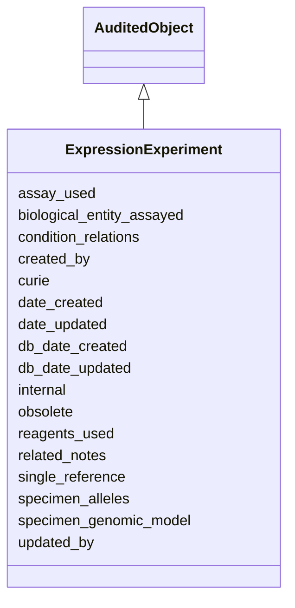

# ExpressionExperiment

Defined by the gene of interest, the specimen, the assay, the reagents (Antibody, Probe), and the reference. It groups ExpressionAnnotations.





URI: [alliance:ExpressionExperiment](http://alliancegenome.org/ExpressionExperiment)


## Parent Classes

* [AuditedObject](AuditedObject.md)
    * **ExpressionExperiment**


<!-- no inheritance hierarchy -->


## Slots

| Name | Description  |
| ---  | ---  |
| [assay_used](assay_used.md) | The assay used to experimentally determine gene expression. |
| [biological_entity_assayed](biological_entity_assayed.md) | Holds between a BiologicalEntity and an ExpressionExperiment that reports on its expression. |
| [condition_relations](condition_relations.md) | None |
| [created_by](created_by.md) | The individual that created the entity. |
| [curie](curie.md) | A unique identifier for a thing. Must be either a CURIE shorthand for a URI or a complete URI |
| [date_created](date_created.md) | The date on which an entity was created. This can be applied to nodes or edges. |
| [date_updated](date_updated.md) | Date on which an entity was last modified. |
| [db_date_created](db_date_created.md) | The date on which an entity was created in the Alliance database.  This is disinct from date_created, which represents the date when the entity was originally created (i.e. at the MOD for imported data). |
| [db_date_updated](db_date_updated.md) | Date on which an entity was last modified in the Alliance database.  This is disinct from date_updated, which represents the date when the entity was last modified and may predate import into the Alliance database. |
| [internal](internal.md) | Classifies the entity as private (for internal use) or not (for public use). |
| [obsolete](obsolete.md) | Entity is no longer current. |
| [reagents_used](reagents_used.md) | Reagents used in the expression assay: e.g., antibodies, probes. |
| [related_notes](related_notes.md) | Holds between an object and a list of related Note objects. |
| [single_reference](single_reference.md) | holds between an object and a single reference |
| [specimen_alleles](specimen_alleles.md) | The Allele(s) of the specimen assayed. |
| [specimen_genomic_model](specimen_genomic_model.md) | The AffectedGenomicModel of the specimen assayed. |
| [updated_by](updated_by.md) | The individual that last modified the entity. |


## Mappings

| Mapping Type | Mapped Value |
| ---  | ---  |
| self | ['alliance:ExpressionExperiment'] |
| native | ['alliance:ExpressionExperiment'] |


## LinkML Specification

<!-- TODO: investigate https://stackoverflow.com/questions/37606292/how-to-create-tabbed-code-blocks-in-mkdocs-or-sphinx -->

### Direct

<details>
```yaml
name: ExpressionExperiment
description: Defined by the gene of interest, the specimen, the assay, the reagents
  (Antibody, Probe), and the reference. It groups ExpressionAnnotations.
notes:
- Specimens are defined by their AGM and/or alleles (or gel lane at MGI).
from_schema: https://github.com/alliance-genome/agr_persistent_schema/src/schema/expression.yaml
is_a: AuditedObject
slots:
- curie
- single_reference
- biological_entity_assayed
- assay_used
- reagents_used
- specimen_genomic_model
- specimen_alleles
- condition_relations
- related_notes
slot_usage:
  curie:
    name: curie
    domain_of:
    - OntologyTerm
    - PhenotypeAnnotation
    - DiseaseAnnotation
    - BiologicalEntity
    - BiologicalEntityDTO
    - Chromosome
    - Assembly
    - Identifier
    - Figure
    - Image
    - Laboratory
    - InformationContentEntity
    - Reference
    - Resource
    - ModCorpusAssociation
    - GeneInteraction
    - ExpressionExperiment
    - GeneNomenclatureSet
    required: true
rules:
- postconditions:
    description: At least one of biological_entity_assayed or reagents_used should
      be populated.
    any_of:
    - slot_conditions:
        biological_entity_assayed:
          name: biological_entity_assayed
          required: true
    - slot_conditions:
        reagents_used:
          name: reagents_used
          required: true

```
</details>

### Induced

<details>
```yaml
name: ExpressionExperiment
description: Defined by the gene of interest, the specimen, the assay, the reagents
  (Antibody, Probe), and the reference. It groups ExpressionAnnotations.
notes:
- Specimens are defined by their AGM and/or alleles (or gel lane at MGI).
from_schema: https://github.com/alliance-genome/agr_persistent_schema/src/schema/expression.yaml
is_a: AuditedObject
slot_usage:
  curie:
    name: curie
    domain_of:
    - OntologyTerm
    - PhenotypeAnnotation
    - DiseaseAnnotation
    - BiologicalEntity
    - BiologicalEntityDTO
    - Chromosome
    - Assembly
    - Identifier
    - Figure
    - Image
    - Laboratory
    - InformationContentEntity
    - Reference
    - Resource
    - ModCorpusAssociation
    - GeneInteraction
    - ExpressionExperiment
    - GeneNomenclatureSet
    required: true
attributes:
  curie:
    name: curie
    description: A unique identifier for a thing. Must be either a CURIE shorthand
      for a URI or a complete URI
    from_schema: https://github.com/alliance-genome/agr_curation_schema/core.yaml
    multivalued: false
    identifier: true
    alias: curie
    owner: ExpressionExperiment
    domain_of:
    - OntologyTerm
    - PhenotypeAnnotation
    - DiseaseAnnotation
    - BiologicalEntity
    - BiologicalEntityDTO
    - Chromosome
    - Assembly
    - Identifier
    - Figure
    - Image
    - Laboratory
    - InformationContentEntity
    - Reference
    - Resource
    - ModCorpusAssociation
    - GeneInteraction
    - ExpressionExperiment
    - GeneNomenclatureSet
    range: uriorcurie
    required: true
  single_reference:
    name: single_reference
    description: holds between an object and a single reference
    from_schema: https://github.com/alliance-genome/agr_curation_schema/core.yaml
    multivalued: false
    alias: single_reference
    owner: ExpressionExperiment
    domain_of:
    - SourceVariantLocation
    - VariantLocation
    - PhenotypeAnnotation
    - DiseaseAnnotation
    - ConditionRelation
    - Figure
    - GeneToGeneOrthologyCurated
    - ExpressionExperiment
    - FunctionalGeneSet
    range: Reference
  biological_entity_assayed:
    name: biological_entity_assayed
    description: Holds between a BiologicalEntity and an ExpressionExperiment that
      reports on its expression.
    notes:
    - 'The BiologicalEntity will usually be a Gene, but there are exceptions to this
      norm at most MODs. FB: some expression for genomic insertions that reflect nearby
      regulatory region activity for unknown gene(s). MGI: some expression data for
      "other feature type" WB: some expression for sequence features (WBsf). ZFIN:
      some expression using antibodies with unknown target. Antibody is a BiologicalEntity'
    from_schema: https://github.com/alliance-genome/agr_persistent_schema/src/schema/expression.yaml
    domain: ExpressionExperiment
    multivalued: false
    alias: biological_entity_assayed
    owner: ExpressionExperiment
    domain_of:
    - ExpressionExperiment
    range: BiologicalEntity
  assay_used:
    name: assay_used
    description: The assay used to experimentally determine gene expression.
    from_schema: https://github.com/alliance-genome/agr_persistent_schema/src/schema/expression.yaml
    domain: ExpressionExperiment
    alias: assay_used
    owner: ExpressionExperiment
    domain_of:
    - ExpressionExperiment
    range: MMOTerm
  reagents_used:
    name: reagents_used
    description: 'Reagents used in the expression assay: e.g., antibodies, probes.'
    notes:
    - I'm assuming that specifying Reagent below will allow for objects that have
      the Reagent mixin.
    from_schema: https://github.com/alliance-genome/agr_persistent_schema/src/schema/expression.yaml
    domain: ExpressionExperiment
    multivalued: true
    alias: reagents_used
    owner: ExpressionExperiment
    domain_of:
    - ExpressionExperiment
    range: Reagent
  specimen_genomic_model:
    name: specimen_genomic_model
    description: The AffectedGenomicModel of the specimen assayed.
    from_schema: https://github.com/alliance-genome/agr_persistent_schema/src/schema/expression.yaml
    domain: ExpressionExperiment
    multivalued: false
    alias: specimen_genomic_model
    owner: ExpressionExperiment
    domain_of:
    - ExpressionExperiment
    range: AffectedGenomicModel
  specimen_alleles:
    name: specimen_alleles
    description: The Allele(s) of the specimen assayed.
    from_schema: https://github.com/alliance-genome/agr_persistent_schema/src/schema/expression.yaml
    domain: ExpressionExperiment
    multivalued: true
    alias: specimen_alleles
    owner: ExpressionExperiment
    domain_of:
    - ExpressionExperiment
    range: Allele
  condition_relations:
    name: condition_relations
    from_schema: https://github.com/alliance-genome/agr_persistent_schema/phenotypeAndDiseaseAnnotation.yaml
    multivalued: true
    alias: condition_relations
    owner: ExpressionExperiment
    domain_of:
    - PhenotypeAnnotation
    - DiseaseAnnotation
    - ExpressionExperiment
    range: ConditionRelation
  related_notes:
    name: related_notes
    description: Holds between an object and a list of related Note objects.
    notes:
    - The original name suggested for this slot was simply notes, but I think that
      label is reserved in LinkML for internal descriptions of objects, hence the
      related_notes label used here.
    from_schema: https://github.com/alliance-genome/agr_curation_schema/core.yaml
    multivalued: true
    alias: related_notes
    owner: ExpressionExperiment
    domain_of:
    - Variant
    - DiseaseAnnotation
    - Gene
    - Antibody
    - ExpressionExperiment
    - ExpressionAnnotation
    range: Note
  created_by:
    name: created_by
    description: The individual that created the entity.
    from_schema: https://github.com/alliance-genome/agr_curation_schema/core.yaml
    domain: AuditedObject
    multivalued: false
    alias: created_by
    owner: ExpressionExperiment
    domain_of:
    - AuditedObject
    range: Person
  date_created:
    name: date_created
    description: The date on which an entity was created. This can be applied to nodes
      or edges.
    from_schema: https://github.com/alliance-genome/agr_curation_schema/core.yaml
    aliases:
    - creation_date
    exact_mappings:
    - dct:createdOn
    - WIKIDATA_PROPERTY:P577
    alias: date_created
    owner: ExpressionExperiment
    domain_of:
    - AuditedObject
    - AuditedObjectDTO
    range: datetime
  updated_by:
    name: updated_by
    description: The individual that last modified the entity.
    from_schema: https://github.com/alliance-genome/agr_curation_schema/core.yaml
    domain: AuditedObject
    multivalued: false
    alias: updated_by
    owner: ExpressionExperiment
    domain_of:
    - AuditedObject
    range: Person
  date_updated:
    name: date_updated
    description: Date on which an entity was last modified.
    from_schema: https://github.com/alliance-genome/agr_curation_schema/core.yaml
    aliases:
    - date_last_modified
    alias: date_updated
    owner: ExpressionExperiment
    domain_of:
    - AuditedObject
    - AuditedObjectDTO
    range: datetime
  db_date_created:
    name: db_date_created
    description: The date on which an entity was created in the Alliance database.  This
      is disinct from date_created, which represents the date when the entity was
      originally created (i.e. at the MOD for imported data).
    from_schema: https://github.com/alliance-genome/agr_curation_schema/core.yaml
    alias: db_date_created
    owner: ExpressionExperiment
    domain_of:
    - AuditedObject
    - AuditedObjectDTO
    range: datetime
  db_date_updated:
    name: db_date_updated
    description: Date on which an entity was last modified in the Alliance database.  This
      is disinct from date_updated, which represents the date when the entity was
      last modified and may predate import into the Alliance database.
    from_schema: https://github.com/alliance-genome/agr_curation_schema/core.yaml
    alias: db_date_updated
    owner: ExpressionExperiment
    domain_of:
    - AuditedObject
    - AuditedObjectDTO
    range: datetime
  internal:
    name: internal
    description: Classifies the entity as private (for internal use) or not (for public
      use).
    notes:
    - Default value is true.
    from_schema: https://github.com/alliance-genome/agr_curation_schema/core.yaml
    alias: internal
    owner: ExpressionExperiment
    domain_of:
    - AuditedObject
    - AuditedObjectDTO
    range: boolean
    required: true
  obsolete:
    name: obsolete
    description: Entity is no longer current.
    notes:
    - Obsolete entities are preserved in the database for posterity but should not
      be publicly displayed.
    from_schema: https://github.com/alliance-genome/agr_curation_schema/core.yaml
    alias: obsolete
    owner: ExpressionExperiment
    domain_of:
    - AuditedObject
    - AuditedObjectDTO
    range: boolean
rules:
- postconditions:
    description: At least one of biological_entity_assayed or reagents_used should
      be populated.
    any_of:
    - slot_conditions:
        biological_entity_assayed:
          name: biological_entity_assayed
          required: true
    - slot_conditions:
        reagents_used:
          name: reagents_used
          required: true

```
</details>