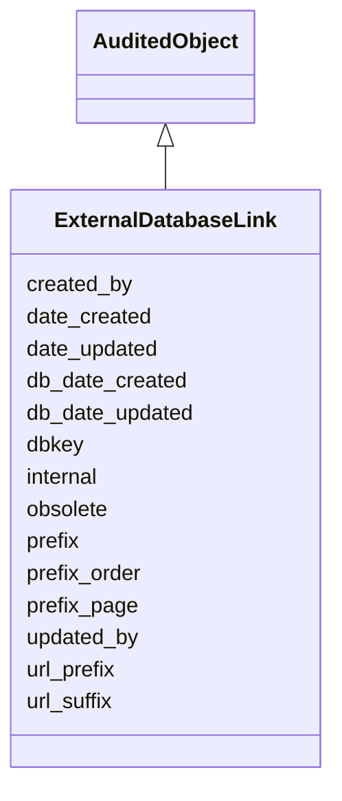

# ExternalDatabaseLink

Base relation that holds the identifier prefix, base url and url suffix to help in generating URLs in crossReferences.





URI: [alliance:ExternalDatabaseLink](http://alliancegenome.org/ExternalDatabaseLink)


## Parent Classes

* [AuditedObject](AuditedObject.md)
    * **ExternalDatabaseLink**


<!-- no inheritance hierarchy -->


## Slots

| Name | Description  |
| ---  | ---  |
| [created_by](created_by.md) | The individual that created the entity. |
| [date_created](date_created.md) | The date on which an entity was created. This can be applied to nodes or edges. |
| [date_updated](date_updated.md) | Date on which an entity was last modified. |
| [db_date_created](db_date_created.md) | The date on which an entity was created in the Alliance database.  This is disinct from date_created, which represents the date when the entity was originally created (i.e. at the MOD for imported data). |
| [db_date_updated](db_date_updated.md) | Date on which an entity was last modified in the Alliance database.  This is disinct from date_updated, which represents the date when the entity was last modified and may predate import into the Alliance database. |
| [dbkey](dbkey.md) | Typically the primary key on the table.  Should be a global sequence in the database to insure uniqueness over the entire suite of tables.  Alternatively, could be a serial8 identifier. Tables with a dbkey should have an alternate key to establish uniqueness based on the data in the table. |
| [internal](internal.md) | Classifies the entity as private (for internal use) or not (for public use). |
| [obsolete](obsolete.md) | Entity is no longer current. |
| [prefix](prefix.md) | Denormalization to help with classifying types of crossReferences, distinguishing DOIs from PMC ids, etc. |
| [prefix_order](prefix_order.md) | The relative order of the resource when listed with other crossReferences. |
| [prefix_page](prefix_page.md) | The cateogry of pages the resource in the context of the URL associated with the crossReference provides.  Equivalent to the 'page' attribute in the Alliance resourceDescriptor file. |
| [updated_by](updated_by.md) | The individual that last modified the entity. |
| [url_prefix](url_prefix.md) | The prefix of the url before the accession number. |
| [url_suffix](url_suffix.md) | The suffix of the url after the accession number. |


## Mappings

| Mapping Type | Mapped Value |
| ---  | ---  |
| self | ['alliance:ExternalDatabaseLink'] |
| native | ['alliance:ExternalDatabaseLink'] |


## LinkML Specification

<!-- TODO: investigate https://stackoverflow.com/questions/37606292/how-to-create-tabbed-code-blocks-in-mkdocs-or-sphinx -->

### Direct

<details>
```yaml
name: ExternalDatabaseLink
description: Base relation that holds the identifier prefix, base url and url suffix
  to help in generating URLs in crossReferences.
from_schema: https://github.com/alliance-genome/agr_curation_schema/core.yaml
is_a: AuditedObject
slots:
- dbkey
- prefix
- url_prefix
- url_suffix
- prefix_page
- prefix_order

```
</details>

### Induced

<details>
```yaml
name: ExternalDatabaseLink
description: Base relation that holds the identifier prefix, base url and url suffix
  to help in generating URLs in crossReferences.
from_schema: https://github.com/alliance-genome/agr_curation_schema/core.yaml
is_a: AuditedObject
attributes:
  dbkey:
    name: dbkey
    description: Typically the primary key on the table.  Should be a global sequence
      in the database to insure uniqueness over the entire suite of tables.  Alternatively,
      could be a serial8 identifier. Tables with a dbkey should have an alternate
      key to establish uniqueness based on the data in the table.
    from_schema: https://github.com/alliance-genome/agr_curation_schema/core.yaml
    alias: dbkey
    owner: ExternalDatabaseLink
    domain_of:
    - OntologyTerm
    - ExternalDatabaseLink
    range: string
  prefix:
    name: prefix
    description: Denormalization to help with classifying types of crossReferences,
      distinguishing DOIs from PMC ids, etc.
    from_schema: https://github.com/alliance-genome/agr_curation_schema/core.yaml
    multivalued: false
    alias: prefix
    owner: ExternalDatabaseLink
    domain_of:
    - CrossReferenceDTO
    - ExternalDatabaseLink
    - ResourceDescriptor
    range: string
    required: true
  url_prefix:
    name: url_prefix
    description: The prefix of the url before the accession number.
    from_schema: https://github.com/alliance-genome/agr_curation_schema/core.yaml
    alias: url_prefix
    owner: ExternalDatabaseLink
    domain_of:
    - ExternalDatabaseLink
    range: string
  url_suffix:
    name: url_suffix
    description: The suffix of the url after the accession number.
    from_schema: https://github.com/alliance-genome/agr_curation_schema/core.yaml
    alias: url_suffix
    owner: ExternalDatabaseLink
    domain_of:
    - ExternalDatabaseLink
    range: string
  prefix_page:
    name: prefix_page
    description: The cateogry of pages the resource in the context of the URL associated
      with the crossReference provides.  Equivalent to the 'page' attribute in the
      Alliance resourceDescriptor file.
    from_schema: https://github.com/alliance-genome/agr_curation_schema/core.yaml
    alias: prefix_page
    owner: ExternalDatabaseLink
    domain_of:
    - ExternalDatabaseLink
    range: string
  prefix_order:
    name: prefix_order
    description: The relative order of the resource when listed with other crossReferences.
    from_schema: https://github.com/alliance-genome/agr_curation_schema/core.yaml
    alias: prefix_order
    owner: ExternalDatabaseLink
    domain_of:
    - ExternalDatabaseLink
    range: string
  created_by:
    name: created_by
    description: The individual that created the entity.
    from_schema: https://github.com/alliance-genome/agr_curation_schema/core.yaml
    domain: AuditedObject
    multivalued: false
    alias: created_by
    owner: ExternalDatabaseLink
    domain_of:
    - AuditedObject
    range: Person
  date_created:
    name: date_created
    description: The date on which an entity was created. This can be applied to nodes
      or edges.
    from_schema: https://github.com/alliance-genome/agr_curation_schema/core.yaml
    aliases:
    - creation_date
    exact_mappings:
    - dct:createdOn
    - WIKIDATA_PROPERTY:P577
    alias: date_created
    owner: ExternalDatabaseLink
    domain_of:
    - AuditedObject
    - AuditedObjectDTO
    range: datetime
  updated_by:
    name: updated_by
    description: The individual that last modified the entity.
    from_schema: https://github.com/alliance-genome/agr_curation_schema/core.yaml
    domain: AuditedObject
    multivalued: false
    alias: updated_by
    owner: ExternalDatabaseLink
    domain_of:
    - AuditedObject
    range: Person
  date_updated:
    name: date_updated
    description: Date on which an entity was last modified.
    from_schema: https://github.com/alliance-genome/agr_curation_schema/core.yaml
    aliases:
    - date_last_modified
    alias: date_updated
    owner: ExternalDatabaseLink
    domain_of:
    - AuditedObject
    - AuditedObjectDTO
    range: datetime
  db_date_created:
    name: db_date_created
    description: The date on which an entity was created in the Alliance database.  This
      is disinct from date_created, which represents the date when the entity was
      originally created (i.e. at the MOD for imported data).
    from_schema: https://github.com/alliance-genome/agr_curation_schema/core.yaml
    alias: db_date_created
    owner: ExternalDatabaseLink
    domain_of:
    - AuditedObject
    - AuditedObjectDTO
    range: datetime
  db_date_updated:
    name: db_date_updated
    description: Date on which an entity was last modified in the Alliance database.  This
      is disinct from date_updated, which represents the date when the entity was
      last modified and may predate import into the Alliance database.
    from_schema: https://github.com/alliance-genome/agr_curation_schema/core.yaml
    alias: db_date_updated
    owner: ExternalDatabaseLink
    domain_of:
    - AuditedObject
    - AuditedObjectDTO
    range: datetime
  internal:
    name: internal
    description: Classifies the entity as private (for internal use) or not (for public
      use).
    notes:
    - Default value is true.
    from_schema: https://github.com/alliance-genome/agr_curation_schema/core.yaml
    alias: internal
    owner: ExternalDatabaseLink
    domain_of:
    - AuditedObject
    - AuditedObjectDTO
    range: boolean
    required: true
  obsolete:
    name: obsolete
    description: Entity is no longer current.
    notes:
    - Obsolete entities are preserved in the database for posterity but should not
      be publicly displayed.
    from_schema: https://github.com/alliance-genome/agr_curation_schema/core.yaml
    alias: obsolete
    owner: ExternalDatabaseLink
    domain_of:
    - AuditedObject
    - AuditedObjectDTO
    range: boolean

```
</details>