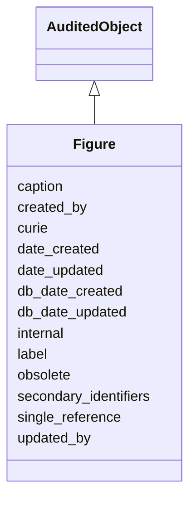

# Figure

An entity representing a figure or table in a publication.





URI: [alliance:Figure](http://alliancegenome.org/Figure)


## Parent Classes

* [AuditedObject](AuditedObject.md)
    * **Figure**


<!-- no inheritance hierarchy -->


## Slots

| Name | Description  |
| ---  | ---  |
| [caption](caption.md) | Text describing the contents of a figure or table in a publication. |
| [created_by](created_by.md) | The individual that created the entity. |
| [curie](curie.md) | A unique identifier for a thing. Must be either a CURIE shorthand for a URI or a complete URI |
| [date_created](date_created.md) | The date on which an entity was created. This can be applied to nodes or edges. |
| [date_updated](date_updated.md) | Date on which an entity was last modified. |
| [db_date_created](db_date_created.md) | The date on which an entity was created in the Alliance database.  This is disinct from date_created, which represents the date when the entity was originally created (i.e. at the MOD for imported data). |
| [db_date_updated](db_date_updated.md) | Date on which an entity was last modified in the Alliance database.  This is disinct from date_updated, which represents the date when the entity was last modified and may predate import into the Alliance database. |
| [internal](internal.md) | Classifies the entity as private (for internal use) or not (for public use). |
| [label](label.md) | A short display name for the figure. For example: Figure 2, Figure 3B |
| [obsolete](obsolete.md) | Entity is no longer current. |
| [secondary_identifiers](secondary_identifiers.md) | None |
| [single_reference](single_reference.md) | holds between an object and a single reference |
| [updated_by](updated_by.md) | The individual that last modified the entity. |


## Mappings

| Mapping Type | Mapped Value |
| ---  | ---  |
| self | ['alliance:Figure'] |
| native | ['alliance:Figure'] |


## LinkML Specification

<!-- TODO: investigate https://stackoverflow.com/questions/37606292/how-to-create-tabbed-code-blocks-in-mkdocs-or-sphinx -->

### Direct

<details>
```yaml
name: Figure
description: An entity representing a figure or table in a publication.
notes:
- Ideally, a Figure entity represents an entire figure (or table). However, in some
  cases, a Figure entity may represent only a part of some figure. For example, when
  importing an old cropped image of Figure 2B, it may be simpler to simply create
  a Figure entity representing that 2B part. A Figure will usually have one related
  Image, but it can sometimes have many.
from_schema: https://github.com/alliance-genome/agr_persistent_schema/src/schema/image.yaml
is_a: AuditedObject
slots:
- curie
- single_reference
- label
- caption
- secondary_identifiers
slot_usage:
  single_reference:
    name: single_reference
    domain_of:
    - SourceVariantLocation
    - VariantLocation
    - PhenotypeAnnotation
    - DiseaseAnnotation
    - ConditionRelation
    - Figure
    - GeneToGeneOrthologyCurated
    - ExpressionExperiment
    - FunctionalGeneSet
    required: true

```
</details>

### Induced

<details>
```yaml
name: Figure
description: An entity representing a figure or table in a publication.
notes:
- Ideally, a Figure entity represents an entire figure (or table). However, in some
  cases, a Figure entity may represent only a part of some figure. For example, when
  importing an old cropped image of Figure 2B, it may be simpler to simply create
  a Figure entity representing that 2B part. A Figure will usually have one related
  Image, but it can sometimes have many.
from_schema: https://github.com/alliance-genome/agr_persistent_schema/src/schema/image.yaml
is_a: AuditedObject
slot_usage:
  single_reference:
    name: single_reference
    domain_of:
    - SourceVariantLocation
    - VariantLocation
    - PhenotypeAnnotation
    - DiseaseAnnotation
    - ConditionRelation
    - Figure
    - GeneToGeneOrthologyCurated
    - ExpressionExperiment
    - FunctionalGeneSet
    required: true
attributes:
  curie:
    name: curie
    description: A unique identifier for a thing. Must be either a CURIE shorthand
      for a URI or a complete URI
    from_schema: https://github.com/alliance-genome/agr_curation_schema/core.yaml
    multivalued: false
    identifier: true
    alias: curie
    owner: Figure
    domain_of:
    - OntologyTerm
    - PhenotypeAnnotation
    - DiseaseAnnotation
    - BiologicalEntity
    - BiologicalEntityDTO
    - Chromosome
    - Assembly
    - Identifier
    - Figure
    - Image
    - Laboratory
    - InformationContentEntity
    - Reference
    - Resource
    - ModCorpusAssociation
    - GeneInteraction
    - ExpressionExperiment
    - GeneNomenclatureSet
    range: uriorcurie
  single_reference:
    name: single_reference
    description: holds between an object and a single reference
    from_schema: https://github.com/alliance-genome/agr_curation_schema/core.yaml
    multivalued: false
    alias: single_reference
    owner: Figure
    domain_of:
    - SourceVariantLocation
    - VariantLocation
    - PhenotypeAnnotation
    - DiseaseAnnotation
    - ConditionRelation
    - Figure
    - GeneToGeneOrthologyCurated
    - ExpressionExperiment
    - FunctionalGeneSet
    range: Reference
    required: true
  label:
    name: label
    description: 'A short display name for the figure. For example: Figure 2, Figure
      3B'
    from_schema: https://github.com/alliance-genome/agr_persistent_schema/src/schema/image.yaml
    alias: label
    owner: Figure
    domain_of:
    - Figure
    - ImagePane
    range: string
  caption:
    name: caption
    description: Text describing the contents of a figure or table in a publication.
    from_schema: https://github.com/alliance-genome/agr_persistent_schema/src/schema/image.yaml
    domain: Figure
    alias: caption
    owner: Figure
    domain_of:
    - Figure
    range: string
  secondary_identifiers:
    name: secondary_identifiers
    from_schema: https://github.com/alliance-genome/agr_curation_schema/core.yaml
    aliases:
    - secondary_ids
    multivalued: true
    alias: secondary_identifiers
    owner: Figure
    domain_of:
    - OntologyTerm
    - GenomicEntity
    - GenomicEntityDTO
    - Figure
    - Image
    - Antibody
    range: uriorcurie
  created_by:
    name: created_by
    description: The individual that created the entity.
    from_schema: https://github.com/alliance-genome/agr_curation_schema/core.yaml
    domain: AuditedObject
    multivalued: false
    alias: created_by
    owner: Figure
    domain_of:
    - AuditedObject
    range: Person
  date_created:
    name: date_created
    description: The date on which an entity was created. This can be applied to nodes
      or edges.
    from_schema: https://github.com/alliance-genome/agr_curation_schema/core.yaml
    aliases:
    - creation_date
    exact_mappings:
    - dct:createdOn
    - WIKIDATA_PROPERTY:P577
    alias: date_created
    owner: Figure
    domain_of:
    - AuditedObject
    - AuditedObjectDTO
    range: datetime
  updated_by:
    name: updated_by
    description: The individual that last modified the entity.
    from_schema: https://github.com/alliance-genome/agr_curation_schema/core.yaml
    domain: AuditedObject
    multivalued: false
    alias: updated_by
    owner: Figure
    domain_of:
    - AuditedObject
    range: Person
  date_updated:
    name: date_updated
    description: Date on which an entity was last modified.
    from_schema: https://github.com/alliance-genome/agr_curation_schema/core.yaml
    aliases:
    - date_last_modified
    alias: date_updated
    owner: Figure
    domain_of:
    - AuditedObject
    - AuditedObjectDTO
    range: datetime
  db_date_created:
    name: db_date_created
    description: The date on which an entity was created in the Alliance database.  This
      is disinct from date_created, which represents the date when the entity was
      originally created (i.e. at the MOD for imported data).
    from_schema: https://github.com/alliance-genome/agr_curation_schema/core.yaml
    alias: db_date_created
    owner: Figure
    domain_of:
    - AuditedObject
    - AuditedObjectDTO
    range: datetime
  db_date_updated:
    name: db_date_updated
    description: Date on which an entity was last modified in the Alliance database.  This
      is disinct from date_updated, which represents the date when the entity was
      last modified and may predate import into the Alliance database.
    from_schema: https://github.com/alliance-genome/agr_curation_schema/core.yaml
    alias: db_date_updated
    owner: Figure
    domain_of:
    - AuditedObject
    - AuditedObjectDTO
    range: datetime
  internal:
    name: internal
    description: Classifies the entity as private (for internal use) or not (for public
      use).
    notes:
    - Default value is true.
    from_schema: https://github.com/alliance-genome/agr_curation_schema/core.yaml
    alias: internal
    owner: Figure
    domain_of:
    - AuditedObject
    - AuditedObjectDTO
    range: boolean
    required: true
  obsolete:
    name: obsolete
    description: Entity is no longer current.
    notes:
    - Obsolete entities are preserved in the database for posterity but should not
      be publicly displayed.
    from_schema: https://github.com/alliance-genome/agr_curation_schema/core.yaml
    alias: obsolete
    owner: Figure
    domain_of:
    - AuditedObject
    - AuditedObjectDTO
    range: boolean

```
</details>