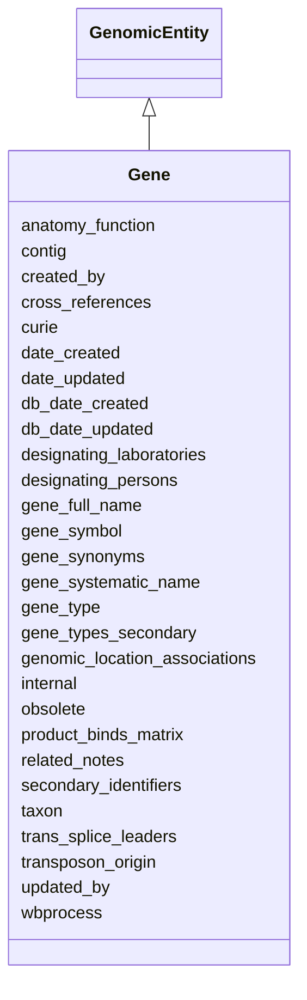

# Gene

A DNA genomic entity from which one or more functional* RNA transcript molecules are transcribed, along with cis-regulatory elements responsible for regulating expression (transcription) of the gene. * A functional RNA molecule here can mean one that is directly responsible for the gene's function (e.g. catalysis, structure, etc.) or one that is translated to produce a functional polypeptide/protein. A pseudogene may be considered a gene under this definition, albeit no longer functional.





URI: [alliance:Gene](http://alliancegenome.org/Gene)


## Parent Classes

* [AuditedObject](AuditedObject.md)
    * [BiologicalEntity](BiologicalEntity.md)
        * [GenomicEntity](GenomicEntity.md)
            * **Gene**


<!-- no inheritance hierarchy -->


## Slots

| Name | Description  |
| ---  | ---  |
| [anatomy_function](anatomy_function.md) | WB specific. Allow the connection between Anatomy_term, Phenotype and gene Eg WBbtf0001 |
| [contig](contig.md) | Contig or clone this gene is located to |
| [created_by](created_by.md) | The individual that created the entity. |
| [cross_references](cross_references.md) | Holds between an object and its CrossReferences. |
| [curie](curie.md) | A unique identifier for a thing. Must be either a CURIE shorthand for a URI or a complete URI |
| [date_created](date_created.md) | The date on which an entity was created. This can be applied to nodes or edges. |
| [date_updated](date_updated.md) | Date on which an entity was last modified. |
| [db_date_created](db_date_created.md) | The date on which an entity was created in the Alliance database.  This is disinct from date_created, which represents the date when the entity was originally created (i.e. at the MOD for imported data). |
| [db_date_updated](db_date_updated.md) | Date on which an entity was last modified in the Alliance database.  This is disinct from date_updated, which represents the date when the entity was last modified and may predate import into the Alliance database. |
| [designating_laboratories](designating_laboratories.md) | A laboratory, rarely laboratories, which designated this gene |
| [designating_persons](designating_persons.md) | A person/persons who designated this gene |
| [gene_full_name](gene_full_name.md) | The one current full name for a gene: e.g., wingless, paired box 2a. |
| [gene_symbol](gene_symbol.md) | The one current accepted symbol for a gene: e.g., wg, pax2a. |
| [gene_synonyms](gene_synonyms.md) | Holds between a Gene and a synonym. |
| [gene_systematic_name](gene_systematic_name.md) | The one current systematic name for a gene: e.g., YHR084W, R09F10.2. |
| [gene_type](gene_type.md) | SOTerm describing gene type |
| [gene_types_secondary](gene_types_secondary.md) | SOTerm describing alternate gene types |
| [genomic_location_associations](genomic_location_associations.md) | None |
| [internal](internal.md) | Classifies the entity as private (for internal use) or not (for public use). |
| [obsolete](obsolete.md) | Entity is no longer current. |
| [product_binds_matrix](product_binds_matrix.md) | WB specific. ID of position matrix object |
| [related_notes](related_notes.md) | Valid note types are available for viewing in the A-Team curation tool Controlled Vocabulary Terms Table (in the "Gene note types" vocabulary) on the production environment (curation.alliancegenome.org). New terms can be added as needed. |
| [secondary_identifiers](secondary_identifiers.md) | None |
| [taxon](taxon.md) | The taxon from which the biological entity derives. |
| [trans_splice_leaders](trans_splice_leaders.md) | Trans-splicing splice leaders observed to operate on this gene, in species which have spliced leader trans-splicing |
| [transposon_origin](transposon_origin.md) | If this gene contains or is originating from a transposon |
| [updated_by](updated_by.md) | The individual that last modified the entity. |
| [wbprocess](wbprocess.md) | WB specific. Eg WBbiop00000015 Corpse engulfment |


## Mappings

| Mapping Type | Mapped Value |
| ---  | ---  |
| self | ['alliance:Gene'] |
| native | ['alliance:Gene'] |


### Valid ID Prefixes

Instances of this class *should* have identifiers with one of the following prefixes:

* ENSEMBL

* HGNC

* FB

* MGI

* RGD

* SGD

* WB

* ZFIN


## LinkML Specification

<!-- TODO: investigate https://stackoverflow.com/questions/37606292/how-to-create-tabbed-code-blocks-in-mkdocs-or-sphinx -->

### Direct

<details>
```yaml
name: Gene
id_prefixes:
- ENSEMBL
- HGNC
- FB
- MGI
- RGD
- SGD
- WB
- ZFIN
description: A DNA genomic entity from which one or more functional* RNA transcript
  molecules are transcribed, along with cis-regulatory elements responsible for regulating
  expression (transcription) of the gene. * A functional RNA molecule here can mean
  one that is directly responsible for the gene's function (e.g. catalysis, structure,
  etc.) or one that is translated to produce a functional polypeptide/protein. A pseudogene
  may be considered a gene under this definition, albeit no longer functional.
from_schema: https://github.com/alliance-genome/agr_curation_schema/gene.yaml
is_a: GenomicEntity
slots:
- gene_symbol
- gene_full_name
- gene_systematic_name
- gene_synonyms
- related_notes
- gene_type
- gene_types_secondary
- designating_laboratories
- designating_persons
- trans_splice_leaders
- contig
- anatomy_function
- product_binds_matrix
- wbprocess
- transposon_origin
slot_usage:
  related_notes:
    name: related_notes
    description: Valid note types are available for viewing in the A-Team curation
      tool Controlled Vocabulary Terms Table (in the "Gene note types" vocabulary)
      on the production environment (curation.alliancegenome.org). New terms can be
      added as needed.
    domain_of:
    - Variant
    - DiseaseAnnotation
    - Gene
    - Antibody
    - ExpressionExperiment
    - ExpressionAnnotation

```
</details>

### Induced

<details>
```yaml
name: Gene
id_prefixes:
- ENSEMBL
- HGNC
- FB
- MGI
- RGD
- SGD
- WB
- ZFIN
description: A DNA genomic entity from which one or more functional* RNA transcript
  molecules are transcribed, along with cis-regulatory elements responsible for regulating
  expression (transcription) of the gene. * A functional RNA molecule here can mean
  one that is directly responsible for the gene's function (e.g. catalysis, structure,
  etc.) or one that is translated to produce a functional polypeptide/protein. A pseudogene
  may be considered a gene under this definition, albeit no longer functional.
from_schema: https://github.com/alliance-genome/agr_curation_schema/gene.yaml
is_a: GenomicEntity
slot_usage:
  related_notes:
    name: related_notes
    description: Valid note types are available for viewing in the A-Team curation
      tool Controlled Vocabulary Terms Table (in the "Gene note types" vocabulary)
      on the production environment (curation.alliancegenome.org). New terms can be
      added as needed.
    domain_of:
    - Variant
    - DiseaseAnnotation
    - Gene
    - Antibody
    - ExpressionExperiment
    - ExpressionAnnotation
attributes:
  gene_symbol:
    name: gene_symbol
    description: 'The one current accepted symbol for a gene: e.g., wg, pax2a.'
    from_schema: https://github.com/alliance-genome/agr_curation_schema/gene.yaml
    exact_mappings:
    - biolink:symbol
    domain: Gene
    multivalued: false
    alias: gene_symbol
    owner: Gene
    domain_of:
    - Gene
    range: GeneSymbolSlotAnnotation
    required: true
  gene_full_name:
    name: gene_full_name
    description: 'The one current full name for a gene: e.g., wingless, paired box
      2a.'
    from_schema: https://github.com/alliance-genome/agr_curation_schema/gene.yaml
    domain: Gene
    multivalued: false
    alias: gene_full_name
    owner: Gene
    domain_of:
    - Gene
    range: GeneFullNameSlotAnnotation
    required: false
  gene_systematic_name:
    name: gene_systematic_name
    description: 'The one current systematic name for a gene: e.g., YHR084W, R09F10.2.'
    from_schema: https://github.com/alliance-genome/agr_curation_schema/gene.yaml
    domain: Gene
    multivalued: false
    alias: gene_systematic_name
    owner: Gene
    domain_of:
    - Gene
    range: GeneSystematicNameSlotAnnotation
    required: false
  gene_synonyms:
    name: gene_synonyms
    description: Holds between a Gene and a synonym.
    from_schema: https://github.com/alliance-genome/agr_curation_schema/gene.yaml
    domain: Gene
    multivalued: true
    alias: gene_synonyms
    owner: Gene
    domain_of:
    - Gene
    range: GeneSynonymSlotAnnotation
    required: false
  related_notes:
    name: related_notes
    description: Valid note types are available for viewing in the A-Team curation
      tool Controlled Vocabulary Terms Table (in the "Gene note types" vocabulary)
      on the production environment (curation.alliancegenome.org). New terms can be
      added as needed.
    from_schema: https://github.com/alliance-genome/agr_curation_schema/core.yaml
    multivalued: true
    alias: related_notes
    owner: Gene
    domain_of:
    - Variant
    - DiseaseAnnotation
    - Gene
    - Antibody
    - ExpressionExperiment
    - ExpressionAnnotation
    range: Note
  gene_type:
    name: gene_type
    description: SOTerm describing gene type
    from_schema: https://github.com/alliance-genome/agr_curation_schema/gene.yaml
    domain: Gene
    alias: gene_type
    owner: Gene
    domain_of:
    - Gene
    range: SOTerm
  gene_types_secondary:
    name: gene_types_secondary
    description: SOTerm describing alternate gene types
    from_schema: https://github.com/alliance-genome/agr_curation_schema/gene.yaml
    domain: Gene
    multivalued: true
    alias: gene_types_secondary
    owner: Gene
    domain_of:
    - Gene
    range: SOTerm
    required: false
  designating_laboratories:
    name: designating_laboratories
    description: A laboratory, rarely laboratories, which designated this gene
    from_schema: https://github.com/alliance-genome/agr_curation_schema/gene.yaml
    domain: Gene
    multivalued: true
    alias: designating_laboratories
    owner: Gene
    domain_of:
    - Gene
    range: Laboratory
    required: false
  designating_persons:
    name: designating_persons
    description: A person/persons who designated this gene
    from_schema: https://github.com/alliance-genome/agr_curation_schema/gene.yaml
    domain: Gene
    multivalued: true
    alias: designating_persons
    owner: Gene
    domain_of:
    - Gene
    range: string
    required: false
  trans_splice_leaders:
    name: trans_splice_leaders
    description: Trans-splicing splice leaders observed to operate on this gene, in
      species which have spliced leader trans-splicing
    from_schema: https://github.com/alliance-genome/agr_curation_schema/gene.yaml
    domain: Gene
    multivalued: true
    alias: trans_splice_leaders
    owner: Gene
    domain_of:
    - Gene
    range: string
    required: false
  contig:
    name: contig
    description: Contig or clone this gene is located to
    from_schema: https://github.com/alliance-genome/agr_curation_schema/gene.yaml
    domain: Gene
    multivalued: true
    alias: contig
    owner: Gene
    domain_of:
    - Gene
    range: string
    required: false
  anatomy_function:
    name: anatomy_function
    description: WB specific. Allow the connection between Anatomy_term, Phenotype
      and gene Eg WBbtf0001
    from_schema: https://github.com/alliance-genome/agr_curation_schema/gene.yaml
    domain: Gene
    multivalued: true
    alias: anatomy_function
    owner: Gene
    domain_of:
    - Gene
    range: string
    required: false
  product_binds_matrix:
    name: product_binds_matrix
    description: WB specific. ID of position matrix object
    from_schema: https://github.com/alliance-genome/agr_curation_schema/gene.yaml
    domain: Gene
    multivalued: true
    alias: product_binds_matrix
    owner: Gene
    domain_of:
    - Gene
    range: string
    required: false
  wbprocess:
    name: wbprocess
    description: WB specific. Eg WBbiop00000015 Corpse engulfment
    from_schema: https://github.com/alliance-genome/agr_curation_schema/gene.yaml
    domain: Gene
    multivalued: true
    alias: wbprocess
    owner: Gene
    domain_of:
    - Gene
    range: string
    required: false
  transposon_origin:
    name: transposon_origin
    description: If this gene contains or is originating from a transposon
    from_schema: https://github.com/alliance-genome/agr_curation_schema/gene.yaml
    domain: Gene
    multivalued: false
    alias: transposon_origin
    owner: Gene
    domain_of:
    - Gene
    range: boolean
    required: false
  cross_references:
    name: cross_references
    description: Holds between an object and its CrossReferences.
    from_schema: https://github.com/alliance-genome/agr_curation_schema/core.yaml
    aliases:
    - xrefs
    singular_name: cross_reference
    multivalued: true
    alias: cross_references
    owner: Gene
    domain_of:
    - OntologyTerm
    - GenomicEntity
    - AuthorReference
    - Antibody
    - GeneInteraction
    range: CrossReference
  secondary_identifiers:
    name: secondary_identifiers
    from_schema: https://github.com/alliance-genome/agr_curation_schema/core.yaml
    aliases:
    - secondary_ids
    multivalued: true
    alias: secondary_identifiers
    owner: Gene
    domain_of:
    - OntologyTerm
    - GenomicEntity
    - GenomicEntityDTO
    - Figure
    - Image
    - Antibody
    range: uriorcurie
  genomic_location_associations:
    name: genomic_location_associations
    from_schema: https://github.com/alliance-genome/agr_curation_schema/core.yaml
    domain: GenomicEntity
    multivalued: true
    alias: genomic_location_associations
    owner: Gene
    domain_of:
    - GenomicEntity
    range: GenomicLocationAssociation
  curie:
    name: curie
    description: A unique identifier for a thing. Must be either a CURIE shorthand
      for a URI or a complete URI
    from_schema: https://github.com/alliance-genome/agr_curation_schema/core.yaml
    multivalued: false
    identifier: true
    alias: curie
    owner: Gene
    domain_of:
    - OntologyTerm
    - PhenotypeAnnotation
    - DiseaseAnnotation
    - BiologicalEntity
    - BiologicalEntityDTO
    - Chromosome
    - Assembly
    - Identifier
    - Figure
    - Image
    - Laboratory
    - InformationContentEntity
    - Reference
    - Resource
    - ModCorpusAssociation
    - GeneInteraction
    - ExpressionExperiment
    - GeneNomenclatureSet
    range: uriorcurie
    required: true
  taxon:
    name: taxon
    description: The taxon from which the biological entity derives.
    from_schema: https://github.com/alliance-genome/agr_curation_schema/core.yaml
    multivalued: false
    alias: taxon
    owner: Gene
    domain_of:
    - BiologicalEntity
    range: NCBITaxonTerm
    required: true
  created_by:
    name: created_by
    description: The individual that created the entity.
    from_schema: https://github.com/alliance-genome/agr_curation_schema/core.yaml
    domain: AuditedObject
    multivalued: false
    alias: created_by
    owner: Gene
    domain_of:
    - AuditedObject
    range: Person
  date_created:
    name: date_created
    description: The date on which an entity was created. This can be applied to nodes
      or edges.
    from_schema: https://github.com/alliance-genome/agr_curation_schema/core.yaml
    aliases:
    - creation_date
    exact_mappings:
    - dct:createdOn
    - WIKIDATA_PROPERTY:P577
    alias: date_created
    owner: Gene
    domain_of:
    - AuditedObject
    - AuditedObjectDTO
    range: datetime
  updated_by:
    name: updated_by
    description: The individual that last modified the entity.
    from_schema: https://github.com/alliance-genome/agr_curation_schema/core.yaml
    domain: AuditedObject
    multivalued: false
    alias: updated_by
    owner: Gene
    domain_of:
    - AuditedObject
    range: Person
  date_updated:
    name: date_updated
    description: Date on which an entity was last modified.
    from_schema: https://github.com/alliance-genome/agr_curation_schema/core.yaml
    aliases:
    - date_last_modified
    alias: date_updated
    owner: Gene
    domain_of:
    - AuditedObject
    - AuditedObjectDTO
    range: datetime
  db_date_created:
    name: db_date_created
    description: The date on which an entity was created in the Alliance database.  This
      is disinct from date_created, which represents the date when the entity was
      originally created (i.e. at the MOD for imported data).
    from_schema: https://github.com/alliance-genome/agr_curation_schema/core.yaml
    alias: db_date_created
    owner: Gene
    domain_of:
    - AuditedObject
    - AuditedObjectDTO
    range: datetime
  db_date_updated:
    name: db_date_updated
    description: Date on which an entity was last modified in the Alliance database.  This
      is disinct from date_updated, which represents the date when the entity was
      last modified and may predate import into the Alliance database.
    from_schema: https://github.com/alliance-genome/agr_curation_schema/core.yaml
    alias: db_date_updated
    owner: Gene
    domain_of:
    - AuditedObject
    - AuditedObjectDTO
    range: datetime
  internal:
    name: internal
    description: Classifies the entity as private (for internal use) or not (for public
      use).
    notes:
    - Default value is true.
    from_schema: https://github.com/alliance-genome/agr_curation_schema/core.yaml
    alias: internal
    owner: Gene
    domain_of:
    - AuditedObject
    - AuditedObjectDTO
    range: boolean
    required: true
  obsolete:
    name: obsolete
    description: Entity is no longer current.
    notes:
    - Obsolete entities are preserved in the database for posterity but should not
      be publicly displayed.
    from_schema: https://github.com/alliance-genome/agr_curation_schema/core.yaml
    alias: obsolete
    owner: Gene
    domain_of:
    - AuditedObject
    - AuditedObjectDTO
    range: boolean

```
</details>