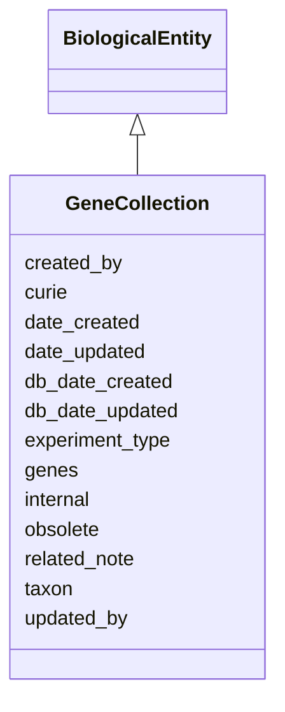

# GeneCollection

A gene collection is a set of genes which have been grouped based on experimental evidence, for example a set of interacting genes, genes in expression cluster, or a set of ChIP binding peaks





URI: [alliance:GeneCollection](http://alliancegenome.org/GeneCollection)


## Parent Classes

* [AuditedObject](AuditedObject.md)
    * [BiologicalEntity](BiologicalEntity.md)
        * **GeneCollection**


<!-- no inheritance hierarchy -->


## Slots

| Name | Description  |
| ---  | ---  |
| [created_by](created_by.md) | The individual that created the entity. |
| [curie](curie.md) | A unique identifier for a thing. Must be either a CURIE shorthand for a URI or a complete URI |
| [date_created](date_created.md) | The date on which an entity was created. This can be applied to nodes or edges. |
| [date_updated](date_updated.md) | Date on which an entity was last modified. |
| [db_date_created](db_date_created.md) | The date on which an entity was created in the Alliance database.  This is disinct from date_created, which represents the date when the entity was originally created (i.e. at the MOD for imported data). |
| [db_date_updated](db_date_updated.md) | Date on which an entity was last modified in the Alliance database.  This is disinct from date_updated, which represents the date when the entity was last modified and may predate import into the Alliance database. |
| [experiment_type](experiment_type.md) | Type of experiment by which these genes were collated eg chip-seq, interaction, expression |
| [genes](genes.md) | None |
| [internal](internal.md) | Classifies the entity as private (for internal use) or not (for public use). |
| [obsolete](obsolete.md) | Entity is no longer current. |
| [related_note](related_note.md) | Holds between an object and a Note object. |
| [taxon](taxon.md) | The taxon from which the biological entity derives. |
| [updated_by](updated_by.md) | The individual that last modified the entity. |


## Mappings

| Mapping Type | Mapped Value |
| ---  | ---  |
| self | ['alliance:GeneCollection'] |
| native | ['alliance:GeneCollection'] |


## LinkML Specification

<!-- TODO: investigate https://stackoverflow.com/questions/37606292/how-to-create-tabbed-code-blocks-in-mkdocs-or-sphinx -->

### Direct

<details>
```yaml
name: GeneCollection
description: A gene collection is a set of genes which have been grouped based on
  experimental evidence, for example a set of interacting genes, genes in expression
  cluster, or a set of ChIP binding peaks
from_schema: https://github.com/alliance-genome/agr_curation_schema/biologicalEntitySet.yaml
is_a: BiologicalEntity
slots:
- genes
- related_note
- experiment_type

```
</details>

### Induced

<details>
```yaml
name: GeneCollection
description: A gene collection is a set of genes which have been grouped based on
  experimental evidence, for example a set of interacting genes, genes in expression
  cluster, or a set of ChIP binding peaks
from_schema: https://github.com/alliance-genome/agr_curation_schema/biologicalEntitySet.yaml
is_a: BiologicalEntity
attributes:
  genes:
    name: genes
    from_schema: https://github.com/alliance-genome/agr_curation_schema/biologicalEntitySet.yaml
    multivalued: true
    alias: genes
    owner: GeneCollection
    domain_of:
    - GeneCluster
    - GeneCollection
    - GeneNomenclatureSet
    - Operon
    - UniGeneSet
    - FunctionalGeneSet
    range: Gene
  related_note:
    name: related_note
    description: Holds between an object and a Note object.
    notes:
    - Singular version of related_notes
    from_schema: https://github.com/alliance-genome/agr_curation_schema/core.yaml
    multivalued: false
    alias: related_note
    owner: GeneCollection
    domain_of:
    - AlleleNoteSlotAnnotation
    - AlleleGenomicEntityAssociation
    - GeneCluster
    - GeneCollection
    - GeneNomenclatureSet
    - Operon
    range: Note
  experiment_type:
    name: experiment_type
    description: Type of experiment by which these genes were collated eg chip-seq,
      interaction, expression
    from_schema: https://github.com/alliance-genome/agr_curation_schema/biologicalEntitySet.yaml
    domain: GeneCollection
    multivalued: true
    alias: experiment_type
    owner: GeneCollection
    domain_of:
    - GeneCollection
    range: string
    required: false
  curie:
    name: curie
    description: A unique identifier for a thing. Must be either a CURIE shorthand
      for a URI or a complete URI
    from_schema: https://github.com/alliance-genome/agr_curation_schema/core.yaml
    multivalued: false
    identifier: true
    alias: curie
    owner: GeneCollection
    domain_of:
    - OntologyTerm
    - PhenotypeAnnotation
    - DiseaseAnnotation
    - BiologicalEntity
    - BiologicalEntityDTO
    - Chromosome
    - Assembly
    - Identifier
    - Figure
    - Image
    - Laboratory
    - InformationContentEntity
    - Reference
    - Resource
    - ModCorpusAssociation
    - GeneInteraction
    - ExpressionExperiment
    - GeneNomenclatureSet
    range: uriorcurie
    required: true
  taxon:
    name: taxon
    description: The taxon from which the biological entity derives.
    from_schema: https://github.com/alliance-genome/agr_curation_schema/core.yaml
    multivalued: false
    alias: taxon
    owner: GeneCollection
    domain_of:
    - BiologicalEntity
    range: NCBITaxonTerm
    required: true
  created_by:
    name: created_by
    description: The individual that created the entity.
    from_schema: https://github.com/alliance-genome/agr_curation_schema/core.yaml
    domain: AuditedObject
    multivalued: false
    alias: created_by
    owner: GeneCollection
    domain_of:
    - AuditedObject
    range: Person
  date_created:
    name: date_created
    description: The date on which an entity was created. This can be applied to nodes
      or edges.
    from_schema: https://github.com/alliance-genome/agr_curation_schema/core.yaml
    aliases:
    - creation_date
    exact_mappings:
    - dct:createdOn
    - WIKIDATA_PROPERTY:P577
    alias: date_created
    owner: GeneCollection
    domain_of:
    - AuditedObject
    - AuditedObjectDTO
    range: datetime
  updated_by:
    name: updated_by
    description: The individual that last modified the entity.
    from_schema: https://github.com/alliance-genome/agr_curation_schema/core.yaml
    domain: AuditedObject
    multivalued: false
    alias: updated_by
    owner: GeneCollection
    domain_of:
    - AuditedObject
    range: Person
  date_updated:
    name: date_updated
    description: Date on which an entity was last modified.
    from_schema: https://github.com/alliance-genome/agr_curation_schema/core.yaml
    aliases:
    - date_last_modified
    alias: date_updated
    owner: GeneCollection
    domain_of:
    - AuditedObject
    - AuditedObjectDTO
    range: datetime
  db_date_created:
    name: db_date_created
    description: The date on which an entity was created in the Alliance database.  This
      is disinct from date_created, which represents the date when the entity was
      originally created (i.e. at the MOD for imported data).
    from_schema: https://github.com/alliance-genome/agr_curation_schema/core.yaml
    alias: db_date_created
    owner: GeneCollection
    domain_of:
    - AuditedObject
    - AuditedObjectDTO
    range: datetime
  db_date_updated:
    name: db_date_updated
    description: Date on which an entity was last modified in the Alliance database.  This
      is disinct from date_updated, which represents the date when the entity was
      last modified and may predate import into the Alliance database.
    from_schema: https://github.com/alliance-genome/agr_curation_schema/core.yaml
    alias: db_date_updated
    owner: GeneCollection
    domain_of:
    - AuditedObject
    - AuditedObjectDTO
    range: datetime
  internal:
    name: internal
    description: Classifies the entity as private (for internal use) or not (for public
      use).
    notes:
    - Default value is true.
    from_schema: https://github.com/alliance-genome/agr_curation_schema/core.yaml
    alias: internal
    owner: GeneCollection
    domain_of:
    - AuditedObject
    - AuditedObjectDTO
    range: boolean
    required: true
  obsolete:
    name: obsolete
    description: Entity is no longer current.
    notes:
    - Obsolete entities are preserved in the database for posterity but should not
      be publicly displayed.
    from_schema: https://github.com/alliance-genome/agr_curation_schema/core.yaml
    alias: obsolete
    owner: GeneCollection
    domain_of:
    - AuditedObject
    - AuditedObjectDTO
    range: boolean

```
</details>