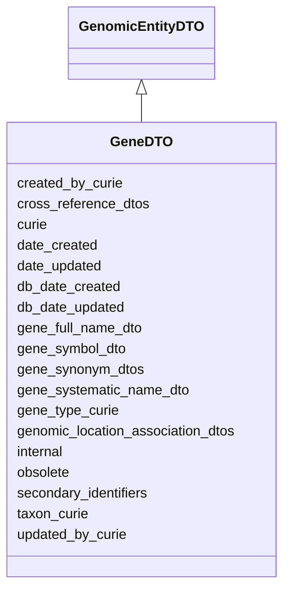

# GeneDTO

Ingest class for genes





URI: [alliance:GeneDTO](http://alliancegenome.org/GeneDTO)


## Parent Classes

* [AuditedObjectDTO](AuditedObjectDTO.md)
    * [BiologicalEntityDTO](BiologicalEntityDTO.md)
        * [GenomicEntityDTO](GenomicEntityDTO.md)
            * **GeneDTO**


<!-- no inheritance hierarchy -->


## Slots

| Name | Description  |
| ---  | ---  |
| [created_by_curie](created_by_curie.md) | Curie of the Person object representing the individual that created the entity |
| [cross_reference_dtos](cross_reference_dtos.md) | None |
| [curie](curie.md) | A unique identifier for a thing. Must be either a CURIE shorthand for a URI or a complete URI |
| [date_created](date_created.md) | The date on which an entity was created. This can be applied to nodes or edges. |
| [date_updated](date_updated.md) | Date on which an entity was last modified. |
| [db_date_created](db_date_created.md) | The date on which an entity was created in the Alliance database.  This is disinct from date_created, which represents the date when the entity was originally created (i.e. at the MOD for imported data). |
| [db_date_updated](db_date_updated.md) | Date on which an entity was last modified in the Alliance database.  This is disinct from date_updated, which represents the date when the entity was last modified and may predate import into the Alliance database. |
| [gene_full_name_dto](gene_full_name_dto.md) | The one current full name for a gene: e.g., wingless, paired box 2a. |
| [gene_symbol_dto](gene_symbol_dto.md) | The one current accepted symbol for a gene: e.g., wg, pax2a. |
| [gene_synonym_dtos](gene_synonym_dtos.md) | None |
| [gene_systematic_name_dto](gene_systematic_name_dto.md) | The one current systematic name for a gene: e.g., YHR084W, R09F10.2. |
| [gene_type_curie](gene_type_curie.md) | Curie of SOTerm describing gene type |
| [genomic_location_association_dtos](genomic_location_association_dtos.md) | None |
| [internal](internal.md) | Classifies the entity as private (for internal use) or not (for public use). |
| [obsolete](obsolete.md) | Entity is no longer current. |
| [secondary_identifiers](secondary_identifiers.md) | None |
| [taxon_curie](taxon_curie.md) | Curie of the NCBITaxonTerm representing the taxon from which the biological entity derives |
| [updated_by_curie](updated_by_curie.md) | Curie of the Person object representing the individual that updated the entity |


## Mappings

| Mapping Type | Mapped Value |
| ---  | ---  |
| self | ['alliance:GeneDTO'] |
| native | ['alliance:GeneDTO'] |


## LinkML Specification

<!-- TODO: investigate https://stackoverflow.com/questions/37606292/how-to-create-tabbed-code-blocks-in-mkdocs-or-sphinx -->

### Direct

<details>
```yaml
name: GeneDTO
description: Ingest class for genes
from_schema: https://github.com/alliance-genome/agr_curation_schema/gene.yaml
is_a: GenomicEntityDTO
slots:
- gene_symbol_dto
- gene_full_name_dto
- gene_systematic_name_dto
- gene_synonym_dtos
- gene_type_curie

```
</details>

### Induced

<details>
```yaml
name: GeneDTO
description: Ingest class for genes
from_schema: https://github.com/alliance-genome/agr_curation_schema/gene.yaml
is_a: GenomicEntityDTO
attributes:
  gene_symbol_dto:
    name: gene_symbol_dto
    description: 'The one current accepted symbol for a gene: e.g., wg, pax2a.'
    from_schema: https://github.com/alliance-genome/agr_curation_schema/gene.yaml
    domain: GeneDTO
    multivalued: false
    alias: gene_symbol_dto
    owner: GeneDTO
    domain_of:
    - GeneDTO
    range: SymbolSlotAnnotationDTO
    required: true
    inlined: true
  gene_full_name_dto:
    name: gene_full_name_dto
    description: 'The one current full name for a gene: e.g., wingless, paired box
      2a.'
    from_schema: https://github.com/alliance-genome/agr_curation_schema/gene.yaml
    domain: GeneDTO
    multivalued: false
    alias: gene_full_name_dto
    owner: GeneDTO
    domain_of:
    - GeneDTO
    range: FullNameSlotAnnotationDTO
    required: false
    inlined: true
  gene_systematic_name_dto:
    name: gene_systematic_name_dto
    description: 'The one current systematic name for a gene: e.g., YHR084W, R09F10.2.'
    from_schema: https://github.com/alliance-genome/agr_curation_schema/gene.yaml
    domain: GeneDTO
    multivalued: false
    alias: gene_systematic_name_dto
    owner: GeneDTO
    domain_of:
    - GeneDTO
    range: SystematicNameSlotAnnotationDTO
    required: false
    inlined: true
  gene_synonym_dtos:
    name: gene_synonym_dtos
    from_schema: https://github.com/alliance-genome/agr_curation_schema/gene.yaml
    domain: GeneDTO
    multivalued: true
    alias: gene_synonym_dtos
    owner: GeneDTO
    domain_of:
    - GeneDTO
    range: NameSlotAnnotationDTO
    inlined: true
    inlined_as_list: true
  gene_type_curie:
    name: gene_type_curie
    description: Curie of SOTerm describing gene type
    from_schema: https://github.com/alliance-genome/agr_curation_schema/gene.yaml
    domain: GeneDTO
    alias: gene_type_curie
    owner: GeneDTO
    domain_of:
    - GeneDTO
    range: string
  cross_reference_dtos:
    name: cross_reference_dtos
    from_schema: https://github.com/alliance-genome/agr_curation_schema/core.yaml
    multivalued: true
    alias: cross_reference_dtos
    owner: GeneDTO
    domain_of:
    - GenomicEntityDTO
    range: CrossReferenceDTO
    inlined: true
    inlined_as_list: true
  secondary_identifiers:
    name: secondary_identifiers
    from_schema: https://github.com/alliance-genome/agr_curation_schema/core.yaml
    aliases:
    - secondary_ids
    multivalued: true
    alias: secondary_identifiers
    owner: GeneDTO
    domain_of:
    - OntologyTerm
    - GenomicEntity
    - GenomicEntityDTO
    - Figure
    - Image
    - Antibody
    range: uriorcurie
  genomic_location_association_dtos:
    name: genomic_location_association_dtos
    from_schema: https://github.com/alliance-genome/agr_curation_schema/core.yaml
    domain: GenomicEntityDTO
    multivalued: true
    alias: genomic_location_association_dtos
    owner: GeneDTO
    domain_of:
    - GenomicEntityDTO
    range: GenomicLocationAssociationDTO
    inlined: true
    inlined_as_list: true
  curie:
    name: curie
    description: A unique identifier for a thing. Must be either a CURIE shorthand
      for a URI or a complete URI
    from_schema: https://github.com/alliance-genome/agr_curation_schema/core.yaml
    multivalued: false
    identifier: true
    alias: curie
    owner: GeneDTO
    domain_of:
    - OntologyTerm
    - PhenotypeAnnotation
    - DiseaseAnnotation
    - BiologicalEntity
    - BiologicalEntityDTO
    - Chromosome
    - Assembly
    - Identifier
    - Figure
    - Image
    - Laboratory
    - InformationContentEntity
    - Reference
    - Resource
    - ModCorpusAssociation
    - GeneInteraction
    - ExpressionExperiment
    - GeneNomenclatureSet
    range: uriorcurie
    required: true
  taxon_curie:
    name: taxon_curie
    description: Curie of the NCBITaxonTerm representing the taxon from which the
      biological entity derives
    from_schema: https://github.com/alliance-genome/agr_curation_schema/core.yaml
    alias: taxon_curie
    owner: GeneDTO
    domain_of:
    - BiologicalEntityDTO
    range: string
    required: true
  created_by_curie:
    name: created_by_curie
    description: Curie of the Person object representing the individual that created
      the entity
    from_schema: https://github.com/alliance-genome/agr_curation_schema/core.yaml
    domain: AuditedObjectDTO
    alias: created_by_curie
    owner: GeneDTO
    domain_of:
    - AuditedObjectDTO
    range: string
  date_created:
    name: date_created
    description: The date on which an entity was created. This can be applied to nodes
      or edges.
    from_schema: https://github.com/alliance-genome/agr_curation_schema/core.yaml
    aliases:
    - creation_date
    exact_mappings:
    - dct:createdOn
    - WIKIDATA_PROPERTY:P577
    alias: date_created
    owner: GeneDTO
    domain_of:
    - AuditedObject
    - AuditedObjectDTO
    range: datetime
  updated_by_curie:
    name: updated_by_curie
    description: Curie of the Person object representing the individual that updated
      the entity
    from_schema: https://github.com/alliance-genome/agr_curation_schema/core.yaml
    domain: AuditedObjectDTO
    alias: updated_by_curie
    owner: GeneDTO
    domain_of:
    - AuditedObjectDTO
    range: string
  date_updated:
    name: date_updated
    description: Date on which an entity was last modified.
    from_schema: https://github.com/alliance-genome/agr_curation_schema/core.yaml
    aliases:
    - date_last_modified
    alias: date_updated
    owner: GeneDTO
    domain_of:
    - AuditedObject
    - AuditedObjectDTO
    range: datetime
  db_date_created:
    name: db_date_created
    description: The date on which an entity was created in the Alliance database.  This
      is disinct from date_created, which represents the date when the entity was
      originally created (i.e. at the MOD for imported data).
    from_schema: https://github.com/alliance-genome/agr_curation_schema/core.yaml
    alias: db_date_created
    owner: GeneDTO
    domain_of:
    - AuditedObject
    - AuditedObjectDTO
    range: datetime
  db_date_updated:
    name: db_date_updated
    description: Date on which an entity was last modified in the Alliance database.  This
      is disinct from date_updated, which represents the date when the entity was
      last modified and may predate import into the Alliance database.
    from_schema: https://github.com/alliance-genome/agr_curation_schema/core.yaml
    alias: db_date_updated
    owner: GeneDTO
    domain_of:
    - AuditedObject
    - AuditedObjectDTO
    range: datetime
  internal:
    name: internal
    description: Classifies the entity as private (for internal use) or not (for public
      use).
    notes:
    - Default value is true.
    from_schema: https://github.com/alliance-genome/agr_curation_schema/core.yaml
    alias: internal
    owner: GeneDTO
    domain_of:
    - AuditedObject
    - AuditedObjectDTO
    range: boolean
    required: true
  obsolete:
    name: obsolete
    description: Entity is no longer current.
    notes:
    - Obsolete entities are preserved in the database for posterity but should not
      be publicly displayed.
    from_schema: https://github.com/alliance-genome/agr_curation_schema/core.yaml
    alias: obsolete
    owner: GeneDTO
    domain_of:
    - AuditedObject
    - AuditedObjectDTO
    range: boolean

```
</details>