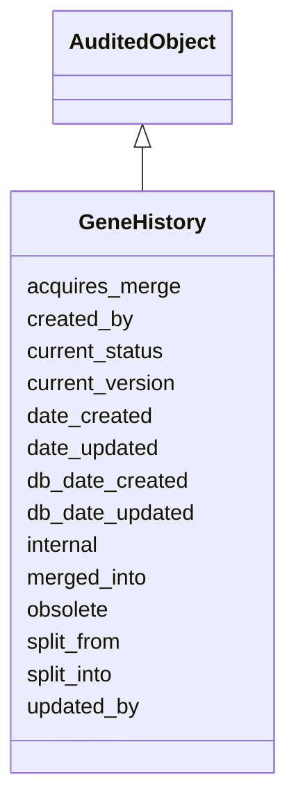

# GeneHistory

The history of a gene





URI: [alliance:GeneHistory](http://alliancegenome.org/GeneHistory)


## Parent Classes

* [AuditedObject](AuditedObject.md)
    * **GeneHistory**


<!-- no inheritance hierarchy -->


## Slots

| Name | Description  |
| ---  | ---  |
| [acquires_merge](acquires_merge.md) | Genes which have been merged into this gene |
| [created_by](created_by.md) | The individual that created the entity. |
| [current_status](current_status.md) | Current status of this object |
| [current_version](current_version.md) | Current version of this object with each version eg 1,2,3 describing major updates |
| [date_created](date_created.md) | The date on which an entity was created. This can be applied to nodes or edges. |
| [date_updated](date_updated.md) | Date on which an entity was last modified. |
| [db_date_created](db_date_created.md) | The date on which an entity was created in the Alliance database.  This is disinct from date_created, which represents the date when the entity was originally created (i.e. at the MOD for imported data). |
| [db_date_updated](db_date_updated.md) | Date on which an entity was last modified in the Alliance database.  This is disinct from date_updated, which represents the date when the entity was last modified and may predate import into the Alliance database. |
| [internal](internal.md) | Classifies the entity as private (for internal use) or not (for public use). |
| [merged_into](merged_into.md) | This gene has been merged into |
| [obsolete](obsolete.md) | Entity is no longer current. |
| [split_from](split_from.md) | This gene exists because it has been split from this gene |
| [split_into](split_into.md) | This gene has been split into these genes |
| [updated_by](updated_by.md) | The individual that last modified the entity. |


## Mappings

| Mapping Type | Mapped Value |
| ---  | ---  |
| self | ['alliance:GeneHistory'] |
| native | ['alliance:GeneHistory'] |


## LinkML Specification

<!-- TODO: investigate https://stackoverflow.com/questions/37606292/how-to-create-tabbed-code-blocks-in-mkdocs-or-sphinx -->

### Direct

<details>
```yaml
name: GeneHistory
description: The history of a gene
from_schema: https://github.com/alliance-genome/agr_curation_schema/gene.yaml
is_a: AuditedObject
slots:
- current_status
- current_version
- merged_into
- acquires_merge
- split_from
- split_into

```
</details>

### Induced

<details>
```yaml
name: GeneHistory
description: The history of a gene
from_schema: https://github.com/alliance-genome/agr_curation_schema/gene.yaml
is_a: AuditedObject
attributes:
  current_status:
    name: current_status
    description: Current status of this object
    from_schema: https://github.com/alliance-genome/agr_curation_schema/gene.yaml
    domain: GeneHistory
    multivalued: true
    alias: current_status
    owner: GeneHistory
    domain_of:
    - GeneHistory
    range: string
    required: false
  current_version:
    name: current_version
    description: Current version of this object with each version eg 1,2,3 describing
      major updates
    from_schema: https://github.com/alliance-genome/agr_curation_schema/gene.yaml
    domain: GeneHistory
    multivalued: false
    alias: current_version
    owner: GeneHistory
    domain_of:
    - GeneHistory
    range: integer
    required: false
  merged_into:
    name: merged_into
    description: This gene has been merged into
    from_schema: https://github.com/alliance-genome/agr_curation_schema/gene.yaml
    domain: GeneHistory
    multivalued: true
    alias: merged_into
    owner: GeneHistory
    domain_of:
    - GeneHistory
    range: Gene
    required: false
  acquires_merge:
    name: acquires_merge
    description: Genes which have been merged into this gene
    from_schema: https://github.com/alliance-genome/agr_curation_schema/gene.yaml
    domain: GeneHistory
    multivalued: true
    alias: acquires_merge
    owner: GeneHistory
    domain_of:
    - GeneHistory
    range: Gene
    required: false
  split_from:
    name: split_from
    description: This gene exists because it has been split from this gene
    from_schema: https://github.com/alliance-genome/agr_curation_schema/gene.yaml
    domain: GeneHistory
    multivalued: true
    alias: split_from
    owner: GeneHistory
    domain_of:
    - GeneHistory
    range: Gene
    required: false
  split_into:
    name: split_into
    description: This gene has been split into these genes
    from_schema: https://github.com/alliance-genome/agr_curation_schema/gene.yaml
    domain: GeneHistory
    multivalued: true
    alias: split_into
    owner: GeneHistory
    domain_of:
    - GeneHistory
    range: Gene
    required: false
  created_by:
    name: created_by
    description: The individual that created the entity.
    from_schema: https://github.com/alliance-genome/agr_curation_schema/core.yaml
    domain: AuditedObject
    multivalued: false
    alias: created_by
    owner: GeneHistory
    domain_of:
    - AuditedObject
    range: Person
  date_created:
    name: date_created
    description: The date on which an entity was created. This can be applied to nodes
      or edges.
    from_schema: https://github.com/alliance-genome/agr_curation_schema/core.yaml
    aliases:
    - creation_date
    exact_mappings:
    - dct:createdOn
    - WIKIDATA_PROPERTY:P577
    alias: date_created
    owner: GeneHistory
    domain_of:
    - AuditedObject
    - AuditedObjectDTO
    range: datetime
  updated_by:
    name: updated_by
    description: The individual that last modified the entity.
    from_schema: https://github.com/alliance-genome/agr_curation_schema/core.yaml
    domain: AuditedObject
    multivalued: false
    alias: updated_by
    owner: GeneHistory
    domain_of:
    - AuditedObject
    range: Person
  date_updated:
    name: date_updated
    description: Date on which an entity was last modified.
    from_schema: https://github.com/alliance-genome/agr_curation_schema/core.yaml
    aliases:
    - date_last_modified
    alias: date_updated
    owner: GeneHistory
    domain_of:
    - AuditedObject
    - AuditedObjectDTO
    range: datetime
  db_date_created:
    name: db_date_created
    description: The date on which an entity was created in the Alliance database.  This
      is disinct from date_created, which represents the date when the entity was
      originally created (i.e. at the MOD for imported data).
    from_schema: https://github.com/alliance-genome/agr_curation_schema/core.yaml
    alias: db_date_created
    owner: GeneHistory
    domain_of:
    - AuditedObject
    - AuditedObjectDTO
    range: datetime
  db_date_updated:
    name: db_date_updated
    description: Date on which an entity was last modified in the Alliance database.  This
      is disinct from date_updated, which represents the date when the entity was
      last modified and may predate import into the Alliance database.
    from_schema: https://github.com/alliance-genome/agr_curation_schema/core.yaml
    alias: db_date_updated
    owner: GeneHistory
    domain_of:
    - AuditedObject
    - AuditedObjectDTO
    range: datetime
  internal:
    name: internal
    description: Classifies the entity as private (for internal use) or not (for public
      use).
    notes:
    - Default value is true.
    from_schema: https://github.com/alliance-genome/agr_curation_schema/core.yaml
    alias: internal
    owner: GeneHistory
    domain_of:
    - AuditedObject
    - AuditedObjectDTO
    range: boolean
    required: true
  obsolete:
    name: obsolete
    description: Entity is no longer current.
    notes:
    - Obsolete entities are preserved in the database for posterity but should not
      be publicly displayed.
    from_schema: https://github.com/alliance-genome/agr_curation_schema/core.yaml
    alias: obsolete
    owner: GeneHistory
    domain_of:
    - AuditedObject
    - AuditedObjectDTO
    range: boolean

```
</details>