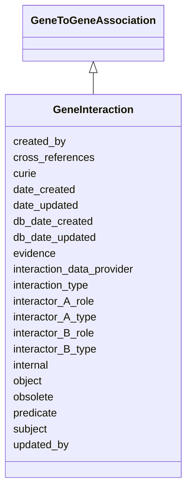

# GeneInteraction

An interaction between two genes or gene products; this may be a physical molecular interaction between gene products (e.g. protein-protein interactions), or may be a genetic interaction between genes (e.g. phenotypic suppression)





URI: [alliance:GeneInteraction](http://alliancegenome.org/GeneInteraction)


## Parent Classes

* [AuditedObject](AuditedObject.md)
    * [Association](Association.md)
        * [GeneToGeneAssociation](GeneToGeneAssociation.md)
            * **GeneInteraction**
                * [GeneMolecularInteraction](GeneMolecularInteraction.md)
                * [GeneGeneticInteraction](GeneGeneticInteraction.md)


## Children

* [AuditedObject](AuditedObject.md)
    * [Association](Association.md)
        * [GeneToGeneAssociation](GeneToGeneAssociation.md)
            * **GeneInteraction**
                * [GeneMolecularInteraction](GeneMolecularInteraction.md)
                * [GeneGeneticInteraction](GeneGeneticInteraction.md)


## Slots

| Name | Description  |
| ---  | ---  |
| [created_by](created_by.md) | The individual that created the entity. |
| [cross_references](cross_references.md) | Additional identifier(s) of the interaction annotation other than the primary id. |
| [curie](curie.md) | The unique primary identifier for the interaction. This should be the source (curation) database identifier, or if that is not available then the aggregation database identifier (e.g. IMEx) |
| [date_created](date_created.md) | The date on which an entity was created. This can be applied to nodes or edges. |
| [date_updated](date_updated.md) | Date on which an entity was last modified. |
| [db_date_created](db_date_created.md) | The date on which an entity was created in the Alliance database.  This is disinct from date_created, which represents the date when the entity was originally created (i.e. at the MOD for imported data). |
| [db_date_updated](db_date_updated.md) | Date on which an entity was last modified in the Alliance database.  This is disinct from date_updated, which represents the date when the entity was last modified and may predate import into the Alliance database. |
| [evidence](evidence.md) |  |
| [interaction_data_provider](interaction_data_provider.md) | The interaction database that curated the interaction. e.g. BioGRID |
| [interaction_type](interaction_type.md) | The type of interaction between the two genes or gene products. e.g. physical association |
| [interactor_A_role](interactor_A_role.md) | None |
| [interactor_A_type](interactor_A_type.md) | None |
| [interactor_B_role](interactor_B_role.md) | None |
| [interactor_B_type](interactor_B_type.md) | None |
| [internal](internal.md) | Classifies the entity as private (for internal use) or not (for public use). |
| [object](object.md) | connects an association to the object of the association. For example, in a gene-to-phenotype association, the gene is subject and phenotype is object. |
| [obsolete](obsolete.md) | Entity is no longer current. |
| [predicate](predicate.md) | A high-level grouping for the relationship type. This is analogous to category for nodes. In RDF, this corresponds to rdf:predicate and in Neo4j this corresponds to the relationship type. |
| [subject](subject.md) | connects an association to the subject of the association. For example, in a gene-to-phenotype association, the gene is subject and phenotype is object. |
| [updated_by](updated_by.md) | The individual that last modified the entity. |


## Mappings

| Mapping Type | Mapped Value |
| ---  | ---  |
| self | ['alliance:GeneInteraction'] |
| native | ['alliance:GeneInteraction'] |


### Valid ID Prefixes

Instances of this class *should* have identifiers with one of the following prefixes:

* BIOGRID

* DIP

* EMDB

* FB

* IMEX

* INTACT

* MINT

* PDBE

* RCSB_PDB

* WB

* WWPDB


## LinkML Specification

<!-- TODO: investigate https://stackoverflow.com/questions/37606292/how-to-create-tabbed-code-blocks-in-mkdocs-or-sphinx -->

### Direct

<details>
```yaml
name: GeneInteraction
id_prefixes:
- BIOGRID
- DIP
- EMDB
- FB
- IMEX
- INTACT
- MINT
- PDBE
- RCSB_PDB
- WB
- WWPDB
description: An interaction between two genes or gene products; this may be a physical
  molecular interaction between gene products (e.g. protein-protein interactions),
  or may be a genetic interaction between genes (e.g. phenotypic suppression)
from_schema: https://github.com/alliance-genome/agr_persistent_schema/geneInteraction.yaml
is_a: GeneToGeneAssociation
abstract: true
slots:
- curie
- cross_references
- interaction_data_provider
- interaction_type
- interactor_A_role
- interactor_B_role
- interactor_A_type
- interactor_B_type
slot_usage:
  curie:
    name: curie
    description: The unique primary identifier for the interaction. This should be
      the source (curation) database identifier, or if that is not available then
      the aggregation database identifier (e.g. IMEx)
    domain_of:
    - OntologyTerm
    - PhenotypeAnnotation
    - DiseaseAnnotation
    - BiologicalEntity
    - BiologicalEntityDTO
    - Chromosome
    - Assembly
    - Identifier
    - Figure
    - Image
    - Laboratory
    - InformationContentEntity
    - Reference
    - Resource
    - ModCorpusAssociation
    - GeneInteraction
    - ExpressionExperiment
    - GeneNomenclatureSet
  cross_references:
    name: cross_references
    description: Additional identifier(s) of the interaction annotation other than
      the primary id.
    domain_of:
    - OntologyTerm
    - GenomicEntity
    - AuthorReference
    - Antibody
    - GeneInteraction
  subject:
    name: subject
    domain_of:
    - Association
    - VariantConsequence
    range: Gene
  predicate:
    name: predicate
    domain_of:
    - Association
    - GeneToGeneOrthology
    subproperty_of: interacts_with
    symmetric: true
  object:
    name: object
    domain_of:
    - Association
    - VariantConsequence
    range: Gene
  interaction_data_provider:
    name: interaction_data_provider
    multivalued: false
    domain_of:
    - GeneInteraction
    required: true
  references:
    name: references
    description: The reference from which the interaction was annotated.
    multivalued: false
defining_slots:
- subject
- predicate
- object

```
</details>

### Induced

<details>
```yaml
name: GeneInteraction
id_prefixes:
- BIOGRID
- DIP
- EMDB
- FB
- IMEX
- INTACT
- MINT
- PDBE
- RCSB_PDB
- WB
- WWPDB
description: An interaction between two genes or gene products; this may be a physical
  molecular interaction between gene products (e.g. protein-protein interactions),
  or may be a genetic interaction between genes (e.g. phenotypic suppression)
from_schema: https://github.com/alliance-genome/agr_persistent_schema/geneInteraction.yaml
is_a: GeneToGeneAssociation
abstract: true
slot_usage:
  curie:
    name: curie
    description: The unique primary identifier for the interaction. This should be
      the source (curation) database identifier, or if that is not available then
      the aggregation database identifier (e.g. IMEx)
    domain_of:
    - OntologyTerm
    - PhenotypeAnnotation
    - DiseaseAnnotation
    - BiologicalEntity
    - BiologicalEntityDTO
    - Chromosome
    - Assembly
    - Identifier
    - Figure
    - Image
    - Laboratory
    - InformationContentEntity
    - Reference
    - Resource
    - ModCorpusAssociation
    - GeneInteraction
    - ExpressionExperiment
    - GeneNomenclatureSet
  cross_references:
    name: cross_references
    description: Additional identifier(s) of the interaction annotation other than
      the primary id.
    domain_of:
    - OntologyTerm
    - GenomicEntity
    - AuthorReference
    - Antibody
    - GeneInteraction
  subject:
    name: subject
    domain_of:
    - Association
    - VariantConsequence
    range: Gene
  predicate:
    name: predicate
    domain_of:
    - Association
    - GeneToGeneOrthology
    subproperty_of: interacts_with
    symmetric: true
  object:
    name: object
    domain_of:
    - Association
    - VariantConsequence
    range: Gene
  interaction_data_provider:
    name: interaction_data_provider
    multivalued: false
    domain_of:
    - GeneInteraction
    required: true
  references:
    name: references
    description: The reference from which the interaction was annotated.
    multivalued: false
attributes:
  curie:
    name: curie
    description: The unique primary identifier for the interaction. This should be
      the source (curation) database identifier, or if that is not available then
      the aggregation database identifier (e.g. IMEx)
    from_schema: https://github.com/alliance-genome/agr_curation_schema/core.yaml
    multivalued: false
    identifier: true
    alias: curie
    owner: GeneInteraction
    domain_of:
    - OntologyTerm
    - PhenotypeAnnotation
    - DiseaseAnnotation
    - BiologicalEntity
    - BiologicalEntityDTO
    - Chromosome
    - Assembly
    - Identifier
    - Figure
    - Image
    - Laboratory
    - InformationContentEntity
    - Reference
    - Resource
    - ModCorpusAssociation
    - GeneInteraction
    - ExpressionExperiment
    - GeneNomenclatureSet
    range: uriorcurie
  cross_references:
    name: cross_references
    description: Additional identifier(s) of the interaction annotation other than
      the primary id.
    from_schema: https://github.com/alliance-genome/agr_curation_schema/core.yaml
    singular_name: cross_reference
    multivalued: true
    alias: cross_references
    owner: GeneInteraction
    domain_of:
    - OntologyTerm
    - GenomicEntity
    - AuthorReference
    - Antibody
    - GeneInteraction
    range: CrossReference
  interaction_data_provider:
    name: interaction_data_provider
    description: The interaction database that curated the interaction. e.g. BioGRID
    from_schema: https://github.com/alliance-genome/agr_persistent_schema/geneInteraction.yaml
    multivalued: false
    alias: interaction_data_provider
    owner: GeneInteraction
    domain_of:
    - GeneInteraction
    range: interaction_source_enum
    required: true
  interaction_type:
    name: interaction_type
    description: The type of interaction between the two genes or gene products. e.g.
      physical association
    from_schema: https://github.com/alliance-genome/agr_persistent_schema/geneInteraction.yaml
    is_a: association_slot
    domain: GeneInteraction
    multivalued: false
    alias: interaction_type
    owner: GeneInteraction
    domain_of:
    - GeneInteraction
    range: interaction_type_enum
    required: true
  interactor_A_role:
    name: interactor_A_role
    from_schema: https://github.com/alliance-genome/agr_persistent_schema/geneInteraction.yaml
    is_a: association_slot
    domain: GeneInteraction
    multivalued: true
    alias: interactor_A_role
    owner: GeneInteraction
    domain_of:
    - GeneInteraction
    range: interactor_A_role_enum
    required: false
  interactor_B_role:
    name: interactor_B_role
    from_schema: https://github.com/alliance-genome/agr_persistent_schema/geneInteraction.yaml
    is_a: association_slot
    domain: GeneInteraction
    multivalued: true
    alias: interactor_B_role
    owner: GeneInteraction
    domain_of:
    - GeneInteraction
    range: interactor_B_role_enum
    required: false
  interactor_A_type:
    name: interactor_A_type
    from_schema: https://github.com/alliance-genome/agr_persistent_schema/geneInteraction.yaml
    is_a: association_slot
    domain: GeneInteraction
    multivalued: false
    alias: interactor_A_type
    owner: GeneInteraction
    domain_of:
    - GeneInteraction
    range: interactor_type_enum
    required: true
  interactor_B_type:
    name: interactor_B_type
    from_schema: https://github.com/alliance-genome/agr_persistent_schema/geneInteraction.yaml
    is_a: association_slot
    domain: GeneInteraction
    multivalued: false
    alias: interactor_B_type
    owner: GeneInteraction
    domain_of:
    - GeneInteraction
    range: interactor_type_enum
    required: true
  subject:
    name: subject
    description: connects an association to the subject of the association. For example,
      in a gene-to-phenotype association, the gene is subject and phenotype is object.
    from_schema: https://github.com/alliance-genome/agr_curation_schema/core.yaml
    is_a: association_slot
    alias: subject
    owner: GeneInteraction
    domain_of:
    - Association
    - VariantConsequence
    range: Gene
    required: true
  predicate:
    name: predicate
    description: A high-level grouping for the relationship type. This is analogous
      to category for nodes. In RDF, this corresponds to rdf:predicate and in Neo4j
      this corresponds to the relationship type.
    from_schema: https://github.com/alliance-genome/agr_curation_schema/core.yaml
    is_a: association_slot
    alias: predicate
    owner: GeneInteraction
    domain_of:
    - Association
    - GeneToGeneOrthology
    subproperty_of: interacts_with
    symmetric: true
    range: string
    required: true
  object:
    name: object
    description: connects an association to the object of the association. For example,
      in a gene-to-phenotype association, the gene is subject and phenotype is object.
    from_schema: https://github.com/alliance-genome/agr_curation_schema/core.yaml
    is_a: association_slot
    alias: object
    owner: GeneInteraction
    domain_of:
    - Association
    - VariantConsequence
    range: Gene
    required: true
  evidence:
    name: evidence
    description: ''
    from_schema: https://github.com/alliance-genome/agr_curation_schema/src/schema/reference
    multivalued: true
    alias: evidence
    owner: GeneInteraction
    domain_of:
    - AlleleGenerationMethodAssociation
    - Note
    - SlotAnnotation
    - Association
    range: InformationContentEntity
  created_by:
    name: created_by
    description: The individual that created the entity.
    from_schema: https://github.com/alliance-genome/agr_curation_schema/core.yaml
    domain: AuditedObject
    multivalued: false
    alias: created_by
    owner: GeneInteraction
    domain_of:
    - AuditedObject
    range: Person
  date_created:
    name: date_created
    description: The date on which an entity was created. This can be applied to nodes
      or edges.
    from_schema: https://github.com/alliance-genome/agr_curation_schema/core.yaml
    aliases:
    - creation_date
    exact_mappings:
    - dct:createdOn
    - WIKIDATA_PROPERTY:P577
    alias: date_created
    owner: GeneInteraction
    domain_of:
    - AuditedObject
    - AuditedObjectDTO
    range: datetime
  updated_by:
    name: updated_by
    description: The individual that last modified the entity.
    from_schema: https://github.com/alliance-genome/agr_curation_schema/core.yaml
    domain: AuditedObject
    multivalued: false
    alias: updated_by
    owner: GeneInteraction
    domain_of:
    - AuditedObject
    range: Person
  date_updated:
    name: date_updated
    description: Date on which an entity was last modified.
    from_schema: https://github.com/alliance-genome/agr_curation_schema/core.yaml
    aliases:
    - date_last_modified
    alias: date_updated
    owner: GeneInteraction
    domain_of:
    - AuditedObject
    - AuditedObjectDTO
    range: datetime
  db_date_created:
    name: db_date_created
    description: The date on which an entity was created in the Alliance database.  This
      is disinct from date_created, which represents the date when the entity was
      originally created (i.e. at the MOD for imported data).
    from_schema: https://github.com/alliance-genome/agr_curation_schema/core.yaml
    alias: db_date_created
    owner: GeneInteraction
    domain_of:
    - AuditedObject
    - AuditedObjectDTO
    range: datetime
  db_date_updated:
    name: db_date_updated
    description: Date on which an entity was last modified in the Alliance database.  This
      is disinct from date_updated, which represents the date when the entity was
      last modified and may predate import into the Alliance database.
    from_schema: https://github.com/alliance-genome/agr_curation_schema/core.yaml
    alias: db_date_updated
    owner: GeneInteraction
    domain_of:
    - AuditedObject
    - AuditedObjectDTO
    range: datetime
  internal:
    name: internal
    description: Classifies the entity as private (for internal use) or not (for public
      use).
    notes:
    - Default value is true.
    from_schema: https://github.com/alliance-genome/agr_curation_schema/core.yaml
    alias: internal
    owner: GeneInteraction
    domain_of:
    - AuditedObject
    - AuditedObjectDTO
    range: boolean
    required: true
  obsolete:
    name: obsolete
    description: Entity is no longer current.
    notes:
    - Obsolete entities are preserved in the database for posterity but should not
      be publicly displayed.
    from_schema: https://github.com/alliance-genome/agr_curation_schema/core.yaml
    alias: obsolete
    owner: GeneInteraction
    domain_of:
    - AuditedObject
    - AuditedObjectDTO
    range: boolean
defining_slots:
- subject
- predicate
- object

```
</details>