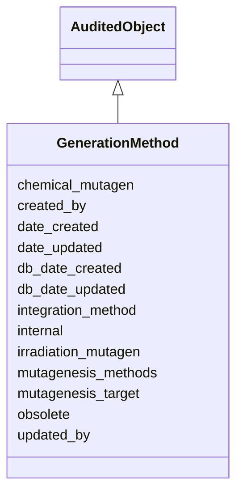

# GenerationMethod

None





URI: [alliance:GenerationMethod](http://alliancegenome.org/GenerationMethod)


## Parent Classes

* [AuditedObject](AuditedObject.md)
    * **GenerationMethod**


<!-- no inheritance hierarchy -->


## Slots

| Name | Description  |
| ---  | ---  |
| [chemical_mutagen](chemical_mutagen.md) | The chemical used to generate the mutation through mutagenesis |
| [created_by](created_by.md) | The individual that created the entity. |
| [date_created](date_created.md) | The date on which an entity was created. This can be applied to nodes or edges. |
| [date_updated](date_updated.md) | Date on which an entity was last modified. |
| [db_date_created](db_date_created.md) | The date on which an entity was created in the Alliance database.  This is disinct from date_created, which represents the date when the entity was originally created (i.e. at the MOD for imported data). |
| [db_date_updated](db_date_updated.md) | Date on which an entity was last modified in the Alliance database.  This is disinct from date_updated, which represents the date when the entity was last modified and may predate import into the Alliance database. |
| [integration_method](integration_method.md) | WormBase captures the method by which an extrachromosomal transgene was integrated into the genome. |
| [internal](internal.md) | Classifies the entity as private (for internal use) or not (for public use). |
| [irradiation_mutagen](irradiation_mutagen.md) | The irradiation used to generate the mutation through mutagenesis |
| [mutagenesis_methods](mutagenesis_methods.md) | Technique used to create the allele, e.g. spontaneous / naturally occurring / radiation-induced / recombinant / ENU / CRISPR / TALEN / gamma rays / not specified / spontaneous / DNA / DNA AND CRISPR / DNA and TALEN / zinc finger nuclease / EMS |
| [mutagenesis_target](mutagenesis_target.md) | The target of the mutation, e.g. strain / adult females / adult males / embryos / sperm / not specified |
| [obsolete](obsolete.md) | Entity is no longer current. |
| [updated_by](updated_by.md) | The individual that last modified the entity. |


## Mappings

| Mapping Type | Mapped Value |
| ---  | ---  |
| self | ['alliance:GenerationMethod'] |
| native | ['alliance:GenerationMethod'] |


## LinkML Specification

<!-- TODO: investigate https://stackoverflow.com/questions/37606292/how-to-create-tabbed-code-blocks-in-mkdocs-or-sphinx -->

### Direct

<details>
```yaml
name: GenerationMethod
from_schema: https://github.com/alliance-genome/agr_curation_schema/src/schema/allele
is_a: AuditedObject
slots:
- mutagenesis_methods
- mutagenesis_target
- integration_method
- chemical_mutagen
- irradiation_mutagen

```
</details>

### Induced

<details>
```yaml
name: GenerationMethod
from_schema: https://github.com/alliance-genome/agr_curation_schema/src/schema/allele
is_a: AuditedObject
attributes:
  mutagenesis_methods:
    name: mutagenesis_methods
    description: Technique used to create the allele, e.g. spontaneous / naturally
      occurring / radiation-induced / recombinant / ENU / CRISPR / TALEN / gamma rays
      / not specified / spontaneous / DNA / DNA AND CRISPR / DNA and TALEN / zinc
      finger nuclease / EMS
    from_schema: https://github.com/alliance-genome/agr_curation_schema/src/schema/allele
    multivalued: true
    alias: mutagenesis_methods
    owner: GenerationMethod
    domain_of:
    - GenerationMethod
    range: VocabularyTerm
  mutagenesis_target:
    name: mutagenesis_target
    description: The target of the mutation, e.g. strain / adult females / adult males
      / embryos / sperm / not specified
    from_schema: https://github.com/alliance-genome/agr_curation_schema/src/schema/allele
    aliases:
    - mutagee
    alias: mutagenesis_target
    owner: GenerationMethod
    domain_of:
    - GenerationMethod
    - GenerationMethodDTO
    range: string
  integration_method:
    name: integration_method
    description: WormBase captures the method by which an extrachromosomal transgene
      was integrated into the genome.
    from_schema: https://github.com/alliance-genome/agr_curation_schema/src/schema/allele
    domain: GenerationMethod
    multivalued: false
    alias: integration_method
    owner: GenerationMethod
    domain_of:
    - GenerationMethod
    range: VocabularyTerm
  chemical_mutagen:
    name: chemical_mutagen
    description: The chemical used to generate the mutation through mutagenesis
    from_schema: https://github.com/alliance-genome/agr_curation_schema/src/schema/allele
    domain: GenerationMethod
    alias: chemical_mutagen
    owner: GenerationMethod
    domain_of:
    - GenerationMethod
    range: VocabularyTerm
  irradiation_mutagen:
    name: irradiation_mutagen
    description: The irradiation used to generate the mutation through mutagenesis
    from_schema: https://github.com/alliance-genome/agr_curation_schema/src/schema/allele
    domain: GenerationMethod
    alias: irradiation_mutagen
    owner: GenerationMethod
    domain_of:
    - GenerationMethod
    range: VocabularyTerm
  created_by:
    name: created_by
    description: The individual that created the entity.
    from_schema: https://github.com/alliance-genome/agr_curation_schema/core.yaml
    domain: AuditedObject
    multivalued: false
    alias: created_by
    owner: GenerationMethod
    domain_of:
    - AuditedObject
    range: Person
  date_created:
    name: date_created
    description: The date on which an entity was created. This can be applied to nodes
      or edges.
    from_schema: https://github.com/alliance-genome/agr_curation_schema/core.yaml
    aliases:
    - creation_date
    exact_mappings:
    - dct:createdOn
    - WIKIDATA_PROPERTY:P577
    alias: date_created
    owner: GenerationMethod
    domain_of:
    - AuditedObject
    - AuditedObjectDTO
    range: datetime
  updated_by:
    name: updated_by
    description: The individual that last modified the entity.
    from_schema: https://github.com/alliance-genome/agr_curation_schema/core.yaml
    domain: AuditedObject
    multivalued: false
    alias: updated_by
    owner: GenerationMethod
    domain_of:
    - AuditedObject
    range: Person
  date_updated:
    name: date_updated
    description: Date on which an entity was last modified.
    from_schema: https://github.com/alliance-genome/agr_curation_schema/core.yaml
    aliases:
    - date_last_modified
    alias: date_updated
    owner: GenerationMethod
    domain_of:
    - AuditedObject
    - AuditedObjectDTO
    range: datetime
  db_date_created:
    name: db_date_created
    description: The date on which an entity was created in the Alliance database.  This
      is disinct from date_created, which represents the date when the entity was
      originally created (i.e. at the MOD for imported data).
    from_schema: https://github.com/alliance-genome/agr_curation_schema/core.yaml
    alias: db_date_created
    owner: GenerationMethod
    domain_of:
    - AuditedObject
    - AuditedObjectDTO
    range: datetime
  db_date_updated:
    name: db_date_updated
    description: Date on which an entity was last modified in the Alliance database.  This
      is disinct from date_updated, which represents the date when the entity was
      last modified and may predate import into the Alliance database.
    from_schema: https://github.com/alliance-genome/agr_curation_schema/core.yaml
    alias: db_date_updated
    owner: GenerationMethod
    domain_of:
    - AuditedObject
    - AuditedObjectDTO
    range: datetime
  internal:
    name: internal
    description: Classifies the entity as private (for internal use) or not (for public
      use).
    notes:
    - Default value is true.
    from_schema: https://github.com/alliance-genome/agr_curation_schema/core.yaml
    alias: internal
    owner: GenerationMethod
    domain_of:
    - AuditedObject
    - AuditedObjectDTO
    range: boolean
    required: true
  obsolete:
    name: obsolete
    description: Entity is no longer current.
    notes:
    - Obsolete entities are preserved in the database for posterity but should not
      be publicly displayed.
    from_schema: https://github.com/alliance-genome/agr_curation_schema/core.yaml
    alias: obsolete
    owner: GenerationMethod
    domain_of:
    - AuditedObject
    - AuditedObjectDTO
    range: boolean

```
</details>