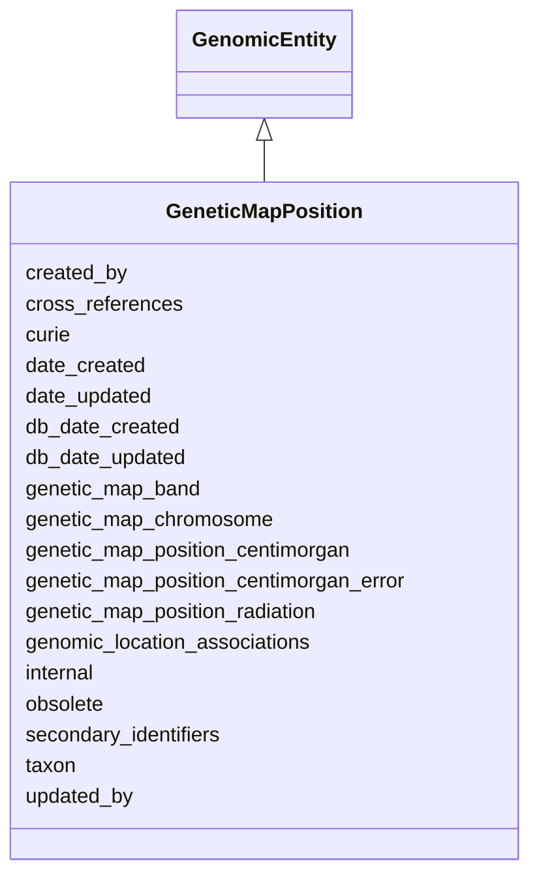

# GeneticMapPosition

A genetic map position.





URI: [alliance:GeneticMapPosition](http://alliancegenome.org/GeneticMapPosition)


## Parent Classes

* [AuditedObject](AuditedObject.md)
    * [BiologicalEntity](BiologicalEntity.md)
        * [GenomicEntity](GenomicEntity.md)
            * **GeneticMapPosition**


<!-- no inheritance hierarchy -->


## Slots

| Name | Description  |
| ---  | ---  |
| [created_by](created_by.md) | The individual that created the entity. |
| [cross_references](cross_references.md) | Holds between an object and its CrossReferences. |
| [curie](curie.md) | A unique identifier for a thing. Must be either a CURIE shorthand for a URI or a complete URI |
| [date_created](date_created.md) | The date on which an entity was created. This can be applied to nodes or edges. |
| [date_updated](date_updated.md) | Date on which an entity was last modified. |
| [db_date_created](db_date_created.md) | The date on which an entity was created in the Alliance database.  This is disinct from date_created, which represents the date when the entity was originally created (i.e. at the MOD for imported data). |
| [db_date_updated](db_date_updated.md) | Date on which an entity was last modified in the Alliance database.  This is disinct from date_updated, which represents the date when the entity was last modified and may predate import into the Alliance database. |
| [genetic_map_band](genetic_map_band.md) | Genetic map predicted chromosome location eg 10q12 |
| [genetic_map_chromosome](genetic_map_chromosome.md) | Chromosome or contig to which the gene has been genetically mapped |
| [genetic_map_position_centimorgan](genetic_map_position_centimorgan.md) | Genetic map predicted chromosome location in centimorgans eg 22.3366 cM |
| [genetic_map_position_centimorgan_error](genetic_map_position_centimorgan_error.md) | Genetic map calculated error in the predicted chromosome location in centimorgans eg 0.045 cM |
| [genetic_map_position_radiation](genetic_map_position_radiation.md) | Radiation hybrid map predicted chromosome location eg 66.5 cR |
| [genomic_location_associations](genomic_location_associations.md) | None |
| [internal](internal.md) | Classifies the entity as private (for internal use) or not (for public use). |
| [obsolete](obsolete.md) | Entity is no longer current. |
| [secondary_identifiers](secondary_identifiers.md) | None |
| [taxon](taxon.md) | The taxon from which the biological entity derives. |
| [updated_by](updated_by.md) | The individual that last modified the entity. |


## Mappings

| Mapping Type | Mapped Value |
| ---  | ---  |
| self | ['alliance:GeneticMapPosition'] |
| native | ['alliance:GeneticMapPosition'] |


## LinkML Specification

<!-- TODO: investigate https://stackoverflow.com/questions/37606292/how-to-create-tabbed-code-blocks-in-mkdocs-or-sphinx -->

### Direct

<details>
```yaml
name: GeneticMapPosition
description: A genetic map position.
from_schema: https://github.com/alliance-genome/agr_curation_schema/gene.yaml
is_a: GenomicEntity
slots:
- genetic_map_chromosome
- genetic_map_band
- genetic_map_position_centimorgan
- genetic_map_position_centimorgan_error
- genetic_map_position_radiation

```
</details>

### Induced

<details>
```yaml
name: GeneticMapPosition
description: A genetic map position.
from_schema: https://github.com/alliance-genome/agr_curation_schema/gene.yaml
is_a: GenomicEntity
attributes:
  genetic_map_chromosome:
    name: genetic_map_chromosome
    description: Chromosome or contig to which the gene has been genetically mapped
    from_schema: https://github.com/alliance-genome/agr_curation_schema/gene.yaml
    domain: GeneticMapPosition
    multivalued: false
    alias: genetic_map_chromosome
    owner: GeneticMapPosition
    domain_of:
    - GeneticMapPosition
    range: Chromosome
    required: false
  genetic_map_band:
    name: genetic_map_band
    description: Genetic map predicted chromosome location eg 10q12
    from_schema: https://github.com/alliance-genome/agr_curation_schema/gene.yaml
    domain: GeneticMapPosition
    multivalued: false
    alias: genetic_map_band
    owner: GeneticMapPosition
    domain_of:
    - GeneticMapPosition
    range: string
    required: false
  genetic_map_position_centimorgan:
    name: genetic_map_position_centimorgan
    description: Genetic map predicted chromosome location in centimorgans eg 22.3366
      cM
    from_schema: https://github.com/alliance-genome/agr_curation_schema/gene.yaml
    domain: GeneticMapPosition
    multivalued: true
    alias: genetic_map_position_centimorgan
    owner: GeneticMapPosition
    domain_of:
    - GeneticMapPosition
    range: float
    required: false
  genetic_map_position_centimorgan_error:
    name: genetic_map_position_centimorgan_error
    description: Genetic map calculated error in the predicted chromosome location
      in centimorgans eg 0.045 cM
    from_schema: https://github.com/alliance-genome/agr_curation_schema/gene.yaml
    domain: GeneticMapPosition
    multivalued: true
    alias: genetic_map_position_centimorgan_error
    owner: GeneticMapPosition
    domain_of:
    - GeneticMapPosition
    range: float
    required: false
  genetic_map_position_radiation:
    name: genetic_map_position_radiation
    description: Radiation hybrid map predicted chromosome location eg 66.5 cR
    from_schema: https://github.com/alliance-genome/agr_curation_schema/gene.yaml
    domain: GeneticMapPosition
    multivalued: true
    alias: genetic_map_position_radiation
    owner: GeneticMapPosition
    domain_of:
    - GeneticMapPosition
    range: float
    required: false
  cross_references:
    name: cross_references
    description: Holds between an object and its CrossReferences.
    from_schema: https://github.com/alliance-genome/agr_curation_schema/core.yaml
    aliases:
    - xrefs
    singular_name: cross_reference
    multivalued: true
    alias: cross_references
    owner: GeneticMapPosition
    domain_of:
    - OntologyTerm
    - GenomicEntity
    - AuthorReference
    - Antibody
    - GeneInteraction
    range: CrossReference
  secondary_identifiers:
    name: secondary_identifiers
    from_schema: https://github.com/alliance-genome/agr_curation_schema/core.yaml
    aliases:
    - secondary_ids
    multivalued: true
    alias: secondary_identifiers
    owner: GeneticMapPosition
    domain_of:
    - OntologyTerm
    - GenomicEntity
    - GenomicEntityDTO
    - Figure
    - Image
    - Antibody
    range: uriorcurie
  genomic_location_associations:
    name: genomic_location_associations
    from_schema: https://github.com/alliance-genome/agr_curation_schema/core.yaml
    domain: GenomicEntity
    multivalued: true
    alias: genomic_location_associations
    owner: GeneticMapPosition
    domain_of:
    - GenomicEntity
    range: GenomicLocationAssociation
  curie:
    name: curie
    description: A unique identifier for a thing. Must be either a CURIE shorthand
      for a URI or a complete URI
    from_schema: https://github.com/alliance-genome/agr_curation_schema/core.yaml
    multivalued: false
    identifier: true
    alias: curie
    owner: GeneticMapPosition
    domain_of:
    - OntologyTerm
    - PhenotypeAnnotation
    - DiseaseAnnotation
    - BiologicalEntity
    - BiologicalEntityDTO
    - Chromosome
    - Assembly
    - Identifier
    - Figure
    - Image
    - Laboratory
    - InformationContentEntity
    - Reference
    - Resource
    - ModCorpusAssociation
    - GeneInteraction
    - ExpressionExperiment
    - GeneNomenclatureSet
    range: uriorcurie
    required: true
  taxon:
    name: taxon
    description: The taxon from which the biological entity derives.
    from_schema: https://github.com/alliance-genome/agr_curation_schema/core.yaml
    multivalued: false
    alias: taxon
    owner: GeneticMapPosition
    domain_of:
    - BiologicalEntity
    range: NCBITaxonTerm
    required: true
  created_by:
    name: created_by
    description: The individual that created the entity.
    from_schema: https://github.com/alliance-genome/agr_curation_schema/core.yaml
    domain: AuditedObject
    multivalued: false
    alias: created_by
    owner: GeneticMapPosition
    domain_of:
    - AuditedObject
    range: Person
  date_created:
    name: date_created
    description: The date on which an entity was created. This can be applied to nodes
      or edges.
    from_schema: https://github.com/alliance-genome/agr_curation_schema/core.yaml
    aliases:
    - creation_date
    exact_mappings:
    - dct:createdOn
    - WIKIDATA_PROPERTY:P577
    alias: date_created
    owner: GeneticMapPosition
    domain_of:
    - AuditedObject
    - AuditedObjectDTO
    range: datetime
  updated_by:
    name: updated_by
    description: The individual that last modified the entity.
    from_schema: https://github.com/alliance-genome/agr_curation_schema/core.yaml
    domain: AuditedObject
    multivalued: false
    alias: updated_by
    owner: GeneticMapPosition
    domain_of:
    - AuditedObject
    range: Person
  date_updated:
    name: date_updated
    description: Date on which an entity was last modified.
    from_schema: https://github.com/alliance-genome/agr_curation_schema/core.yaml
    aliases:
    - date_last_modified
    alias: date_updated
    owner: GeneticMapPosition
    domain_of:
    - AuditedObject
    - AuditedObjectDTO
    range: datetime
  db_date_created:
    name: db_date_created
    description: The date on which an entity was created in the Alliance database.  This
      is disinct from date_created, which represents the date when the entity was
      originally created (i.e. at the MOD for imported data).
    from_schema: https://github.com/alliance-genome/agr_curation_schema/core.yaml
    alias: db_date_created
    owner: GeneticMapPosition
    domain_of:
    - AuditedObject
    - AuditedObjectDTO
    range: datetime
  db_date_updated:
    name: db_date_updated
    description: Date on which an entity was last modified in the Alliance database.  This
      is disinct from date_updated, which represents the date when the entity was
      last modified and may predate import into the Alliance database.
    from_schema: https://github.com/alliance-genome/agr_curation_schema/core.yaml
    alias: db_date_updated
    owner: GeneticMapPosition
    domain_of:
    - AuditedObject
    - AuditedObjectDTO
    range: datetime
  internal:
    name: internal
    description: Classifies the entity as private (for internal use) or not (for public
      use).
    notes:
    - Default value is true.
    from_schema: https://github.com/alliance-genome/agr_curation_schema/core.yaml
    alias: internal
    owner: GeneticMapPosition
    domain_of:
    - AuditedObject
    - AuditedObjectDTO
    range: boolean
    required: true
  obsolete:
    name: obsolete
    description: Entity is no longer current.
    notes:
    - Obsolete entities are preserved in the database for posterity but should not
      be publicly displayed.
    from_schema: https://github.com/alliance-genome/agr_curation_schema/core.yaml
    alias: obsolete
    owner: GeneticMapPosition
    domain_of:
    - AuditedObject
    - AuditedObjectDTO
    range: boolean

```
</details>