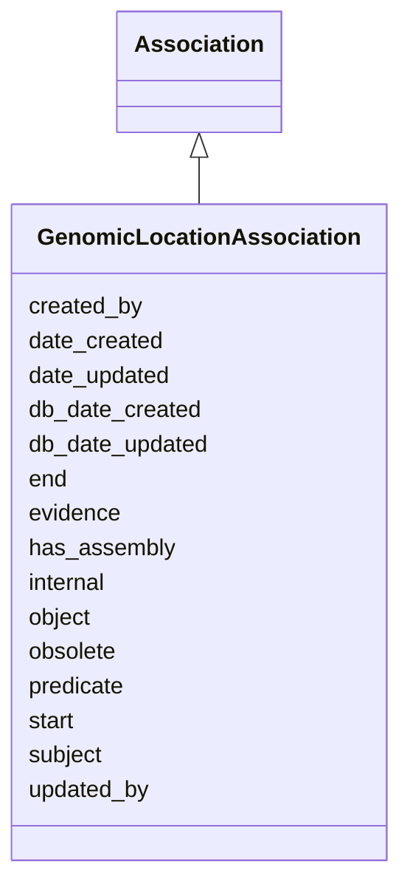

# GenomicLocationAssociation

None





URI: [alliance:GenomicLocationAssociation](http://alliancegenome.org/GenomicLocationAssociation)


## Parent Classes

* [AuditedObject](AuditedObject.md)
    * [Association](Association.md)
        * **GenomicLocationAssociation**


<!-- no inheritance hierarchy -->


## Slots

| Name | Description  |
| ---  | ---  |
| [created_by](created_by.md) | The individual that created the entity. |
| [date_created](date_created.md) | The date on which an entity was created. This can be applied to nodes or edges. |
| [date_updated](date_updated.md) | Date on which an entity was last modified. |
| [db_date_created](db_date_created.md) | The date on which an entity was created in the Alliance database.  This is disinct from date_created, which represents the date when the entity was originally created (i.e. at the MOD for imported data). |
| [db_date_updated](db_date_updated.md) | Date on which an entity was last modified in the Alliance database.  This is disinct from date_updated, which represents the date when the entity was last modified and may predate import into the Alliance database. |
| [end](end.md) | The end of the feature in positive 1-based integer coordinates |
| [evidence](evidence.md) |  |
| [has_assembly](has_assembly.md) | None |
| [internal](internal.md) | Classifies the entity as private (for internal use) or not (for public use). |
| [object](object.md) | object should be the chromosome identifier |
| [obsolete](obsolete.md) | Entity is no longer current. |
| [predicate](predicate.md) | A high-level grouping for the relationship type. This is analogous to category for nodes. In RDF, this corresponds to rdf:predicate and in Neo4j this corresponds to the relationship type. |
| [start](start.md) | The start of the feature in positive 1-based integer coordinates |
| [subject](subject.md) | subject should be a genomic entity |
| [updated_by](updated_by.md) | The individual that last modified the entity. |


## Mappings

| Mapping Type | Mapped Value |
| ---  | ---  |
| self | ['alliance:GenomicLocationAssociation'] |
| native | ['alliance:GenomicLocationAssociation'] |


## LinkML Specification

<!-- TODO: investigate https://stackoverflow.com/questions/37606292/how-to-create-tabbed-code-blocks-in-mkdocs-or-sphinx -->

### Direct

<details>
```yaml
name: GenomicLocationAssociation
from_schema: https://github.com/alliance-genome/agr_curation_schema/core.yaml
is_a: Association
slots:
- has_assembly
- start
- end
slot_usage:
  subject:
    name: subject
    description: subject should be a genomic entity
    domain_of:
    - Association
    - VariantConsequence
    range: GenomicEntity
  object:
    name: object
    description: object should be the chromosome identifier
    domain_of:
    - Association
    - VariantConsequence
    range: Chromosome
  predicate:
    name: predicate
    domain_of:
    - Association
    - GeneToGeneOrthology
    any_of:
    - equals_string: has_genomic_location
defining_slots:
- subject
- predicate
- object
- has_assembly
- start
- end

```
</details>

### Induced

<details>
```yaml
name: GenomicLocationAssociation
from_schema: https://github.com/alliance-genome/agr_curation_schema/core.yaml
is_a: Association
slot_usage:
  subject:
    name: subject
    description: subject should be a genomic entity
    domain_of:
    - Association
    - VariantConsequence
    range: GenomicEntity
  object:
    name: object
    description: object should be the chromosome identifier
    domain_of:
    - Association
    - VariantConsequence
    range: Chromosome
  predicate:
    name: predicate
    domain_of:
    - Association
    - GeneToGeneOrthology
    any_of:
    - equals_string: has_genomic_location
attributes:
  has_assembly:
    name: has_assembly
    from_schema: https://github.com/alliance-genome/agr_curation_schema/core.yaml
    domain: GenomicLocationAssociation
    alias: has_assembly
    owner: GenomicLocationAssociation
    domain_of:
    - GenomicLocationAssociation
    range: Assembly
    required: true
  start:
    name: start
    description: The start of the feature in positive 1-based integer coordinates
    from_schema: https://github.com/alliance-genome/agr_curation_schema/core.yaml
    alias: start
    owner: GenomicLocationAssociation
    domain_of:
    - GenomicLocationAssociation
    - GenomicLocationAssociationDTO
    range: integer
  end:
    name: end
    description: The end of the feature in positive 1-based integer coordinates
    from_schema: https://github.com/alliance-genome/agr_curation_schema/core.yaml
    alias: end
    owner: GenomicLocationAssociation
    domain_of:
    - GenomicLocationAssociation
    - GenomicLocationAssociationDTO
    range: integer
  subject:
    name: subject
    description: subject should be a genomic entity
    from_schema: https://github.com/alliance-genome/agr_curation_schema/core.yaml
    is_a: association_slot
    alias: subject
    owner: GenomicLocationAssociation
    domain_of:
    - Association
    - VariantConsequence
    range: GenomicEntity
    required: true
  predicate:
    name: predicate
    description: A high-level grouping for the relationship type. This is analogous
      to category for nodes. In RDF, this corresponds to rdf:predicate and in Neo4j
      this corresponds to the relationship type.
    from_schema: https://github.com/alliance-genome/agr_curation_schema/core.yaml
    is_a: association_slot
    alias: predicate
    owner: GenomicLocationAssociation
    domain_of:
    - Association
    - GeneToGeneOrthology
    range: string
    required: true
    any_of:
    - equals_string: has_genomic_location
  object:
    name: object
    description: object should be the chromosome identifier
    from_schema: https://github.com/alliance-genome/agr_curation_schema/core.yaml
    is_a: association_slot
    alias: object
    owner: GenomicLocationAssociation
    domain_of:
    - Association
    - VariantConsequence
    range: Chromosome
    required: true
  evidence:
    name: evidence
    description: ''
    from_schema: https://github.com/alliance-genome/agr_curation_schema/src/schema/reference
    multivalued: true
    alias: evidence
    owner: GenomicLocationAssociation
    domain_of:
    - AlleleGenerationMethodAssociation
    - Note
    - SlotAnnotation
    - Association
    range: InformationContentEntity
  created_by:
    name: created_by
    description: The individual that created the entity.
    from_schema: https://github.com/alliance-genome/agr_curation_schema/core.yaml
    domain: AuditedObject
    multivalued: false
    alias: created_by
    owner: GenomicLocationAssociation
    domain_of:
    - AuditedObject
    range: Person
  date_created:
    name: date_created
    description: The date on which an entity was created. This can be applied to nodes
      or edges.
    from_schema: https://github.com/alliance-genome/agr_curation_schema/core.yaml
    aliases:
    - creation_date
    exact_mappings:
    - dct:createdOn
    - WIKIDATA_PROPERTY:P577
    alias: date_created
    owner: GenomicLocationAssociation
    domain_of:
    - AuditedObject
    - AuditedObjectDTO
    range: datetime
  updated_by:
    name: updated_by
    description: The individual that last modified the entity.
    from_schema: https://github.com/alliance-genome/agr_curation_schema/core.yaml
    domain: AuditedObject
    multivalued: false
    alias: updated_by
    owner: GenomicLocationAssociation
    domain_of:
    - AuditedObject
    range: Person
  date_updated:
    name: date_updated
    description: Date on which an entity was last modified.
    from_schema: https://github.com/alliance-genome/agr_curation_schema/core.yaml
    aliases:
    - date_last_modified
    alias: date_updated
    owner: GenomicLocationAssociation
    domain_of:
    - AuditedObject
    - AuditedObjectDTO
    range: datetime
  db_date_created:
    name: db_date_created
    description: The date on which an entity was created in the Alliance database.  This
      is disinct from date_created, which represents the date when the entity was
      originally created (i.e. at the MOD for imported data).
    from_schema: https://github.com/alliance-genome/agr_curation_schema/core.yaml
    alias: db_date_created
    owner: GenomicLocationAssociation
    domain_of:
    - AuditedObject
    - AuditedObjectDTO
    range: datetime
  db_date_updated:
    name: db_date_updated
    description: Date on which an entity was last modified in the Alliance database.  This
      is disinct from date_updated, which represents the date when the entity was
      last modified and may predate import into the Alliance database.
    from_schema: https://github.com/alliance-genome/agr_curation_schema/core.yaml
    alias: db_date_updated
    owner: GenomicLocationAssociation
    domain_of:
    - AuditedObject
    - AuditedObjectDTO
    range: datetime
  internal:
    name: internal
    description: Classifies the entity as private (for internal use) or not (for public
      use).
    notes:
    - Default value is true.
    from_schema: https://github.com/alliance-genome/agr_curation_schema/core.yaml
    alias: internal
    owner: GenomicLocationAssociation
    domain_of:
    - AuditedObject
    - AuditedObjectDTO
    range: boolean
    required: true
  obsolete:
    name: obsolete
    description: Entity is no longer current.
    notes:
    - Obsolete entities are preserved in the database for posterity but should not
      be publicly displayed.
    from_schema: https://github.com/alliance-genome/agr_curation_schema/core.yaml
    alias: obsolete
    owner: GenomicLocationAssociation
    domain_of:
    - AuditedObject
    - AuditedObjectDTO
    range: boolean
defining_slots:
- subject
- predicate
- object
- has_assembly
- start
- end

```
</details>