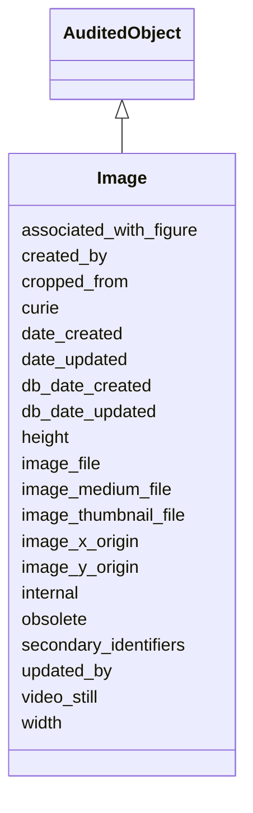

# Image

The set of files and metadata that constitute an image.





URI: [alliance:Image](http://alliancegenome.org/Image)


## Parent Classes

* [AuditedObject](AuditedObject.md)
    * **Image**


<!-- no inheritance hierarchy -->


## Slots

| Name | Description  |
| ---  | ---  |
| [associated_with_figure](associated_with_figure.md) | The figure to which the image belongs. |
| [created_by](created_by.md) | The individual that created the entity. |
| [cropped_from](cropped_from.md) | Another larger image from which this image was cropped. |
| [curie](curie.md) | A unique identifier for a thing. Must be either a CURIE shorthand for a URI or a complete URI |
| [date_created](date_created.md) | The date on which an entity was created. This can be applied to nodes or edges. |
| [date_updated](date_updated.md) | Date on which an entity was last modified. |
| [db_date_created](db_date_created.md) | The date on which an entity was created in the Alliance database.  This is disinct from date_created, which represents the date when the entity was originally created (i.e. at the MOD for imported data). |
| [db_date_updated](db_date_updated.md) | Date on which an entity was last modified in the Alliance database.  This is disinct from date_updated, which represents the date when the entity was last modified and may predate import into the Alliance database. |
| [height](height.md) | The height of the image (pixels). |
| [image_file](image_file.md) | The file representing the full-sized version of this image. |
| [image_medium_file](image_medium_file.md) | The file representing a medium-sized version of this image. |
| [image_thumbnail_file](image_thumbnail_file.md) | The file representing the thumbnail of this image. |
| [image_x_origin](image_x_origin.md) | The x coordinate within a larger source image from which the crop begins. |
| [image_y_origin](image_y_origin.md) | The y coordinate within a larger source image from which the crop begins. |
| [internal](internal.md) | Classifies the entity as private (for internal use) or not (for public use). |
| [obsolete](obsolete.md) | Entity is no longer current. |
| [secondary_identifiers](secondary_identifiers.md) | None |
| [updated_by](updated_by.md) | The individual that last modified the entity. |
| [video_still](video_still.md) | An image represents a video still. |
| [width](width.md) | The width of the image (pixels). |


## Mappings

| Mapping Type | Mapped Value |
| ---  | ---  |
| self | ['alliance:Image'] |
| native | ['alliance:Image'] |


## LinkML Specification

<!-- TODO: investigate https://stackoverflow.com/questions/37606292/how-to-create-tabbed-code-blocks-in-mkdocs-or-sphinx -->

### Direct

<details>
```yaml
name: Image
description: The set of files and metadata that constitute an image.
notes:
- Do we need a separate Image.label, or can it just use the label from the parent
  Figure entity?
from_schema: https://github.com/alliance-genome/agr_persistent_schema/src/schema/image.yaml
is_a: AuditedObject
slots:
- curie
- associated_with_figure
- width
- height
- image_file
- image_medium_file
- image_thumbnail_file
- cropped_from
- image_x_origin
- image_y_origin
- video_still
- secondary_identifiers
slot_usage:
  associated_with_figure:
    name: associated_with_figure
    description: The figure to which the image belongs.
    multivalued: false
    domain_of:
    - Image
    - ExpressionAnnotation
    required: true
  image_x_origin:
    name: image_x_origin
    description: The x coordinate within a larger source image from which the crop
      begins.
    domain: Image
    domain_of:
    - Image
    - ImagePane
  image_y_origin:
    name: image_y_origin
    description: The y coordinate within a larger source image from which the crop
      begins.
    domain: Image
    domain_of:
    - Image
    - ImagePane

```
</details>

### Induced

<details>
```yaml
name: Image
description: The set of files and metadata that constitute an image.
notes:
- Do we need a separate Image.label, or can it just use the label from the parent
  Figure entity?
from_schema: https://github.com/alliance-genome/agr_persistent_schema/src/schema/image.yaml
is_a: AuditedObject
slot_usage:
  associated_with_figure:
    name: associated_with_figure
    description: The figure to which the image belongs.
    multivalued: false
    domain_of:
    - Image
    - ExpressionAnnotation
    required: true
  image_x_origin:
    name: image_x_origin
    description: The x coordinate within a larger source image from which the crop
      begins.
    domain: Image
    domain_of:
    - Image
    - ImagePane
  image_y_origin:
    name: image_y_origin
    description: The y coordinate within a larger source image from which the crop
      begins.
    domain: Image
    domain_of:
    - Image
    - ImagePane
attributes:
  curie:
    name: curie
    description: A unique identifier for a thing. Must be either a CURIE shorthand
      for a URI or a complete URI
    from_schema: https://github.com/alliance-genome/agr_curation_schema/core.yaml
    multivalued: false
    identifier: true
    alias: curie
    owner: Image
    domain_of:
    - OntologyTerm
    - PhenotypeAnnotation
    - DiseaseAnnotation
    - BiologicalEntity
    - BiologicalEntityDTO
    - Chromosome
    - Assembly
    - Identifier
    - Figure
    - Image
    - Laboratory
    - InformationContentEntity
    - Reference
    - Resource
    - ModCorpusAssociation
    - GeneInteraction
    - ExpressionExperiment
    - GeneNomenclatureSet
    range: uriorcurie
  associated_with_figure:
    name: associated_with_figure
    description: The figure to which the image belongs.
    from_schema: https://github.com/alliance-genome/agr_persistent_schema/src/schema/image.yaml
    multivalued: false
    alias: associated_with_figure
    owner: Image
    domain_of:
    - Image
    - ExpressionAnnotation
    range: Figure
    required: true
  width:
    name: width
    description: The width of the image (pixels).
    from_schema: https://github.com/alliance-genome/agr_persistent_schema/src/schema/image.yaml
    domain: Image
    multivalued: false
    alias: width
    owner: Image
    domain_of:
    - Image
    - ImagePane
    range: integer
    required: true
  height:
    name: height
    description: The height of the image (pixels).
    from_schema: https://github.com/alliance-genome/agr_persistent_schema/src/schema/image.yaml
    domain: Image
    multivalued: false
    alias: height
    owner: Image
    domain_of:
    - Image
    - ImagePane
    range: integer
    required: true
  image_file:
    name: image_file
    description: The file representing the full-sized version of this image.
    from_schema: https://github.com/alliance-genome/agr_persistent_schema/src/schema/image.yaml
    domain: Image
    multivalued: false
    alias: image_file
    owner: Image
    domain_of:
    - Image
    range: File
    required: true
  image_medium_file:
    name: image_medium_file
    description: The file representing a medium-sized version of this image.
    from_schema: https://github.com/alliance-genome/agr_persistent_schema/src/schema/image.yaml
    domain: Image
    multivalued: false
    alias: image_medium_file
    owner: Image
    domain_of:
    - Image
    range: File
    required: true
  image_thumbnail_file:
    name: image_thumbnail_file
    description: The file representing the thumbnail of this image.
    from_schema: https://github.com/alliance-genome/agr_persistent_schema/src/schema/image.yaml
    domain: Image
    multivalued: false
    alias: image_thumbnail_file
    owner: Image
    domain_of:
    - Image
    range: File
    required: true
  cropped_from:
    name: cropped_from
    description: Another larger image from which this image was cropped.
    from_schema: https://github.com/alliance-genome/agr_persistent_schema/src/schema/image.yaml
    domain: Image
    multivalued: false
    alias: cropped_from
    owner: Image
    domain_of:
    - Image
    range: Image
    required: false
  image_x_origin:
    name: image_x_origin
    description: The x coordinate within a larger source image from which the crop
      begins.
    from_schema: https://github.com/alliance-genome/agr_persistent_schema/src/schema/image.yaml
    domain: Image
    multivalued: false
    alias: image_x_origin
    owner: Image
    domain_of:
    - Image
    - ImagePane
    range: integer
    required: false
  image_y_origin:
    name: image_y_origin
    description: The y coordinate within a larger source image from which the crop
      begins.
    from_schema: https://github.com/alliance-genome/agr_persistent_schema/src/schema/image.yaml
    domain: Image
    multivalued: false
    alias: image_y_origin
    owner: Image
    domain_of:
    - Image
    - ImagePane
    range: integer
    required: false
  video_still:
    name: video_still
    description: An image represents a video still.
    from_schema: https://github.com/alliance-genome/agr_persistent_schema/src/schema/image.yaml
    domain: Image
    alias: video_still
    owner: Image
    domain_of:
    - Image
    range: boolean
  secondary_identifiers:
    name: secondary_identifiers
    from_schema: https://github.com/alliance-genome/agr_curation_schema/core.yaml
    aliases:
    - secondary_ids
    multivalued: true
    alias: secondary_identifiers
    owner: Image
    domain_of:
    - OntologyTerm
    - GenomicEntity
    - GenomicEntityDTO
    - Figure
    - Image
    - Antibody
    range: uriorcurie
  created_by:
    name: created_by
    description: The individual that created the entity.
    from_schema: https://github.com/alliance-genome/agr_curation_schema/core.yaml
    domain: AuditedObject
    multivalued: false
    alias: created_by
    owner: Image
    domain_of:
    - AuditedObject
    range: Person
  date_created:
    name: date_created
    description: The date on which an entity was created. This can be applied to nodes
      or edges.
    from_schema: https://github.com/alliance-genome/agr_curation_schema/core.yaml
    aliases:
    - creation_date
    exact_mappings:
    - dct:createdOn
    - WIKIDATA_PROPERTY:P577
    alias: date_created
    owner: Image
    domain_of:
    - AuditedObject
    - AuditedObjectDTO
    range: datetime
  updated_by:
    name: updated_by
    description: The individual that last modified the entity.
    from_schema: https://github.com/alliance-genome/agr_curation_schema/core.yaml
    domain: AuditedObject
    multivalued: false
    alias: updated_by
    owner: Image
    domain_of:
    - AuditedObject
    range: Person
  date_updated:
    name: date_updated
    description: Date on which an entity was last modified.
    from_schema: https://github.com/alliance-genome/agr_curation_schema/core.yaml
    aliases:
    - date_last_modified
    alias: date_updated
    owner: Image
    domain_of:
    - AuditedObject
    - AuditedObjectDTO
    range: datetime
  db_date_created:
    name: db_date_created
    description: The date on which an entity was created in the Alliance database.  This
      is disinct from date_created, which represents the date when the entity was
      originally created (i.e. at the MOD for imported data).
    from_schema: https://github.com/alliance-genome/agr_curation_schema/core.yaml
    alias: db_date_created
    owner: Image
    domain_of:
    - AuditedObject
    - AuditedObjectDTO
    range: datetime
  db_date_updated:
    name: db_date_updated
    description: Date on which an entity was last modified in the Alliance database.  This
      is disinct from date_updated, which represents the date when the entity was
      last modified and may predate import into the Alliance database.
    from_schema: https://github.com/alliance-genome/agr_curation_schema/core.yaml
    alias: db_date_updated
    owner: Image
    domain_of:
    - AuditedObject
    - AuditedObjectDTO
    range: datetime
  internal:
    name: internal
    description: Classifies the entity as private (for internal use) or not (for public
      use).
    notes:
    - Default value is true.
    from_schema: https://github.com/alliance-genome/agr_curation_schema/core.yaml
    alias: internal
    owner: Image
    domain_of:
    - AuditedObject
    - AuditedObjectDTO
    range: boolean
    required: true
  obsolete:
    name: obsolete
    description: Entity is no longer current.
    notes:
    - Obsolete entities are preserved in the database for posterity but should not
      be publicly displayed.
    from_schema: https://github.com/alliance-genome/agr_curation_schema/core.yaml
    alias: obsolete
    owner: Image
    domain_of:
    - AuditedObject
    - AuditedObjectDTO
    range: boolean

```
</details>