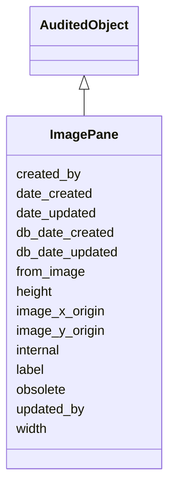

# ImagePane

Part of an Image that is relevant to some annotation. An annotation may reference many panes of an Image.





URI: [alliance:ImagePane](http://alliancegenome.org/ImagePane)


## Parent Classes

* [AuditedObject](AuditedObject.md)
    * **ImagePane**


<!-- no inheritance hierarchy -->


## Slots

| Name | Description  |
| ---  | ---  |
| [created_by](created_by.md) | The individual that created the entity. |
| [date_created](date_created.md) | The date on which an entity was created. This can be applied to nodes or edges. |
| [date_updated](date_updated.md) | Date on which an entity was last modified. |
| [db_date_created](db_date_created.md) | The date on which an entity was created in the Alliance database.  This is disinct from date_created, which represents the date when the entity was originally created (i.e. at the MOD for imported data). |
| [db_date_updated](db_date_updated.md) | Date on which an entity was last modified in the Alliance database.  This is disinct from date_updated, which represents the date when the entity was last modified and may predate import into the Alliance database. |
| [from_image](from_image.md) | Holds between an ImagePane and an Image. |
| [height](height.md) | The height of the image (pixels). |
| [image_x_origin](image_x_origin.md) | The x coordinate within a larger source image from which the pane begins. |
| [image_y_origin](image_y_origin.md) | The y coordinate within a larger source image from which the pane begins. |
| [internal](internal.md) | Classifies the entity as private (for internal use) or not (for public use). |
| [label](label.md) | A short display name for the figure. For example: Figure 2, Figure 3B |
| [obsolete](obsolete.md) | Entity is no longer current. |
| [updated_by](updated_by.md) | The individual that last modified the entity. |
| [width](width.md) | The width of the image (pixels). |


## Mappings

| Mapping Type | Mapped Value |
| ---  | ---  |
| self | ['alliance:ImagePane'] |
| native | ['alliance:ImagePane'] |


## LinkML Specification

<!-- TODO: investigate https://stackoverflow.com/questions/37606292/how-to-create-tabbed-code-blocks-in-mkdocs-or-sphinx -->

### Direct

<details>
```yaml
name: ImagePane
description: Part of an Image that is relevant to some annotation. An annotation may
  reference many panes of an Image.
notes:
- An image pane can encompass an entire image.
from_schema: https://github.com/alliance-genome/agr_persistent_schema/src/schema/image.yaml
is_a: AuditedObject
slots:
- from_image
- label
- width
- height
- image_x_origin
- image_y_origin
slot_usage:
  from_image:
    name: from_image
    multivalued: false
    domain_of:
    - ImagePane
    required: true
  image_x_origin:
    name: image_x_origin
    description: The x coordinate within a larger source image from which the pane
      begins.
    domain: ImagePane
    domain_of:
    - Image
    - ImagePane
  image_y_origin:
    name: image_y_origin
    description: The y coordinate within a larger source image from which the pane
      begins.
    domain: ImagePane
    domain_of:
    - Image
    - ImagePane

```
</details>

### Induced

<details>
```yaml
name: ImagePane
description: Part of an Image that is relevant to some annotation. An annotation may
  reference many panes of an Image.
notes:
- An image pane can encompass an entire image.
from_schema: https://github.com/alliance-genome/agr_persistent_schema/src/schema/image.yaml
is_a: AuditedObject
slot_usage:
  from_image:
    name: from_image
    multivalued: false
    domain_of:
    - ImagePane
    required: true
  image_x_origin:
    name: image_x_origin
    description: The x coordinate within a larger source image from which the pane
      begins.
    domain: ImagePane
    domain_of:
    - Image
    - ImagePane
  image_y_origin:
    name: image_y_origin
    description: The y coordinate within a larger source image from which the pane
      begins.
    domain: ImagePane
    domain_of:
    - Image
    - ImagePane
attributes:
  from_image:
    name: from_image
    description: Holds between an ImagePane and an Image.
    from_schema: https://github.com/alliance-genome/agr_persistent_schema/src/schema/image.yaml
    domain: ImagePane
    multivalued: false
    alias: from_image
    owner: ImagePane
    domain_of:
    - ImagePane
    range: Image
    required: true
  label:
    name: label
    description: 'A short display name for the figure. For example: Figure 2, Figure
      3B'
    from_schema: https://github.com/alliance-genome/agr_persistent_schema/src/schema/image.yaml
    alias: label
    owner: ImagePane
    domain_of:
    - Figure
    - ImagePane
    range: string
  width:
    name: width
    description: The width of the image (pixels).
    from_schema: https://github.com/alliance-genome/agr_persistent_schema/src/schema/image.yaml
    domain: Image
    multivalued: false
    alias: width
    owner: ImagePane
    domain_of:
    - Image
    - ImagePane
    range: integer
    required: true
  height:
    name: height
    description: The height of the image (pixels).
    from_schema: https://github.com/alliance-genome/agr_persistent_schema/src/schema/image.yaml
    domain: Image
    multivalued: false
    alias: height
    owner: ImagePane
    domain_of:
    - Image
    - ImagePane
    range: integer
    required: true
  image_x_origin:
    name: image_x_origin
    description: The x coordinate within a larger source image from which the pane
      begins.
    from_schema: https://github.com/alliance-genome/agr_persistent_schema/src/schema/image.yaml
    domain: ImagePane
    multivalued: false
    alias: image_x_origin
    owner: ImagePane
    domain_of:
    - Image
    - ImagePane
    range: integer
    required: false
  image_y_origin:
    name: image_y_origin
    description: The y coordinate within a larger source image from which the pane
      begins.
    from_schema: https://github.com/alliance-genome/agr_persistent_schema/src/schema/image.yaml
    domain: ImagePane
    multivalued: false
    alias: image_y_origin
    owner: ImagePane
    domain_of:
    - Image
    - ImagePane
    range: integer
    required: false
  created_by:
    name: created_by
    description: The individual that created the entity.
    from_schema: https://github.com/alliance-genome/agr_curation_schema/core.yaml
    domain: AuditedObject
    multivalued: false
    alias: created_by
    owner: ImagePane
    domain_of:
    - AuditedObject
    range: Person
  date_created:
    name: date_created
    description: The date on which an entity was created. This can be applied to nodes
      or edges.
    from_schema: https://github.com/alliance-genome/agr_curation_schema/core.yaml
    aliases:
    - creation_date
    exact_mappings:
    - dct:createdOn
    - WIKIDATA_PROPERTY:P577
    alias: date_created
    owner: ImagePane
    domain_of:
    - AuditedObject
    - AuditedObjectDTO
    range: datetime
  updated_by:
    name: updated_by
    description: The individual that last modified the entity.
    from_schema: https://github.com/alliance-genome/agr_curation_schema/core.yaml
    domain: AuditedObject
    multivalued: false
    alias: updated_by
    owner: ImagePane
    domain_of:
    - AuditedObject
    range: Person
  date_updated:
    name: date_updated
    description: Date on which an entity was last modified.
    from_schema: https://github.com/alliance-genome/agr_curation_schema/core.yaml
    aliases:
    - date_last_modified
    alias: date_updated
    owner: ImagePane
    domain_of:
    - AuditedObject
    - AuditedObjectDTO
    range: datetime
  db_date_created:
    name: db_date_created
    description: The date on which an entity was created in the Alliance database.  This
      is disinct from date_created, which represents the date when the entity was
      originally created (i.e. at the MOD for imported data).
    from_schema: https://github.com/alliance-genome/agr_curation_schema/core.yaml
    alias: db_date_created
    owner: ImagePane
    domain_of:
    - AuditedObject
    - AuditedObjectDTO
    range: datetime
  db_date_updated:
    name: db_date_updated
    description: Date on which an entity was last modified in the Alliance database.  This
      is disinct from date_updated, which represents the date when the entity was
      last modified and may predate import into the Alliance database.
    from_schema: https://github.com/alliance-genome/agr_curation_schema/core.yaml
    alias: db_date_updated
    owner: ImagePane
    domain_of:
    - AuditedObject
    - AuditedObjectDTO
    range: datetime
  internal:
    name: internal
    description: Classifies the entity as private (for internal use) or not (for public
      use).
    notes:
    - Default value is true.
    from_schema: https://github.com/alliance-genome/agr_curation_schema/core.yaml
    alias: internal
    owner: ImagePane
    domain_of:
    - AuditedObject
    - AuditedObjectDTO
    range: boolean
    required: true
  obsolete:
    name: obsolete
    description: Entity is no longer current.
    notes:
    - Obsolete entities are preserved in the database for posterity but should not
      be publicly displayed.
    from_schema: https://github.com/alliance-genome/agr_curation_schema/core.yaml
    alias: obsolete
    owner: ImagePane
    domain_of:
    - AuditedObject
    - AuditedObjectDTO
    range: boolean

```
</details>