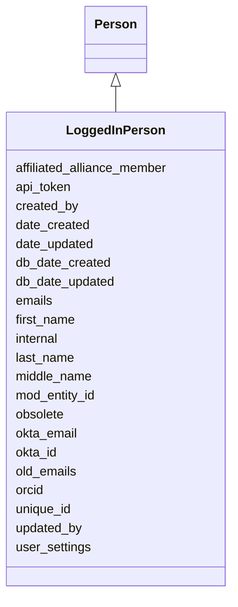

# LoggedInPerson

None





URI: [alliance:LoggedInPerson](http://alliancegenome.org/LoggedInPerson)


## Parent Classes

* [AuditedObject](AuditedObject.md)
    * [Agent](Agent.md)
        * [Person](Person.md)
            * **LoggedInPerson**


<!-- no inheritance hierarchy -->


## Slots

| Name | Description  |
| ---  | ---  |
| [affiliated_alliance_member](affiliated_alliance_member.md) | The Alliance Member the person is affiliated with |
| [api_token](api_token.md) | The API token of the LoggedInPerson for the curation system |
| [created_by](created_by.md) | The individual that created the entity. |
| [date_created](date_created.md) | The date on which an entity was created. This can be applied to nodes or edges. |
| [date_updated](date_updated.md) | Date on which an entity was last modified. |
| [db_date_created](db_date_created.md) | The date on which an entity was created in the Alliance database.  This is disinct from date_created, which represents the date when the entity was originally created (i.e. at the MOD for imported data). |
| [db_date_updated](db_date_updated.md) | Date on which an entity was last modified in the Alliance database.  This is disinct from date_updated, which represents the date when the entity was last modified and may predate import into the Alliance database. |
| [emails](emails.md) | list of emails for a person |
| [first_name](first_name.md) | first name of a person |
| [internal](internal.md) | Classifies the entity as private (for internal use) or not (for public use). |
| [last_name](last_name.md) | last (family) name of a person |
| [middle_name](middle_name.md) | middle names of a person |
| [mod_entity_id](mod_entity_id.md) | The model organism database (MOD) identifier/curie for the object |
| [obsolete](obsolete.md) | Entity is no longer current. |
| [okta_email](okta_email.md) | The email address of the LoggedInPerson registered with Okta for user authentication |
| [okta_id](okta_id.md) | The Okta identifier for the person registered in Okta for user authentication |
| [old_emails](old_emails.md) | list of old (outdated) emails for a person |
| [orcid](orcid.md) | Open Researcher and Contributor ID |
| [unique_id](unique_id.md) | A non-curie unique identifier for a thing. |
| [updated_by](updated_by.md) | The individual that last modified the entity. |
| [user_settings](user_settings.md) | JSON Blob containing details of UI settings for LoggedInPerson |


## Mappings

| Mapping Type | Mapped Value |
| ---  | ---  |
| self | ['alliance:LoggedInPerson'] |
| native | ['alliance:LoggedInPerson'] |


## LinkML Specification

<!-- TODO: investigate https://stackoverflow.com/questions/37606292/how-to-create-tabbed-code-blocks-in-mkdocs-or-sphinx -->

### Direct

<details>
```yaml
name: LoggedInPerson
from_schema: https://github.com/alliance-genome/agr_curation_schema/src/schema/person
is_a: Person
slots:
- okta_id
- okta_email
- user_settings
- api_token
slot_usage:
  okta_id:
    name: okta_id
    domain_of:
    - LoggedInPerson
    required: true
  okta_email:
    name: okta_email
    domain_of:
    - LoggedInPerson
    required: true

```
</details>

### Induced

<details>
```yaml
name: LoggedInPerson
from_schema: https://github.com/alliance-genome/agr_curation_schema/src/schema/person
is_a: Person
slot_usage:
  okta_id:
    name: okta_id
    domain_of:
    - LoggedInPerson
    required: true
  okta_email:
    name: okta_email
    domain_of:
    - LoggedInPerson
    required: true
attributes:
  okta_id:
    name: okta_id
    description: The Okta identifier for the person registered in Okta for user authentication
    from_schema: https://github.com/alliance-genome/agr_curation_schema/src/schema/person
    domain: LoggedInPerson
    multivalued: false
    alias: okta_id
    owner: LoggedInPerson
    domain_of:
    - LoggedInPerson
    range: string
    required: true
  okta_email:
    name: okta_email
    description: The email address of the LoggedInPerson registered with Okta for
      user authentication
    from_schema: https://github.com/alliance-genome/agr_curation_schema/src/schema/person
    domain: LoggedInPerson
    multivalued: false
    alias: okta_email
    owner: LoggedInPerson
    domain_of:
    - LoggedInPerson
    range: string
    required: true
  user_settings:
    name: user_settings
    description: JSON Blob containing details of UI settings for LoggedInPerson
    from_schema: https://github.com/alliance-genome/agr_curation_schema/src/schema/person
    domain: LoggedInPerson
    multivalued: false
    alias: user_settings
    owner: LoggedInPerson
    domain_of:
    - LoggedInPerson
    range: string
  api_token:
    name: api_token
    description: The API token of the LoggedInPerson for the curation system
    from_schema: https://github.com/alliance-genome/agr_curation_schema/src/schema/person
    domain: LoggedInPerson
    alias: api_token
    owner: LoggedInPerson
    domain_of:
    - LoggedInPerson
    range: string
  last_name:
    name: last_name
    description: last (family) name of a person
    from_schema: https://github.com/alliance-genome/agr_curation_schema/core.yaml
    alias: last_name
    owner: LoggedInPerson
    domain_of:
    - Person
    - AuthorReference
    range: string
  middle_name:
    name: middle_name
    description: middle names of a person
    from_schema: https://github.com/alliance-genome/agr_curation_schema/core.yaml
    multivalued: false
    alias: middle_name
    owner: LoggedInPerson
    domain_of:
    - Person
    range: string
  first_name:
    name: first_name
    description: first name of a person
    from_schema: https://github.com/alliance-genome/agr_curation_schema/core.yaml
    alias: first_name
    owner: LoggedInPerson
    domain_of:
    - Person
    - AuthorReference
    range: string
  orcid:
    name: orcid
    description: Open Researcher and Contributor ID
    from_schema: https://github.com/alliance-genome/agr_curation_schema/src/schema/person
    domain: Person
    multivalued: false
    alias: orcid
    owner: LoggedInPerson
    domain_of:
    - Person
    range: uriorcurie
  emails:
    name: emails
    description: list of emails for a person
    from_schema: https://github.com/alliance-genome/agr_curation_schema/src/schema/person
    multivalued: true
    alias: emails
    owner: LoggedInPerson
    domain_of:
    - Person
    range: string
  old_emails:
    name: old_emails
    description: list of old (outdated) emails for a person
    from_schema: https://github.com/alliance-genome/agr_curation_schema/src/schema/person
    multivalued: true
    alias: old_emails
    owner: LoggedInPerson
    domain_of:
    - Person
    range: string
  mod_entity_id:
    name: mod_entity_id
    description: The model organism database (MOD) identifier/curie for the object
    from_schema: https://github.com/alliance-genome/agr_curation_schema/core.yaml
    alias: mod_entity_id
    owner: LoggedInPerson
    domain_of:
    - DiseaseAnnotation
    - DiseaseAnnotationDTO
    - Person
    range: string
  unique_id:
    name: unique_id
    description: A non-curie unique identifier for a thing.
    from_schema: https://github.com/alliance-genome/agr_curation_schema/core.yaml
    multivalued: false
    identifier: true
    alias: unique_id
    owner: LoggedInPerson
    domain_of:
    - DiseaseAnnotation
    - ExperimentalCondition
    - ConditionRelation
    - Person
    range: string
  affiliated_alliance_member:
    name: affiliated_alliance_member
    description: The Alliance Member the person is affiliated with
    from_schema: https://github.com/alliance-genome/agr_curation_schema/src/schema/person
    domain: Person
    alias: affiliated_alliance_member
    owner: LoggedInPerson
    domain_of:
    - Person
    range: AllianceMember
  created_by:
    name: created_by
    description: The individual that created the entity.
    from_schema: https://github.com/alliance-genome/agr_curation_schema/core.yaml
    domain: AuditedObject
    multivalued: false
    alias: created_by
    owner: LoggedInPerson
    domain_of:
    - AuditedObject
    range: Person
  date_created:
    name: date_created
    description: The date on which an entity was created. This can be applied to nodes
      or edges.
    from_schema: https://github.com/alliance-genome/agr_curation_schema/core.yaml
    aliases:
    - creation_date
    exact_mappings:
    - dct:createdOn
    - WIKIDATA_PROPERTY:P577
    alias: date_created
    owner: LoggedInPerson
    domain_of:
    - AuditedObject
    - AuditedObjectDTO
    range: datetime
  updated_by:
    name: updated_by
    description: The individual that last modified the entity.
    from_schema: https://github.com/alliance-genome/agr_curation_schema/core.yaml
    domain: AuditedObject
    multivalued: false
    alias: updated_by
    owner: LoggedInPerson
    domain_of:
    - AuditedObject
    range: Person
  date_updated:
    name: date_updated
    description: Date on which an entity was last modified.
    from_schema: https://github.com/alliance-genome/agr_curation_schema/core.yaml
    aliases:
    - date_last_modified
    alias: date_updated
    owner: LoggedInPerson
    domain_of:
    - AuditedObject
    - AuditedObjectDTO
    range: datetime
  db_date_created:
    name: db_date_created
    description: The date on which an entity was created in the Alliance database.  This
      is disinct from date_created, which represents the date when the entity was
      originally created (i.e. at the MOD for imported data).
    from_schema: https://github.com/alliance-genome/agr_curation_schema/core.yaml
    alias: db_date_created
    owner: LoggedInPerson
    domain_of:
    - AuditedObject
    - AuditedObjectDTO
    range: datetime
  db_date_updated:
    name: db_date_updated
    description: Date on which an entity was last modified in the Alliance database.  This
      is disinct from date_updated, which represents the date when the entity was
      last modified and may predate import into the Alliance database.
    from_schema: https://github.com/alliance-genome/agr_curation_schema/core.yaml
    alias: db_date_updated
    owner: LoggedInPerson
    domain_of:
    - AuditedObject
    - AuditedObjectDTO
    range: datetime
  internal:
    name: internal
    description: Classifies the entity as private (for internal use) or not (for public
      use).
    notes:
    - Default value is true.
    from_schema: https://github.com/alliance-genome/agr_curation_schema/core.yaml
    alias: internal
    owner: LoggedInPerson
    domain_of:
    - AuditedObject
    - AuditedObjectDTO
    range: boolean
    required: true
  obsolete:
    name: obsolete
    description: Entity is no longer current.
    notes:
    - Obsolete entities are preserved in the database for posterity but should not
      be publicly displayed.
    from_schema: https://github.com/alliance-genome/agr_curation_schema/core.yaml
    alias: obsolete
    owner: LoggedInPerson
    domain_of:
    - AuditedObject
    - AuditedObjectDTO
    range: boolean

```
</details>