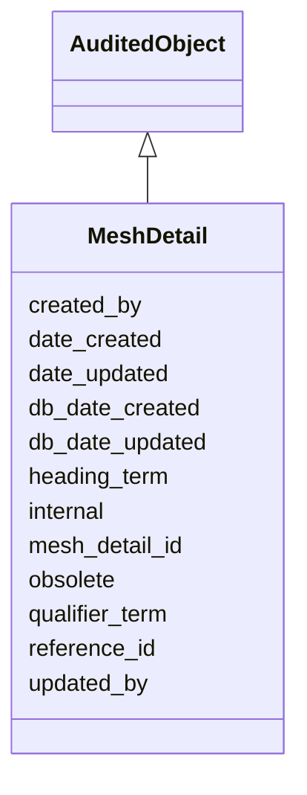

# MeshDetail

Medical Subject Headings information coming from PubMed.





URI: [alliance:MeshDetail](http://alliancegenome.org/MeshDetail)


## Parent Classes

* [AuditedObject](AuditedObject.md)
    * **MeshDetail**


<!-- no inheritance hierarchy -->


## Slots

| Name | Description  |
| ---  | ---  |
| [created_by](created_by.md) | The individual that created the entity. |
| [date_created](date_created.md) | The date on which an entity was created. This can be applied to nodes or edges. |
| [date_updated](date_updated.md) | Date on which an entity was last modified. |
| [db_date_created](db_date_created.md) | The date on which an entity was created in the Alliance database.  This is disinct from date_created, which represents the date when the entity was originally created (i.e. at the MOD for imported data). |
| [db_date_updated](db_date_updated.md) | Date on which an entity was last modified in the Alliance database.  This is disinct from date_updated, which represents the date when the entity was last modified and may predate import into the Alliance database. |
| [heading_term](heading_term.md) | The MeSH term description or definition from PubMed. e.g. Measles in a Measles/epidemiology term. |
| [internal](internal.md) | Classifies the entity as private (for internal use) or not (for public use). |
| [mesh_detail_id](mesh_detail_id.md) | The primary key for a MeshDetail object. |
| [obsolete](obsolete.md) | Entity is no longer current. |
| [qualifier_term](qualifier_term.md) | The MeSH term subheading from PubMed, to narrow down the topic. e.g. epidemiology in a Measles/epidemiology term. |
| [reference_id](reference_id.md) | Here, a foreign key referring to the references table. |
| [updated_by](updated_by.md) | The individual that last modified the entity. |


## Mappings

| Mapping Type | Mapped Value |
| ---  | ---  |
| self | ['alliance:MeshDetail'] |
| native | ['alliance:MeshDetail'] |


## LinkML Specification

<!-- TODO: investigate https://stackoverflow.com/questions/37606292/how-to-create-tabbed-code-blocks-in-mkdocs-or-sphinx -->

### Direct

<details>
```yaml
name: MeshDetail
description: Medical Subject Headings information coming from PubMed.
notes:
- In the literature database, the table is named mesh_details. In the literature API,
  the field is named mesh_terms.
from_schema: https://github.com/alliance-genome/agr_curation_schema/src/schema/reference
aliases:
- mesh_details
- mesh_terms
is_a: AuditedObject
slots:
- mesh_detail_id
- reference_id
- heading_term
- qualifier_term
slot_usage:
  reference_id:
    name: reference_id
    description: Here, a foreign key referring to the references table.
    domain_of:
    - Reference
    - MeshDetail
    - ModCorpusAssociation

```
</details>

### Induced

<details>
```yaml
name: MeshDetail
description: Medical Subject Headings information coming from PubMed.
notes:
- In the literature database, the table is named mesh_details. In the literature API,
  the field is named mesh_terms.
from_schema: https://github.com/alliance-genome/agr_curation_schema/src/schema/reference
aliases:
- mesh_details
- mesh_terms
is_a: AuditedObject
slot_usage:
  reference_id:
    name: reference_id
    description: Here, a foreign key referring to the references table.
    domain_of:
    - Reference
    - MeshDetail
    - ModCorpusAssociation
attributes:
  mesh_detail_id:
    name: mesh_detail_id
    description: The primary key for a MeshDetail object.
    from_schema: https://github.com/alliance-genome/agr_curation_schema/src/schema/reference
    domain: MeshDetail
    alias: mesh_detail_id
    owner: MeshDetail
    domain_of:
    - MeshDetail
    range: integer
    required: true
  reference_id:
    name: reference_id
    description: Here, a foreign key referring to the references table.
    from_schema: https://github.com/alliance-genome/agr_curation_schema/src/schema/reference
    is_a: table_key
    multivalued: false
    alias: reference_id
    owner: MeshDetail
    domain_of:
    - Reference
    - MeshDetail
    - ModCorpusAssociation
    range: integer
    required: true
  heading_term:
    name: heading_term
    description: The MeSH term description or definition from PubMed. e.g. Measles
      in a Measles/epidemiology term.
    from_schema: https://github.com/alliance-genome/agr_curation_schema/src/schema/reference
    domain: MeshDetail
    multivalued: false
    alias: heading_term
    owner: MeshDetail
    domain_of:
    - MeshDetail
    range: string
    required: true
  qualifier_term:
    name: qualifier_term
    description: The MeSH term subheading from PubMed, to narrow down the topic. e.g.
      epidemiology in a Measles/epidemiology term.
    from_schema: https://github.com/alliance-genome/agr_curation_schema/src/schema/reference
    domain: MeshDetail
    multivalued: false
    alias: qualifier_term
    owner: MeshDetail
    domain_of:
    - MeshDetail
    range: string
    required: false
  created_by:
    name: created_by
    description: The individual that created the entity.
    from_schema: https://github.com/alliance-genome/agr_curation_schema/core.yaml
    domain: AuditedObject
    multivalued: false
    alias: created_by
    owner: MeshDetail
    domain_of:
    - AuditedObject
    range: Person
  date_created:
    name: date_created
    description: The date on which an entity was created. This can be applied to nodes
      or edges.
    from_schema: https://github.com/alliance-genome/agr_curation_schema/core.yaml
    aliases:
    - creation_date
    exact_mappings:
    - dct:createdOn
    - WIKIDATA_PROPERTY:P577
    alias: date_created
    owner: MeshDetail
    domain_of:
    - AuditedObject
    - AuditedObjectDTO
    range: datetime
  updated_by:
    name: updated_by
    description: The individual that last modified the entity.
    from_schema: https://github.com/alliance-genome/agr_curation_schema/core.yaml
    domain: AuditedObject
    multivalued: false
    alias: updated_by
    owner: MeshDetail
    domain_of:
    - AuditedObject
    range: Person
  date_updated:
    name: date_updated
    description: Date on which an entity was last modified.
    from_schema: https://github.com/alliance-genome/agr_curation_schema/core.yaml
    aliases:
    - date_last_modified
    alias: date_updated
    owner: MeshDetail
    domain_of:
    - AuditedObject
    - AuditedObjectDTO
    range: datetime
  db_date_created:
    name: db_date_created
    description: The date on which an entity was created in the Alliance database.  This
      is disinct from date_created, which represents the date when the entity was
      originally created (i.e. at the MOD for imported data).
    from_schema: https://github.com/alliance-genome/agr_curation_schema/core.yaml
    alias: db_date_created
    owner: MeshDetail
    domain_of:
    - AuditedObject
    - AuditedObjectDTO
    range: datetime
  db_date_updated:
    name: db_date_updated
    description: Date on which an entity was last modified in the Alliance database.  This
      is disinct from date_updated, which represents the date when the entity was
      last modified and may predate import into the Alliance database.
    from_schema: https://github.com/alliance-genome/agr_curation_schema/core.yaml
    alias: db_date_updated
    owner: MeshDetail
    domain_of:
    - AuditedObject
    - AuditedObjectDTO
    range: datetime
  internal:
    name: internal
    description: Classifies the entity as private (for internal use) or not (for public
      use).
    notes:
    - Default value is true.
    from_schema: https://github.com/alliance-genome/agr_curation_schema/core.yaml
    alias: internal
    owner: MeshDetail
    domain_of:
    - AuditedObject
    - AuditedObjectDTO
    range: boolean
    required: true
  obsolete:
    name: obsolete
    description: Entity is no longer current.
    notes:
    - Obsolete entities are preserved in the database for posterity but should not
      be publicly displayed.
    from_schema: https://github.com/alliance-genome/agr_curation_schema/core.yaml
    alias: obsolete
    owner: MeshDetail
    domain_of:
    - AuditedObject
    - AuditedObjectDTO
    range: boolean

```
</details>