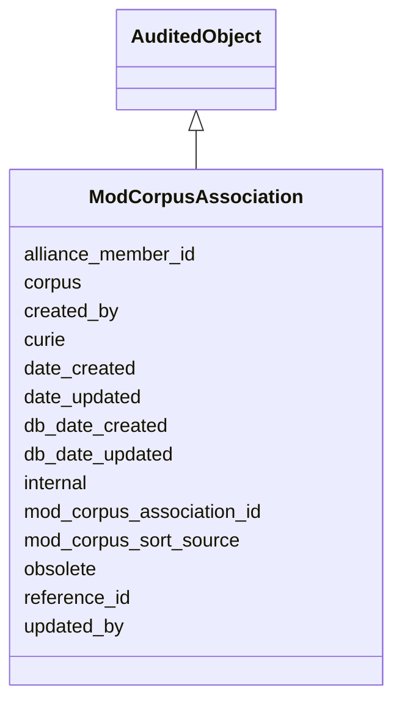

# ModCorpusAssociation

For a given reference and Mod, whether it is inside corpus, outside corpus, or needs review, as well as where this sorting came from.





URI: [alliance:ModCorpusAssociation](http://alliancegenome.org/ModCorpusAssociation)


## Parent Classes

* [AuditedObject](AuditedObject.md)
    * **ModCorpusAssociation**


<!-- no inheritance hierarchy -->


## Slots

| Name | Description  |
| ---  | ---  |
| [alliance_member_id](alliance_member_id.md) | An integer referring to an AllianceMember object in the AllianceMember/MOD database table. It's a primary key in the AllianceMember/MOD table, a foreign key if used in other tables. |
| [corpus](corpus.md) | in-out-review corpus status of the publication at the mod. null means needs_review, false means outside_corpus,  true means inside_corpus. |
| [created_by](created_by.md) | The individual that created the entity. |
| [curie](curie.md) | A unique identifier for a thing. Must be either a CURIE shorthand for a URI or a complete URI |
| [date_created](date_created.md) | The date on which an entity was created. This can be applied to nodes or edges. |
| [date_updated](date_updated.md) | Date on which an entity was last modified. |
| [db_date_created](db_date_created.md) | The date on which an entity was created in the Alliance database.  This is disinct from date_created, which represents the date when the entity was originally created (i.e. at the MOD for imported data). |
| [db_date_updated](db_date_updated.md) | Date on which an entity was last modified in the Alliance database.  This is disinct from date_updated, which represents the date when the entity was last modified and may predate import into the Alliance database. |
| [internal](internal.md) | Classifies the entity as private (for internal use) or not (for public use). |
| [mod_corpus_association_id](mod_corpus_association_id.md) | An integer referring to a ModCorpusAssociation object. A primary key in the mod_corpus_association table, a foreign key if used in other tables. |
| [mod_corpus_sort_source](mod_corpus_sort_source.md) | origin of corpus determination for that publication and mod |
| [obsolete](obsolete.md) | Entity is no longer current. |
| [reference_id](reference_id.md) | An integer referring to a Reference object in the references table. It's a primary key in the references table, a foreign key when in other tables. |
| [updated_by](updated_by.md) | The individual that last modified the entity. |


## Mappings

| Mapping Type | Mapped Value |
| ---  | ---  |
| self | ['alliance:ModCorpusAssociation'] |
| native | ['alliance:ModCorpusAssociation'] |


## LinkML Specification

<!-- TODO: investigate https://stackoverflow.com/questions/37606292/how-to-create-tabbed-code-blocks-in-mkdocs-or-sphinx -->

### Direct

<details>
```yaml
name: ModCorpusAssociation
description: For a given reference and Mod, whether it is inside corpus, outside corpus,
  or needs review, as well as where this sorting came from.
notes:
- There should be only one corpus call for any given reference-mod pair.
from_schema: https://github.com/alliance-genome/agr_curation_schema/src/schema/modCorpusAssociation
is_a: AuditedObject
slots:
- corpus
- mod_corpus_association_id
- mod_corpus_sort_source
- alliance_member_id
- reference_id
- curie
slot_usage:
  alliance_member_id:
    name: alliance_member_id
    notes:
    - An integer corresponding to a primary key in the AllianceMember/MOD table. Used
      here as a foreign key.
    domain_of:
    - AllianceMember
    - ModCorpusAssociation
  reference_id:
    name: reference_id
    notes:
    - An integer corresponding to a primary key in the reference table. Used here
      as a foreign key.
    domain_of:
    - Reference
    - MeshDetail
    - ModCorpusAssociation
  date_created:
    name: date_created
    domain_of:
    - AuditedObject
    - AuditedObjectDTO
    required: true
defining_slots:
- reference_id
- alliance_member_id

```
</details>

### Induced

<details>
```yaml
name: ModCorpusAssociation
description: For a given reference and Mod, whether it is inside corpus, outside corpus,
  or needs review, as well as where this sorting came from.
notes:
- There should be only one corpus call for any given reference-mod pair.
from_schema: https://github.com/alliance-genome/agr_curation_schema/src/schema/modCorpusAssociation
is_a: AuditedObject
slot_usage:
  alliance_member_id:
    name: alliance_member_id
    notes:
    - An integer corresponding to a primary key in the AllianceMember/MOD table. Used
      here as a foreign key.
    domain_of:
    - AllianceMember
    - ModCorpusAssociation
  reference_id:
    name: reference_id
    notes:
    - An integer corresponding to a primary key in the reference table. Used here
      as a foreign key.
    domain_of:
    - Reference
    - MeshDetail
    - ModCorpusAssociation
  date_created:
    name: date_created
    domain_of:
    - AuditedObject
    - AuditedObjectDTO
    required: true
attributes:
  corpus:
    name: corpus
    description: in-out-review corpus status of the publication at the mod. null means
      needs_review, false means outside_corpus,  true means inside_corpus.
    from_schema: https://github.com/alliance-genome/agr_curation_schema/src/schema/modCorpusAssociation
    domain: ModCorpusAssociation
    multivalued: false
    alias: corpus
    owner: ModCorpusAssociation
    domain_of:
    - ModCorpusAssociation
    range: boolean
    required: false
  mod_corpus_association_id:
    name: mod_corpus_association_id
    description: An integer referring to a ModCorpusAssociation object. A primary
      key in the mod_corpus_association table, a foreign key if used in other tables.
    from_schema: https://github.com/alliance-genome/agr_curation_schema/src/schema/modCorpusAssociation
    domain: ModCorpusAssociation
    multivalued: false
    alias: mod_corpus_association_id
    owner: ModCorpusAssociation
    domain_of:
    - ModCorpusAssociation
    range: integer
    required: true
  mod_corpus_sort_source:
    name: mod_corpus_sort_source
    description: origin of corpus determination for that publication and mod
    from_schema: https://github.com/alliance-genome/agr_curation_schema/src/schema/modCorpusAssociation
    domain: ModCorpusAssociation
    multivalued: false
    alias: mod_corpus_sort_source
    owner: ModCorpusAssociation
    domain_of:
    - ModCorpusAssociation
    range: mod_corpus_sort_source_enum
    required: true
  alliance_member_id:
    name: alliance_member_id
    description: An integer referring to an AllianceMember object in the AllianceMember/MOD
      database table. It's a primary key in the AllianceMember/MOD table, a foreign
      key if used in other tables.
    notes:
    - An integer corresponding to a primary key in the AllianceMember/MOD table. Used
      here as a foreign key.
    from_schema: https://github.com/alliance-genome/agr_curation_schema/src/schema/allianceMember
    domain: AllianceMember
    multivalued: false
    alias: alliance_member_id
    owner: ModCorpusAssociation
    domain_of:
    - AllianceMember
    - ModCorpusAssociation
    range: integer
    required: true
  reference_id:
    name: reference_id
    description: An integer referring to a Reference object in the references table.
      It's a primary key in the references table, a foreign key when in other tables.
    notes:
    - An integer corresponding to a primary key in the reference table. Used here
      as a foreign key.
    from_schema: https://github.com/alliance-genome/agr_curation_schema/src/schema/reference
    is_a: table_key
    multivalued: false
    alias: reference_id
    owner: ModCorpusAssociation
    domain_of:
    - Reference
    - MeshDetail
    - ModCorpusAssociation
    range: integer
    required: true
  curie:
    name: curie
    description: A unique identifier for a thing. Must be either a CURIE shorthand
      for a URI or a complete URI
    from_schema: https://github.com/alliance-genome/agr_curation_schema/core.yaml
    multivalued: false
    identifier: true
    alias: curie
    owner: ModCorpusAssociation
    domain_of:
    - OntologyTerm
    - PhenotypeAnnotation
    - DiseaseAnnotation
    - BiologicalEntity
    - BiologicalEntityDTO
    - Chromosome
    - Assembly
    - Identifier
    - Figure
    - Image
    - Laboratory
    - InformationContentEntity
    - Reference
    - Resource
    - ModCorpusAssociation
    - GeneInteraction
    - ExpressionExperiment
    - GeneNomenclatureSet
    range: uriorcurie
  created_by:
    name: created_by
    description: The individual that created the entity.
    from_schema: https://github.com/alliance-genome/agr_curation_schema/core.yaml
    domain: AuditedObject
    multivalued: false
    alias: created_by
    owner: ModCorpusAssociation
    domain_of:
    - AuditedObject
    range: Person
  date_created:
    name: date_created
    description: The date on which an entity was created. This can be applied to nodes
      or edges.
    from_schema: https://github.com/alliance-genome/agr_curation_schema/core.yaml
    alias: date_created
    owner: ModCorpusAssociation
    domain_of:
    - AuditedObject
    - AuditedObjectDTO
    range: datetime
    required: true
  updated_by:
    name: updated_by
    description: The individual that last modified the entity.
    from_schema: https://github.com/alliance-genome/agr_curation_schema/core.yaml
    domain: AuditedObject
    multivalued: false
    alias: updated_by
    owner: ModCorpusAssociation
    domain_of:
    - AuditedObject
    range: Person
  date_updated:
    name: date_updated
    description: Date on which an entity was last modified.
    from_schema: https://github.com/alliance-genome/agr_curation_schema/core.yaml
    aliases:
    - date_last_modified
    alias: date_updated
    owner: ModCorpusAssociation
    domain_of:
    - AuditedObject
    - AuditedObjectDTO
    range: datetime
  db_date_created:
    name: db_date_created
    description: The date on which an entity was created in the Alliance database.  This
      is disinct from date_created, which represents the date when the entity was
      originally created (i.e. at the MOD for imported data).
    from_schema: https://github.com/alliance-genome/agr_curation_schema/core.yaml
    alias: db_date_created
    owner: ModCorpusAssociation
    domain_of:
    - AuditedObject
    - AuditedObjectDTO
    range: datetime
  db_date_updated:
    name: db_date_updated
    description: Date on which an entity was last modified in the Alliance database.  This
      is disinct from date_updated, which represents the date when the entity was
      last modified and may predate import into the Alliance database.
    from_schema: https://github.com/alliance-genome/agr_curation_schema/core.yaml
    alias: db_date_updated
    owner: ModCorpusAssociation
    domain_of:
    - AuditedObject
    - AuditedObjectDTO
    range: datetime
  internal:
    name: internal
    description: Classifies the entity as private (for internal use) or not (for public
      use).
    notes:
    - Default value is true.
    from_schema: https://github.com/alliance-genome/agr_curation_schema/core.yaml
    alias: internal
    owner: ModCorpusAssociation
    domain_of:
    - AuditedObject
    - AuditedObjectDTO
    range: boolean
    required: true
  obsolete:
    name: obsolete
    description: Entity is no longer current.
    notes:
    - Obsolete entities are preserved in the database for posterity but should not
      be publicly displayed.
    from_schema: https://github.com/alliance-genome/agr_curation_schema/core.yaml
    alias: obsolete
    owner: ModCorpusAssociation
    domain_of:
    - AuditedObject
    - AuditedObjectDTO
    range: boolean
defining_slots:
- reference_id
- alliance_member_id

```
</details>