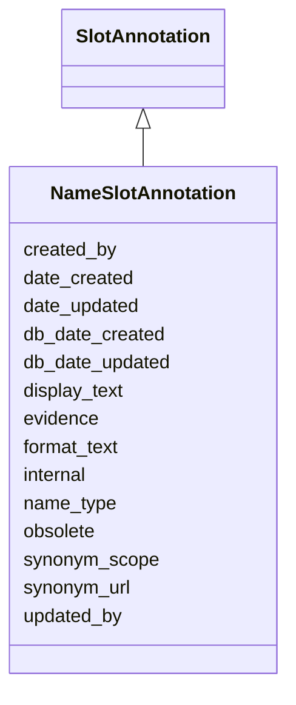

# NameSlotAnnotation

Some symbol or name for an object, including current names as well as aliases, with accompanying metadata. The entity to which the symbol/name applies is specified in objects that inherit from this object.





URI: [alliance:NameSlotAnnotation](http://alliancegenome.org/NameSlotAnnotation)


## Parent Classes

* [AuditedObject](AuditedObject.md)
    * [SlotAnnotation](SlotAnnotation.md)
        * **NameSlotAnnotation**
            * [AlleleFullNameSlotAnnotation](AlleleFullNameSlotAnnotation.md)
            * [AlleleSymbolSlotAnnotation](AlleleSymbolSlotAnnotation.md)
            * [AlleleSynonymSlotAnnotation](AlleleSynonymSlotAnnotation.md)
            * [GeneSymbolSlotAnnotation](GeneSymbolSlotAnnotation.md)
            * [GeneFullNameSlotAnnotation](GeneFullNameSlotAnnotation.md)
            * [GeneSystematicNameSlotAnnotation](GeneSystematicNameSlotAnnotation.md)
            * [GeneSynonymSlotAnnotation](GeneSynonymSlotAnnotation.md)


## Children

* [AuditedObject](AuditedObject.md)
    * [SlotAnnotation](SlotAnnotation.md)
        * **NameSlotAnnotation**
            * [AlleleFullNameSlotAnnotation](AlleleFullNameSlotAnnotation.md)
            * [AlleleSymbolSlotAnnotation](AlleleSymbolSlotAnnotation.md)
            * [AlleleSynonymSlotAnnotation](AlleleSynonymSlotAnnotation.md)
            * [GeneSymbolSlotAnnotation](GeneSymbolSlotAnnotation.md)
            * [GeneFullNameSlotAnnotation](GeneFullNameSlotAnnotation.md)
            * [GeneSystematicNameSlotAnnotation](GeneSystematicNameSlotAnnotation.md)
            * [GeneSynonymSlotAnnotation](GeneSynonymSlotAnnotation.md)


## Slots

| Name | Description  |
| ---  | ---  |
| [created_by](created_by.md) | The individual that created the entity. |
| [date_created](date_created.md) | The date on which an entity was created. This can be applied to nodes or edges. |
| [date_updated](date_updated.md) | Date on which an entity was last modified. |
| [db_date_created](db_date_created.md) | The date on which an entity was created in the Alliance database.  This is disinct from date_created, which represents the date when the entity was originally created (i.e. at the MOD for imported data). |
| [db_date_updated](db_date_updated.md) | Date on which an entity was last modified in the Alliance database.  This is disinct from date_updated, which represents the date when the entity was last modified and may predate import into the Alliance database. |
| [display_text](display_text.md) | A version of a synonym string for display. Any UTF8 character is permitted. |
| [evidence](evidence.md) |  |
| [format_text](format_text.md) | A version of a synonym string using only ASCII characters, which is easier to type (for searches), print and parse. For example, Greek characters are transliterated. |
| [internal](internal.md) | Classifies the entity as private (for internal use) or not (for public use). |
| [name_type](name_type.md) | The type of name: e.g., symbol, full_name, systematic_name, etc. |
| [obsolete](obsolete.md) | Entity is no longer current. |
| [synonym_scope](synonym_scope.md) | the scope of the synonym - permissible values are narrow / broad / related / exact |
| [synonym_url](synonym_url.md) | URL for a synonym: e.g., NCBI URL for the NCBI synonym of an object. |
| [updated_by](updated_by.md) | The individual that last modified the entity. |


## Mappings

| Mapping Type | Mapped Value |
| ---  | ---  |
| self | ['alliance:NameSlotAnnotation'] |
| native | ['alliance:NameSlotAnnotation'] |


## LinkML Specification

<!-- TODO: investigate https://stackoverflow.com/questions/37606292/how-to-create-tabbed-code-blocks-in-mkdocs-or-sphinx -->

### Direct

<details>
```yaml
name: NameSlotAnnotation
description: Some symbol or name for an object, including current names as well as
  aliases, with accompanying metadata. The entity to which the symbol/name applies
  is specified in objects that inherit from this object.
from_schema: https://github.com/alliance-genome/agr_curation_schema/core.yaml
is_a: SlotAnnotation
abstract: true
slots:
- name_type
- format_text
- display_text
- synonym_url
- synonym_scope

```
</details>

### Induced

<details>
```yaml
name: NameSlotAnnotation
description: Some symbol or name for an object, including current names as well as
  aliases, with accompanying metadata. The entity to which the symbol/name applies
  is specified in objects that inherit from this object.
from_schema: https://github.com/alliance-genome/agr_curation_schema/core.yaml
is_a: SlotAnnotation
abstract: true
attributes:
  name_type:
    name: name_type
    description: 'The type of name: e.g., symbol, full_name, systematic_name, etc.'
    notes:
    - "Proposed vocabulary terms for name_type.\n  nomenclature_symbol: A symbol for\
      \ an object: e.g., pax6a, lin-12.\n  full_name: The full length name of an entity:\
      \ e.g., paired box 6a.\n  systematic_name: A systematic name: e.g., YHR084W,\
      \ R09F10.2, CG4889.\n  ncbi_protein_name: Synonyms developed by SGD and NCBI\
      \ curators.\n  uniform: SGD-specific.\n  non_uniform: SGD-specific.\n  retired_name:\
      \ SGD-specific.\n  unspecified: unclassified names."
    from_schema: https://github.com/alliance-genome/agr_curation_schema/core.yaml
    domain: NameSlotAnnotation
    multivalued: false
    alias: name_type
    owner: NameSlotAnnotation
    domain_of:
    - NameSlotAnnotation
    range: VocabularyTerm
    required: true
  format_text:
    name: format_text
    description: A version of a synonym string using only ASCII characters, which
      is easier to type (for searches), print and parse. For example, Greek characters
      are transliterated.
    from_schema: https://github.com/alliance-genome/agr_curation_schema/core.yaml
    aliases:
    - synonym_text
    multivalued: false
    alias: format_text
    owner: NameSlotAnnotation
    domain_of:
    - NameSlotAnnotation
    - NameSlotAnnotationDTO
    range: string
    required: true
  display_text:
    name: display_text
    description: A version of a synonym string for display. Any UTF8 character is
      permitted.
    from_schema: https://github.com/alliance-genome/agr_curation_schema/core.yaml
    aliases:
    - synonym_sgml
    multivalued: false
    alias: display_text
    owner: NameSlotAnnotation
    domain_of:
    - NameSlotAnnotation
    - NameSlotAnnotationDTO
    range: string
    required: true
  synonym_url:
    name: synonym_url
    description: 'URL for a synonym: e.g., NCBI URL for the NCBI synonym of an object.'
    from_schema: https://github.com/alliance-genome/agr_curation_schema/core.yaml
    alias: synonym_url
    owner: NameSlotAnnotation
    domain_of:
    - NameSlotAnnotation
    - NameSlotAnnotationDTO
    range: uri
  synonym_scope:
    name: synonym_scope
    description: the scope of the synonym - permissible values are narrow / broad
      / related / exact
    from_schema: https://github.com/alliance-genome/agr_curation_schema/core.yaml
    domain: NameSlotAnnotation
    alias: synonym_scope
    owner: NameSlotAnnotation
    domain_of:
    - NameSlotAnnotation
    range: VocabularyTerm
  evidence:
    name: evidence
    description: ''
    from_schema: https://github.com/alliance-genome/agr_curation_schema/src/schema/reference
    multivalued: true
    alias: evidence
    owner: NameSlotAnnotation
    domain_of:
    - AlleleGenerationMethodAssociation
    - Note
    - SlotAnnotation
    - Association
    range: InformationContentEntity
  created_by:
    name: created_by
    description: The individual that created the entity.
    from_schema: https://github.com/alliance-genome/agr_curation_schema/core.yaml
    domain: AuditedObject
    multivalued: false
    alias: created_by
    owner: NameSlotAnnotation
    domain_of:
    - AuditedObject
    range: Person
  date_created:
    name: date_created
    description: The date on which an entity was created. This can be applied to nodes
      or edges.
    from_schema: https://github.com/alliance-genome/agr_curation_schema/core.yaml
    aliases:
    - creation_date
    exact_mappings:
    - dct:createdOn
    - WIKIDATA_PROPERTY:P577
    alias: date_created
    owner: NameSlotAnnotation
    domain_of:
    - AuditedObject
    - AuditedObjectDTO
    range: datetime
  updated_by:
    name: updated_by
    description: The individual that last modified the entity.
    from_schema: https://github.com/alliance-genome/agr_curation_schema/core.yaml
    domain: AuditedObject
    multivalued: false
    alias: updated_by
    owner: NameSlotAnnotation
    domain_of:
    - AuditedObject
    range: Person
  date_updated:
    name: date_updated
    description: Date on which an entity was last modified.
    from_schema: https://github.com/alliance-genome/agr_curation_schema/core.yaml
    aliases:
    - date_last_modified
    alias: date_updated
    owner: NameSlotAnnotation
    domain_of:
    - AuditedObject
    - AuditedObjectDTO
    range: datetime
  db_date_created:
    name: db_date_created
    description: The date on which an entity was created in the Alliance database.  This
      is disinct from date_created, which represents the date when the entity was
      originally created (i.e. at the MOD for imported data).
    from_schema: https://github.com/alliance-genome/agr_curation_schema/core.yaml
    alias: db_date_created
    owner: NameSlotAnnotation
    domain_of:
    - AuditedObject
    - AuditedObjectDTO
    range: datetime
  db_date_updated:
    name: db_date_updated
    description: Date on which an entity was last modified in the Alliance database.  This
      is disinct from date_updated, which represents the date when the entity was
      last modified and may predate import into the Alliance database.
    from_schema: https://github.com/alliance-genome/agr_curation_schema/core.yaml
    alias: db_date_updated
    owner: NameSlotAnnotation
    domain_of:
    - AuditedObject
    - AuditedObjectDTO
    range: datetime
  internal:
    name: internal
    description: Classifies the entity as private (for internal use) or not (for public
      use).
    notes:
    - Default value is true.
    from_schema: https://github.com/alliance-genome/agr_curation_schema/core.yaml
    alias: internal
    owner: NameSlotAnnotation
    domain_of:
    - AuditedObject
    - AuditedObjectDTO
    range: boolean
    required: true
  obsolete:
    name: obsolete
    description: Entity is no longer current.
    notes:
    - Obsolete entities are preserved in the database for posterity but should not
      be publicly displayed.
    from_schema: https://github.com/alliance-genome/agr_curation_schema/core.yaml
    alias: obsolete
    owner: NameSlotAnnotation
    domain_of:
    - AuditedObject
    - AuditedObjectDTO
    range: boolean

```
</details>