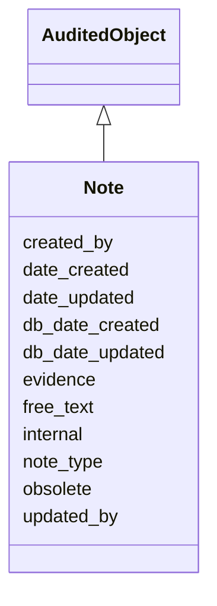

# Note

Note object for capturing free-text describing some attribute of an entity, coupled with a 'note type', internal boolean, and an optional list of references. Permissible values for note_type can be viewed and managed in the A-Team curation UI Controlled Vocabulary Terms Table.





URI: [alliance:Note](http://alliancegenome.org/Note)


## Parent Classes

* [AuditedObject](AuditedObject.md)
    * **Note**


<!-- no inheritance hierarchy -->


## Slots

| Name | Description  |
| ---  | ---  |
| [created_by](created_by.md) | The individual that created the entity. |
| [date_created](date_created.md) | The date on which an entity was created. This can be applied to nodes or edges. |
| [date_updated](date_updated.md) | Date on which an entity was last modified. |
| [db_date_created](db_date_created.md) | The date on which an entity was created in the Alliance database.  This is disinct from date_created, which represents the date when the entity was originally created (i.e. at the MOD for imported data). |
| [db_date_updated](db_date_updated.md) | Date on which an entity was last modified in the Alliance database.  This is disinct from date_updated, which represents the date when the entity was last modified and may predate import into the Alliance database. |
| [evidence](evidence.md) |  |
| [free_text](free_text.md) | A free text string that describes some aspect of an entity. |
| [internal](internal.md) | Classifies the entity as private (for internal use) or not (for public use). |
| [note_type](note_type.md) | The type of note: e.g., cytology, comment, summary. Permissible values for 'note_type' currently = disease_summary, disease_note |
| [obsolete](obsolete.md) | Entity is no longer current. |
| [updated_by](updated_by.md) | The individual that last modified the entity. |


## Mappings

| Mapping Type | Mapped Value |
| ---  | ---  |
| self | ['alliance:Note'] |
| native | ['alliance:Note'] |


## LinkML Specification

<!-- TODO: investigate https://stackoverflow.com/questions/37606292/how-to-create-tabbed-code-blocks-in-mkdocs-or-sphinx -->

### Direct

<details>
```yaml
name: Note
description: Note object for capturing free-text describing some attribute of an entity,
  coupled with a 'note type', internal boolean, and an optional list of references.
  Permissible values for note_type can be viewed and managed in the A-Team curation
  UI Controlled Vocabulary Terms Table.
from_schema: https://github.com/alliance-genome/agr_curation_schema/core.yaml
is_a: AuditedObject
slots:
- free_text
- note_type
- evidence
slot_usage:
  free_text:
    name: free_text
    domain_of:
    - Note
    - NoteDTO
    required: true
  note_type:
    name: note_type
    examples:
    - value: disease_summary
    - value: disease_note
    - value: automated_gene_description
    - value: MOD_provided_gene_description
    - value: gene_disease_summary
    - value: gene_function_summary
    - value: gene_phenotype_summary
    - value: transgene_construction_summary
    domain_of:
    - Note
    required: true

```
</details>

### Induced

<details>
```yaml
name: Note
description: Note object for capturing free-text describing some attribute of an entity,
  coupled with a 'note type', internal boolean, and an optional list of references.
  Permissible values for note_type can be viewed and managed in the A-Team curation
  UI Controlled Vocabulary Terms Table.
from_schema: https://github.com/alliance-genome/agr_curation_schema/core.yaml
is_a: AuditedObject
slot_usage:
  free_text:
    name: free_text
    domain_of:
    - Note
    - NoteDTO
    required: true
  note_type:
    name: note_type
    examples:
    - value: disease_summary
    - value: disease_note
    - value: automated_gene_description
    - value: MOD_provided_gene_description
    - value: gene_disease_summary
    - value: gene_function_summary
    - value: gene_phenotype_summary
    - value: transgene_construction_summary
    domain_of:
    - Note
    required: true
attributes:
  free_text:
    name: free_text
    description: A free text string that describes some aspect of an entity.
    from_schema: https://github.com/alliance-genome/agr_curation_schema/core.yaml
    alias: free_text
    owner: Note
    domain_of:
    - Note
    - NoteDTO
    range: string
    required: true
  note_type:
    name: note_type
    description: 'The type of note: e.g., cytology, comment, summary. Permissible
      values for ''note_type'' currently = disease_summary, disease_note'
    examples:
    - value: disease_summary
    - value: disease_note
    - value: automated_gene_description
    - value: MOD_provided_gene_description
    - value: gene_disease_summary
    - value: gene_function_summary
    - value: gene_phenotype_summary
    - value: transgene_construction_summary
    from_schema: https://github.com/alliance-genome/agr_curation_schema/core.yaml
    alias: note_type
    owner: Note
    domain_of:
    - Note
    range: VocabularyTerm
    required: true
  evidence:
    name: evidence
    description: ''
    from_schema: https://github.com/alliance-genome/agr_curation_schema/src/schema/reference
    multivalued: true
    alias: evidence
    owner: Note
    domain_of:
    - AlleleGenerationMethodAssociation
    - Note
    - SlotAnnotation
    - Association
    range: InformationContentEntity
  created_by:
    name: created_by
    description: The individual that created the entity.
    from_schema: https://github.com/alliance-genome/agr_curation_schema/core.yaml
    domain: AuditedObject
    multivalued: false
    alias: created_by
    owner: Note
    domain_of:
    - AuditedObject
    range: Person
  date_created:
    name: date_created
    description: The date on which an entity was created. This can be applied to nodes
      or edges.
    from_schema: https://github.com/alliance-genome/agr_curation_schema/core.yaml
    aliases:
    - creation_date
    exact_mappings:
    - dct:createdOn
    - WIKIDATA_PROPERTY:P577
    alias: date_created
    owner: Note
    domain_of:
    - AuditedObject
    - AuditedObjectDTO
    range: datetime
  updated_by:
    name: updated_by
    description: The individual that last modified the entity.
    from_schema: https://github.com/alliance-genome/agr_curation_schema/core.yaml
    domain: AuditedObject
    multivalued: false
    alias: updated_by
    owner: Note
    domain_of:
    - AuditedObject
    range: Person
  date_updated:
    name: date_updated
    description: Date on which an entity was last modified.
    from_schema: https://github.com/alliance-genome/agr_curation_schema/core.yaml
    aliases:
    - date_last_modified
    alias: date_updated
    owner: Note
    domain_of:
    - AuditedObject
    - AuditedObjectDTO
    range: datetime
  db_date_created:
    name: db_date_created
    description: The date on which an entity was created in the Alliance database.  This
      is disinct from date_created, which represents the date when the entity was
      originally created (i.e. at the MOD for imported data).
    from_schema: https://github.com/alliance-genome/agr_curation_schema/core.yaml
    alias: db_date_created
    owner: Note
    domain_of:
    - AuditedObject
    - AuditedObjectDTO
    range: datetime
  db_date_updated:
    name: db_date_updated
    description: Date on which an entity was last modified in the Alliance database.  This
      is disinct from date_updated, which represents the date when the entity was
      last modified and may predate import into the Alliance database.
    from_schema: https://github.com/alliance-genome/agr_curation_schema/core.yaml
    alias: db_date_updated
    owner: Note
    domain_of:
    - AuditedObject
    - AuditedObjectDTO
    range: datetime
  internal:
    name: internal
    description: Classifies the entity as private (for internal use) or not (for public
      use).
    notes:
    - Default value is true.
    from_schema: https://github.com/alliance-genome/agr_curation_schema/core.yaml
    alias: internal
    owner: Note
    domain_of:
    - AuditedObject
    - AuditedObjectDTO
    range: boolean
    required: true
  obsolete:
    name: obsolete
    description: Entity is no longer current.
    notes:
    - Obsolete entities are preserved in the database for posterity but should not
      be publicly displayed.
    from_schema: https://github.com/alliance-genome/agr_curation_schema/core.yaml
    alias: obsolete
    owner: Note
    domain_of:
    - AuditedObject
    - AuditedObjectDTO
    range: boolean

```
</details>