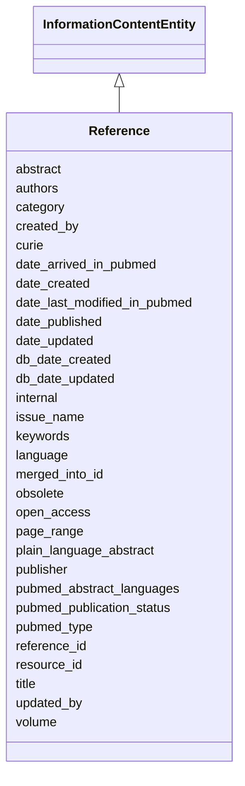

# Reference

None





URI: [alliance:Reference](http://alliancegenome.org/Reference)


## Parent Classes

* [AuditedObject](AuditedObject.md)
    * [InformationContentEntity](InformationContentEntity.md)
        * **Reference**


<!-- no inheritance hierarchy -->


## Slots

| Name | Description  |
| ---  | ---  |
| [abstract](abstract.md) | The author summary of the publication. From PubMed otherwise from Mod or manual reference creation. |
| [authors](authors.md) | Ordered author entities for this publication.  An Author is associated with only one publication.  A Person can be associated with multiple publications. |
| [category](category.md) | The alliance category type.  Only relevant at Alliance. |
| [created_by](created_by.md) | The individual that created the entity. |
| [curie](curie.md) | A unique identifier for a thing. Must be either a CURIE shorthand for a URI or a complete URI |
| [date_arrived_in_pubmed](date_arrived_in_pubmed.md) | Day in which a reference or resource was created in PubMed. Only relevant for PubMed references. |
| [date_created](date_created.md) | The date on which an entity was created. This can be applied to nodes or edges. |
| [date_last_modified_in_pubmed](date_last_modified_in_pubmed.md) | Date on which entity was last updated at PubMed. Only relevant for PubMed references. |
| [date_published](date_published.md) | Date on which an entity was published.  From PubMed otherwise from Mod or manual reference creation. |
| [date_updated](date_updated.md) | Date on which an entity was last modified. |
| [db_date_created](db_date_created.md) | The date on which an entity was created in the Alliance database.  This is disinct from date_created, which represents the date when the entity was originally created (i.e. at the MOD for imported data). |
| [db_date_updated](db_date_updated.md) | Date on which an entity was last modified in the Alliance database.  This is disinct from date_updated, which represents the date when the entity was last modified and may predate import into the Alliance database. |
| [internal](internal.md) | Classifies the entity as private (for internal use) or not (for public use). |
| [issue_name](issue_name.md) | The number of the journal issue in which the article was published. From PubMed otherwise from Mod or manual reference creation. |
| [keywords](keywords.md) | Keywords tagging a publication.  Aggregation of PubMed and ZFIN, editable at Alliance. |
| [language](language.md) | Language of the reference.  Aggregation of PubMed and FlyBase, editable at Alliance. |
| [merged_into_id](merged_into_id.md) | ID that used to refer to this reference |
| [obsolete](obsolete.md) | Entity is no longer current. |
| [open_access](open_access.md) | Indicates if the reference is freely available for use by anyone, usually with fewer copyright and licensing barriers. |
| [page_range](page_range.md) | Page numbers of source referenced for statement or publication. From PubMed otherwise from Mod or manual reference creation. |
| [plain_language_abstract](plain_language_abstract.md) | Lay person, readable version of the abstract. Only relevant for PubMed references. |
| [publisher](publisher.md) | Publisher associated with a reference or resource. From PubMed otherwise from Mod or manual reference creation. |
| [pubmed_abstract_languages](pubmed_abstract_languages.md) | Languages for the abstract. Only relevant for PubMed references. |
| [pubmed_publication_status](pubmed_publication_status.md) | Status of the publication at PubMed. Only relevant for PubMed references. |
| [pubmed_type](pubmed_type.md) | Type of Reference as described by PubMed. Only relevant for PubMed references. |
| [reference_id](reference_id.md) | The primary key for the Reference object in the references table. |
| [resource_id](resource_id.md) | None |
| [title](title.md) | A human readable title for a reference. From PubMed otherwise from Mod or manual reference creation. |
| [updated_by](updated_by.md) | The individual that last modified the entity. |
| [volume](volume.md) | Volume associated with a reference. From PubMed otherwise from Mod or manual reference creation. |


## Mappings

| Mapping Type | Mapped Value |
| ---  | ---  |
| self | ['alliance:Reference'] |
| native | ['alliance:Reference'] |


### Valid ID Prefixes

Instances of this class *should* have identifiers with one of the following prefixes:

* PMID

* NLMID

* DOI

* SGD

* FB

* WB

* ZFIN

* MGI

* RGD

* PMC

* DOI


## LinkML Specification

<!-- TODO: investigate https://stackoverflow.com/questions/37606292/how-to-create-tabbed-code-blocks-in-mkdocs-or-sphinx -->

### Direct

<details>
```yaml
name: Reference
id_prefixes:
- PMID
- NLMID
- DOI
- SGD
- FB
- WB
- ZFIN
- MGI
- RGD
- PMC
- DOI
notes:
- In the ABC literature database, the table holding Reference objects is named references.
from_schema: https://github.com/alliance-genome/agr_curation_schema/src/schema/reference
aliases:
- references
- publication
is_a: InformationContentEntity
slots:
- abstract
- authors
- category
- curie
- date_arrived_in_pubmed
- date_last_modified_in_pubmed
- date_published
- issue_name
- keywords
- language
- merged_into_id
- open_access
- page_range
- plain_language_abstract
- publisher
- pubmed_abstract_languages
- pubmed_publication_status
- pubmed_type
- reference_id
- resource_id
- title
- volume
slot_usage:
  reference_id:
    name: reference_id
    description: The primary key for the Reference object in the references table.
    domain_of:
    - Reference
    - MeshDetail
    - ModCorpusAssociation

```
</details>

### Induced

<details>
```yaml
name: Reference
id_prefixes:
- PMID
- NLMID
- DOI
- SGD
- FB
- WB
- ZFIN
- MGI
- RGD
- PMC
- DOI
notes:
- In the ABC literature database, the table holding Reference objects is named references.
from_schema: https://github.com/alliance-genome/agr_curation_schema/src/schema/reference
aliases:
- references
- publication
is_a: InformationContentEntity
slot_usage:
  reference_id:
    name: reference_id
    description: The primary key for the Reference object in the references table.
    domain_of:
    - Reference
    - MeshDetail
    - ModCorpusAssociation
attributes:
  abstract:
    name: abstract
    description: The author summary of the publication. From PubMed otherwise from
      Mod or manual reference creation.
    from_schema: https://github.com/alliance-genome/agr_curation_schema/src/schema/reference
    domain: Reference
    multivalued: false
    alias: abstract
    owner: Reference
    domain_of:
    - Reference
    range: string
  authors:
    name: authors
    description: Ordered author entities for this publication.  An Author is associated
      with only one publication.  A Person can be associated with multiple publications.
    from_schema: https://github.com/alliance-genome/agr_curation_schema/src/schema/reference
    domain: Reference
    multivalued: true
    alias: authors
    owner: Reference
    domain_of:
    - Reference
    - Resource
    range: AuthorReference
  category:
    name: category
    description: The alliance category type.  Only relevant at Alliance.
    from_schema: https://github.com/alliance-genome/agr_curation_schema/src/schema/reference
    domain: Reference
    multivalued: false
    alias: category
    owner: Reference
    domain_of:
    - Reference
    range: reference_category_enum
  curie:
    name: curie
    description: A unique identifier for a thing. Must be either a CURIE shorthand
      for a URI or a complete URI
    from_schema: https://github.com/alliance-genome/agr_curation_schema/core.yaml
    multivalued: false
    identifier: true
    alias: curie
    owner: Reference
    domain_of:
    - OntologyTerm
    - PhenotypeAnnotation
    - DiseaseAnnotation
    - BiologicalEntity
    - BiologicalEntityDTO
    - Chromosome
    - Assembly
    - Identifier
    - Figure
    - Image
    - Laboratory
    - InformationContentEntity
    - Reference
    - Resource
    - ModCorpusAssociation
    - GeneInteraction
    - ExpressionExperiment
    - GeneNomenclatureSet
    range: uriorcurie
  date_arrived_in_pubmed:
    name: date_arrived_in_pubmed
    description: Day in which a reference or resource was created in PubMed. Only
      relevant for PubMed references.
    from_schema: https://github.com/alliance-genome/agr_curation_schema/src/schema/reference
    domain: Reference
    multivalued: true
    alias: date_arrived_in_pubmed
    owner: Reference
    domain_of:
    - Reference
    range: string
  date_last_modified_in_pubmed:
    name: date_last_modified_in_pubmed
    description: Date on which entity was last updated at PubMed. Only relevant for
      PubMed references.
    from_schema: https://github.com/alliance-genome/agr_curation_schema/src/schema/reference
    domain: Reference
    multivalued: false
    alias: date_last_modified_in_pubmed
    owner: Reference
    domain_of:
    - Reference
    range: string
  date_published:
    name: date_published
    description: Date on which an entity was published.  From PubMed otherwise from
      Mod or manual reference creation.
    notes:
    - 'Values here can be quite variable: e.g., just a year, or a year-season, etc.'
    from_schema: https://github.com/alliance-genome/agr_curation_schema/src/schema/reference
    multivalued: false
    alias: date_published
    owner: Reference
    domain_of:
    - Reference
    range: string
  issue_name:
    name: issue_name
    description: The number of the journal issue in which the article was published.
      From PubMed otherwise from Mod or manual reference creation.
    from_schema: https://github.com/alliance-genome/agr_curation_schema/src/schema/reference
    domain: Reference
    multivalued: false
    alias: issue_name
    owner: Reference
    domain_of:
    - Reference
    range: string
  keywords:
    name: keywords
    description: Keywords tagging a publication.  Aggregation of PubMed and ZFIN,
      editable at Alliance.
    from_schema: https://github.com/alliance-genome/agr_curation_schema/src/schema/reference
    multivalued: true
    alias: keywords
    owner: Reference
    domain_of:
    - Reference
    range: string
  language:
    name: language
    description: Language of the reference.  Aggregation of PubMed and FlyBase, editable
      at Alliance.
    from_schema: https://github.com/alliance-genome/agr_curation_schema/src/schema/reference
    domain: Reference
    multivalued: false
    alias: language
    owner: Reference
    domain_of:
    - Reference
    range: string
  merged_into_id:
    name: merged_into_id
    description: ID that used to refer to this reference
    from_schema: https://github.com/alliance-genome/agr_curation_schema/src/schema/reference
    domain: Reference
    multivalued: false
    alias: merged_into_id
    owner: Reference
    domain_of:
    - Reference
    range: uriorcurie
  open_access:
    name: open_access
    description: Indicates if the reference is freely available for use by anyone,
      usually with fewer copyright and licensing barriers.
    from_schema: https://github.com/alliance-genome/agr_curation_schema/src/schema/reference
    domain: Reference
    multivalued: false
    alias: open_access
    owner: Reference
    domain_of:
    - Reference
    range: boolean
  page_range:
    name: page_range
    description: Page numbers of source referenced for statement or publication. From
      PubMed otherwise from Mod or manual reference creation.
    from_schema: https://github.com/alliance-genome/agr_curation_schema/src/schema/reference
    close_mappings:
    - WIKIDATA_PROPERTY:P304
    multivalued: false
    alias: page_range
    owner: Reference
    domain_of:
    - Reference
    range: string
  plain_language_abstract:
    name: plain_language_abstract
    description: Lay person, readable version of the abstract. Only relevant for PubMed
      references.
    from_schema: https://github.com/alliance-genome/agr_curation_schema/src/schema/reference
    domain: Reference
    multivalued: false
    alias: plain_language_abstract
    owner: Reference
    domain_of:
    - Reference
    range: string
  publisher:
    name: publisher
    description: Publisher associated with a reference or resource. From PubMed otherwise
      from Mod or manual reference creation.
    from_schema: https://github.com/alliance-genome/agr_curation_schema/src/schema/reference
    domain: Reference
    multivalued: false
    alias: publisher
    owner: Reference
    domain_of:
    - Reference
    - Resource
    range: string
  pubmed_abstract_languages:
    name: pubmed_abstract_languages
    description: Languages for the abstract. Only relevant for PubMed references.
    from_schema: https://github.com/alliance-genome/agr_curation_schema/src/schema/reference
    domain: Reference
    multivalued: true
    alias: pubmed_abstract_languages
    owner: Reference
    domain_of:
    - Reference
    range: string
  pubmed_publication_status:
    name: pubmed_publication_status
    description: Status of the publication at PubMed. Only relevant for PubMed references.
    from_schema: https://github.com/alliance-genome/agr_curation_schema/src/schema/reference
    domain: Reference
    multivalued: false
    alias: pubmed_publication_status
    owner: Reference
    domain_of:
    - Reference
    range: pubmed_publication_status_enum
  pubmed_type:
    name: pubmed_type
    description: Type of Reference as described by PubMed. Only relevant for PubMed
      references.
    from_schema: https://github.com/alliance-genome/agr_curation_schema/src/schema/reference
    domain: Reference
    multivalued: true
    alias: pubmed_type
    owner: Reference
    domain_of:
    - Reference
    range: pubmed_type_enum
  reference_id:
    name: reference_id
    description: The primary key for the Reference object in the references table.
    from_schema: https://github.com/alliance-genome/agr_curation_schema/src/schema/reference
    is_a: table_key
    multivalued: false
    alias: reference_id
    owner: Reference
    domain_of:
    - Reference
    - MeshDetail
    - ModCorpusAssociation
    range: integer
    required: true
  resource_id:
    name: resource_id
    notes:
    - The value is the primary key for the resources table (an integer).
    from_schema: https://github.com/alliance-genome/agr_curation_schema/src/schema/reference
    domain: Reference
    alias: resource_id
    owner: Reference
    domain_of:
    - Reference
    range: integer
  title:
    name: title
    description: A human readable title for a reference. From PubMed otherwise from
      Mod or manual reference creation.
    from_schema: https://github.com/alliance-genome/agr_curation_schema/src/schema/reference
    domain: Reference
    multivalued: false
    alias: title
    owner: Reference
    domain_of:
    - Reference
    - Resource
    range: string
  volume:
    name: volume
    description: Volume associated with a reference. From PubMed otherwise from Mod
      or manual reference creation.
    from_schema: https://github.com/alliance-genome/agr_curation_schema/src/schema/reference
    domain: Reference
    multivalued: false
    alias: volume
    owner: Reference
    domain_of:
    - Reference
    - Resource
    range: string
  created_by:
    name: created_by
    description: The individual that created the entity.
    from_schema: https://github.com/alliance-genome/agr_curation_schema/core.yaml
    domain: AuditedObject
    multivalued: false
    alias: created_by
    owner: Reference
    domain_of:
    - AuditedObject
    range: Person
  date_created:
    name: date_created
    description: The date on which an entity was created. This can be applied to nodes
      or edges.
    from_schema: https://github.com/alliance-genome/agr_curation_schema/core.yaml
    aliases:
    - creation_date
    exact_mappings:
    - dct:createdOn
    - WIKIDATA_PROPERTY:P577
    alias: date_created
    owner: Reference
    domain_of:
    - AuditedObject
    - AuditedObjectDTO
    range: datetime
  updated_by:
    name: updated_by
    description: The individual that last modified the entity.
    from_schema: https://github.com/alliance-genome/agr_curation_schema/core.yaml
    domain: AuditedObject
    multivalued: false
    alias: updated_by
    owner: Reference
    domain_of:
    - AuditedObject
    range: Person
  date_updated:
    name: date_updated
    description: Date on which an entity was last modified.
    from_schema: https://github.com/alliance-genome/agr_curation_schema/core.yaml
    aliases:
    - date_last_modified
    alias: date_updated
    owner: Reference
    domain_of:
    - AuditedObject
    - AuditedObjectDTO
    range: datetime
  db_date_created:
    name: db_date_created
    description: The date on which an entity was created in the Alliance database.  This
      is disinct from date_created, which represents the date when the entity was
      originally created (i.e. at the MOD for imported data).
    from_schema: https://github.com/alliance-genome/agr_curation_schema/core.yaml
    alias: db_date_created
    owner: Reference
    domain_of:
    - AuditedObject
    - AuditedObjectDTO
    range: datetime
  db_date_updated:
    name: db_date_updated
    description: Date on which an entity was last modified in the Alliance database.  This
      is disinct from date_updated, which represents the date when the entity was
      last modified and may predate import into the Alliance database.
    from_schema: https://github.com/alliance-genome/agr_curation_schema/core.yaml
    alias: db_date_updated
    owner: Reference
    domain_of:
    - AuditedObject
    - AuditedObjectDTO
    range: datetime
  internal:
    name: internal
    description: Classifies the entity as private (for internal use) or not (for public
      use).
    notes:
    - Default value is true.
    from_schema: https://github.com/alliance-genome/agr_curation_schema/core.yaml
    alias: internal
    owner: Reference
    domain_of:
    - AuditedObject
    - AuditedObjectDTO
    range: boolean
    required: true
  obsolete:
    name: obsolete
    description: Entity is no longer current.
    notes:
    - Obsolete entities are preserved in the database for posterity but should not
      be publicly displayed.
    from_schema: https://github.com/alliance-genome/agr_curation_schema/core.yaml
    alias: obsolete
    owner: Reference
    domain_of:
    - AuditedObject
    - AuditedObjectDTO
    range: boolean

```
</details>