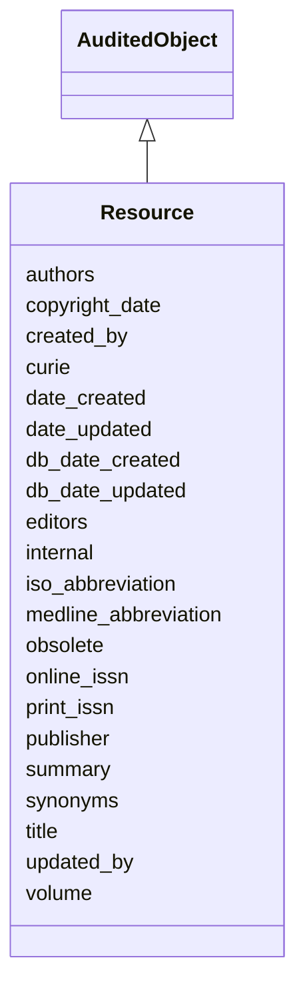

# Resource

None





URI: [alliance:Resource](http://alliancegenome.org/Resource)


## Parent Classes

* [AuditedObject](AuditedObject.md)
    * **Resource**


<!-- no inheritance hierarchy -->


## Slots

| Name | Description  |
| ---  | ---  |
| [authors](authors.md) | Ordered author entities for this publication.  An Author is associated with only one publication.  A Person can be associated with multiple publications. |
| [copyright_date](copyright_date.md) |  |
| [created_by](created_by.md) | The individual that created the entity. |
| [curie](curie.md) | A unique identifier for a thing. Must be either a CURIE shorthand for a URI or a complete URI |
| [date_created](date_created.md) | The date on which an entity was created. This can be applied to nodes or edges. |
| [date_updated](date_updated.md) | Date on which an entity was last modified. |
| [db_date_created](db_date_created.md) | The date on which an entity was created in the Alliance database.  This is disinct from date_created, which represents the date when the entity was originally created (i.e. at the MOD for imported data). |
| [db_date_updated](db_date_updated.md) | Date on which an entity was last modified in the Alliance database.  This is disinct from date_updated, which represents the date when the entity was last modified and may predate import into the Alliance database. |
| [editors](editors.md) | holds between a resource and a editor_resource |
| [internal](internal.md) | Classifies the entity as private (for internal use) or not (for public use). |
| [iso_abbreviation](iso_abbreviation.md) |  |
| [medline_abbreviation](medline_abbreviation.md) |  |
| [obsolete](obsolete.md) | Entity is no longer current. |
| [online_issn](online_issn.md) |  |
| [print_issn](print_issn.md) |  |
| [publisher](publisher.md) | Publisher associated with a reference or resource. From PubMed otherwise from Mod or manual reference creation. |
| [summary](summary.md) |  |
| [synonyms](synonyms.md) | Placeholder? Some objects still use this slot. Not clear how it fits in with NameSlotAnnotation (which captures evidence). |
| [title](title.md) | the title of the publication |
| [updated_by](updated_by.md) | The individual that last modified the entity. |
| [volume](volume.md) | Volume associated with a reference. From PubMed otherwise from Mod or manual reference creation. |


## Mappings

| Mapping Type | Mapped Value |
| ---  | ---  |
| self | ['alliance:Resource'] |
| native | ['alliance:Resource'] |


### Valid ID Prefixes

Instances of this class *should* have identifiers with one of the following prefixes:

* PMID

* NLMID

* DOI

* SGD

* FB

* WB

* ZFIN

* MGI

* RGD


## LinkML Specification

<!-- TODO: investigate https://stackoverflow.com/questions/37606292/how-to-create-tabbed-code-blocks-in-mkdocs-or-sphinx -->

### Direct

<details>
```yaml
name: Resource
id_prefixes:
- PMID
- NLMID
- DOI
- SGD
- FB
- WB
- ZFIN
- MGI
- RGD
from_schema: https://github.com/alliance-genome/agr_curation_schema/src/schema/resource
is_a: AuditedObject
slots:
- curie
- title
- iso_abbreviation
- medline_abbreviation
- copyright_date
- print_issn
- online_issn
- publisher
- volume
- summary
- synonyms
- authors
- editors
slot_usage:
  id:
    name: id
    description: 'Precedence of identifiers for references is as follows: PMID if
      available; DOI if not; actual alternate CURIE otherwise.'
  title:
    name: title
    description: the title of the publication
    domain_of:
    - Reference
    - Resource

```
</details>

### Induced

<details>
```yaml
name: Resource
id_prefixes:
- PMID
- NLMID
- DOI
- SGD
- FB
- WB
- ZFIN
- MGI
- RGD
from_schema: https://github.com/alliance-genome/agr_curation_schema/src/schema/resource
is_a: AuditedObject
slot_usage:
  id:
    name: id
    description: 'Precedence of identifiers for references is as follows: PMID if
      available; DOI if not; actual alternate CURIE otherwise.'
  title:
    name: title
    description: the title of the publication
    domain_of:
    - Reference
    - Resource
attributes:
  curie:
    name: curie
    description: A unique identifier for a thing. Must be either a CURIE shorthand
      for a URI or a complete URI
    from_schema: https://github.com/alliance-genome/agr_curation_schema/core.yaml
    multivalued: false
    identifier: true
    alias: curie
    owner: Resource
    domain_of:
    - OntologyTerm
    - PhenotypeAnnotation
    - DiseaseAnnotation
    - BiologicalEntity
    - BiologicalEntityDTO
    - Chromosome
    - Assembly
    - Identifier
    - Figure
    - Image
    - Laboratory
    - InformationContentEntity
    - Reference
    - Resource
    - ModCorpusAssociation
    - GeneInteraction
    - ExpressionExperiment
    - GeneNomenclatureSet
    range: uriorcurie
  title:
    name: title
    description: the title of the publication
    from_schema: https://github.com/alliance-genome/agr_curation_schema/src/schema/reference
    domain: Reference
    multivalued: false
    alias: title
    owner: Resource
    domain_of:
    - Reference
    - Resource
    range: string
  iso_abbreviation:
    name: iso_abbreviation
    description: ''
    from_schema: https://github.com/alliance-genome/agr_curation_schema/src/schema/resource
    domain: Resource
    alias: iso_abbreviation
    owner: Resource
    domain_of:
    - Resource
    range: string
  medline_abbreviation:
    name: medline_abbreviation
    description: ''
    from_schema: https://github.com/alliance-genome/agr_curation_schema/src/schema/resource
    domain: Resource
    alias: medline_abbreviation
    owner: Resource
    domain_of:
    - Resource
    range: string
  copyright_date:
    name: copyright_date
    description: ''
    from_schema: https://github.com/alliance-genome/agr_curation_schema/src/schema/resource
    domain: Resource
    alias: copyright_date
    owner: Resource
    domain_of:
    - Resource
    range: date
  print_issn:
    name: print_issn
    description: ''
    from_schema: https://github.com/alliance-genome/agr_curation_schema/src/schema/resource
    domain: Resource
    alias: print_issn
    owner: Resource
    domain_of:
    - Resource
    range: string
  online_issn:
    name: online_issn
    description: ''
    from_schema: https://github.com/alliance-genome/agr_curation_schema/src/schema/resource
    domain: Resource
    alias: online_issn
    owner: Resource
    domain_of:
    - Resource
    range: string
  publisher:
    name: publisher
    description: Publisher associated with a reference or resource. From PubMed otherwise
      from Mod or manual reference creation.
    from_schema: https://github.com/alliance-genome/agr_curation_schema/src/schema/reference
    domain: Reference
    multivalued: false
    alias: publisher
    owner: Resource
    domain_of:
    - Reference
    - Resource
    range: string
  volume:
    name: volume
    description: Volume associated with a reference. From PubMed otherwise from Mod
      or manual reference creation.
    from_schema: https://github.com/alliance-genome/agr_curation_schema/src/schema/reference
    domain: Reference
    multivalued: false
    alias: volume
    owner: Resource
    domain_of:
    - Reference
    - Resource
    range: string
  summary:
    name: summary
    description: ''
    from_schema: https://github.com/alliance-genome/agr_curation_schema/src/schema/resource
    domain: Resource
    alias: summary
    owner: Resource
    domain_of:
    - Resource
    range: string
  synonyms:
    name: synonyms
    description: Placeholder? Some objects still use this slot. Not clear how it fits
      in with NameSlotAnnotation (which captures evidence).
    from_schema: https://github.com/alliance-genome/agr_curation_schema/core.yaml
    multivalued: true
    alias: synonyms
    owner: Resource
    domain_of:
    - OntologyTerm
    - ResourceDescriptor
    - Resource
    - GeneNomenclatureSet
    range: string
    required: false
  authors:
    name: authors
    description: Ordered author entities for this publication.  An Author is associated
      with only one publication.  A Person can be associated with multiple publications.
    from_schema: https://github.com/alliance-genome/agr_curation_schema/src/schema/reference
    domain: Reference
    multivalued: true
    alias: authors
    owner: Resource
    domain_of:
    - Reference
    - Resource
    range: AuthorReference
  editors:
    name: editors
    description: holds between a resource and a editor_resource
    from_schema: https://github.com/alliance-genome/agr_curation_schema/src/schema/resource
    singular_name: editor
    domain: Resource
    multivalued: true
    alias: editors
    owner: Resource
    domain_of:
    - Resource
    range: AuthorReference
  created_by:
    name: created_by
    description: The individual that created the entity.
    from_schema: https://github.com/alliance-genome/agr_curation_schema/core.yaml
    domain: AuditedObject
    multivalued: false
    alias: created_by
    owner: Resource
    domain_of:
    - AuditedObject
    range: Person
  date_created:
    name: date_created
    description: The date on which an entity was created. This can be applied to nodes
      or edges.
    from_schema: https://github.com/alliance-genome/agr_curation_schema/core.yaml
    aliases:
    - creation_date
    exact_mappings:
    - dct:createdOn
    - WIKIDATA_PROPERTY:P577
    alias: date_created
    owner: Resource
    domain_of:
    - AuditedObject
    - AuditedObjectDTO
    range: datetime
  updated_by:
    name: updated_by
    description: The individual that last modified the entity.
    from_schema: https://github.com/alliance-genome/agr_curation_schema/core.yaml
    domain: AuditedObject
    multivalued: false
    alias: updated_by
    owner: Resource
    domain_of:
    - AuditedObject
    range: Person
  date_updated:
    name: date_updated
    description: Date on which an entity was last modified.
    from_schema: https://github.com/alliance-genome/agr_curation_schema/core.yaml
    aliases:
    - date_last_modified
    alias: date_updated
    owner: Resource
    domain_of:
    - AuditedObject
    - AuditedObjectDTO
    range: datetime
  db_date_created:
    name: db_date_created
    description: The date on which an entity was created in the Alliance database.  This
      is disinct from date_created, which represents the date when the entity was
      originally created (i.e. at the MOD for imported data).
    from_schema: https://github.com/alliance-genome/agr_curation_schema/core.yaml
    alias: db_date_created
    owner: Resource
    domain_of:
    - AuditedObject
    - AuditedObjectDTO
    range: datetime
  db_date_updated:
    name: db_date_updated
    description: Date on which an entity was last modified in the Alliance database.  This
      is disinct from date_updated, which represents the date when the entity was
      last modified and may predate import into the Alliance database.
    from_schema: https://github.com/alliance-genome/agr_curation_schema/core.yaml
    alias: db_date_updated
    owner: Resource
    domain_of:
    - AuditedObject
    - AuditedObjectDTO
    range: datetime
  internal:
    name: internal
    description: Classifies the entity as private (for internal use) or not (for public
      use).
    notes:
    - Default value is true.
    from_schema: https://github.com/alliance-genome/agr_curation_schema/core.yaml
    alias: internal
    owner: Resource
    domain_of:
    - AuditedObject
    - AuditedObjectDTO
    range: boolean
    required: true
  obsolete:
    name: obsolete
    description: Entity is no longer current.
    notes:
    - Obsolete entities are preserved in the database for posterity but should not
      be publicly displayed.
    from_schema: https://github.com/alliance-genome/agr_curation_schema/core.yaml
    alias: obsolete
    owner: Resource
    domain_of:
    - AuditedObject
    - AuditedObjectDTO
    range: boolean

```
</details>