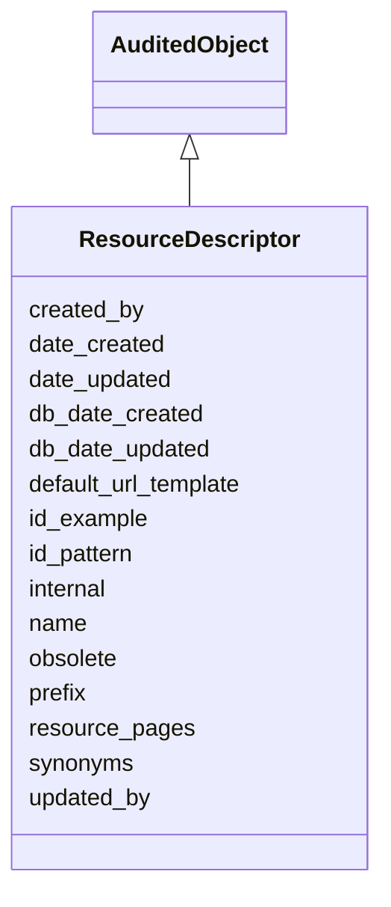

# ResourceDescriptor

None





URI: [alliance:ResourceDescriptor](http://alliancegenome.org/ResourceDescriptor)


## Parent Classes

* [AuditedObject](AuditedObject.md)
    * **ResourceDescriptor**


<!-- no inheritance hierarchy -->


## Slots

| Name | Description  |
| ---  | ---  |
| [created_by](created_by.md) | The individual that created the entity. |
| [date_created](date_created.md) | The date on which an entity was created. This can be applied to nodes or edges. |
| [date_updated](date_updated.md) | Date on which an entity was last modified. |
| [db_date_created](db_date_created.md) | The date on which an entity was created in the Alliance database.  This is disinct from date_created, which represents the date when the entity was originally created (i.e. at the MOD for imported data). |
| [db_date_updated](db_date_updated.md) | Date on which an entity was last modified in the Alliance database.  This is disinct from date_updated, which represents the date when the entity was last modified and may predate import into the Alliance database. |
| [default_url_template](default_url_template.md) | Default URL template for the resource |
| [id_example](id_example.md) | Example ID for the resource that fits the pattern described by the id_pattern slot |
| [id_pattern](id_pattern.md) | Regex for the expected format of the ID |
| [internal](internal.md) | Classifies the entity as private (for internal use) or not (for public use). |
| [name](name.md) | a human-readable name for an entity |
| [obsolete](obsolete.md) | Entity is no longer current. |
| [prefix](prefix.md) | Denormalization to help with classifying types of crossReferences, distinguishing DOIs from PMC ids, etc. |
| [resource_pages](resource_pages.md) | Pages for a particular resource |
| [synonyms](synonyms.md) | Placeholder? Some objects still use this slot. Not clear how it fits in with NameSlotAnnotation (which captures evidence). |
| [updated_by](updated_by.md) | The individual that last modified the entity. |


## Mappings

| Mapping Type | Mapped Value |
| ---  | ---  |
| self | ['alliance:ResourceDescriptor'] |
| native | ['alliance:ResourceDescriptor'] |


## LinkML Specification

<!-- TODO: investigate https://stackoverflow.com/questions/37606292/how-to-create-tabbed-code-blocks-in-mkdocs-or-sphinx -->

### Direct

<details>
```yaml
name: ResourceDescriptor
from_schema: https://github.com/alliance-genome/agr_curation_schema/resourceDescriptor.yaml
is_a: AuditedObject
slots:
- prefix
- name
- synonyms
- id_pattern
- id_example
- default_url_template
- resource_pages

```
</details>

### Induced

<details>
```yaml
name: ResourceDescriptor
from_schema: https://github.com/alliance-genome/agr_curation_schema/resourceDescriptor.yaml
is_a: AuditedObject
attributes:
  prefix:
    name: prefix
    description: Denormalization to help with classifying types of crossReferences,
      distinguishing DOIs from PMC ids, etc.
    from_schema: https://github.com/alliance-genome/agr_curation_schema/core.yaml
    multivalued: false
    alias: prefix
    owner: ResourceDescriptor
    domain_of:
    - CrossReferenceDTO
    - ExternalDatabaseLink
    - ResourceDescriptor
    range: string
    required: true
  name:
    name: name
    description: a human-readable name for an entity
    notes:
    - May want to convert this into a slot that uses NameSlotAnnotation.
    from_schema: https://github.com/alliance-genome/agr_curation_schema/affectedGenomicModel
    multivalued: false
    alias: name
    owner: ResourceDescriptor
    domain_of:
    - OntologyTerm
    - ResourceDescriptor
    - ResourceDescriptorPage
    - AffectedGenomicModel
    - AffectedGenomicModelDTO
    - VocabularyTerm
    - Vocabulary
    - VocabularyTermSet
    - Antibody
    - CurationReportGroup
    - CurationReport
    - BulkLoadGroup
    - BulkLoad
    range: string
  synonyms:
    name: synonyms
    description: Placeholder? Some objects still use this slot. Not clear how it fits
      in with NameSlotAnnotation (which captures evidence).
    from_schema: https://github.com/alliance-genome/agr_curation_schema/core.yaml
    multivalued: true
    alias: synonyms
    owner: ResourceDescriptor
    domain_of:
    - OntologyTerm
    - ResourceDescriptor
    - Resource
    - GeneNomenclatureSet
    range: string
    required: false
  id_pattern:
    name: id_pattern
    description: Regex for the expected format of the ID
    from_schema: https://github.com/alliance-genome/agr_curation_schema/resourceDescriptor.yaml
    domain: ResourceDescriptor
    alias: id_pattern
    owner: ResourceDescriptor
    domain_of:
    - ResourceDescriptor
    range: string
  id_example:
    name: id_example
    description: Example ID for the resource that fits the pattern described by the
      id_pattern slot
    from_schema: https://github.com/alliance-genome/agr_curation_schema/resourceDescriptor.yaml
    domain: ResourceDescriptor
    alias: id_example
    owner: ResourceDescriptor
    domain_of:
    - ResourceDescriptor
    range: string
  default_url_template:
    name: default_url_template
    description: Default URL template for the resource
    from_schema: https://github.com/alliance-genome/agr_curation_schema/resourceDescriptor.yaml
    domain: ResourceDescriptor
    alias: default_url_template
    owner: ResourceDescriptor
    domain_of:
    - ResourceDescriptor
    range: string
  resource_pages:
    name: resource_pages
    description: Pages for a particular resource
    from_schema: https://github.com/alliance-genome/agr_curation_schema/resourceDescriptor.yaml
    domain: ResourceDescriptor
    multivalued: true
    alias: resource_pages
    owner: ResourceDescriptor
    domain_of:
    - ResourceDescriptor
    range: ResourceDescriptorPage
  created_by:
    name: created_by
    description: The individual that created the entity.
    from_schema: https://github.com/alliance-genome/agr_curation_schema/core.yaml
    domain: AuditedObject
    multivalued: false
    alias: created_by
    owner: ResourceDescriptor
    domain_of:
    - AuditedObject
    range: Person
  date_created:
    name: date_created
    description: The date on which an entity was created. This can be applied to nodes
      or edges.
    from_schema: https://github.com/alliance-genome/agr_curation_schema/core.yaml
    aliases:
    - creation_date
    exact_mappings:
    - dct:createdOn
    - WIKIDATA_PROPERTY:P577
    alias: date_created
    owner: ResourceDescriptor
    domain_of:
    - AuditedObject
    - AuditedObjectDTO
    range: datetime
  updated_by:
    name: updated_by
    description: The individual that last modified the entity.
    from_schema: https://github.com/alliance-genome/agr_curation_schema/core.yaml
    domain: AuditedObject
    multivalued: false
    alias: updated_by
    owner: ResourceDescriptor
    domain_of:
    - AuditedObject
    range: Person
  date_updated:
    name: date_updated
    description: Date on which an entity was last modified.
    from_schema: https://github.com/alliance-genome/agr_curation_schema/core.yaml
    aliases:
    - date_last_modified
    alias: date_updated
    owner: ResourceDescriptor
    domain_of:
    - AuditedObject
    - AuditedObjectDTO
    range: datetime
  db_date_created:
    name: db_date_created
    description: The date on which an entity was created in the Alliance database.  This
      is disinct from date_created, which represents the date when the entity was
      originally created (i.e. at the MOD for imported data).
    from_schema: https://github.com/alliance-genome/agr_curation_schema/core.yaml
    alias: db_date_created
    owner: ResourceDescriptor
    domain_of:
    - AuditedObject
    - AuditedObjectDTO
    range: datetime
  db_date_updated:
    name: db_date_updated
    description: Date on which an entity was last modified in the Alliance database.  This
      is disinct from date_updated, which represents the date when the entity was
      last modified and may predate import into the Alliance database.
    from_schema: https://github.com/alliance-genome/agr_curation_schema/core.yaml
    alias: db_date_updated
    owner: ResourceDescriptor
    domain_of:
    - AuditedObject
    - AuditedObjectDTO
    range: datetime
  internal:
    name: internal
    description: Classifies the entity as private (for internal use) or not (for public
      use).
    notes:
    - Default value is true.
    from_schema: https://github.com/alliance-genome/agr_curation_schema/core.yaml
    alias: internal
    owner: ResourceDescriptor
    domain_of:
    - AuditedObject
    - AuditedObjectDTO
    range: boolean
    required: true
  obsolete:
    name: obsolete
    description: Entity is no longer current.
    notes:
    - Obsolete entities are preserved in the database for posterity but should not
      be publicly displayed.
    from_schema: https://github.com/alliance-genome/agr_curation_schema/core.yaml
    alias: obsolete
    owner: ResourceDescriptor
    domain_of:
    - AuditedObject
    - AuditedObjectDTO
    range: boolean

```
</details>