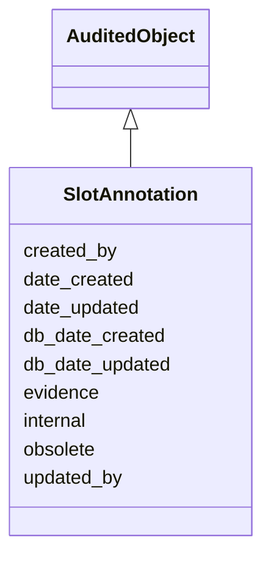

# SlotAnnotation

SlotAnnotation classes should be used when we need to attach metadata (in particular evidence and provenance) to a slot in the context of its referencing class, that can not be fully captured using an Association between the full class itself, and an InformationContentEntity. Evidence and provenance can exist here in the form of an evidence code, a publication, a personal communication or any other kind of InformationContentEntity. SlotAnnotation classes are used where the slot is not referencing a class in and of itself, and often has a scalar range.





URI: [alliance:SlotAnnotation](http://alliancegenome.org/SlotAnnotation)


## Parent Classes

* [AuditedObject](AuditedObject.md)
    * **SlotAnnotation**
        * [AlleleDatabaseStatusSlotAnnotation](AlleleDatabaseStatusSlotAnnotation.md)
        * [AlleleFunctionalImpactSlotAnnotation](AlleleFunctionalImpactSlotAnnotation.md)
        * [AlleleGermlineTransmissionStatusSlotAnnotation](AlleleGermlineTransmissionStatusSlotAnnotation.md)
        * [AlleleInheritanceModeSlotAnnotation](AlleleInheritanceModeSlotAnnotation.md)
        * [AlleleMolecularMutationSlotAnnotation](AlleleMolecularMutationSlotAnnotation.md)
        * [AlleleMutationTypeSlotAnnotation](AlleleMutationTypeSlotAnnotation.md)
        * [AlleleNomenclatureEventSlotAnnotation](AlleleNomenclatureEventSlotAnnotation.md)
        * [AlleleNoteSlotAnnotation](AlleleNoteSlotAnnotation.md)
        * [AlleleSecondaryIdSlotAnnotation](AlleleSecondaryIdSlotAnnotation.md)
        * [NameSlotAnnotation](NameSlotAnnotation.md)


## Children

* [AuditedObject](AuditedObject.md)
    * **SlotAnnotation**
        * [AlleleDatabaseStatusSlotAnnotation](AlleleDatabaseStatusSlotAnnotation.md)
        * [AlleleFunctionalImpactSlotAnnotation](AlleleFunctionalImpactSlotAnnotation.md)
        * [AlleleGermlineTransmissionStatusSlotAnnotation](AlleleGermlineTransmissionStatusSlotAnnotation.md)
        * [AlleleInheritanceModeSlotAnnotation](AlleleInheritanceModeSlotAnnotation.md)
        * [AlleleMolecularMutationSlotAnnotation](AlleleMolecularMutationSlotAnnotation.md)
        * [AlleleMutationTypeSlotAnnotation](AlleleMutationTypeSlotAnnotation.md)
        * [AlleleNomenclatureEventSlotAnnotation](AlleleNomenclatureEventSlotAnnotation.md)
        * [AlleleNoteSlotAnnotation](AlleleNoteSlotAnnotation.md)
        * [AlleleSecondaryIdSlotAnnotation](AlleleSecondaryIdSlotAnnotation.md)
        * [NameSlotAnnotation](NameSlotAnnotation.md)


## Slots

| Name | Description  |
| ---  | ---  |
| [created_by](created_by.md) | The individual that created the entity. |
| [date_created](date_created.md) | The date on which an entity was created. This can be applied to nodes or edges. |
| [date_updated](date_updated.md) | Date on which an entity was last modified. |
| [db_date_created](db_date_created.md) | The date on which an entity was created in the Alliance database.  This is disinct from date_created, which represents the date when the entity was originally created (i.e. at the MOD for imported data). |
| [db_date_updated](db_date_updated.md) | Date on which an entity was last modified in the Alliance database.  This is disinct from date_updated, which represents the date when the entity was last modified and may predate import into the Alliance database. |
| [evidence](evidence.md) |  |
| [internal](internal.md) | Classifies the entity as private (for internal use) or not (for public use). |
| [obsolete](obsolete.md) | Entity is no longer current. |
| [updated_by](updated_by.md) | The individual that last modified the entity. |


## Mappings

| Mapping Type | Mapped Value |
| ---  | ---  |
| self | ['alliance:SlotAnnotation'] |
| native | ['alliance:SlotAnnotation'] |


## LinkML Specification

<!-- TODO: investigate https://stackoverflow.com/questions/37606292/how-to-create-tabbed-code-blocks-in-mkdocs-or-sphinx -->

### Direct

<details>
```yaml
name: SlotAnnotation
description: SlotAnnotation classes should be used when we need to attach metadata
  (in particular evidence and provenance) to a slot in the context of its referencing
  class, that can not be fully captured using an Association between the full class
  itself, and an InformationContentEntity. Evidence and provenance can exist here
  in the form of an evidence code, a publication, a personal communication or any
  other kind of InformationContentEntity. SlotAnnotation classes are used where the
  slot is not referencing a class in and of itself, and often has a scalar range.
notes:
- A good example of the use of a SlotAnnotation class is the use case of attributing
  one of many functional impacts of an allele to a publication.  AlleleFunctionalImpact
  is the SlotAnnotation class that represents this use case.
from_schema: https://github.com/alliance-genome/agr_curation_schema/core.yaml
is_a: AuditedObject
slots:
- evidence

```
</details>

### Induced

<details>
```yaml
name: SlotAnnotation
description: SlotAnnotation classes should be used when we need to attach metadata
  (in particular evidence and provenance) to a slot in the context of its referencing
  class, that can not be fully captured using an Association between the full class
  itself, and an InformationContentEntity. Evidence and provenance can exist here
  in the form of an evidence code, a publication, a personal communication or any
  other kind of InformationContentEntity. SlotAnnotation classes are used where the
  slot is not referencing a class in and of itself, and often has a scalar range.
notes:
- A good example of the use of a SlotAnnotation class is the use case of attributing
  one of many functional impacts of an allele to a publication.  AlleleFunctionalImpact
  is the SlotAnnotation class that represents this use case.
from_schema: https://github.com/alliance-genome/agr_curation_schema/core.yaml
is_a: AuditedObject
attributes:
  evidence:
    name: evidence
    description: ''
    from_schema: https://github.com/alliance-genome/agr_curation_schema/src/schema/reference
    multivalued: true
    alias: evidence
    owner: SlotAnnotation
    domain_of:
    - AlleleGenerationMethodAssociation
    - Note
    - SlotAnnotation
    - Association
    range: InformationContentEntity
  created_by:
    name: created_by
    description: The individual that created the entity.
    from_schema: https://github.com/alliance-genome/agr_curation_schema/core.yaml
    domain: AuditedObject
    multivalued: false
    alias: created_by
    owner: SlotAnnotation
    domain_of:
    - AuditedObject
    range: Person
  date_created:
    name: date_created
    description: The date on which an entity was created. This can be applied to nodes
      or edges.
    from_schema: https://github.com/alliance-genome/agr_curation_schema/core.yaml
    aliases:
    - creation_date
    exact_mappings:
    - dct:createdOn
    - WIKIDATA_PROPERTY:P577
    alias: date_created
    owner: SlotAnnotation
    domain_of:
    - AuditedObject
    - AuditedObjectDTO
    range: datetime
  updated_by:
    name: updated_by
    description: The individual that last modified the entity.
    from_schema: https://github.com/alliance-genome/agr_curation_schema/core.yaml
    domain: AuditedObject
    multivalued: false
    alias: updated_by
    owner: SlotAnnotation
    domain_of:
    - AuditedObject
    range: Person
  date_updated:
    name: date_updated
    description: Date on which an entity was last modified.
    from_schema: https://github.com/alliance-genome/agr_curation_schema/core.yaml
    aliases:
    - date_last_modified
    alias: date_updated
    owner: SlotAnnotation
    domain_of:
    - AuditedObject
    - AuditedObjectDTO
    range: datetime
  db_date_created:
    name: db_date_created
    description: The date on which an entity was created in the Alliance database.  This
      is disinct from date_created, which represents the date when the entity was
      originally created (i.e. at the MOD for imported data).
    from_schema: https://github.com/alliance-genome/agr_curation_schema/core.yaml
    alias: db_date_created
    owner: SlotAnnotation
    domain_of:
    - AuditedObject
    - AuditedObjectDTO
    range: datetime
  db_date_updated:
    name: db_date_updated
    description: Date on which an entity was last modified in the Alliance database.  This
      is disinct from date_updated, which represents the date when the entity was
      last modified and may predate import into the Alliance database.
    from_schema: https://github.com/alliance-genome/agr_curation_schema/core.yaml
    alias: db_date_updated
    owner: SlotAnnotation
    domain_of:
    - AuditedObject
    - AuditedObjectDTO
    range: datetime
  internal:
    name: internal
    description: Classifies the entity as private (for internal use) or not (for public
      use).
    notes:
    - Default value is true.
    from_schema: https://github.com/alliance-genome/agr_curation_schema/core.yaml
    alias: internal
    owner: SlotAnnotation
    domain_of:
    - AuditedObject
    - AuditedObjectDTO
    range: boolean
    required: true
  obsolete:
    name: obsolete
    description: Entity is no longer current.
    notes:
    - Obsolete entities are preserved in the database for posterity but should not
      be publicly displayed.
    from_schema: https://github.com/alliance-genome/agr_curation_schema/core.yaml
    alias: obsolete
    owner: SlotAnnotation
    domain_of:
    - AuditedObject
    - AuditedObjectDTO
    range: boolean

```
</details>