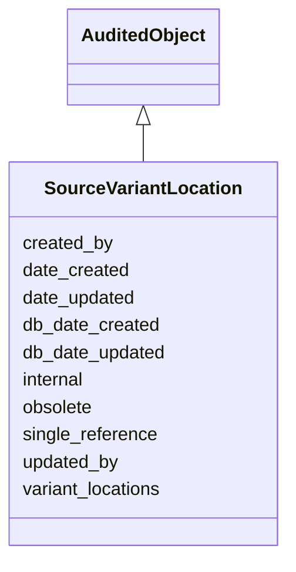

# SourceVariantLocation

Links a paper to the variant locations described in that paper





URI: [alliance:SourceVariantLocation](http://alliancegenome.org/SourceVariantLocation)


## Parent Classes

* [AuditedObject](AuditedObject.md)
    * **SourceVariantLocation**


<!-- no inheritance hierarchy -->


## Slots

| Name | Description  |
| ---  | ---  |
| [created_by](created_by.md) | The individual that created the entity. |
| [date_created](date_created.md) | The date on which an entity was created. This can be applied to nodes or edges. |
| [date_updated](date_updated.md) | Date on which an entity was last modified. |
| [db_date_created](db_date_created.md) | The date on which an entity was created in the Alliance database.  This is disinct from date_created, which represents the date when the entity was originally created (i.e. at the MOD for imported data). |
| [db_date_updated](db_date_updated.md) | Date on which an entity was last modified in the Alliance database.  This is disinct from date_updated, which represents the date when the entity was last modified and may predate import into the Alliance database. |
| [internal](internal.md) | Classifies the entity as private (for internal use) or not (for public use). |
| [obsolete](obsolete.md) | Entity is no longer current. |
| [single_reference](single_reference.md) | holds between an object and a single reference |
| [updated_by](updated_by.md) | The individual that last modified the entity. |
| [variant_locations](variant_locations.md) | Location of the variant within genomic entities. Variant_locations can include any or all of: one VariantGenomeLocation stanza, one or more VariantTranscriptLocation stanzas and/or one or more VariantPolypeptideLocation stanzas. |


## Mappings

| Mapping Type | Mapped Value |
| ---  | ---  |
| self | ['alliance:SourceVariantLocation'] |
| native | ['alliance:SourceVariantLocation'] |


## LinkML Specification

<!-- TODO: investigate https://stackoverflow.com/questions/37606292/how-to-create-tabbed-code-blocks-in-mkdocs-or-sphinx -->

### Direct

<details>
```yaml
name: SourceVariantLocation
description: Links a paper to the variant locations described in that paper
from_schema: https://github.com/alliance-genome/agr_curation_schema/src/schema/variation
is_a: AuditedObject
slots:
- variant_locations
- single_reference
slot_usage:
  single_reference:
    name: single_reference
    domain_of:
    - SourceVariantLocation
    - VariantLocation
    - PhenotypeAnnotation
    - DiseaseAnnotation
    - ConditionRelation
    - Figure
    - GeneToGeneOrthologyCurated
    - ExpressionExperiment
    - FunctionalGeneSet
    required: true

```
</details>

### Induced

<details>
```yaml
name: SourceVariantLocation
description: Links a paper to the variant locations described in that paper
from_schema: https://github.com/alliance-genome/agr_curation_schema/src/schema/variation
is_a: AuditedObject
slot_usage:
  single_reference:
    name: single_reference
    domain_of:
    - SourceVariantLocation
    - VariantLocation
    - PhenotypeAnnotation
    - DiseaseAnnotation
    - ConditionRelation
    - Figure
    - GeneToGeneOrthologyCurated
    - ExpressionExperiment
    - FunctionalGeneSet
    required: true
attributes:
  variant_locations:
    name: variant_locations
    description: 'Location of the variant within genomic entities. Variant_locations
      can include any or all of: one VariantGenomeLocation stanza, one or more VariantTranscriptLocation
      stanzas and/or one or more VariantPolypeptideLocation stanzas.'
    from_schema: https://github.com/alliance-genome/agr_curation_schema/src/schema/variation
    domain: Variant
    multivalued: true
    alias: variant_locations
    owner: SourceVariantLocation
    domain_of:
    - SourceVariantLocation
    range: VariantLocation
  single_reference:
    name: single_reference
    description: holds between an object and a single reference
    from_schema: https://github.com/alliance-genome/agr_curation_schema/core.yaml
    multivalued: false
    alias: single_reference
    owner: SourceVariantLocation
    domain_of:
    - SourceVariantLocation
    - VariantLocation
    - PhenotypeAnnotation
    - DiseaseAnnotation
    - ConditionRelation
    - Figure
    - GeneToGeneOrthologyCurated
    - ExpressionExperiment
    - FunctionalGeneSet
    range: Reference
    required: true
  created_by:
    name: created_by
    description: The individual that created the entity.
    from_schema: https://github.com/alliance-genome/agr_curation_schema/core.yaml
    domain: AuditedObject
    multivalued: false
    alias: created_by
    owner: SourceVariantLocation
    domain_of:
    - AuditedObject
    range: Person
  date_created:
    name: date_created
    description: The date on which an entity was created. This can be applied to nodes
      or edges.
    from_schema: https://github.com/alliance-genome/agr_curation_schema/core.yaml
    aliases:
    - creation_date
    exact_mappings:
    - dct:createdOn
    - WIKIDATA_PROPERTY:P577
    alias: date_created
    owner: SourceVariantLocation
    domain_of:
    - AuditedObject
    - AuditedObjectDTO
    range: datetime
  updated_by:
    name: updated_by
    description: The individual that last modified the entity.
    from_schema: https://github.com/alliance-genome/agr_curation_schema/core.yaml
    domain: AuditedObject
    multivalued: false
    alias: updated_by
    owner: SourceVariantLocation
    domain_of:
    - AuditedObject
    range: Person
  date_updated:
    name: date_updated
    description: Date on which an entity was last modified.
    from_schema: https://github.com/alliance-genome/agr_curation_schema/core.yaml
    aliases:
    - date_last_modified
    alias: date_updated
    owner: SourceVariantLocation
    domain_of:
    - AuditedObject
    - AuditedObjectDTO
    range: datetime
  db_date_created:
    name: db_date_created
    description: The date on which an entity was created in the Alliance database.  This
      is disinct from date_created, which represents the date when the entity was
      originally created (i.e. at the MOD for imported data).
    from_schema: https://github.com/alliance-genome/agr_curation_schema/core.yaml
    alias: db_date_created
    owner: SourceVariantLocation
    domain_of:
    - AuditedObject
    - AuditedObjectDTO
    range: datetime
  db_date_updated:
    name: db_date_updated
    description: Date on which an entity was last modified in the Alliance database.  This
      is disinct from date_updated, which represents the date when the entity was
      last modified and may predate import into the Alliance database.
    from_schema: https://github.com/alliance-genome/agr_curation_schema/core.yaml
    alias: db_date_updated
    owner: SourceVariantLocation
    domain_of:
    - AuditedObject
    - AuditedObjectDTO
    range: datetime
  internal:
    name: internal
    description: Classifies the entity as private (for internal use) or not (for public
      use).
    notes:
    - Default value is true.
    from_schema: https://github.com/alliance-genome/agr_curation_schema/core.yaml
    alias: internal
    owner: SourceVariantLocation
    domain_of:
    - AuditedObject
    - AuditedObjectDTO
    range: boolean
    required: true
  obsolete:
    name: obsolete
    description: Entity is no longer current.
    notes:
    - Obsolete entities are preserved in the database for posterity but should not
      be publicly displayed.
    from_schema: https://github.com/alliance-genome/agr_curation_schema/core.yaml
    alias: obsolete
    owner: SourceVariantLocation
    domain_of:
    - AuditedObject
    - AuditedObjectDTO
    range: boolean

```
</details>