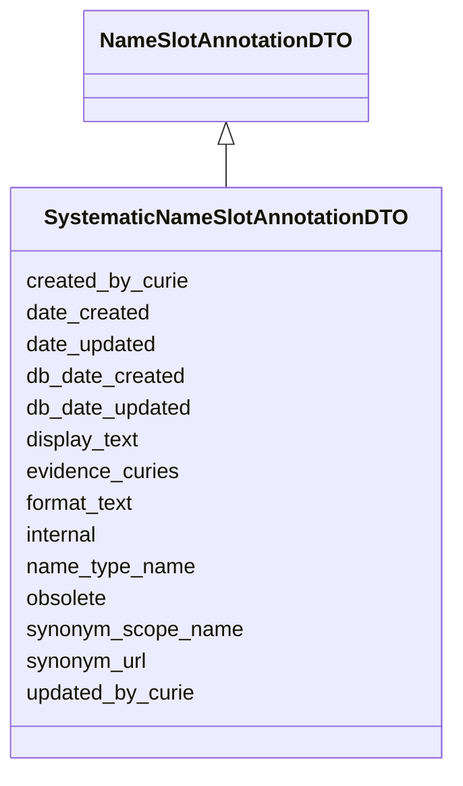

# SystematicNameSlotAnnotationDTO

None





URI: [alliance:SystematicNameSlotAnnotationDTO](http://alliancegenome.org/SystematicNameSlotAnnotationDTO)


## Parent Classes

* [AuditedObjectDTO](AuditedObjectDTO.md)
    * [SlotAnnotationDTO](SlotAnnotationDTO.md)
        * [NameSlotAnnotationDTO](NameSlotAnnotationDTO.md)
            * **SystematicNameSlotAnnotationDTO**


<!-- no inheritance hierarchy -->


## Slots

| Name | Description  |
| ---  | ---  |
| [created_by_curie](created_by_curie.md) | Curie of the Person object representing the individual that created the entity |
| [date_created](date_created.md) | The date on which an entity was created. This can be applied to nodes or edges. |
| [date_updated](date_updated.md) | Date on which an entity was last modified. |
| [db_date_created](db_date_created.md) | The date on which an entity was created in the Alliance database.  This is disinct from date_created, which represents the date when the entity was originally created (i.e. at the MOD for imported data). |
| [db_date_updated](db_date_updated.md) | Date on which an entity was last modified in the Alliance database.  This is disinct from date_updated, which represents the date when the entity was last modified and may predate import into the Alliance database. |
| [display_text](display_text.md) | A version of a synonym string for display. Any UTF8 character is permitted. |
| [evidence_curies](evidence_curies.md) | Curies of InformationContentEntity objects given as evidence |
| [format_text](format_text.md) | A version of a synonym string using only ASCII characters, which is easier to type (for searches), print and parse. For example, Greek characters are transliterated. |
| [internal](internal.md) | Classifies the entity as private (for internal use) or not (for public use). |
| [name_type_name](name_type_name.md) | Name of the VocabularyTerm representing the name type of the synonym - proposed values are nomenclature_symbol / full_name / systematic_name / ncbi_protein_name / uniform / non_uniform / retired_name / unspecified |
| [obsolete](obsolete.md) | Entity is no longer current. |
| [synonym_scope_name](synonym_scope_name.md) | Name of the VocabularyTerm representing the scope of the synonym - permissible values are narrow / broad / related / exact |
| [synonym_url](synonym_url.md) | URL for a synonym: e.g., NCBI URL for the NCBI synonym of an object. |
| [updated_by_curie](updated_by_curie.md) | Curie of the Person object representing the individual that updated the entity |


## Mappings

| Mapping Type | Mapped Value |
| ---  | ---  |
| self | ['alliance:SystematicNameSlotAnnotationDTO'] |
| native | ['alliance:SystematicNameSlotAnnotationDTO'] |


## LinkML Specification

<!-- TODO: investigate https://stackoverflow.com/questions/37606292/how-to-create-tabbed-code-blocks-in-mkdocs-or-sphinx -->

### Direct

<details>
```yaml
name: SystematicNameSlotAnnotationDTO
from_schema: https://github.com/alliance-genome/agr_curation_schema/core.yaml
is_a: NameSlotAnnotationDTO
slot_usage:
  name_type_name:
    name: name_type_name
    domain_of:
    - NameSlotAnnotationDTO
    any_of:
    - equals_string: systematic_name

```
</details>

### Induced

<details>
```yaml
name: SystematicNameSlotAnnotationDTO
from_schema: https://github.com/alliance-genome/agr_curation_schema/core.yaml
is_a: NameSlotAnnotationDTO
slot_usage:
  name_type_name:
    name: name_type_name
    domain_of:
    - NameSlotAnnotationDTO
    any_of:
    - equals_string: systematic_name
attributes:
  name_type_name:
    name: name_type_name
    description: Name of the VocabularyTerm representing the name type of the synonym
      - proposed values are nomenclature_symbol / full_name / systematic_name / ncbi_protein_name
      / uniform / non_uniform / retired_name / unspecified
    from_schema: https://github.com/alliance-genome/agr_curation_schema/core.yaml
    domain: NameSlotAnnotationDTO
    alias: name_type_name
    owner: SystematicNameSlotAnnotationDTO
    domain_of:
    - NameSlotAnnotationDTO
    range: string
    required: true
    any_of:
    - equals_string: systematic_name
  format_text:
    name: format_text
    description: A version of a synonym string using only ASCII characters, which
      is easier to type (for searches), print and parse. For example, Greek characters
      are transliterated.
    from_schema: https://github.com/alliance-genome/agr_curation_schema/core.yaml
    aliases:
    - synonym_text
    multivalued: false
    alias: format_text
    owner: SystematicNameSlotAnnotationDTO
    domain_of:
    - NameSlotAnnotation
    - NameSlotAnnotationDTO
    range: string
    required: true
  display_text:
    name: display_text
    description: A version of a synonym string for display. Any UTF8 character is
      permitted.
    from_schema: https://github.com/alliance-genome/agr_curation_schema/core.yaml
    aliases:
    - synonym_sgml
    multivalued: false
    alias: display_text
    owner: SystematicNameSlotAnnotationDTO
    domain_of:
    - NameSlotAnnotation
    - NameSlotAnnotationDTO
    range: string
    required: true
  synonym_url:
    name: synonym_url
    description: 'URL for a synonym: e.g., NCBI URL for the NCBI synonym of an object.'
    from_schema: https://github.com/alliance-genome/agr_curation_schema/core.yaml
    alias: synonym_url
    owner: SystematicNameSlotAnnotationDTO
    domain_of:
    - NameSlotAnnotation
    - NameSlotAnnotationDTO
    range: uri
  synonym_scope_name:
    name: synonym_scope_name
    description: Name of the VocabularyTerm representing the scope of the synonym
      - permissible values are narrow / broad / related / exact
    from_schema: https://github.com/alliance-genome/agr_curation_schema/core.yaml
    domain: NameSlotAnnotationDTO
    alias: synonym_scope_name
    owner: SystematicNameSlotAnnotationDTO
    domain_of:
    - NameSlotAnnotationDTO
    range: string
  evidence_curies:
    name: evidence_curies
    description: Curies of InformationContentEntity objects given as evidence
    from_schema: https://github.com/alliance-genome/agr_curation_schema/src/schema/reference
    multivalued: true
    alias: evidence_curies
    owner: SystematicNameSlotAnnotationDTO
    domain_of:
    - DiseaseAnnotationDTO
    - AlleleCellLineAssociationDTO
    - AlleleGenerationMethodAssociationDTO
    - AlleleGenomicEntityAssociationDTO
    - AlleleImageAssociationDTO
    - AlleleOriginAssociationDTO
    - NoteDTO
    - SlotAnnotationDTO
    - GenomicLocationAssociationDTO
    range: string
  created_by_curie:
    name: created_by_curie
    description: Curie of the Person object representing the individual that created
      the entity
    from_schema: https://github.com/alliance-genome/agr_curation_schema/core.yaml
    domain: AuditedObjectDTO
    alias: created_by_curie
    owner: SystematicNameSlotAnnotationDTO
    domain_of:
    - AuditedObjectDTO
    range: string
  date_created:
    name: date_created
    description: The date on which an entity was created. This can be applied to nodes
      or edges.
    from_schema: https://github.com/alliance-genome/agr_curation_schema/core.yaml
    aliases:
    - creation_date
    exact_mappings:
    - dct:createdOn
    - WIKIDATA_PROPERTY:P577
    alias: date_created
    owner: SystematicNameSlotAnnotationDTO
    domain_of:
    - AuditedObject
    - AuditedObjectDTO
    range: datetime
  updated_by_curie:
    name: updated_by_curie
    description: Curie of the Person object representing the individual that updated
      the entity
    from_schema: https://github.com/alliance-genome/agr_curation_schema/core.yaml
    domain: AuditedObjectDTO
    alias: updated_by_curie
    owner: SystematicNameSlotAnnotationDTO
    domain_of:
    - AuditedObjectDTO
    range: string
  date_updated:
    name: date_updated
    description: Date on which an entity was last modified.
    from_schema: https://github.com/alliance-genome/agr_curation_schema/core.yaml
    aliases:
    - date_last_modified
    alias: date_updated
    owner: SystematicNameSlotAnnotationDTO
    domain_of:
    - AuditedObject
    - AuditedObjectDTO
    range: datetime
  db_date_created:
    name: db_date_created
    description: The date on which an entity was created in the Alliance database.  This
      is disinct from date_created, which represents the date when the entity was
      originally created (i.e. at the MOD for imported data).
    from_schema: https://github.com/alliance-genome/agr_curation_schema/core.yaml
    alias: db_date_created
    owner: SystematicNameSlotAnnotationDTO
    domain_of:
    - AuditedObject
    - AuditedObjectDTO
    range: datetime
  db_date_updated:
    name: db_date_updated
    description: Date on which an entity was last modified in the Alliance database.  This
      is disinct from date_updated, which represents the date when the entity was
      last modified and may predate import into the Alliance database.
    from_schema: https://github.com/alliance-genome/agr_curation_schema/core.yaml
    alias: db_date_updated
    owner: SystematicNameSlotAnnotationDTO
    domain_of:
    - AuditedObject
    - AuditedObjectDTO
    range: datetime
  internal:
    name: internal
    description: Classifies the entity as private (for internal use) or not (for public
      use).
    notes:
    - Default value is true.
    from_schema: https://github.com/alliance-genome/agr_curation_schema/core.yaml
    alias: internal
    owner: SystematicNameSlotAnnotationDTO
    domain_of:
    - AuditedObject
    - AuditedObjectDTO
    range: boolean
    required: true
  obsolete:
    name: obsolete
    description: Entity is no longer current.
    notes:
    - Obsolete entities are preserved in the database for posterity but should not
      be publicly displayed.
    from_schema: https://github.com/alliance-genome/agr_curation_schema/core.yaml
    alias: obsolete
    owner: SystematicNameSlotAnnotationDTO
    domain_of:
    - AuditedObject
    - AuditedObjectDTO
    range: boolean

```
</details>