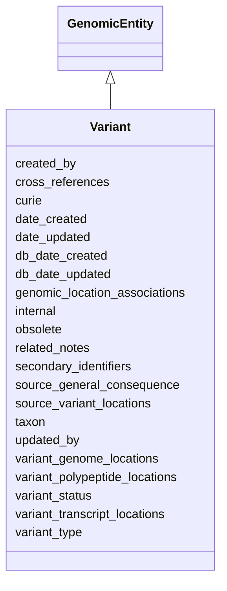

# Variant

A DNA, RNA or protein/polypeptide sequence that differs relative to a designated reference sequence.  The sequence occurs at a single position or in a range of contiguous nucleotides or amino acids.





URI: [alliance:Variant](http://alliancegenome.org/Variant)


## Parent Classes

* [AuditedObject](AuditedObject.md)
    * [BiologicalEntity](BiologicalEntity.md)
        * [GenomicEntity](GenomicEntity.md)
            * **Variant**


<!-- no inheritance hierarchy -->


## Slots

| Name | Description  |
| ---  | ---  |
| [created_by](created_by.md) | The individual that created the entity. |
| [cross_references](cross_references.md) | Holds between an object and its CrossReferences. |
| [curie](curie.md) | A unique identifier for a thing. Must be either a CURIE shorthand for a URI or a complete URI |
| [date_created](date_created.md) | The date on which an entity was created. This can be applied to nodes or edges. |
| [date_updated](date_updated.md) | Date on which an entity was last modified. |
| [db_date_created](db_date_created.md) | The date on which an entity was created in the Alliance database.  This is disinct from date_created, which represents the date when the entity was originally created (i.e. at the MOD for imported data). |
| [db_date_updated](db_date_updated.md) | Date on which an entity was last modified in the Alliance database.  This is disinct from date_updated, which represents the date when the entity was last modified and may predate import into the Alliance database. |
| [genomic_location_associations](genomic_location_associations.md) | None |
| [internal](internal.md) | Classifies the entity as private (for internal use) or not (for public use). |
| [obsolete](obsolete.md) | Entity is no longer current. |
| [related_notes](related_notes.md) | Holds between an object and a list of related Note objects. |
| [secondary_identifiers](secondary_identifiers.md) | None |
| [source_general_consequence](source_general_consequence.md) | SOTerm (child of SO:0001576 - transcript_variant) that describes the consequence of the variant, as stated in the source reference when no transcript ID is provided. Since a curator would determine variant location and consequences relative to at least one specific genome assembly, transcript and/or polypeptide, no slot for curated general consequence is provided. |
| [source_variant_locations](source_variant_locations.md) | Location of the variant within genomic entities,as described in the source references. |
| [taxon](taxon.md) | The taxon from which the biological entity derives. |
| [updated_by](updated_by.md) | The individual that last modified the entity. |
| [variant_genome_locations](variant_genome_locations.md) | Location of the variant in a genomic context.  multiple variant_genome_locations represent multiple assemblies. |
| [variant_polypeptide_locations](variant_polypeptide_locations.md) | Location of the variant within polypeptide entities. |
| [variant_status](variant_status.md) |  |
| [variant_transcript_locations](variant_transcript_locations.md) | Location of the variant within transcript entities. |
| [variant_type](variant_type.md) | SOTerm describing the type of variant. In practice, variant type will be limited to a subset of the SO specified in an Alliance controlled vocabulary in order to maintain consistency. |


## Mappings

| Mapping Type | Mapped Value |
| ---  | ---  |
| self | ['alliance:Variant'] |
| native | ['alliance:Variant'] |
| exact | ['SO:0001059'] |


## LinkML Specification

<!-- TODO: investigate https://stackoverflow.com/questions/37606292/how-to-create-tabbed-code-blocks-in-mkdocs-or-sphinx -->

### Direct

<details>
```yaml
name: Variant
description: A DNA, RNA or protein/polypeptide sequence that differs relative to a
  designated reference sequence.  The sequence occurs at a single position or in a
  range of contiguous nucleotides or amino acids.
from_schema: https://github.com/alliance-genome/agr_curation_schema/src/schema/variation
exact_mappings:
- SO:0001059
is_a: GenomicEntity
slots:
- variant_type
- related_notes
- source_general_consequence
- variant_genome_locations
- variant_polypeptide_locations
- variant_transcript_locations
- source_variant_locations
- variant_status
rules:
- postconditions:
    description: a variant must have a genome location, or must be private
    any_of:
    - slot_conditions:
        variant_genome_locations:
          name: variant_genome_locations
          required: true
    - slot_conditions:
        variant_status:
          name: variant_status
          equals_string: private

```
</details>

### Induced

<details>
```yaml
name: Variant
description: A DNA, RNA or protein/polypeptide sequence that differs relative to a
  designated reference sequence.  The sequence occurs at a single position or in a
  range of contiguous nucleotides or amino acids.
from_schema: https://github.com/alliance-genome/agr_curation_schema/src/schema/variation
exact_mappings:
- SO:0001059
is_a: GenomicEntity
attributes:
  variant_type:
    name: variant_type
    description: SOTerm describing the type of variant. In practice, variant type
      will be limited to a subset of the SO specified in an Alliance controlled vocabulary
      in order to maintain consistency.
    from_schema: https://github.com/alliance-genome/agr_curation_schema/src/schema/variation
    domain: Variant
    multivalued: false
    alias: variant_type
    owner: Variant
    domain_of:
    - Variant
    range: SOTerm
    required: true
  related_notes:
    name: related_notes
    description: Holds between an object and a list of related Note objects.
    notes:
    - The original name suggested for this slot was simply notes, but I think that
      label is reserved in LinkML for internal descriptions of objects, hence the
      related_notes label used here.
    from_schema: https://github.com/alliance-genome/agr_curation_schema/core.yaml
    multivalued: true
    alias: related_notes
    owner: Variant
    domain_of:
    - Variant
    - DiseaseAnnotation
    - Gene
    - Antibody
    - ExpressionExperiment
    - ExpressionAnnotation
    range: Note
  source_general_consequence:
    name: source_general_consequence
    description: SOTerm (child of SO:0001576 - transcript_variant) that describes
      the consequence of the variant, as stated in the source reference when no transcript
      ID is provided. Since a curator would determine variant location and consequences
      relative to at least one specific genome assembly, transcript and/or polypeptide,
      no slot for curated general consequence is provided.
    from_schema: https://github.com/alliance-genome/agr_curation_schema/src/schema/variation
    domain: Variant
    multivalued: false
    alias: source_general_consequence
    owner: Variant
    domain_of:
    - Variant
    range: SOTerm
    required: false
  variant_genome_locations:
    name: variant_genome_locations
    description: Location of the variant in a genomic context.  multiple variant_genome_locations
      represent multiple assemblies.
    from_schema: https://github.com/alliance-genome/agr_curation_schema/src/schema/variation
    is_a: variant_locations
    domain: Variant
    multivalued: true
    alias: variant_genome_locations
    owner: Variant
    domain_of:
    - Variant
    range: VariantGenomeLocation
    required: true
    inlined: true
    inlined_as_list: true
  variant_polypeptide_locations:
    name: variant_polypeptide_locations
    description: Location of the variant within polypeptide entities.
    from_schema: https://github.com/alliance-genome/agr_curation_schema/src/schema/variation
    is_a: variant_locations
    domain: Variant
    multivalued: true
    alias: variant_polypeptide_locations
    owner: Variant
    domain_of:
    - Variant
    range: VariantPolypeptideLocation
    required: false
  variant_transcript_locations:
    name: variant_transcript_locations
    description: Location of the variant within transcript entities.
    from_schema: https://github.com/alliance-genome/agr_curation_schema/src/schema/variation
    is_a: variant_locations
    domain: Variant
    multivalued: true
    alias: variant_transcript_locations
    owner: Variant
    domain_of:
    - Variant
    range: VariantTranscriptLocation
    required: false
  source_variant_locations:
    name: source_variant_locations
    description: Location of the variant within genomic entities,as described in the
      source references.
    from_schema: https://github.com/alliance-genome/agr_curation_schema/src/schema/variation
    domain: Variant
    multivalued: true
    alias: source_variant_locations
    owner: Variant
    domain_of:
    - Variant
    range: SourceVariantLocation
    required: false
  variant_status:
    name: variant_status
    description: ''
    from_schema: https://github.com/alliance-genome/agr_curation_schema/src/schema/variation
    alias: variant_status
    owner: Variant
    domain_of:
    - Variant
    range: variant_status_enum
    required: false
  cross_references:
    name: cross_references
    description: Holds between an object and its CrossReferences.
    from_schema: https://github.com/alliance-genome/agr_curation_schema/core.yaml
    aliases:
    - xrefs
    singular_name: cross_reference
    multivalued: true
    alias: cross_references
    owner: Variant
    domain_of:
    - OntologyTerm
    - GenomicEntity
    - AuthorReference
    - Antibody
    - GeneInteraction
    range: CrossReference
  secondary_identifiers:
    name: secondary_identifiers
    from_schema: https://github.com/alliance-genome/agr_curation_schema/core.yaml
    aliases:
    - secondary_ids
    multivalued: true
    alias: secondary_identifiers
    owner: Variant
    domain_of:
    - OntologyTerm
    - GenomicEntity
    - GenomicEntityDTO
    - Figure
    - Image
    - Antibody
    range: uriorcurie
  genomic_location_associations:
    name: genomic_location_associations
    from_schema: https://github.com/alliance-genome/agr_curation_schema/core.yaml
    domain: GenomicEntity
    multivalued: true
    alias: genomic_location_associations
    owner: Variant
    domain_of:
    - GenomicEntity
    range: GenomicLocationAssociation
  curie:
    name: curie
    description: A unique identifier for a thing. Must be either a CURIE shorthand
      for a URI or a complete URI
    from_schema: https://github.com/alliance-genome/agr_curation_schema/core.yaml
    multivalued: false
    identifier: true
    alias: curie
    owner: Variant
    domain_of:
    - OntologyTerm
    - PhenotypeAnnotation
    - DiseaseAnnotation
    - BiologicalEntity
    - BiologicalEntityDTO
    - Chromosome
    - Assembly
    - Identifier
    - Figure
    - Image
    - Laboratory
    - InformationContentEntity
    - Reference
    - Resource
    - ModCorpusAssociation
    - GeneInteraction
    - ExpressionExperiment
    - GeneNomenclatureSet
    range: uriorcurie
    required: true
  taxon:
    name: taxon
    description: The taxon from which the biological entity derives.
    from_schema: https://github.com/alliance-genome/agr_curation_schema/core.yaml
    multivalued: false
    alias: taxon
    owner: Variant
    domain_of:
    - BiologicalEntity
    range: NCBITaxonTerm
    required: true
  created_by:
    name: created_by
    description: The individual that created the entity.
    from_schema: https://github.com/alliance-genome/agr_curation_schema/core.yaml
    domain: AuditedObject
    multivalued: false
    alias: created_by
    owner: Variant
    domain_of:
    - AuditedObject
    range: Person
  date_created:
    name: date_created
    description: The date on which an entity was created. This can be applied to nodes
      or edges.
    from_schema: https://github.com/alliance-genome/agr_curation_schema/core.yaml
    aliases:
    - creation_date
    exact_mappings:
    - dct:createdOn
    - WIKIDATA_PROPERTY:P577
    alias: date_created
    owner: Variant
    domain_of:
    - AuditedObject
    - AuditedObjectDTO
    range: datetime
  updated_by:
    name: updated_by
    description: The individual that last modified the entity.
    from_schema: https://github.com/alliance-genome/agr_curation_schema/core.yaml
    domain: AuditedObject
    multivalued: false
    alias: updated_by
    owner: Variant
    domain_of:
    - AuditedObject
    range: Person
  date_updated:
    name: date_updated
    description: Date on which an entity was last modified.
    from_schema: https://github.com/alliance-genome/agr_curation_schema/core.yaml
    aliases:
    - date_last_modified
    alias: date_updated
    owner: Variant
    domain_of:
    - AuditedObject
    - AuditedObjectDTO
    range: datetime
  db_date_created:
    name: db_date_created
    description: The date on which an entity was created in the Alliance database.  This
      is disinct from date_created, which represents the date when the entity was
      originally created (i.e. at the MOD for imported data).
    from_schema: https://github.com/alliance-genome/agr_curation_schema/core.yaml
    alias: db_date_created
    owner: Variant
    domain_of:
    - AuditedObject
    - AuditedObjectDTO
    range: datetime
  db_date_updated:
    name: db_date_updated
    description: Date on which an entity was last modified in the Alliance database.  This
      is disinct from date_updated, which represents the date when the entity was
      last modified and may predate import into the Alliance database.
    from_schema: https://github.com/alliance-genome/agr_curation_schema/core.yaml
    alias: db_date_updated
    owner: Variant
    domain_of:
    - AuditedObject
    - AuditedObjectDTO
    range: datetime
  internal:
    name: internal
    description: Classifies the entity as private (for internal use) or not (for public
      use).
    notes:
    - Default value is true.
    from_schema: https://github.com/alliance-genome/agr_curation_schema/core.yaml
    alias: internal
    owner: Variant
    domain_of:
    - AuditedObject
    - AuditedObjectDTO
    range: boolean
    required: true
  obsolete:
    name: obsolete
    description: Entity is no longer current.
    notes:
    - Obsolete entities are preserved in the database for posterity but should not
      be publicly displayed.
    from_schema: https://github.com/alliance-genome/agr_curation_schema/core.yaml
    alias: obsolete
    owner: Variant
    domain_of:
    - AuditedObject
    - AuditedObjectDTO
    range: boolean
rules:
- postconditions:
    description: a variant must have a genome location, or must be private
    any_of:
    - slot_conditions:
        variant_genome_locations:
          name: variant_genome_locations
          required: true
    - slot_conditions:
        variant_status:
          name: variant_status
          equals_string: private

```
</details>