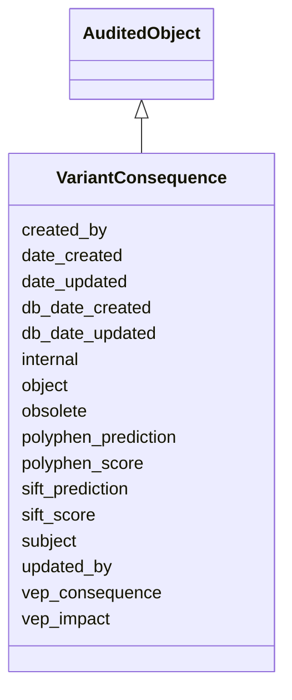

# VariantConsequence

Parent class for gene- and transcript-level consequences





URI: [alliance:VariantConsequence](http://alliancegenome.org/VariantConsequence)


## Parent Classes

* [AuditedObject](AuditedObject.md)
    * **VariantConsequence**
        * [VariantGeneConsequence](VariantGeneConsequence.md)
        * [VariantTranscriptConsequence](VariantTranscriptConsequence.md)


## Children

* [AuditedObject](AuditedObject.md)
    * **VariantConsequence**
        * [VariantGeneConsequence](VariantGeneConsequence.md)
        * [VariantTranscriptConsequence](VariantTranscriptConsequence.md)


## Slots

| Name | Description  |
| ---  | ---  |
| [created_by](created_by.md) | The individual that created the entity. |
| [date_created](date_created.md) | The date on which an entity was created. This can be applied to nodes or edges. |
| [date_updated](date_updated.md) | Date on which an entity was last modified. |
| [db_date_created](db_date_created.md) | The date on which an entity was created in the Alliance database.  This is disinct from date_created, which represents the date when the entity was originally created (i.e. at the MOD for imported data). |
| [db_date_updated](db_date_updated.md) | Date on which an entity was last modified in the Alliance database.  This is disinct from date_updated, which represents the date when the entity was last modified and may predate import into the Alliance database. |
| [internal](internal.md) | Classifies the entity as private (for internal use) or not (for public use). |
| [object](object.md) | connects an association to the object of the association. For example, in a gene-to-phenotype association, the gene is subject and phenotype is object. |
| [obsolete](obsolete.md) | Entity is no longer current. |
| [polyphen_prediction](polyphen_prediction.md) | PolyPhen-2 prediction |
| [polyphen_score](polyphen_score.md) | PolyPhen-2 score between 0 and 1 |
| [sift_prediction](sift_prediction.md) | SIFT prediction |
| [sift_score](sift_score.md) | SIFT score between 0 and 1 |
| [subject](subject.md) | connects an association to the subject of the association. For example, in a gene-to-phenotype association, the gene is subject and phenotype is object. |
| [updated_by](updated_by.md) | The individual that last modified the entity. |
| [vep_consequence](vep_consequence.md) | VEP consequence |
| [vep_impact](vep_impact.md) | VEP predicted impact of variation on molecule |


## Mappings

| Mapping Type | Mapped Value |
| ---  | ---  |
| self | ['alliance:VariantConsequence'] |
| native | ['alliance:VariantConsequence'] |


## LinkML Specification

<!-- TODO: investigate https://stackoverflow.com/questions/37606292/how-to-create-tabbed-code-blocks-in-mkdocs-or-sphinx -->

### Direct

<details>
```yaml
name: VariantConsequence
description: Parent class for gene- and transcript-level consequences
from_schema: https://github.com/alliance-genome/agr_curation_schema/src/schema/variantConsequence
is_a: AuditedObject
abstract: true
slots:
- subject
- object
- vep_consequence
- vep_impact
- polyphen_score
- polyphen_prediction
- sift_score
- sift_prediction

```
</details>

### Induced

<details>
```yaml
name: VariantConsequence
description: Parent class for gene- and transcript-level consequences
from_schema: https://github.com/alliance-genome/agr_curation_schema/src/schema/variantConsequence
is_a: AuditedObject
abstract: true
attributes:
  subject:
    name: subject
    description: connects an association to the subject of the association. For example,
      in a gene-to-phenotype association, the gene is subject and phenotype is object.
    from_schema: https://github.com/alliance-genome/agr_curation_schema/core.yaml
    exact_mappings:
    - owl:annotatedSource
    - biolink:subject
    is_a: association_slot
    alias: subject
    owner: VariantConsequence
    domain_of:
    - Association
    - VariantConsequence
    range: string
    required: true
  object:
    name: object
    description: connects an association to the object of the association. For example,
      in a gene-to-phenotype association, the gene is subject and phenotype is object.
    from_schema: https://github.com/alliance-genome/agr_curation_schema/core.yaml
    exact_mappings:
    - biolink:object
    is_a: association_slot
    alias: object
    owner: VariantConsequence
    domain_of:
    - Association
    - VariantConsequence
    range: string
    required: true
  vep_consequence:
    name: vep_consequence
    description: VEP consequence
    from_schema: https://github.com/alliance-genome/agr_curation_schema/src/schema/variantConsequence
    alias: vep_consequence
    owner: VariantConsequence
    domain_of:
    - VariantConsequence
    range: vep_consequence_levels
  vep_impact:
    name: vep_impact
    description: VEP predicted impact of variation on molecule
    from_schema: https://github.com/alliance-genome/agr_curation_schema/src/schema/variantConsequence
    alias: vep_impact
    owner: VariantConsequence
    domain_of:
    - VariantConsequence
    range: string
  polyphen_score:
    name: polyphen_score
    description: PolyPhen-2 score between 0 and 1
    from_schema: https://github.com/alliance-genome/agr_curation_schema/src/schema/variantConsequence
    domain: VariantGeneConsequence
    alias: polyphen_score
    owner: VariantConsequence
    domain_of:
    - VariantConsequence
    range: float
  polyphen_prediction:
    name: polyphen_prediction
    description: PolyPhen-2 prediction
    from_schema: https://github.com/alliance-genome/agr_curation_schema/src/schema/variantConsequence
    alias: polyphen_prediction
    owner: VariantConsequence
    domain_of:
    - VariantConsequence
    range: polyphen_prediction_levels
  sift_score:
    name: sift_score
    description: SIFT score between 0 and 1
    from_schema: https://github.com/alliance-genome/agr_curation_schema/src/schema/variantConsequence
    domain: VariantGeneConsequence
    alias: sift_score
    owner: VariantConsequence
    domain_of:
    - VariantConsequence
    range: float
  sift_prediction:
    name: sift_prediction
    description: SIFT prediction
    from_schema: https://github.com/alliance-genome/agr_curation_schema/src/schema/variantConsequence
    alias: sift_prediction
    owner: VariantConsequence
    domain_of:
    - VariantConsequence
    range: sift_prediction_levels
  created_by:
    name: created_by
    description: The individual that created the entity.
    from_schema: https://github.com/alliance-genome/agr_curation_schema/core.yaml
    domain: AuditedObject
    multivalued: false
    alias: created_by
    owner: VariantConsequence
    domain_of:
    - AuditedObject
    range: Person
  date_created:
    name: date_created
    description: The date on which an entity was created. This can be applied to nodes
      or edges.
    from_schema: https://github.com/alliance-genome/agr_curation_schema/core.yaml
    aliases:
    - creation_date
    exact_mappings:
    - dct:createdOn
    - WIKIDATA_PROPERTY:P577
    alias: date_created
    owner: VariantConsequence
    domain_of:
    - AuditedObject
    - AuditedObjectDTO
    range: datetime
  updated_by:
    name: updated_by
    description: The individual that last modified the entity.
    from_schema: https://github.com/alliance-genome/agr_curation_schema/core.yaml
    domain: AuditedObject
    multivalued: false
    alias: updated_by
    owner: VariantConsequence
    domain_of:
    - AuditedObject
    range: Person
  date_updated:
    name: date_updated
    description: Date on which an entity was last modified.
    from_schema: https://github.com/alliance-genome/agr_curation_schema/core.yaml
    aliases:
    - date_last_modified
    alias: date_updated
    owner: VariantConsequence
    domain_of:
    - AuditedObject
    - AuditedObjectDTO
    range: datetime
  db_date_created:
    name: db_date_created
    description: The date on which an entity was created in the Alliance database.  This
      is disinct from date_created, which represents the date when the entity was
      originally created (i.e. at the MOD for imported data).
    from_schema: https://github.com/alliance-genome/agr_curation_schema/core.yaml
    alias: db_date_created
    owner: VariantConsequence
    domain_of:
    - AuditedObject
    - AuditedObjectDTO
    range: datetime
  db_date_updated:
    name: db_date_updated
    description: Date on which an entity was last modified in the Alliance database.  This
      is disinct from date_updated, which represents the date when the entity was
      last modified and may predate import into the Alliance database.
    from_schema: https://github.com/alliance-genome/agr_curation_schema/core.yaml
    alias: db_date_updated
    owner: VariantConsequence
    domain_of:
    - AuditedObject
    - AuditedObjectDTO
    range: datetime
  internal:
    name: internal
    description: Classifies the entity as private (for internal use) or not (for public
      use).
    notes:
    - Default value is true.
    from_schema: https://github.com/alliance-genome/agr_curation_schema/core.yaml
    alias: internal
    owner: VariantConsequence
    domain_of:
    - AuditedObject
    - AuditedObjectDTO
    range: boolean
    required: true
  obsolete:
    name: obsolete
    description: Entity is no longer current.
    notes:
    - Obsolete entities are preserved in the database for posterity but should not
      be publicly displayed.
    from_schema: https://github.com/alliance-genome/agr_curation_schema/core.yaml
    alias: obsolete
    owner: VariantConsequence
    domain_of:
    - AuditedObject
    - AuditedObjectDTO
    range: boolean

```
</details>