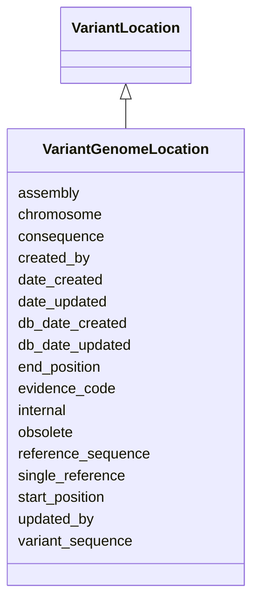

# VariantGenomeLocation

Links a variant to a genomic position and the resulting consequence to the sequence and/or function. In practice, functional consequences for variants which overlap genes are not generally provided at the genome level but rather are calculated and annotated relative to a specific transcript or protein isoform.





URI: [alliance:VariantGenomeLocation](http://alliancegenome.org/VariantGenomeLocation)


## Parent Classes

* [AuditedObject](AuditedObject.md)
    * [VariantLocation](VariantLocation.md)
        * **VariantGenomeLocation**


<!-- no inheritance hierarchy -->


## Slots

| Name | Description  |
| ---  | ---  |
| [assembly](assembly.md) | Assembly to which variant is aligned. |
| [chromosome](chromosome.md) | Chromosome to which variant is aligned. |
| [consequence](consequence.md) | SOTerm (child of SO:0001576 - transcript_variant) that describes the consequence of the variant, as stated in the source reference. In practice source consequence will be associated with locations at any or all of VariantGenomeLocation, VariantTranscriptLocation, and VariantPolypeptideLocation. |
| [created_by](created_by.md) | The individual that created the entity. |
| [date_created](date_created.md) | The date on which an entity was created. This can be applied to nodes or edges. |
| [date_updated](date_updated.md) | Date on which an entity was last modified. |
| [db_date_created](db_date_created.md) | The date on which an entity was created in the Alliance database.  This is disinct from date_created, which represents the date when the entity was originally created (i.e. at the MOD for imported data). |
| [db_date_updated](db_date_updated.md) | Date on which an entity was last modified in the Alliance database.  This is disinct from date_updated, which represents the date when the entity was last modified and may predate import into the Alliance database. |
| [end_position](end_position.md) | End position of variant on genomic entity. |
| [evidence_code](evidence_code.md) | None |
| [internal](internal.md) | Classifies the entity as private (for internal use) or not (for public use). |
| [obsolete](obsolete.md) | Entity is no longer current. |
| [reference_sequence](reference_sequence.md) | Reference sequence of genome or genomic entity at position of aligned variant. |
| [single_reference](single_reference.md) | holds between an object and a single reference |
| [start_position](start_position.md) | Start position of variant on genomic entity. |
| [updated_by](updated_by.md) | The individual that last modified the entity. |
| [variant_sequence](variant_sequence.md) | Sequence that differs from the reference sequence of genome or genomic entity at position of variant, as specified by curator. |


## Mappings

| Mapping Type | Mapped Value |
| ---  | ---  |
| self | ['alliance:VariantGenomeLocation'] |
| native | ['alliance:VariantGenomeLocation'] |


## LinkML Specification

<!-- TODO: investigate https://stackoverflow.com/questions/37606292/how-to-create-tabbed-code-blocks-in-mkdocs-or-sphinx -->

### Direct

<details>
```yaml
name: VariantGenomeLocation
description: Links a variant to a genomic position and the resulting consequence to
  the sequence and/or function. In practice, functional consequences for variants
  which overlap genes are not generally provided at the genome level but rather are
  calculated and annotated relative to a specific transcript or protein isoform.
from_schema: https://github.com/alliance-genome/agr_curation_schema/src/schema/variation
is_a: VariantLocation
slots:
- assembly
- chromosome

```
</details>

### Induced

<details>
```yaml
name: VariantGenomeLocation
description: Links a variant to a genomic position and the resulting consequence to
  the sequence and/or function. In practice, functional consequences for variants
  which overlap genes are not generally provided at the genome level but rather are
  calculated and annotated relative to a specific transcript or protein isoform.
from_schema: https://github.com/alliance-genome/agr_curation_schema/src/schema/variation
is_a: VariantLocation
attributes:
  assembly:
    name: assembly
    description: Assembly to which variant is aligned.
    from_schema: https://github.com/alliance-genome/agr_curation_schema/src/schema/variation
    domain: VariantLocation
    multivalued: false
    alias: assembly
    owner: VariantGenomeLocation
    domain_of:
    - VariantGenomeLocation
    range: Assembly
    required: false
  chromosome:
    name: chromosome
    description: Chromosome to which variant is aligned.
    from_schema: https://github.com/alliance-genome/agr_curation_schema/src/schema/variation
    domain: VariantLocation
    multivalued: false
    alias: chromosome
    owner: VariantGenomeLocation
    domain_of:
    - VariantGenomeLocation
    range: Chromosome
    required: false
  evidence_code:
    name: evidence_code
    from_schema: https://github.com/alliance-genome/agr_curation_schema/core.yaml
    multivalued: false
    alias: evidence_code
    owner: VariantGenomeLocation
    domain_of:
    - VariantLocation
    - AlleleGenomicEntityAssociation
    - GeneToGeneOrthologyCurated
    range: ECOTerm
    required: false
  single_reference:
    name: single_reference
    description: holds between an object and a single reference
    from_schema: https://github.com/alliance-genome/agr_curation_schema/core.yaml
    multivalued: false
    alias: single_reference
    owner: VariantGenomeLocation
    domain_of:
    - SourceVariantLocation
    - VariantLocation
    - PhenotypeAnnotation
    - DiseaseAnnotation
    - ConditionRelation
    - Figure
    - GeneToGeneOrthologyCurated
    - ExpressionExperiment
    - FunctionalGeneSet
    range: Reference
  start_position:
    name: start_position
    description: Start position of variant on genomic entity.
    from_schema: https://github.com/alliance-genome/agr_curation_schema/src/schema/variation
    domain: VariantLocation
    multivalued: false
    alias: start_position
    owner: VariantGenomeLocation
    domain_of:
    - VariantLocation
    range: integer
    required: false
  end_position:
    name: end_position
    description: End position of variant on genomic entity.
    from_schema: https://github.com/alliance-genome/agr_curation_schema/src/schema/variation
    domain: VariantLocation
    multivalued: false
    alias: end_position
    owner: VariantGenomeLocation
    domain_of:
    - VariantLocation
    range: integer
    required: false
  reference_sequence:
    name: reference_sequence
    description: Reference sequence of genome or genomic entity at position of aligned
      variant.
    from_schema: https://github.com/alliance-genome/agr_curation_schema/src/schema/variation
    domain: VariantLocation
    multivalued: false
    alias: reference_sequence
    owner: VariantGenomeLocation
    domain_of:
    - VariantLocation
    range: biological_sequence
    required: false
  variant_sequence:
    name: variant_sequence
    description: Sequence that differs from the reference sequence of genome or genomic
      entity at position of variant, as specified by curator.
    from_schema: https://github.com/alliance-genome/agr_curation_schema/src/schema/variation
    domain: VariantLocation
    multivalued: false
    alias: variant_sequence
    owner: VariantGenomeLocation
    domain_of:
    - VariantLocation
    range: biological_sequence
    required: false
  consequence:
    name: consequence
    description: SOTerm (child of SO:0001576 - transcript_variant) that describes
      the consequence of the variant, as stated in the source reference. In practice
      source consequence will be associated with locations at any or all of VariantGenomeLocation,
      VariantTranscriptLocation, and VariantPolypeptideLocation.
    from_schema: https://github.com/alliance-genome/agr_curation_schema/src/schema/variation
    domain: VariantLocation
    multivalued: false
    alias: consequence
    owner: VariantGenomeLocation
    domain_of:
    - VariantLocation
    range: SOTerm
    required: false
  created_by:
    name: created_by
    description: The individual that created the entity.
    from_schema: https://github.com/alliance-genome/agr_curation_schema/core.yaml
    domain: AuditedObject
    multivalued: false
    alias: created_by
    owner: VariantGenomeLocation
    domain_of:
    - AuditedObject
    range: Person
  date_created:
    name: date_created
    description: The date on which an entity was created. This can be applied to nodes
      or edges.
    from_schema: https://github.com/alliance-genome/agr_curation_schema/core.yaml
    aliases:
    - creation_date
    exact_mappings:
    - dct:createdOn
    - WIKIDATA_PROPERTY:P577
    alias: date_created
    owner: VariantGenomeLocation
    domain_of:
    - AuditedObject
    - AuditedObjectDTO
    range: datetime
  updated_by:
    name: updated_by
    description: The individual that last modified the entity.
    from_schema: https://github.com/alliance-genome/agr_curation_schema/core.yaml
    domain: AuditedObject
    multivalued: false
    alias: updated_by
    owner: VariantGenomeLocation
    domain_of:
    - AuditedObject
    range: Person
  date_updated:
    name: date_updated
    description: Date on which an entity was last modified.
    from_schema: https://github.com/alliance-genome/agr_curation_schema/core.yaml
    aliases:
    - date_last_modified
    alias: date_updated
    owner: VariantGenomeLocation
    domain_of:
    - AuditedObject
    - AuditedObjectDTO
    range: datetime
  db_date_created:
    name: db_date_created
    description: The date on which an entity was created in the Alliance database.  This
      is disinct from date_created, which represents the date when the entity was
      originally created (i.e. at the MOD for imported data).
    from_schema: https://github.com/alliance-genome/agr_curation_schema/core.yaml
    alias: db_date_created
    owner: VariantGenomeLocation
    domain_of:
    - AuditedObject
    - AuditedObjectDTO
    range: datetime
  db_date_updated:
    name: db_date_updated
    description: Date on which an entity was last modified in the Alliance database.  This
      is disinct from date_updated, which represents the date when the entity was
      last modified and may predate import into the Alliance database.
    from_schema: https://github.com/alliance-genome/agr_curation_schema/core.yaml
    alias: db_date_updated
    owner: VariantGenomeLocation
    domain_of:
    - AuditedObject
    - AuditedObjectDTO
    range: datetime
  internal:
    name: internal
    description: Classifies the entity as private (for internal use) or not (for public
      use).
    notes:
    - Default value is true.
    from_schema: https://github.com/alliance-genome/agr_curation_schema/core.yaml
    alias: internal
    owner: VariantGenomeLocation
    domain_of:
    - AuditedObject
    - AuditedObjectDTO
    range: boolean
    required: true
  obsolete:
    name: obsolete
    description: Entity is no longer current.
    notes:
    - Obsolete entities are preserved in the database for posterity but should not
      be publicly displayed.
    from_schema: https://github.com/alliance-genome/agr_curation_schema/core.yaml
    alias: obsolete
    owner: VariantGenomeLocation
    domain_of:
    - AuditedObject
    - AuditedObjectDTO
    range: boolean

```
</details>