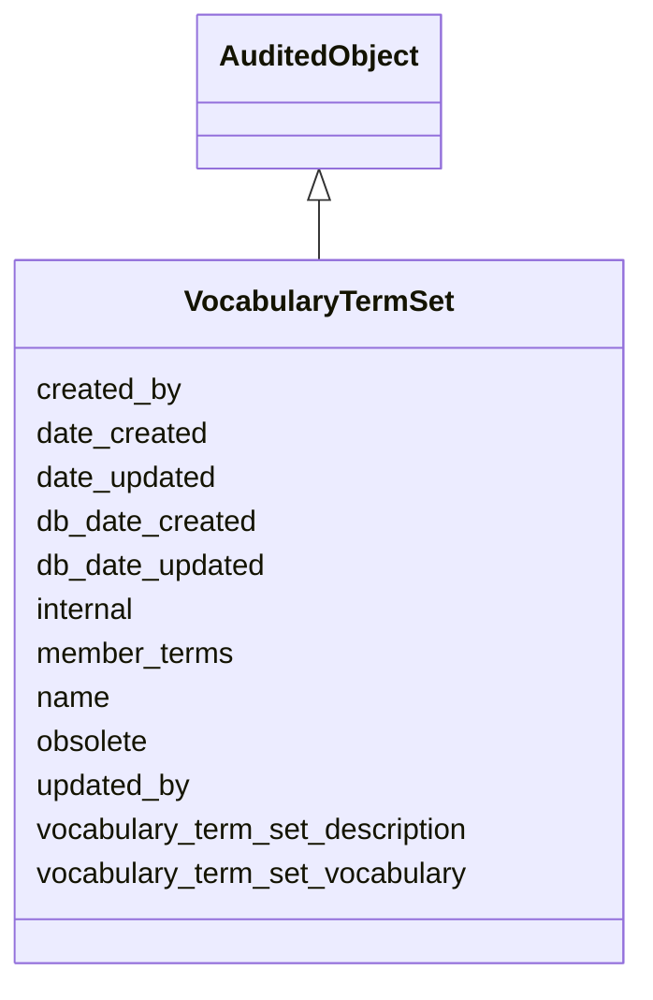

# VocabularyTermSet

A subset of terms from a Vocabulary that are valid for particular applications





URI: [alliance:VocabularyTermSet](http://alliancegenome.org/VocabularyTermSet)


## Parent Classes

* [AuditedObject](AuditedObject.md)
    * **VocabularyTermSet**


<!-- no inheritance hierarchy -->


## Slots

| Name | Description  |
| ---  | ---  |
| [created_by](created_by.md) | The individual that created the entity. |
| [date_created](date_created.md) | The date on which an entity was created. This can be applied to nodes or edges. |
| [date_updated](date_updated.md) | Date on which an entity was last modified. |
| [db_date_created](db_date_created.md) | The date on which an entity was created in the Alliance database.  This is disinct from date_created, which represents the date when the entity was originally created (i.e. at the MOD for imported data). |
| [db_date_updated](db_date_updated.md) | Date on which an entity was last modified in the Alliance database.  This is disinct from date_updated, which represents the date when the entity was last modified and may predate import into the Alliance database. |
| [internal](internal.md) | Classifies the entity as private (for internal use) or not (for public use). |
| [member_terms](member_terms.md) | Set of VocabularyTerm objects in a Vocabulary object set |
| [name](name.md) | a human-readable name for an entity |
| [obsolete](obsolete.md) | Entity is no longer current. |
| [updated_by](updated_by.md) | The individual that last modified the entity. |
| [vocabulary_term_set_description](vocabulary_term_set_description.md) | The free text description of a VocabularyTermSet including its intended use. |
| [vocabulary_term_set_vocabulary](vocabulary_term_set_vocabulary.md) | The Vocabulary from which the terms contained in theVocabularyTermSet belong |


## Mappings

| Mapping Type | Mapped Value |
| ---  | ---  |
| self | ['alliance:VocabularyTermSet'] |
| native | ['alliance:VocabularyTermSet'] |


## LinkML Specification

<!-- TODO: investigate https://stackoverflow.com/questions/37606292/how-to-create-tabbed-code-blocks-in-mkdocs-or-sphinx -->

### Direct

<details>
```yaml
name: VocabularyTermSet
description: A subset of terms from a Vocabulary that are valid for particular applications
from_schema: https://github.com/alliance-genome/agr_curation_schema/controlledVocabulary.yaml
is_a: AuditedObject
slots:
- name
- vocabulary_term_set_vocabulary
- vocabulary_term_set_description
- member_terms
slot_usage:
  name:
    name: name
    identifier: true
    domain_of:
    - OntologyTerm
    - ResourceDescriptor
    - ResourceDescriptorPage
    - AffectedGenomicModel
    - AffectedGenomicModelDTO
    - VocabularyTerm
    - Vocabulary
    - VocabularyTermSet
    - Antibody
    - CurationReportGroup
    - CurationReport
    - BulkLoadGroup
    - BulkLoad
    required: true

```
</details>

### Induced

<details>
```yaml
name: VocabularyTermSet
description: A subset of terms from a Vocabulary that are valid for particular applications
from_schema: https://github.com/alliance-genome/agr_curation_schema/controlledVocabulary.yaml
is_a: AuditedObject
slot_usage:
  name:
    name: name
    identifier: true
    domain_of:
    - OntologyTerm
    - ResourceDescriptor
    - ResourceDescriptorPage
    - AffectedGenomicModel
    - AffectedGenomicModelDTO
    - VocabularyTerm
    - Vocabulary
    - VocabularyTermSet
    - Antibody
    - CurationReportGroup
    - CurationReport
    - BulkLoadGroup
    - BulkLoad
    required: true
attributes:
  name:
    name: name
    description: a human-readable name for an entity
    from_schema: https://github.com/alliance-genome/agr_curation_schema/affectedGenomicModel
    multivalued: false
    identifier: true
    alias: name
    owner: VocabularyTermSet
    domain_of:
    - OntologyTerm
    - ResourceDescriptor
    - ResourceDescriptorPage
    - AffectedGenomicModel
    - AffectedGenomicModelDTO
    - VocabularyTerm
    - Vocabulary
    - VocabularyTermSet
    - Antibody
    - CurationReportGroup
    - CurationReport
    - BulkLoadGroup
    - BulkLoad
    range: string
    required: true
  vocabulary_term_set_vocabulary:
    name: vocabulary_term_set_vocabulary
    description: The Vocabulary from which the terms contained in theVocabularyTermSet
      belong
    from_schema: https://github.com/alliance-genome/agr_curation_schema/controlledVocabulary.yaml
    domain: VocabularyTermSet
    alias: vocabulary_term_set_vocabulary
    owner: VocabularyTermSet
    domain_of:
    - VocabularyTermSet
    range: Vocabulary
    required: true
  vocabulary_term_set_description:
    name: vocabulary_term_set_description
    description: The free text description of a VocabularyTermSet including its intended
      use.
    from_schema: https://github.com/alliance-genome/agr_curation_schema/controlledVocabulary.yaml
    domain: VocabularyTermSet
    alias: vocabulary_term_set_description
    owner: VocabularyTermSet
    domain_of:
    - VocabularyTermSet
    range: string
  member_terms:
    name: member_terms
    description: Set of VocabularyTerm objects in a Vocabulary object set
    from_schema: https://github.com/alliance-genome/agr_curation_schema/controlledVocabulary.yaml
    multivalued: true
    alias: member_terms
    owner: VocabularyTermSet
    domain_of:
    - Vocabulary
    - VocabularyTermSet
    range: VocabularyTerm
  created_by:
    name: created_by
    description: The individual that created the entity.
    from_schema: https://github.com/alliance-genome/agr_curation_schema/core.yaml
    domain: AuditedObject
    multivalued: false
    alias: created_by
    owner: VocabularyTermSet
    domain_of:
    - AuditedObject
    range: Person
  date_created:
    name: date_created
    description: The date on which an entity was created. This can be applied to nodes
      or edges.
    from_schema: https://github.com/alliance-genome/agr_curation_schema/core.yaml
    aliases:
    - creation_date
    exact_mappings:
    - dct:createdOn
    - WIKIDATA_PROPERTY:P577
    alias: date_created
    owner: VocabularyTermSet
    domain_of:
    - AuditedObject
    - AuditedObjectDTO
    range: datetime
  updated_by:
    name: updated_by
    description: The individual that last modified the entity.
    from_schema: https://github.com/alliance-genome/agr_curation_schema/core.yaml
    domain: AuditedObject
    multivalued: false
    alias: updated_by
    owner: VocabularyTermSet
    domain_of:
    - AuditedObject
    range: Person
  date_updated:
    name: date_updated
    description: Date on which an entity was last modified.
    from_schema: https://github.com/alliance-genome/agr_curation_schema/core.yaml
    aliases:
    - date_last_modified
    alias: date_updated
    owner: VocabularyTermSet
    domain_of:
    - AuditedObject
    - AuditedObjectDTO
    range: datetime
  db_date_created:
    name: db_date_created
    description: The date on which an entity was created in the Alliance database.  This
      is disinct from date_created, which represents the date when the entity was
      originally created (i.e. at the MOD for imported data).
    from_schema: https://github.com/alliance-genome/agr_curation_schema/core.yaml
    alias: db_date_created
    owner: VocabularyTermSet
    domain_of:
    - AuditedObject
    - AuditedObjectDTO
    range: datetime
  db_date_updated:
    name: db_date_updated
    description: Date on which an entity was last modified in the Alliance database.  This
      is disinct from date_updated, which represents the date when the entity was
      last modified and may predate import into the Alliance database.
    from_schema: https://github.com/alliance-genome/agr_curation_schema/core.yaml
    alias: db_date_updated
    owner: VocabularyTermSet
    domain_of:
    - AuditedObject
    - AuditedObjectDTO
    range: datetime
  internal:
    name: internal
    description: Classifies the entity as private (for internal use) or not (for public
      use).
    notes:
    - Default value is true.
    from_schema: https://github.com/alliance-genome/agr_curation_schema/core.yaml
    alias: internal
    owner: VocabularyTermSet
    domain_of:
    - AuditedObject
    - AuditedObjectDTO
    range: boolean
    required: true
  obsolete:
    name: obsolete
    description: Entity is no longer current.
    notes:
    - Obsolete entities are preserved in the database for posterity but should not
      be publicly displayed.
    from_schema: https://github.com/alliance-genome/agr_curation_schema/core.yaml
    alias: obsolete
    owner: VocabularyTermSet
    domain_of:
    - AuditedObject
    - AuditedObjectDTO
    range: boolean

```
</details>