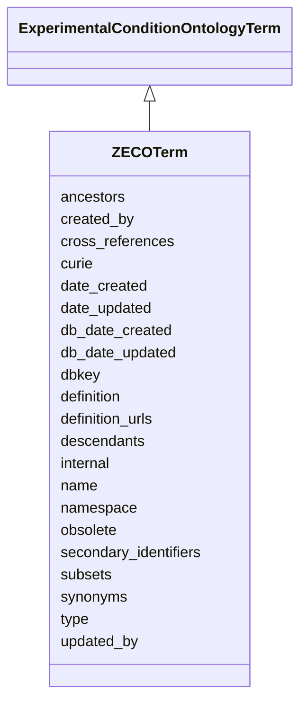

# ZECOTerm

None





URI: [alliance:ZECOTerm](http://alliancegenome.org/ZECOTerm)


## Parent Classes

* [AuditedObject](AuditedObject.md)
    * [OntologyTerm](OntologyTerm.md)
        * [ExperimentalConditionOntologyTerm](ExperimentalConditionOntologyTerm.md)
            * **ZECOTerm**


<!-- no inheritance hierarchy -->


## Slots

| Name | Description  |
| ---  | ---  |
| [ancestors](ancestors.md) | The ancestors of this term in the ontology, including the term itself. This language works well for the majority of use cases, however for a relationship like "develops_from", ancestors are the terms from which this term develops (not a true parent/child or ancestor/descendant relationship). |
| [created_by](created_by.md) | The individual that created the entity. |
| [cross_references](cross_references.md) | Holds between an object and its CrossReferences. |
| [curie](curie.md) | A unique identifier for a thing. Must be either a CURIE shorthand for a URI or a complete URI |
| [date_created](date_created.md) | The date on which an entity was created. This can be applied to nodes or edges. |
| [date_updated](date_updated.md) | Date on which an entity was last modified. |
| [db_date_created](db_date_created.md) | The date on which an entity was created in the Alliance database.  This is disinct from date_created, which represents the date when the entity was originally created (i.e. at the MOD for imported data). |
| [db_date_updated](db_date_updated.md) | Date on which an entity was last modified in the Alliance database.  This is disinct from date_updated, which represents the date when the entity was last modified and may predate import into the Alliance database. |
| [dbkey](dbkey.md) | Typically the primary key on the table.  Should be a global sequence in the database to insure uniqueness over the entire suite of tables.  Alternatively, could be a serial8 identifier. Tables with a dbkey should have an alternate key to establish uniqueness based on the data in the table. |
| [definition](definition.md) | The explanation of the meaning of a term. |
| [definition_urls](definition_urls.md) | None |
| [descendants](descendants.md) | The descendants of this term in the ontology, including the term itself. This language works well for the majority of use cases, however for a relationship like "develops_from", ancestors are the terms to which this term develops into (not a true parent/child or ancestor/descendant relationship). |
| [internal](internal.md) | Classifies the entity as private (for internal use) or not (for public use). |
| [name](name.md) | a human-readable name for an entity |
| [namespace](namespace.md) | the namespace of the ontology. |
| [obsolete](obsolete.md) | Entity is no longer current. |
| [secondary_identifiers](secondary_identifiers.md) | None |
| [subsets](subsets.md) | None |
| [synonyms](synonyms.md) | Placeholder? Some objects still use this slot. Not clear how it fits in with NameSlotAnnotation (which captures evidence). |
| [type](type.md) | None |
| [updated_by](updated_by.md) | The individual that last modified the entity. |


## Mappings

| Mapping Type | Mapped Value |
| ---  | ---  |
| self | ['alliance:ZECOTerm'] |
| native | ['alliance:ZECOTerm'] |


## LinkML Specification

<!-- TODO: investigate https://stackoverflow.com/questions/37606292/how-to-create-tabbed-code-blocks-in-mkdocs-or-sphinx -->

### Direct

<details>
```yaml
name: ZECOTerm
from_schema: https://github.com/alliance-genome/agr_curation_schema/ontologyTerm.yaml
is_a: ExperimentalConditionOntologyTerm

```
</details>

### Induced

<details>
```yaml
name: ZECOTerm
from_schema: https://github.com/alliance-genome/agr_curation_schema/ontologyTerm.yaml
is_a: ExperimentalConditionOntologyTerm
attributes:
  curie:
    name: curie
    description: A unique identifier for a thing. Must be either a CURIE shorthand
      for a URI or a complete URI
    from_schema: https://github.com/alliance-genome/agr_curation_schema/core.yaml
    multivalued: false
    identifier: true
    alias: curie
    owner: ZECOTerm
    domain_of:
    - OntologyTerm
    - PhenotypeAnnotation
    - DiseaseAnnotation
    - BiologicalEntity
    - BiologicalEntityDTO
    - Chromosome
    - Assembly
    - Identifier
    - Figure
    - Image
    - Laboratory
    - InformationContentEntity
    - Reference
    - Resource
    - ModCorpusAssociation
    - GeneInteraction
    - ExpressionExperiment
    - GeneNomenclatureSet
    range: uriorcurie
    required: true
  dbkey:
    name: dbkey
    description: Typically the primary key on the table.  Should be a global sequence
      in the database to insure uniqueness over the entire suite of tables.  Alternatively,
      could be a serial8 identifier. Tables with a dbkey should have an alternate
      key to establish uniqueness based on the data in the table.
    from_schema: https://github.com/alliance-genome/agr_curation_schema/core.yaml
    alias: dbkey
    owner: ZECOTerm
    domain_of:
    - OntologyTerm
    - ExternalDatabaseLink
    range: string
  name:
    name: name
    description: a human-readable name for an entity
    notes:
    - May want to convert this into a slot that uses NameSlotAnnotation.
    from_schema: https://github.com/alliance-genome/agr_curation_schema/affectedGenomicModel
    multivalued: false
    alias: name
    owner: ZECOTerm
    domain_of:
    - OntologyTerm
    - ResourceDescriptor
    - ResourceDescriptorPage
    - AffectedGenomicModel
    - AffectedGenomicModelDTO
    - VocabularyTerm
    - Vocabulary
    - VocabularyTermSet
    - Antibody
    - CurationReportGroup
    - CurationReport
    - BulkLoadGroup
    - BulkLoad
    range: string
  definition:
    name: definition
    description: The explanation of the meaning of a term.
    from_schema: https://github.com/alliance-genome/agr_curation_schema/ontologyTerm.yaml
    alias: definition
    owner: ZECOTerm
    domain_of:
    - OntologyTerm
    - VocabularyTerm
    range: string
  definition_urls:
    name: definition_urls
    from_schema: https://github.com/alliance-genome/agr_curation_schema/ontologyTerm.yaml
    multivalued: true
    alias: definition_urls
    owner: ZECOTerm
    domain_of:
    - OntologyTerm
    range: string
  type:
    name: type
    from_schema: https://github.com/alliance-genome/agr_curation_schema/core.yaml
    alias: type
    owner: ZECOTerm
    domain_of:
    - OntologyTerm
    range: uriorcurie
  cross_references:
    name: cross_references
    description: Holds between an object and its CrossReferences.
    from_schema: https://github.com/alliance-genome/agr_curation_schema/core.yaml
    aliases:
    - xrefs
    singular_name: cross_reference
    multivalued: true
    alias: cross_references
    owner: ZECOTerm
    domain_of:
    - OntologyTerm
    - GenomicEntity
    - AuthorReference
    - Antibody
    - GeneInteraction
    range: CrossReference
  synonyms:
    name: synonyms
    description: Placeholder? Some objects still use this slot. Not clear how it fits
      in with NameSlotAnnotation (which captures evidence).
    from_schema: https://github.com/alliance-genome/agr_curation_schema/core.yaml
    multivalued: true
    alias: synonyms
    owner: ZECOTerm
    domain_of:
    - OntologyTerm
    - ResourceDescriptor
    - Resource
    - GeneNomenclatureSet
    range: string
    required: false
  namespace:
    name: namespace
    description: the namespace of the ontology.
    from_schema: https://github.com/alliance-genome/agr_curation_schema/ontologyTerm.yaml
    alias: namespace
    owner: ZECOTerm
    domain_of:
    - OntologyTerm
    range: string
  subsets:
    name: subsets
    from_schema: https://github.com/alliance-genome/agr_curation_schema/ontologyTerm.yaml
    multivalued: true
    alias: subsets
    owner: ZECOTerm
    domain_of:
    - OntologyTerm
    range: string
  secondary_identifiers:
    name: secondary_identifiers
    from_schema: https://github.com/alliance-genome/agr_curation_schema/core.yaml
    aliases:
    - secondary_ids
    multivalued: true
    alias: secondary_identifiers
    owner: ZECOTerm
    domain_of:
    - OntologyTerm
    - GenomicEntity
    - GenomicEntityDTO
    - Figure
    - Image
    - Antibody
    range: uriorcurie
  ancestors:
    name: ancestors
    description: The ancestors of this term in the ontology, including the term itself.
      This language works well for the majority of use cases, however for a relationship
      like "develops_from", ancestors are the terms from which this term develops
      (not a true parent/child or ancestor/descendant relationship).
    from_schema: https://github.com/alliance-genome/agr_curation_schema/ontologyTerm.yaml
    multivalued: true
    alias: ancestors
    owner: ZECOTerm
    domain_of:
    - OntologyTerm
    range: OntologyTermClosure
  descendants:
    name: descendants
    description: The descendants of this term in the ontology, including the term
      itself. This language works well for the majority of use cases, however for
      a relationship like "develops_from", ancestors are the terms to which this term
      develops into (not a true parent/child or ancestor/descendant relationship).
    from_schema: https://github.com/alliance-genome/agr_curation_schema/ontologyTerm.yaml
    multivalued: true
    alias: descendants
    owner: ZECOTerm
    domain_of:
    - OntologyTerm
    range: OntologyTermClosure
  created_by:
    name: created_by
    description: The individual that created the entity.
    from_schema: https://github.com/alliance-genome/agr_curation_schema/core.yaml
    domain: AuditedObject
    multivalued: false
    alias: created_by
    owner: ZECOTerm
    domain_of:
    - AuditedObject
    range: Person
  date_created:
    name: date_created
    description: The date on which an entity was created. This can be applied to nodes
      or edges.
    from_schema: https://github.com/alliance-genome/agr_curation_schema/core.yaml
    aliases:
    - creation_date
    exact_mappings:
    - dct:createdOn
    - WIKIDATA_PROPERTY:P577
    alias: date_created
    owner: ZECOTerm
    domain_of:
    - AuditedObject
    - AuditedObjectDTO
    range: datetime
  updated_by:
    name: updated_by
    description: The individual that last modified the entity.
    from_schema: https://github.com/alliance-genome/agr_curation_schema/core.yaml
    domain: AuditedObject
    multivalued: false
    alias: updated_by
    owner: ZECOTerm
    domain_of:
    - AuditedObject
    range: Person
  date_updated:
    name: date_updated
    description: Date on which an entity was last modified.
    from_schema: https://github.com/alliance-genome/agr_curation_schema/core.yaml
    aliases:
    - date_last_modified
    alias: date_updated
    owner: ZECOTerm
    domain_of:
    - AuditedObject
    - AuditedObjectDTO
    range: datetime
  db_date_created:
    name: db_date_created
    description: The date on which an entity was created in the Alliance database.  This
      is disinct from date_created, which represents the date when the entity was
      originally created (i.e. at the MOD for imported data).
    from_schema: https://github.com/alliance-genome/agr_curation_schema/core.yaml
    alias: db_date_created
    owner: ZECOTerm
    domain_of:
    - AuditedObject
    - AuditedObjectDTO
    range: datetime
  db_date_updated:
    name: db_date_updated
    description: Date on which an entity was last modified in the Alliance database.  This
      is disinct from date_updated, which represents the date when the entity was
      last modified and may predate import into the Alliance database.
    from_schema: https://github.com/alliance-genome/agr_curation_schema/core.yaml
    alias: db_date_updated
    owner: ZECOTerm
    domain_of:
    - AuditedObject
    - AuditedObjectDTO
    range: datetime
  internal:
    name: internal
    description: Classifies the entity as private (for internal use) or not (for public
      use).
    notes:
    - Default value is true.
    from_schema: https://github.com/alliance-genome/agr_curation_schema/core.yaml
    alias: internal
    owner: ZECOTerm
    domain_of:
    - AuditedObject
    - AuditedObjectDTO
    range: boolean
    required: true
  obsolete:
    name: obsolete
    description: Entity is no longer current.
    notes:
    - Obsolete entities are preserved in the database for posterity but should not
      be publicly displayed.
    from_schema: https://github.com/alliance-genome/agr_curation_schema/core.yaml
    alias: obsolete
    owner: ZECOTerm
    domain_of:
    - AuditedObject
    - AuditedObjectDTO
    range: boolean

```
</details>